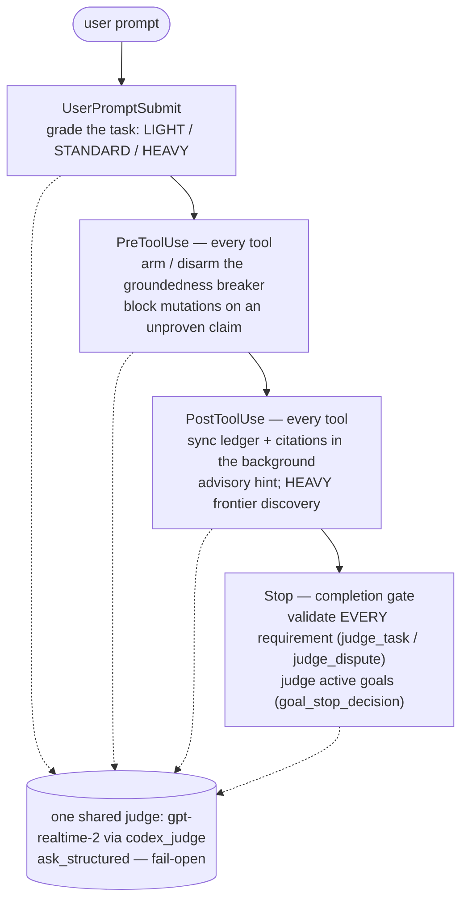

# unifable

A harness that makes Opus (or any Claude/Codex model) behave like **Fable** — completion,
evidence, and verification enforced as *procedure*, auto-routed per task. **One codebase,
two hosts:** Claude Code and Codex, each as a **native plugin** (own manifest + own hooks).

The premise: a harness cannot raise a model's ceiling, but it can make the model reach its own
ceiling by turning verification, completion, and investigation into procedure the model cannot
skip. The same gate scripts run on both hosts via Claude-Code-compatible hooks.

## Two models, symbiotic

unifable runs **two models at once**, and that is the core of the design:

- **The worker** — your primary model (Opus / Sonnet / Codex). It does the task.
- **The judge** — a *second, independent* model, `gpt-realtime-2`, reached over the OpenAI
  Realtime API with the Codex ChatGPT OAuth bearer in `~/.codex/auth.json` (no platform API key,
  no TLS fingerprint — `scripts/gate/codex_judge.py`). It never writes code. It watches, validates,
  and reasons about whether the worker actually did what it claims.

The two are **symbiotic**, not sequential. The judge fires on **every tool call** and keeps
evidence state updated in the background, then renders verdicts at the gates:

- **Background, every tool call** — PostToolUse matches `.*` (`hooks/hooks.json`,
  `hooks/gate_post_tool.py`): each tool result is parsed for real activity (files read, URLs
  fetched, commands run, verification outcomes) and written to a per-session ledger. Citations the
  spec needs sync automatically from this activity (`scripts/gate/citations.py`) — the worker does
  not hand-curate evidence; the harness records what actually happened.
- **At the gates, judged** — the same `gpt-realtime-2` renders verdicts at each host event: it grades
  the task, arms the groundedness breaker, validates every requirement, and judges goal completion. A
  faked "validated" cannot pass — the judge reads the actual check output, not the worker's prose. See
  [How the judge flows through a session](#how-the-judge-flows-through-a-session) for the full lifecycle.

Because the judge runs over transcript material on a 256,000-char per-message budget, that material
is **pre-trimmed** before each call (`scripts/gate/transcript_tail.py` — tail-preserving truncation,
a token budget, and a hard char ceiling). A far more advanced evolution of this judge-context
pruning — keeping only the relevant slice of context — lives in
[**patchpress**](https://github.com/jaredboynton/patchpress).

## How the judge flows through a session

The same judge fires at four host events, from the first prompt to the final Stop. Each box below is
a hook on the critical path; each dotted line is a call to the one shared `gpt-realtime-2` instance
over `scripts/gate/codex_judge.py`.



What happens at each stage:

1. **Each prompt — UserPromptSubmit.** The judge grades the operative prompt into LIGHT / STANDARD /
   HEAVY (`judge_grade_classify`, `scripts/gate/grade_override.py`), which sets how strict the
   evidence gate is for the turn. Fail-open to normal on any judge or transport error.
2. **Before each mutating tool — PreToolUse.** The judge arms the groundedness breaker on an
   unproven, load-bearing, confident claim and blocks the edit or delegation until it is grounded;
   reads, web, and whitelisted research Bash stay free (`scripts/gate/groundedness.py`, debounced to
   one judge call per 15s).
3. **After every tool — PostToolUse.** Real activity (files read, URLs fetched, commands run,
   failures) is parsed into the per-session ledger and the spec's citations sync automatically; a
   repeated failure spends one judge call for an advisory `judge_hint`, and a HEAVY task
   under-supplied with approaches triggers `judge_discover_frontiers`.
4. **On Stop — completion gate.** `auto_validate_spec` (`scripts/gate/spec.py`) runs each open
   requirement's check and the judge renders a verdict (`judge_task` / `judge_tasks`), adjudicates
   impossibility disputes (`judge_dispute`), then `goal_stop_decision` (`hooks/gate_stop.py`) judges
   any active multi-step goal from the transcript. Stop stays blocked until every requirement is
   validated or retracted.

Where the judge decides, and what it falls back to:

| Stage | Judge call | Decides | On judge error |
|---|---|---|---|
| UserPromptSubmit | `judge_grade_classify` | task grade -> evidence-gate strictness | fail-open: normal / STANDARD |
| PreToolUse | `arm_judge` / `disarm_judge` | arm or release the groundedness breaker | fail-open: tool allowed |
| PostToolUse | `judge_hint`, `judge_discover_frontiers` | advisory nudge; propose HEAVY frontiers | fail-open: no hint |
| Stop | `judge_task` / `judge_tasks`, `judge_dispute` | validate or reject each requirement; accept or deny disputes | fail-open allow; dispute defaults to reject |
| Stop | `goal_stop_decision` | active goal complete or impossible, from transcript | fail-open allow after cap |

What the judge catches:

| Scenario | What the judge does |
|---|---|
| Worker claims a requirement is "validated" but the check output disagrees | Reads the actual check output, marks the task `failed`, Stop stays blocked (`judge_task`) |
| A confident, load-bearing claim is asserted before an edit with no evidence | Arms the breaker; the edit is blocked until the claim is grounded by a read or tool output (`groundedness.py`) |
| Worker argues a requirement is impossible to dodge it | `judge_dispute` accepts only with proof and defaults to reject (verdict 0), so impossibility is never granted by default |
| The same failure class repeats and the worker is looping | One `judge_hint` offers a concrete next step — advisory only, it never unblocks anything |
| A HEAVY task starts without two or more candidate approaches | `judge_discover_frontiers` proposes frontier approach tasks before primary-path edits are allowed |

## How enforcement is wired

Anything left to the worker's discretion gets skipped under load, so every load-bearing behavior is
a deterministic hook on the host's critical path, not a skill the worker may choose to run.

| Hook | Script | Role |
|---|---|---|
| UserPromptSubmit | `router.sh`, `gate_prompt.py`, `gate_prompt_effort.py` | Route task signal to a pack; classify task mode (quick / normal / deep); effort-gated playbook |
| PreToolUse | `pre_tool_use.py` (+ `bash_classify.py`, `groundedness.py`) | **Evidence gate** + **groundedness breaker** + protected-path guard: block edits, delegation, and non-whitelisted research Bash until the spec validates, and block mutations on an unproven confident claim |
| PostToolUse | `gate_post_tool.py` | Observe evidence on **every** tool call (read paths, fetched URLs, ran commands, real failures) into the ledger; surface an advisory judge hint on a repeating failure |
| PostToolUse (edits) | `test_after_edit.py` | Debounced test runner after a file change (`UNIFABLE_TEST_AFTER_EDIT=1`) |
| Stop | `gate_stop.py` (120s) | Completion gate: require the evidence spec; judge active goals; verification-ran + promise-no-act guards; advisory judge hint when stuck behind the completion breaker |

Shared core lives in `scripts/gate/` (ledger, task classifier, tool-result parser, verify-state,
the judge client) and `packs/` (investigation protocol, verification-grounding). It stays
host-agnostic; host wiring lives in `hooks/` and `install/`.

## Evidence gate

On any non-trivial task (grade STANDARD+), the worker cannot edit a file, delegate with
`Task`/`Agent`, run Bash outside the research whitelist (`cd`, `ls`, `glob`, `rg`, the explore skill's
`trace.sh`, or the unifusion skill scripts `unifusion.sh`/`save_run.sh`/`summarize_session.sh`/
`resolve_session.sh`), or finish until the session's evidence spec
(`~/.unifable/specs/<dirhash>/<session>/spec.json`, one per directory+session) validates. The spec
must carry: `repo_context` (`{cite: path:line, why}` the worker actually read), `acceptance_criteria`
(a runnable `check` plus its live `evidence` output — placeholders are rejected), and `prior_art` (a
source URL, required at HEAVY). Read, search, web, `trace.sh` exploration, and unifusion panel
research stay available so the worker can gather that evidence; a valid spec unlocks the action phase. Quick/LIGHT tasks are waived.

The spec is **append-only and CLI-only** — never hand-edited. The worker drives it with
`unifable restate` (state the intended outcome), `unifable add-task` (add a requirement + its check),
and `unifable dispute` (argue a requirement is impossible; only the judge can retract it). The gate
is always on (no env disable) and fails open on malformed input, so a bug in the gate never bricks a
session.

The **Fable orchestrator posture** (delegate-first) is delivered as always-on context loaded once
per session, not re-injected per prompt: on Claude via the **Fable output style**
(`output-styles/fable.md`, set by `install/claude.sh`), on Codex via an `AGENTS.md` block
(`setup/orchestrator-block.md`, injected by `install/codex.sh`).

## Consistent checking

Checking is continuous, not a one-shot at the end:

- The gate is **always on** — no env switch disables it; every qualifying task is held to the same
  bar.
- Citations **sync continuously** from real activity, so the evidence the spec is judged against is
  what the worker actually did, kept current in the background on every tool call.
- On **Stop**, `auto_validate_spec` in `scripts/gate/spec.py` validates open requirements:
  pending/delivered tasks get fresh checks; failed tasks are re-judged on stored output;
  disputed impossibility claims are adjudicated. The judge always sees the full board
  (including validated tasks) and re-evaluates only what is still open.
- **Completion is blocked** until every requirement is validated or retracted — the worker cannot
  declare done with open requirements, and only the judge can retract one (by accepting a dispute).

## Groundedness breaker

Separate from the evidence spec: an overconfidence breaker (`scripts/gate/groundedness.py`) arms
when the worker makes an unproven, load-bearing, confident claim, and blocks mutating tools until the
claim is grounded. Release paths: **full disarm** (the judge finds the claim grounded, retracted, or
no longer load-bearing — including grounding by empirical tool output), **provisional lift** (the
worker is actively pursuing the verification the breaker asked for; mutations are allowed within a
goal-scoped `lift_scope` while a monitor judge watches for drift), and **fail-open** after a bounded
number of consecutive blocks (`BREAKER_MAX_BLOCKS`). Every enforcement loop is capped so it can never
trap a session.

## Assistant-facing judge nudges

The judge can also emit a **non-blocking advisory hint** — one concrete next step for a worker that
looks stuck or is making a poor call (e.g. looping on a check that references a nonexistent file).
The invariant is that a hint is the *opposite* of a gate: it **never** changes a verdict, changes a
task's status, or opens/lifts any breaker. It is advisory context only, surfaced on a distinct
`UNIFABLE_MODEL_HINT` channel (`scripts/gate/model_notify.py`) labelled "advisory, not a gate" so it
cannot be mistaken for an instruction. The hint text is **reasoned by the judge**, never a canned
string. Three surfaces, all fail-open (a judge error yields no hint and leaves gate behavior
byte-identical):

- **Verdict hint** — `judge_task` / `judge_dispute` carry an optional `hint` alongside the verdict;
  no extra judge call, it rides the one already made.
- **Completion-breaker loop** — after the worker re-blocks Stop past a threshold, one `judge_hint`
  call appends a nudge to the still-blocking reason.
- **Repeated-failure loop** — when PostToolUse sees the same failure class repeat, a `judge_hint`
  call offers guidance.

`judge_hint` is verdict-free by construction (its schema returns only `hint`), so it structurally
cannot resolve a task. Locked by `tests/test_judge_hint.py`.

## Signal-first failure detection

Failure is asserted only from a structured `exit_code` / `success` / `status` signal, or — when the
host gives none (Codex shell `tool_response` has no exit code) — from a high-precision anchored
marker (`Traceback`, `command not found`, `panicked at`, a non-zero `exit code N`,
`N failed` / `N errors`, never `0 failed`). This avoids firing a false "tool failed" on a successful
command whose output merely *contains* the word `error` (a `cat`, a `grep`, a `12 passed, 0 failed`
summary). Implemented in `scripts/gate/parse_tool_result.py`, locked by
`tests/test_gate_false_positive.py`.

## Install — Claude Code

```
/plugin marketplace add jaredboynton/unifable
/plugin install unifable@unifable
```

Then (optional always-on operating block):

```bash
bash "${CLAUDE_PLUGIN_ROOT}/setup/setup.sh" global   # or: local
```

Hooks register automatically from `hooks/hooks.json` on install.

## Install — Codex

Codex loads unifable as a **native plugin** (`.codex-plugin/plugin.json` → `.codex-plugin/hooks.json`,
`${PLUGIN_ROOT}` paths). The supported path mirrors Claude's `/plugin`:

```bash
codex plugin marketplace add jaredboynton/unifable
codex plugin add unifable@unifable
```

`install/codex.sh` reproduces this non-interactively and **migrates off** any legacy install: it
registers the marketplace, installs + force-enables `unifable@unifable`, then retires the old
`~/.codex/skills/unifable` copy and strips the old unifable entries from `~/.codex/hooks.json`
(both backed up). Optional always-on operating block: prefix with `UNIFABLE_BLOCK=1`.

```bash
git clone https://github.com/jaredboynton/unifable ~/__devlocal/unifable
bash ~/__devlocal/unifable/install/codex.sh
```

Restart Codex; the plugin loads its own hooks. Verify with `codex plugin list`.

## More capabilities

Beyond the gate, unifable ships: a debounced test-runner (`UNIFABLE_TEST_AFTER_EDIT=1`);
a findings ledger and warning-threshold accumulation; per-task **grade tiers** and a
depth-shaped final response; per-model posture files under `skills/unifable/tiers/`; routing
packs for domain verification, decision traces, subagent briefs, and completion checks;
multi-story goal tracking (`scripts/goals.py`, state under `./.unifable/`); and a behavioral eval
suite (`docs/evals/`, `tests/eval_rubric.md`).

## Tests

```bash
python3 tests/test_gate.py                 # completion-gate scenarios
python3 tests/test_gate_robustness.py      # loop-guard / no-false-nag
python3 tests/test_gate_false_positive.py  # signal-first failure detection
python3 tests/test_recovery.py
```

## License

Copyright © Jared Boynton. All rights reserved. This is a **private, proprietary repository** — not
licensed for redistribution. Make it public only under explicit terms set by the author.
