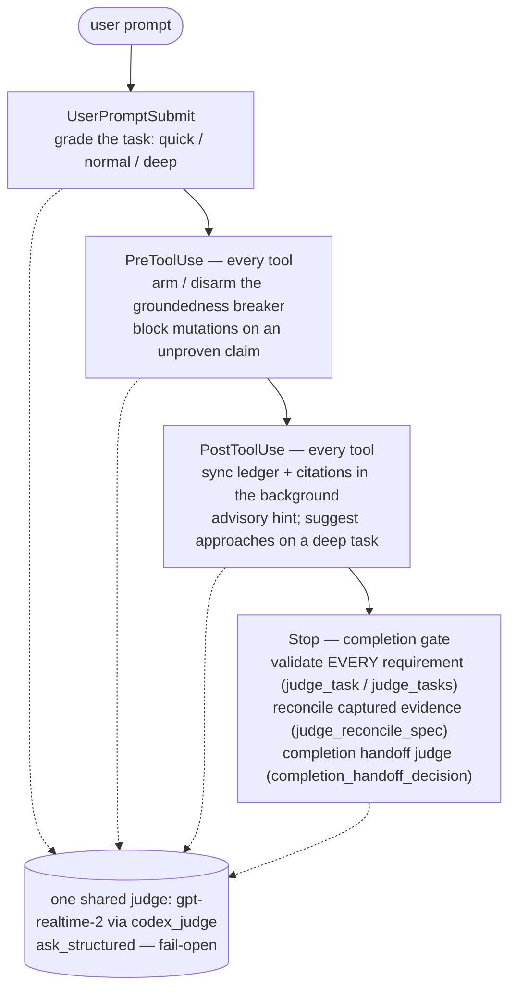

# unifable

A harness that makes Opus (or any Claude/Codex model) behave like **Fable** — completion,
evidence, and verification enforced as *procedure*, auto-routed per task. **One codebase,
two hosts:** Claude Code and Codex, each as a **native plugin** (own manifest + own hooks).

## Live Benchmark

> **2026-06-24 (hermetic, 3 repeats/cell, cache-weighted cost, completed-only means):**
> On the saved-summary regression task, in an isolated per-cell environment (only the
> unifable plugin varies — builtin subagents disabled, no leaked user hooks/skills,
> token auth; Codex on a clean fast-tier config), unifable adds real overhead and every
> cell produced the one-file deliverable directly (worktree-measured `files_changed` == 1
> for all cells):
>
> | Condition | ok/total | Mean elapsed | Est. cost (USD) | Output tok |
> |---|---:|---:|---:|---:|
> | claude:baseline | 3/3 | 113s | $0.66 | 7,912 |
> | claude:unifable | 3/3 | 636s | $2.86 | 35,526 |
> | codex:baseline | 3/3 | 84s | $0.73 | 5,271 |
> | codex:unifable | 3/3 | 444s | $4.19 | 20,648 |
>
> So unifable runs ~5.6x slower / ~4.3x costlier on Claude and ~5.3x slower / ~5.7x
> costlier on Codex — the genuine price of forced grounding and gate machinery, now
> isolated from confounds. Disabling builtin subagents removed a prior delegation
> deadlock (claude:unifable went 2/3 → 3/3 completed and 1017s → 636s), and the clean
> environment also sped the baseline up (382s → 113s). The earlier single run that showed
> unifable *faster* on Claude (160s) was an n=1 outlier; raw `total_tokens` is 80-90%
> near-free cache reads (billed at 0.1x input) and overstates cost. **This benchmark
> measures cost and latency, not the grounding/verification quality unifable trades them
> for.** Method, hermetic setup, pricing sources, and the self-referential-task caveat are
> in [docs/benchmark-methodology.md](docs/benchmark-methodology.md); raw artifacts are in
> [benchmark/results/20260624T175715Z/summary.md](benchmark/results/20260624T175715Z/summary.md)
> (the prior inherited-config run, showing the delegation deadlock, is in
> `benchmark/results/20260624T133303Z/`).

The premise: a harness cannot raise a model's ceiling, but it can make the model reach its own
ceiling by turning verification, completion, and investigation into procedure the model cannot
skip. The same gate scripts run on both hosts via Claude-Code-compatible hooks.

## Two models, symbiotic

unifable runs **two models at once**, and that is the core of the design:

- **The worker** — your primary model (Opus / Sonnet / Codex). It does the task.
- **The judge** — a *second, independent* model, `gpt-realtime-2`, reached over the OpenAI
  Realtime API with the Codex ChatGPT OAuth bearer in `~/.codex/auth.json` (no platform API key,
  no TLS fingerprint — `scripts/gate/codex_judge.py`). It never writes code. It watches, validates,
  and reasons about whether the worker actually did what it claims.

**No Realtime?** Bedrock `nvidia.nemotron-nano-3-30b` is a possible judge substitute — 256K context,
us-east-1 / us-east-2 / us-west-2, converse-stream + reasoning off. Not integrated. See
`probes/bench_bedrock_ttft.py` for TTFT numbers.

The two are **symbiotic**, not sequential. The judge fires on **every tool call** and keeps
evidence state updated in the background, then renders verdicts at the gates:

- **Background, every tool call** — PostToolUse matches `.*` (`hooks/hooks.json`,
  `hooks/gate_post_tool.py`): each tool result is parsed for real activity (files read, URLs
  fetched, commands run, verification outcomes) and written to a per-session ledger. Citations the
  spec needs sync automatically from this activity (`scripts/gate/citations.py`) — the worker does
  not hand-curate evidence; the harness records what actually happened.
- **At the gates, judged** — the same `gpt-realtime-2` renders verdicts at each host event: it grades
  the task, arms the groundedness breaker, validates every requirement, and judges goal completion. A
  faked "validated" cannot pass — the judge reads the actual check output, not the worker's prose. See
  [How the judge flows through a session](#how-the-judge-flows-through-a-session) for the full lifecycle.

Because the judge runs over transcript material on a 256,000-char per-message budget, that material
is **pre-trimmed** before each call (`scripts/gate/transcript_tail.py` — patchpress-compatible
compact Edit/Write diffs, age-based tool-output compression defaulting to observation masking,
sticky retention-window tailing, a token budget, and a hard char ceiling). The full compaction
harness that `/compact` uses lives in [**patchpress**](https://github.com/jaredboynton/patchpress);
Unifusion vendors the same renderer for session briefs.

## How the judge flows through a session

The same judge fires at four host events, from the first prompt to the final Stop. Each box below is
a hook on the critical path; each dotted line is a call to the one shared `gpt-realtime-2` instance
over `scripts/gate/codex_judge.py`.



What happens at each stage:

1. **Each prompt — UserPromptSubmit.** The judge sizes up the operative prompt by depth — a quick
   fix, a normal task, or a deep task (`judge_grade_classify`, `scripts/gate/grade_override.py`) —
   which sets how strict the evidence gate is for the turn. Fail-open to a normal task on any judge or
   transport error.
2. **Before each tool call — PreToolUse.** The per-tool judge is the stepwise *director*: on every
   tool call (debounced to one judge call per 3s) it emits a minimal next-step directive and a tool
   scope, both persisted to breaker state. The directive is surfaced to the model (when it changes)
   and the scope is enforced deterministically by `scripts/gate/tool_scope.py` while the spec is
   unvalidated. The same judge still arms the groundedness breaker on an unproven, load-bearing,
   confident claim and blocks the edit or delegation until it is grounded; reads, web, and whitelisted
   research Bash stay free (`scripts/gate/groundedness.py`).
3. **After every tool — PostToolUse.** Real activity (files read, URLs fetched, commands run,
   failures) is parsed into the per-session ledger and the spec's citations sync automatically; a
   repeated failure spends one judge call for an advisory `judge_hint`, and a deep task that has not
   yet laid out enough candidate approaches triggers `judge_discover_frontiers`.
4. **On Stop — completion gate.** `auto_validate_spec` (`scripts/gate/spec.py`) runs each open
   requirement's check, the judge renders a verdict (`judge_task` / `judge_tasks`), reconciles
   obsolete or superseded requirements from captured evidence (`judge_reconcile_spec`), and `completion_handoff_decision`
   (`scripts/gate/completion_handoff.py`) blocks when the agent ends by deferring autonomous work.
   Stop stays blocked until every requirement is validated, retracted, or superseded, and the agent
   is not dangling permission-seeking follow-ups. A "turn" here is one tool call, so Stop is rare; when
   it blocks, the gate hands back the live director directive (`tool_scope.current_directive`) so the
   blocked Stop becomes a guided-iterative-continuation of the goal loop.

Where the judge decides, and what it falls back to:

| Stage | Judge call | Decides | On judge error |
|---|---|---|---|
| UserPromptSubmit | `judge_grade_classify` | how deep the task is -> how strict the gate is | fail-open: treat as a normal task |
| PreToolUse | `arm_judge` / `disarm_judge` | arm or release the groundedness breaker | fail-open: tool allowed |
| PostToolUse | `judge_hint`, `judge_discover_frontiers` | advisory nudge; suggest approaches for a deep task | fail-open: no hint |
| Stop | `judge_task` / `judge_tasks`, `judge_reconcile_spec` | validate or reject each requirement; retract, revise, or supersede only when captured evidence supports it | fail-open allow |
| Stop | `completion_handoff_decision` | agent may end turn vs deferring autonomous work | fail-open allow after cap |

What the judge catches:

| Scenario | What the judge does |
|---|---|
| Worker claims a requirement is "validated" but the check output disagrees | Reads the actual check output, marks the task `failed`, Stop stays blocked (`judge_task`) |
| A confident, load-bearing claim is asserted before an edit with no evidence | Arms the breaker; the edit is blocked until the claim is grounded by a read or tool output (`groundedness.py`) |
| Captured evidence shows a requirement is obsolete or implementation moved | `judge_reconcile_spec` may retract, revise, or supersede the task, but only when the cited evidence is in the session ledger |
| The same failure class repeats and the worker is looping | One `judge_hint` offers a concrete next step — advisory only, it never unblocks anything |
| A deep task starts without two or more candidate approaches | `judge_discover_frontiers` proposes candidate approach tasks before work on the chosen one is allowed |
| Agent ends with permission-seeking or deferred autonomous work | `completion_handoff_decision` blocks Stop and forces the work through (`completion_handoff.py`) |

## How enforcement is wired

Anything left to the worker's discretion gets skipped under load, so every load-bearing behavior is
a deterministic hook on the host's critical path, not a skill the worker may choose to run.

| Hook | Script | Role |
|---|---|---|
| UserPromptSubmit | `gate_prompt.py` (+ `pack_router.py`, `gate_prompt_effort.py`) | Single entrypoint per prompt: route task signal to a pack, classify task mode (quick / normal / deep), and inject the effort-gated playbook — merged into one `additionalContext` |
| PreToolUse | `pre_tool_use.py` (+ `bash_classify.py`, `groundedness.py`) | **Evidence gate** + **groundedness breaker** + protected-path guard: block edits, delegation, and non-whitelisted research Bash until the spec validates, and block mutations on an unproven confident claim |
| PostToolUse | `gate_post_tool.py` | Observe evidence on **every** tool call (read paths, fetched URLs, ran commands, real failures) into the ledger; surface an advisory judge hint on a repeating failure |
| PostToolUse (edits) | `test_after_edit.py` | Debounced test runner after a file change (`UNIFABLE_TEST_AFTER_EDIT=1`) |
| Stop | `gate_stop.py` (120s) | Completion gate: require the evidence spec; judge active goals; completion handoff judge for deferred work; advisory judge hint when stuck behind the completion breaker; **passthrough** (`{}`) when all criteria pass |

Shared core lives in `scripts/gate/` (ledger, task classifier, tool-result parser, verify-state,
the judge client) and `packs/router-manifest.json` (inline discipline injected by the router). It stays
host-agnostic; host wiring lives in `hooks/` and `install/`.

## Evidence gate

On any non-trivial task (grade STANDARD+), the worker cannot edit a file, delegate with
`Task`/`Agent`, run Bash outside the research whitelist (`cd`, `ls`, `glob`, `rg`, the unitrace skill's
`unitrace.sh` and `unisearch.sh` when that skill is installed — hook messages show the resolved paths — or the unifusion skill scripts `unifusion.sh`/`save_run.sh`/`summarize_session.sh`/
`resolve_session.sh`), or finish until the session's evidence spec
(stored in the consolidated `~/.unifable/unifable.db`, keyed one per directory+session) validates. The spec
must carry (for **code-profile** tasks): `repo_context` (`{cite: path:line, why}` the worker actually
read), `acceptance_criteria` (a runnable `check` plus its live `evidence` output -- placeholders are
rejected), and `prior_art` (a source URL fetched via WebFetch/curl, required at STANDARD+). **Operational-profile**
tasks (account research, draft replies, internal-tool synthesis) waive repo_context and prior_art;
restated goal + requirement tasks unlock edits, with Stop-time judge validation. Read, search, web, unitrace-skill `unitrace.sh` and `unisearch.sh` (when installed), and unifusion panel
research stay available so the worker can gather that evidence; a valid spec unlocks the action phase. Quick/LIGHT tasks are waived.

The spec is **append-only and CLI-only** — never hand-edited. The worker drives it with
`unifable restate` (state the intended outcome), `unifable add-task` (add a requirement + its check),
`unifable add-frontier`, and `unifable set-primary`. Lifecycle changes are judge-owned and come from
captured evidence, not a worker-side lifecycle command. The gate
is always on (no env disable) and fails open on malformed input, so a bug in the gate never bricks a
session.

The model is **not** front-loaded with a large standing posture. The **SessionStart hook**
(`hooks/session_start.py` -> `scripts/gate/context_block.py`) injects only a thin
judge-relationship frame: it tells the model a director judge guides it step by step (opening and
restricting tools, tending the spec) and to restate the goal first. All step-by-step guidance is
delivered at runtime by the per-tool director, not front-loaded here. On Claude the posture is
reinforced by an output style shipped by `install/claude.sh`: **mute is the default**
(`output-styles/mute.md` — silent between tool calls, caveman-terse when speaking). The
frame ships only when the plugin is enabled -- it is not injected into host memory files, so it does
not pollute context for other CLI tools.

## Consistent checking

Checking is continuous, not a one-shot at the end:

- The gate is **always on** — no env switch disables it; every qualifying task is held to the same
  bar.
- Citations **sync continuously** from real activity, so the evidence the spec is judged against is
  what the worker actually did, kept current in the background on every tool call.
- On **Stop**, `auto_validate_spec` in `scripts/gate/spec.py` validates open requirements:
  every open task gets a fresh harness check (failed tasks re-run unless `replay_failed` is set);
  captured evidence can also retract, revise, or supersede stale requirements. When Stop **blocks**, feedback is packaged as a
  **priority digest** (`build_stop_validate_context` in `scripts/gate/model_notify.py`):
  **Action required** first (full judge reasoning for tasks adjudicated this stop), then a collapsed
  delta summary, then a compact incomplete-only board. Stale failed tasks no longer replay prior
  judge essays every stop. The blocking `reason` field also carries `Action:` lines for those tasks
  so guidance survives host preview truncation. Full digest is persisted to `last_stop_validation.txt`
  beside the spec on every Stop adjudication; it is injected via `additionalContext` only when Stop
  blocks — on Claude Code, Stop `additionalContext` continues the turn, so a clean pass emits `{}`
  and lets the session end.
- **Completion is blocked** until every requirement is validated, retracted, or superseded —
  the worker cannot declare done with open requirements. Only the judge can retract or supersede one,
  and only from captured evidence.

By default the completion loop runs until the work is genuinely complete: the Stop-block safety
caps **default to `0` (infinite)**, so the breaker never auto-releases Stop on block count alone.
This is intentional — for long-horizon work (iterating on a benchmark for days, grinding a
refactor to green) you want the session to keep going until the criteria pass. If you prefer a
finite escape hatch, set any of these environment variables to a positive integer in your Claude
settings (global `~/.claude/settings.json` or a project `.claude/settings.json`, under `env`):
`UNIFABLE_COMPLETION_MAX_STALLED_BLOCKS`, `UNIFABLE_COMPLETION_MAX_STOP_BLOCKS`,
`UNIFABLE_COMPLETION_HANDOFF_BLOCK_CAP`, `UNIFABLE_GOAL_STOP_BLOCK_CAP`. A positive value caps the
consecutive blocked stops before that release path fires; `0` disables it.

## Groundedness breaker

Separate from the evidence spec: an overconfidence breaker (`scripts/gate/groundedness.py`) is
always on (no env disable). It arms when the worker makes an unproven, load-bearing, confident
claim, and blocks mutating tools until the claim is grounded. Release paths: **full disarm** (the judge finds the claim grounded, retracted, or
no longer load-bearing — including grounding by empirical tool output), **provisional lift** (the
worker is actively pursuing the verification the breaker asked for; mutations are allowed within a
goal-scoped `lift_scope` while a monitor judge watches for drift), and **fail-open** after a bounded
number of consecutive blocks (`BREAKER_MAX_BLOCKS`). Every enforcement loop is capped so it can never
trap a session.

## Assistant-facing judge nudges

The judge surfaces feedback in two distinct paths:

- **Verdict feedback** — `judge_task` returns a single `reason` that explains
  why evidence failed and, when `verdict=0`, one concrete next step. On Stop, tasks changed this
  stop appear first in an **Action required** section (full `judge:` + optional `hint:`); the
  blocking `reason` repeats short `Action:` lines for the same tasks. PostToolUse still emits
  headline + board only (no separate preamble channels).
- **Proactive nudge** — when the worker looks stuck (completion-breaker loop or repeated failure),
  one `judge_hint` call offers advisory guidance. This is verdict-free: it never changes task status
  or opens/lifts any breaker.

Proactive hints are fail-open (a judge error yields no hint and leaves gate behavior
byte-identical):

- **Completion-breaker loop** — after the worker re-blocks Stop past a threshold, one `judge_hint`
  call appends a nudge to the still-blocking reason.
- **Repeated-failure loop** — when PostToolUse sees the same failure class repeat, a `judge_hint`
  call offers guidance.

`judge_hint` is verdict-free by construction (its schema returns only `hint`), so it structurally
cannot resolve a task. Locked by `tests/test_judge_hint.py`.

## Signal-first failure detection

Failure is asserted only from a structured `exit_code` / `success` / `status` signal, or — when the
host gives none (Codex shell `tool_response` has no exit code) — from a high-precision anchored
marker (`Traceback`, `command not found`, `panicked at`, a non-zero `exit code N`,
`N failed` / `N errors`, never `0 failed`). This avoids firing a false "tool failed" on a successful
command whose output merely *contains* the word `error` (a `cat`, a `grep`, a `12 passed, 0 failed`
summary). Implemented in `scripts/gate/parse_tool_result.py`, locked by
`tests/test_gate_false_positive.py`.

## Install — Claude Code

```
/plugin marketplace add jaredboynton/unifable
/plugin install unifable@unifable
```

The SessionStart hook seeds the stable `~/.unifable` runtime and links
`unifable` (and the `unifusion` panel launcher) into `~/.local/bin` automatically
on the first session after install — no separate setup step. The operating-mode
context is delivered by the SessionStart hook whenever the plugin is enabled, so
no block is injected into CLAUDE.md.

```bash
# Non-interactive alternative to the /plugin commands above (also seeds the
# runtime + bin links at install time, so they work before the first session):
bash install/claude.sh
```

Hooks register automatically from `hooks/hooks.json` on install.

## Install — Codex

Codex loads unifable as a **native plugin** (`.codex-plugin/plugin.json` → `.codex-plugin/hooks.json`,
`${PLUGIN_ROOT}` paths). The supported path mirrors Claude's `/plugin`:

```bash
codex plugin marketplace add jaredboynton/unifable
codex plugin add unifable@unifable
```

`install/codex.sh` reproduces this non-interactively and **migrates off** any legacy install: it
registers the marketplace, installs + force-enables `unifable@unifable`, then strips the old
unifable entries from `~/.codex/hooks.json` and any prior `<!-- UNIFABLE -->` / `<!-- FABLIZE -->`
static block from `~/.codex/AGENTS.md` (both backed up). The operating-mode context is delivered
by the SessionStart hook whenever the plugin is enabled — no block is injected into AGENTS.md.

```bash
git clone https://github.com/jaredboynton/unifable ~/__devlocal/unifable
bash ~/__devlocal/unifable/install/codex.sh
```

Restart Codex; the plugin loads its own hooks. Verify with `codex plugin list`.

## More capabilities

Beyond the gate, unifable ships: a debounced test-runner (`UNIFABLE_TEST_AFTER_EDIT=1`);
a findings ledger and warning-threshold accumulation; per-task **grade tiers** and a
depth-shaped final response; inline routing packs for domain verification, decision traces,
subagent briefs, and investigation (all in `packs/router-manifest.json`, injected by the hooks);
multi-story tracking via the spec task board (one requirement per story); and a behavioral eval
suite (`docs/evals/`, `tests/eval_rubric.md`).

## Tests

```bash
python3 tests/test_gate.py                 # completion-gate scenarios
python3 tests/test_gate_robustness.py      # loop-guard / no-false-nag
python3 tests/test_gate_false_positive.py  # signal-first failure detection
python3 tests/test_recovery.py
```

## License

Copyright © Jared Boynton. All rights reserved. This is a **private, proprietary repository** — not
licensed for redistribution. Make it public only under explicit terms set by the author.
