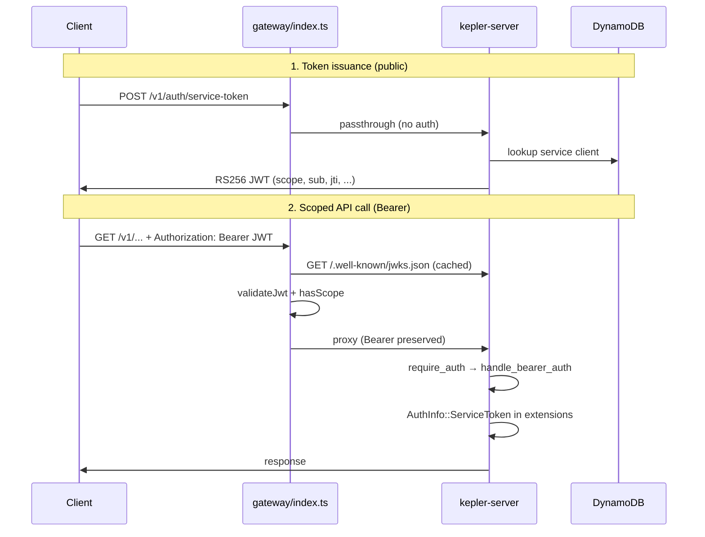

Tracing the gateway auth path: entry, token validation, scopes/identity, and backend forwarding.
# Service-token and scope/identity flow

Kepler uses a **two-layer** model: the Cloudflare gateway (`api.keplr.sh`) validates credentials and enforces scopes at the edge; the Rust API (`kepler-server`) re-validates and attaches identity before route handlers run. Both layers read the same generated scope matrix from `policy/scope-matrix.json`.

---

## End-to-end picture



---

## Phase 1: Token issuance (public gateway passthrough)

### Gateway entry

Every request hits the Worker `fetch` handler, which assigns `X-Request-Id` and delegates to `handleRequest`:

```1062:1094:gateway/src/index.ts
export default {
  async fetch(request: Request, env: Env, ctx: ExecutionContext): Promise<Response> {
    const requestId = getOrCreateRequestId(request);
    // ...
    const tracedHeaders = new Headers(request.headers);
    tracedHeaders.set('X-Request-Id', requestId);
    const tracedRequest = new Request(request, { headers: tracedHeaders });
    // ...
    const res = await handleRequest(tracedRequest, env, ctx, log, sentry);
```

`POST /v1/auth/service-token` is listed in `PUBLIC_BACKEND_PASsthrough` and bypasses auth at the edge:

```735:759:gateway/src/index.ts
    // Allow unauthenticated access to OAuth M2M endpoints (JWKS and token issuance)
    if (isPublicBackendPassthroughPath(url.pathname)) {
      const backendUrl = buildRequestBackendUrl(url, env);
      const originReq = new Request(backendUrl.toString(), {
        method: request.method,
        headers: sanitizeOriginHeaders(request.headers, trustedClientIp),
        body: request.body,
        redirect: 'manual'
      });
      const originRes = await withFetchTimeout(originReq, 5000, 'Backend timeout');
      // ...
```

### Backend issuance

The backend mounts `issue_service_token` as a public, rate-limited route:

```735:758:crates/kepler-server/src/main.rs
    let public_auth_routes = Router::new()
        .route(
            "/v1/auth/register-client",
            post(routes::client_registration::register_client),
        )
        .route(
            "/v1/auth/service-token",
            post(routes::service_auth::issue_service_token),
        )
        // ...
        .layer(axum_middleware::from_fn_with_state(
            state.clone(),
            auth_middleware::auth_rate_limit::auth_rate_limit_middleware,
        ))
```

`issue_service_token` supports two grants:

| Grant | Inputs | Identity source |
|-------|--------|-------------------|
| `client_credentials` (default) | `client_id` + `client_secret` | DynamoDB service client (`ServiceClientManager`) |
| `jwt-bearer` | GitHub Actions OIDC `assertion` | Verified OIDC claims |

For client credentials, the flow is:

1. Look up client in DynamoDB (`service_client_manager.get_client`)
2. Verify enabled + SHA-256 secret hash
3. Intersect requested scopes with client's allowed scopes
4. Sign RS256 JWT via `sign_and_respond`

JWT claims embed identity and authorization:

```58:77:crates/kepler-server/src/routes/service_auth.rs
pub struct ServiceTokenClaims {
    pub iss: String,
    pub sub: String,        // client_id (or GitHub repo for OIDC)
    pub aud: String,
    pub exp: i64,
    pub iat: i64,
    pub jti: String,        // unique; used for revocation denylist
    pub scope: String,      // space-separated kepler scopes
    pub client_name: String,
}
```

```379:416:crates/kepler-server/src/routes/service_auth.rs
fn sign_and_respond(
    state: &AppState,
    subject: String,
    client_name: String,
    scope_string: String,
) -> Result<Json<ServiceTokenResponse>, ...> {
    let claims = ServiceTokenClaims {
        iss: state.jwt_issuer.clone(),
        sub: subject,
        aud: state.jwt_audience.clone(),
        // ...
        jti: Uuid::new_v4().to_string(),
        scope: scope_string.clone(),
        client_name,
    };
    // RS256 encode with kid header
```

Tokens expire in **15 minutes**. Verification keys are published at `GET /.well-known/jwks.json` (`service_auth::jwks`).

---

## Phase 2: Authenticated request at the gateway

After public-route checks, the gateway requires **either** `Authorization: Bearer <jwt>` **or** `X-API-Key`:

```762:770:gateway/src/index.ts
    const apiKey = request.headers.get('X-API-Key');
    const authHeader = request.headers.get('Authorization');
    const bearerToken = authHeader?.startsWith('Bearer ') ? authHeader.substring(7) : null;

    if (!apiKey && !bearerToken) {
      return new Response('Missing X-API-Key or Authorization header', { status: 401, ... });
    }
```

### Bearer JWT path (primary for M2M)

**1. Cryptographic validation** — `validateJwt()`:

- Parses header/payload; requires RS256, `kid`, unexpired `exp`
- Checks `iss` against `JWT_ISSUER` / `JWT_ISSUERS` and `aud` against `JWT_AUDIENCE`
- Fetches JWKS from backend (`getJwksForJwtValidation`), caches in KV + in-memory
- Verifies signature with Web Crypto

```195:276:gateway/src/index.ts
async function validateJwt(token: string, env: Env, ctx: ExecutionContext): Promise<JwtPayload | null> {
    // ... parse, check alg/kid/exp/iss/aud
    const jwks = await getJwksForJwtValidation(env, ctx);
    const publicKey = await importJwtVerificationKey(key, env);
    const valid = await crypto.subtle.verify('RSASSA-PKCS1-v1_5', publicKey, signature, ...);
    // cache validated payload until exp
```

**2. Scope enforcement** — uses generated helpers from `gateway/src/generated/scope-matrix.ts`:

- `getRequiredScopes(pathname, method)` maps route prefix → required scope(s)
- `hasScope(granted, required)` supports exact match, trailing `:*` wildcards, and aliases

```785:807:gateway/src/index.ts
        const requiredScopes = getRequiredScopes(url.pathname, request.method);
        if (requiredScopes && jwtPayload.scope) {
          const missing = requiredArr.filter((s) => !hasScope(jwtPayload!.scope!, s));
          if (missing.length > 0) {
            return new Response(
              JSON.stringify({ error: 'insufficient_scope', required: requiredArr }),
              { status: 403, ... }
            );
          }
        }
```

**3. Forward to backend** — on success, the gateway proxies with headers sanitized but **Authorization preserved**:

```809:829:gateway/src/index.ts
        const fwdHeaders = sanitizeOriginHeaders(request.headers, trustedClientIp);
        const originReq = new Request(backendUrl.toString(), {
          method: request.method,
          headers: fwdHeaders,
          body: request.body,
          redirect: 'manual'
        });
        const originRes = await withFetchTimeout(originReq, backendTimeout, 'Backend timeout');
```

`sanitizeOriginHeaders` strips hop-by-hop and spoofable proxy identity headers, sets `X-Kepler-Client-IP` from Cloudflare's trusted IP, and forwards everything else (including `Authorization` and `X-Request-Id`):

```444:459:gateway/src/index.ts
function sanitizeOriginHeaders(incomingHeaders: Headers, trustedClientIp?: string): Headers {
  // strips cf-*, x-forwarded-*, etc.
  // copies Authorization, X-API-Key, X-Request-Id, ...
  if (trustedClientIp) {
    headers.set('X-Kepler-Client-IP', trustedClientIp);
  }
  return headers;
}
```

Note: the Bearer path skips gateway rate limiting and caching; those apply only to the `X-API-Key` branch.

### X-API-Key path (legacy/scoped keys)

If no Bearer token, the gateway calls the backend validate endpoint:

```286:328:gateway/src/index.ts
async function fetchScopesForApiKey(apiKey: string, env: Env, ctx: ExecutionContext) {
  const cacheKey = `token:${await sha256hex(apiKey)}`;
  // KV cache hit → return granted scopes
  const validateUrl = buildBackendUrl(env, '/v1/auth/validate');
  const res = await fetch(new Request(validateUrl, { headers: { 'X-API-Key': apiKey } }));
  const data = await res.json();
  // requires explicit scopes; caches positive results ~45s
```

Backend validate reads DynamoDB via `AuthTokenManager.validate_token`:

```542:558:crates/kepler-server/src/routes/auth.rs
pub async fn validate_token(...) -> Result<Json<ValidateResponse>, StatusCode> {
    let token = headers.get("x-api-key")...;
    match state.auth_token_manager.validate_token(token).await {
        Ok(Some(info)) => Ok(Json(ValidateResponse {
            valid: true,
            scopes: info.kepler_scopes,
        })),
```

Gateway then enforces scopes with `hasScope` (403 `legacy_key_scope_required`) before proxying.

---

## Phase 3: Backend re-validation and identity

Scoped route groups in `main.rs` each wrap handlers with `require_auth(Some(scope))`:

```507:505:crates/kepler-server/src/main.rs
    let comms_routes = Router::new()
        .route("/communications/search", get(...))
        // ...
        .layer(axum_middleware::from_fn_with_state(
            state.clone(),
            auth_middleware::require_auth(Some(scopes::SCOPE_COMMUNICATIONS_CONTENT_READ)),
        ))
```

### Unified auth middleware

`require_auth` prefers Bearer over API key:

```125:128:crates/kepler-server/src/middleware.rs
    if let Some(token) = jwt::extract_bearer_token(&request) {
        return handle_bearer_auth(&state, token, request, next, required_scope).await;
    }
```

For Bearer tokens, `handle_bearer_auth`:

1. Validates JWT (RS256, kid, iss, aud, exp) via `jwt::validate_service_jwt_with_scope` or `validate_service_jwt_no_scope`
2. Checks JTI denylist (revoked tokens via `POST /v1/auth/revoke-jwt`)
3. Enforces route scope with `scopes::has_scope`
4. Writes audit events
5. Inserts **`AuthInfo::ServiceToken`** into request extensions

```439:445:crates/kepler-server/src/middleware.rs
            let auth_info = AuthInfo::ServiceToken {
                client_id: claims.sub,
                client_name: claims.client_name,
                scopes: claims.scope,
            };
            request.extensions_mut().insert(auth_info);
            next.run(request).await
```

The identity envelope:

```36:46:crates/kepler-server/src/middleware.rs
pub enum AuthInfo {
    ApiKey { token_info: TokenInfo },
    ServiceToken {
        client_id: String,   // JWT sub
        client_name: String,
        scopes: String,
    },
}
```

JWT validation core (`middleware/jwt.rs`) mirrors gateway checks but adds kid pinning and JTI denylist:

```32:71:crates/kepler-server/src/middleware/jwt.rs
fn decode_and_validate(token, decoding_key, issuer, audience, expected_kid) {
    // kid must match state.jwt_key_id
    // RS256, iss/aud/exp validation via jsonwebtoken crate
}
```

For API keys, identity comes from DynamoDB `TokenInfo` (okta fields, `kepler_scopes`, etc.) via `kepler-identity/src/auth.rs::validate_token`.

---

## Scope matrix (shared contract)

Both gateway and backend consume generated artifacts from `policy/scope-matrix.json`:

| Layer | File | Key functions |
|-------|------|---------------|
| Gateway | `gateway/src/generated/scope-matrix.ts` | `getRequiredScopes`, `hasScope`, `isPublicBackendPassthroughPath` |
| Backend | `crates/kepler-server/src/middleware/scopes.rs` | re-exports generated `has_scope`, `SCOPE_*` constants |

Route→scope mapping example:

```17:27:gateway/src/generated/scope-matrix.ts
const ROUTE_SCOPES: Record<string, string> = {
  '/v1/health': 'kepler:health:read',
  '/v1/communications/': 'kepler:communications:content:read',
  '/v1/accounts/': 'kepler:accounts:read',
  // ...
};
```

Wildcard matching (both layers):

```227:238:gateway/src/generated/scope-matrix.ts
export function hasScope(granted: string, required: string): boolean {
  // exact match OR granted ends with ':*' and required starts with prefix
  // plus SCOPE_ALIASES (e.g. kepler:communications:read → content:read)
}
```

---

## Error semantics (by layer and credential type)

| Situation | Gateway | Backend |
|-----------|---------|---------|
| No credential | 401 | 401 (`missing_credentials`) |
| Invalid/expired JWT | 401 | 401 |
| Revoked JWT (jti) | not checked at edge | 401 |
| Valid JWT, wrong scope | 403 `insufficient_scope` | 403 `insufficient_scope` |
| Valid API key, wrong scope | 403 `legacy_key_scope_required` | 403 `legacy_key_scope_required` |
| API key without scopes | 401 (validate returns empty) | 401 `missing_scopes` |

---

## Key files summary

| Role | Path |
|------|------|
| Gateway entry + proxy | `gateway/src/index.ts` — `fetch`, `handleRequest`, `validateJwt`, `fetchScopesForApiKey`, `sanitizeOriginHeaders` |
| Generated edge scope map | `gateway/src/generated/scope-matrix.ts` |
| Token issuance | `crates/kepler-server/src/routes/service_auth.rs` — `issue_service_token`, `sign_and_respond`, `jwks` |
| Service client registry | `crates/kepler-identity/src/service_client.rs` |
| API key validation | `crates/kepler-identity/src/auth.rs` — `validate_token`; `routes/auth.rs` — `validate_token` endpoint |
| Backend auth middleware | `crates/kepler-server/src/middleware.rs` — `require_auth`, `handle_bearer_auth`, `AuthInfo` |
| JWT decode/verify | `crates/kepler-server/src/middleware/jwt.rs` |
| Route wiring + scopes | `crates/kepler-server/src/main.rs`, `middleware/scopes.rs` |
| Canonical policy | `policy/scope-matrix.json` (regenerate via `just generate-scope-matrix`) |
| Operator docs | `docs/service-auth.md`, `gateway/AGENTS.md` |

---

## Design takeaways

1. **Service tokens are self-contained JWTs** — identity (`sub`, `client_name`) and authorization (`scope`) live in claims; the gateway validates locally with JWKS and never calls `/v1/auth/validate` for Bearer auth.

2. **Defense in depth** — the gateway blocks under-scoped traffic before it hits origin; the backend independently validates signature, expiry, revocation, and scope again.

3. **Forwarding is transparent** — the same `Authorization: Bearer` header the client sent reaches `kepler-server`; identity is reconstructed server-side from JWT claims, not from gateway-injected headers.

4. **Two credential families** — short-lived Bearer JWTs (preferred for M2M) and scoped `X-API-Key` tokens (DynamoDB-backed, validated via `/v1/auth/validate` at the edge). Both converge on the same scope vocabulary and `require_auth` middleware.
