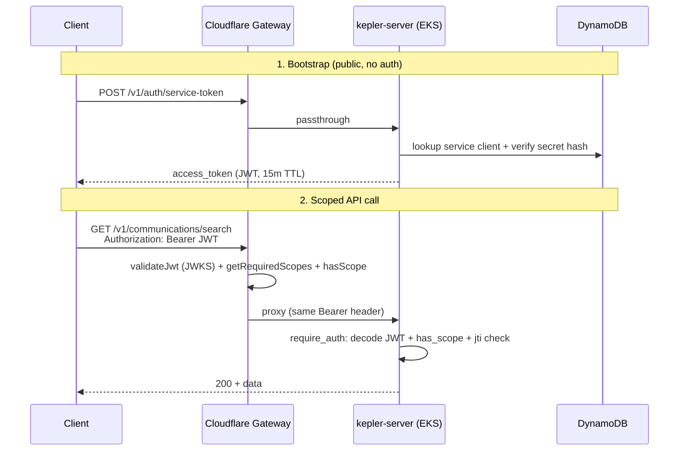

Tracing the gateway entry, token validation, and backend forwarding path in the codebase.
## Overview

Kepler uses **OAuth 2.0 client credentials** (plus optional GitHub OIDC JWT-bearer for CI) to mint **short-lived RS256 JWTs**. Callers present either:

1. **`Authorization: Bearer <jwt>`** — preferred for M2M service integrations  
2. **`X-API-Key`** — legacy/scoped portal keys stored in DynamoDB  

Scope enforcement is **defense in depth**: the Cloudflare gateway (`api.keplr.sh`) checks credentials and scopes first; the Rust API re-validates and checks again before handlers run. The canonical route→scope map lives in `policy/scope-matrix.json`, generated into both `gateway/src/generated/scope-matrix.ts` and `crates/kepler-server/src/generated/scope_matrix.rs`.

---

## End-to-end flow



---

## Phase 1: Token issuance (public bootstrap)

### Gateway: unauthenticated passthrough

`/v1/auth/service-token`, `/.well-known/jwks.json`, client registration, and related auth routes are listed in `PUBLIC_BACKEND_PASSTHROUGH` and bypass gateway auth:

```735:760:gateway/src/index.ts
    // Allow unauthenticated access to OAuth M2M endpoints (JWKS and token issuance)
    // and self-serve portal endpoints (auth via GitHub OAuth token in X-GitHub-Token header)
    if (isPublicBackendPassthroughPath(url.pathname)) {
      const backendUrl = buildRequestBackendUrl(url, env);
      const originReq = new Request(backendUrl.toString(), {
        method: request.method,
        headers: sanitizeOriginHeaders(request.headers, trustedClientIp),
        body: request.body,
        redirect: 'manual'
      });
      // ...
```

### Backend: `POST /v1/auth/service-token`

`issue_service_token` in `crates/kepler-server/src/routes/service_auth.rs` supports two grant types:

| Grant | Inputs | Identity source |
|-------|--------|-----------------|
| `client_credentials` (default) | `client_id` + `client_secret` | DynamoDB service client registry |
| `urn:ietf:params:oauth:grant-type:jwt-bearer` | `assertion` (GitHub OIDC) | Verified GitHub Actions token |

For client credentials, the flow is:

1. Load client from `ServiceClientManager` (`crates/kepler-identity/src/service_client.rs`) — DynamoDB table `kepler-service-clients-prod`
2. Reject if disabled or secret hash mismatch (constant-time SHA-256 compare)
3. Intersect requested `scope` with client's allowed scopes (or grant all client scopes if omitted)
4. Sign JWT via `sign_and_respond`

JWT claims embed identity and authorization:

```58:77:crates/kepler-server/src/routes/service_auth.rs
pub struct ServiceTokenClaims {
    pub iss: String,
    pub sub: String,       // client_id or GitHub subject
    pub aud: String,
    pub exp: i64,
    pub iat: i64,
    pub jti: String,
    pub scope: String,     // space-separated Kepler scopes
    pub client_name: String,
}
```

Signing uses RS256 with keys from Secrets Manager (`JWT_SIGNING_KEY` / `JWT_PUBLIC_KEY`), issuer `https://api.keplr.sh`, audience `api://kepler`, 15-minute TTL. JWKS is served at `GET /.well-known/jwks.json` for verifiers (gateway + backend).

Auth endpoints are rate-limited per-IP (`AuthRateLimitStore`: 30 req/min for service-token) in `crates/kepler-server/src/middleware/auth_rate_limit.rs`.

---

## Phase 2: Gateway entry (`gateway/src/index.ts`)

### Request routing order

The `fetch` export wraps `handleRequest` with `X-Request-Id` tracing, then branches in this order:

1. `OPTIONS` → CORS  
2. OpenAPI spec (served locally)  
3. `/v1/auth/session` → optional Okta introspection, then backend forward  
4. Public gateway passthrough (`/health`)  
5. Public backend passthrough (auth bootstrap, JWKS, portal)  
6. **Authenticated paths** — require `Authorization: Bearer` **or** `X-API-Key`

### Bearer JWT path (service tokens)

```762:836:gateway/src/index.ts
    const apiKey = request.headers.get('X-API-Key');
    const authHeader = request.headers.get('Authorization');
    const bearerToken = authHeader?.startsWith('Bearer ') ? authHeader.substring(7) : null;
    // ...
    if (bearerToken) {
      jwtPayload = await validateJwt(bearerToken, env, ctx);
      // ...
      const requiredScopes = getRequiredScopes(url.pathname, request.method);
      // hasScope check → 403 insufficient_scope
      // forward to BACKEND_URL with sanitizeOriginHeaders (Bearer preserved)
```

`validateJwt` (`gateway/src/index.ts:195-281`):

- Parses header/payload; pins **RS256**, checks `kid`, `iss` (from `JWT_ISSUER` / `JWT_ISSUERS`), `aud` (`JWT_AUDIENCE`), `exp`
- Fetches JWKS from backend `/.well-known/jwks.json` (cached in KV + in-memory)
- Verifies RSA signature via Web Crypto
- Caches validated payload until token expiry

Scope check uses generated helpers:

```217:240:gateway/src/generated/scope-matrix.ts
export function getRequiredScopes(pathname: string, method: string): string | string[] | null {
  // prefix-longest match against ROUTE_SCOPES; admin routes split GET vs mutating
}
export function hasScope(granted: string, required: string): boolean {
  // exact match, trailing :* wildcards, SCOPE_ALIASES (e.g. communications:read alias)
}
```

On success, the gateway **proxies the original request unchanged** (including `Authorization: Bearer`) to `BACKEND_URL`. It does **not** mint or swap tokens. Bearer requests skip gateway rate limiting (rate limits apply only on the X-API-Key branch).

### X-API-Key path (scoped API keys)

If no Bearer token, the gateway calls the backend validate endpoint:

```286:333:gateway/src/index.ts
async function fetchScopesForApiKey(apiKey, env, ctx) {
  // KV cache keyed by sha256(apiKey), 45s TTL
  const validateUrl = buildBackendUrl(env, '/v1/auth/validate');
  // POST with X-API-Key → { valid, scopes }
  // Rejects keys with empty/missing scopes
}
```

Backend `validate_token` (`crates/kepler-server/src/routes/auth.rs:542-570`) looks up the key hash in DynamoDB via `AuthTokenManager.validate_token` and returns `kepler_scopes`. Gateway enforces scopes the same way as JWT, returning `403 legacy_key_scope_required` on failure.

---

## Phase 3: Backend validation and identity

### Router structure

`crates/kepler-server/src/main.rs` mounts:

- **Public**: `/health`, JWKS, `/v1/auth/*`, portal routes (no `require_auth`)
- **Protected** (nested under `/v1`): route groups each wrapped with `require_auth(Some(SCOPE_*))`

Example — communications routes require `kepler:communications:content:read`:

```603:606:crates/kepler-server/src/main.rs
        .layer(axum_middleware::from_fn_with_state(
            state.clone(),
            auth_middleware::require_auth(Some(scopes::SCOPE_COMMUNICATIONS_CONTENT_READ)),
        ))
```

### Unified auth middleware

`require_auth` in `crates/kepler-server/src/middleware.rs` is the single backend auth gate:

```125:128:crates/kepler-server/src/middleware.rs
    // 1. Try Bearer JWT first (preferred for M2M service tokens)
    if let Some(token) = jwt::extract_bearer_token(&request) {
        return handle_bearer_auth(&state, token, request, next, required_scope).await;
    }
```

**Bearer handling** (`handle_bearer_auth`):

1. `validate_service_jwt_with_scope` or `validate_service_jwt_no_scope` — RS256 decode, kid/iss/aud/exp checks (`crates/kepler-server/src/middleware/jwt.rs`)
2. **JTI denylist** check for revoked tokens (`jti_denylist`)
3. Wildcard-aware scope check via `scopes::has_scope`
4. Audit log (`audit_jwt_allow` / `audit_jwt_deny_scope`)
5. Insert **`AuthInfo::ServiceToken`** into request extensions:

```439:444:crates/kepler-server/src/middleware.rs
            let auth_info = AuthInfo::ServiceToken {
                client_id: claims.sub,
                client_name: claims.client_name,
                scopes: claims.scope,
            };
            request.extensions_mut().insert(auth_info);
```

**X-API-Key handling** (fallback): DynamoDB validation, reject if `kepler_scopes` absent, scope check, insert `AuthInfo::ApiKey { token_info }`.

`AuthInfo` is the unified identity envelope handlers can extract — it records auth method plus caller identity (`client_id`/`client_name` for service tokens, Okta metadata for API keys).

### JWT revocation

`POST /v1/auth/revoke-jwt` decodes the token, adds `jti` to the in-memory denylist until original expiry. Both gateway-issued and backend-checked tokens fail at step 2 above once revoked.

---

## Important files summary

| Role | File | Key functions/types |
|------|------|---------------------|
| Gateway entry + proxy | `gateway/src/index.ts` | `fetch`, `handleRequest`, `validateJwt`, `fetchScopesForApiKey`, `sanitizeOriginHeaders` |
| Gateway scope map | `gateway/src/generated/scope-matrix.ts` | `getRequiredScopes`, `hasScope`, `isPublicBackendPassthroughPath` |
| Token issuance | `crates/kepler-server/src/routes/service_auth.rs` | `issue_service_token`, `sign_and_respond`, `ServiceTokenClaims`, `jwks` |
| Service client registry | `crates/kepler-identity/src/service_client.rs` | `ServiceClientManager::get_client` |
| Backend auth middleware | `crates/kepler-server/src/middleware.rs` | `require_auth`, `AuthInfo`, `handle_bearer_auth` |
| JWT decode/validate | `crates/kepler-server/src/middleware/jwt.rs` | `validate_service_jwt_with_scope`, `extract_bearer_token` |
| Scope matching | `crates/kepler-server/src/middleware/scopes.rs` → `generated/scope_matrix.rs` | `has_scope` (delegates to `kepler_llm_common::scopes`) |
| API key validate (gateway callback) | `crates/kepler-server/src/routes/auth.rs` | `validate_token` |
| API key storage | `crates/kepler-identity/src/auth.rs` | `AuthTokenManager::validate_token`, `TokenInfo.kepler_scopes` |
| Route wiring | `crates/kepler-server/src/main.rs` | public vs scoped routers, JWT key init |
| Operator docs | `docs/service-auth.md` | end-to-end M2M flow, scope vocabulary |

---

## Design notes worth remembering

- **No credential translation**: the gateway validates then forwards the same `Authorization` or `X-API-Key` header; the backend independently re-validates. A token that passes the gateway but fails backend checks (e.g. revoked JTI after gateway cache) still gets rejected at origin.
- **Dual scope enforcement** uses the same generated matrix; gateway blocks early with `403`, backend returns structured `insufficient_scope` / `legacy_key_scope_required` JSON.
- **Service tokens carry scopes in the JWT `scope` claim**; API keys carry them in DynamoDB `kepler_scopes`. Unscoped API keys are rejected (no fallback).
- **Identity for service tokens**: `sub` = client_id (or GitHub OIDC subject), `client_name` for logging/audit; handlers receive this via `AuthInfo::ServiceToken` extensions after middleware succeeds.
