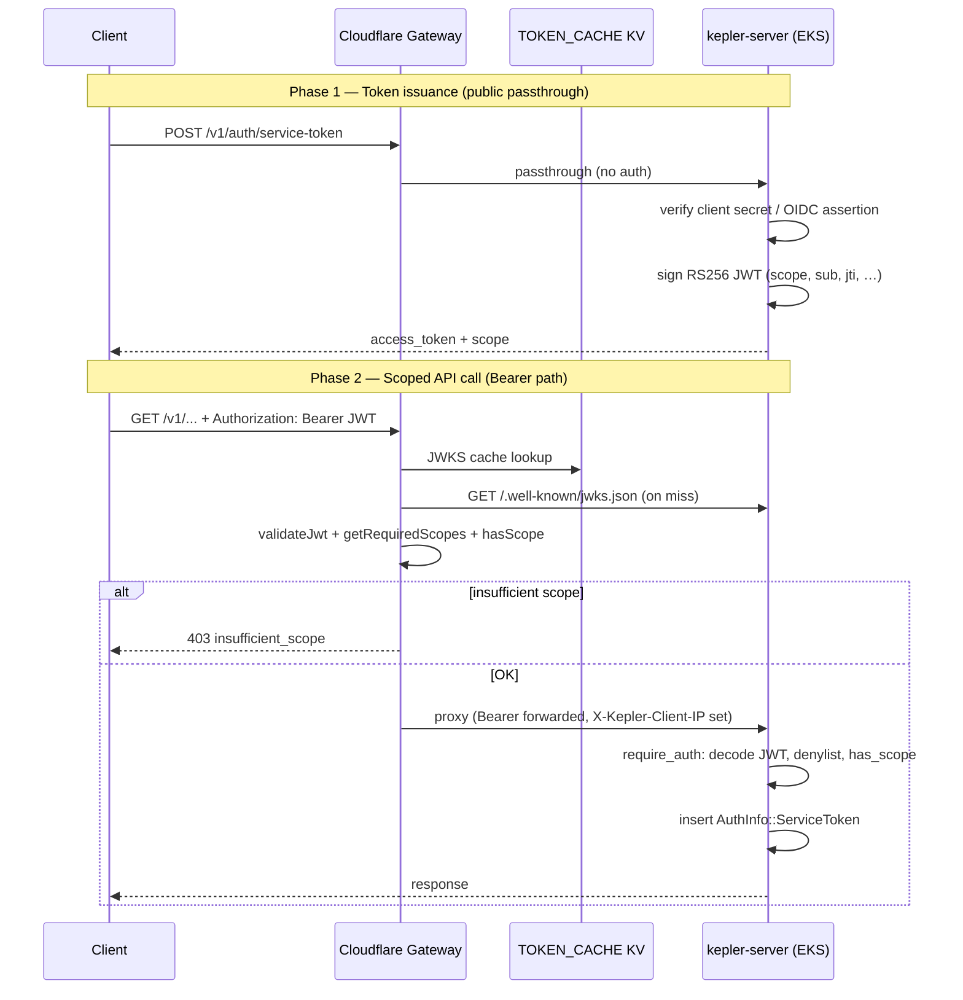

Tracing the gateway auth path: I'll search the repo for service-token validation, scope handling, and how requests are forwarded to the backend.
## Overview

Kepler uses a **two-layer, dual-credential** auth model. Service integrations obtain short-lived **Bearer JWTs** from `POST /v1/auth/service-token` (OAuth 2.0 client credentials or GitHub OIDC jwt-bearer). Portal-issued **`X-API-Key`** credentials are also supported, but only when they carry explicit `kepler_scopes` in DynamoDB.

Both credentials hit **`api.keplr.sh`** (Cloudflare Worker in `gateway/src/index.ts`), which validates and enforces scopes **before** proxying to the Rust backend. The backend re-validates and re-enforces scopes in `require_auth()` middleware — there is no trust-the-edge bypass.

The canonical route→scope map lives in `policy/scope-matrix.json` and is generated into `gateway/src/generated/scope-matrix.ts` and `crates/kepler-server/src/middleware/scopes.rs`.

---

## End-to-end flow



---

## Phase 1: Service-token issuance

### Gateway entry (public passthrough)

`POST /v1/auth/service-token` is listed in `PUBLIC_BACKEND_PASSTHROUGH` in the generated scope matrix and bypasses gateway auth. The gateway strips hop-by-hop/proxy headers and forwards the request unchanged to `BACKEND_URL`:

```735:759:gateway/src/index.ts
    // Allow unauthenticated access to OAuth M2M endpoints (JWKS and token issuance)
    // and self-serve portal endpoints (auth via GitHub OAuth token in X-GitHub-Token header)
    if (isPublicBackendPassthroughPath(url.pathname)) {
      const backendUrl = buildRequestBackendUrl(url, env);
      const originReq = new Request(backendUrl.toString(), {
        method: request.method,
        headers: sanitizeOriginHeaders(request.headers, trustedClientIp),
        body: request.body,
        redirect: 'manual'
      });
      // ...
    }
```

Same passthrough applies to `/.well-known/jwks.json`, `/v1/auth/validate`, client registration, portal routes, etc. (`gateway/src/generated/scope-matrix.ts` lines 29–123).

### Backend token minting

`issue_service_token()` in `crates/kepler-server/src/routes/service_auth.rs` handles two grant types:

| Grant | Input | Identity source |
|-------|-------|-----------------|
| `client_credentials` (default) | `client_id` + `client_secret` | DynamoDB service client registry (`ServiceClientManager`) |
| `urn:ietf:params:oauth:grant-type:jwt-bearer` | GitHub OIDC `assertion` | Verified OIDC claims (`sub`, repository) |

For client credentials, the handler:
1. Loads the client from DynamoDB and checks `enabled`
2. Verifies `client_secret` against stored SHA-256 hash (`verify_client_secret`)
3. Resolves scopes (requested subset must ⊆ client's registered scopes, or all client scopes if none requested)
4. Signs a 15-minute RS256 JWT via `sign_and_respond()`

JWT claims include `iss`, `sub` (client_id or OIDC subject), `aud`, `exp`, `jti`, **`scope`** (space-separated), and `client_name`:

```379:416:crates/kepler-server/src/routes/service_auth.rs
fn sign_and_respond(
    state: &AppState,
    subject: String,
    client_name: String,
    scope_string: String,
) -> Result<Json<ServiceTokenResponse>, (StatusCode, Json<TokenErrorResponse>)> {
    let now = Utc::now();
    let exp = now + Duration::minutes(SERVICE_TOKEN_TTL_MINUTES);
    let claims = ServiceTokenClaims {
        iss: state.jwt_issuer.clone(),
        sub: subject,
        aud: state.jwt_audience.clone(),
        exp: exp.timestamp(),
        iat: now.timestamp(),
        jti: Uuid::new_v4().to_string(),
        scope: scope_string.clone(),
        client_name,
    };
    // ... RS256 encode with kid ...
}
```

The public key is published at `GET /.well-known/jwks.json` (`service_auth::jwks`). The gateway fetches this to validate inbound Bearer tokens (`getJwksForJwtValidation` in `gateway/src/index.ts`).

Rate limiting on issuance: 30 req/min per IP via `AuthRateLimitStore` (`crates/kepler-server/src/middleware/auth_rate_limit.rs`).

---

## Phase 2: Protected request — gateway entry

The Worker's `fetch` handler (`gateway/src/index.ts` ~1062) wraps every request with `X-Request-Id`, then calls `handleRequest()`.

**Branch order** (must be preserved):
1. `OPTIONS` → CORS
2. Public OpenAPI (served locally)
3. `/v1/auth/session` → Okta introspection (separate human-auth path)
4. Public gateway passthrough (`/health`)
5. Public backend passthrough (auth bootstrap routes)
6. **Authenticated paths** — require `Authorization: Bearer` **or** `X-API-Key`

```762:770:gateway/src/index.ts
    const apiKey = request.headers.get('X-API-Key');
    const authHeader = request.headers.get('Authorization');
    const bearerToken = authHeader?.startsWith('Bearer ') ? authHeader.substring(7) : null;

    if (!apiKey && !bearerToken) {
      return new Response('Missing X-API-Key or Authorization header', { status: 401, headers: errorCorsHeaders() });
    }
```

**Bearer takes precedence**: if `bearerToken` is present, the JWT path runs even when `X-API-Key` is also set.

---

## Bearer JWT path (gateway)

### 1. Cryptographic validation — `validateJwt()`

```195:276:gateway/src/index.ts
async function validateJwt(token: string, env: Env, ctx: ExecutionContext): Promise<JwtPayload | null> {
    // Parse header/payload; require RS256, kid, non-expired exp
    // Check iss against JWT_ISSUER(S), aud against JWT_AUDIENCE
    // Fetch JWKS from backend (runtime + KV cache)
    // Verify RS256 signature via Web Crypto
    // Cache validated payload until exp or JWKS TTL
}
```

JWKS is read from `/.well-known/jwks.json` on the backend (`getJwksForJwtValidation`, lines 124–155).

### 2. Scope enforcement — `getRequiredScopes()` + `hasScope()`

After JWT validation, the gateway looks up required scope(s) for the path/method and checks the JWT's `scope` claim:

```785:807:gateway/src/index.ts
        const requiredScopes = getRequiredScopes(url.pathname, request.method);
        if (requiredScopes && jwtPayload.scope) {
          const requiredArr = Array.isArray(requiredScopes) ? requiredScopes : [requiredScopes];
          const missing = requiredArr.filter((s) => !hasScope(jwtPayload!.scope!, s));
          if (missing.length > 0) {
            return new Response(
              JSON.stringify({ error: 'insufficient_scope', required: requiredArr }),
              { status: 403, headers: errHeaders }
            );
          }
        } else if (requiredScopes && !jwtPayload.scope) {
          // JWT has no scope claim at all -- deny access to scoped routes
          // ...
        }
```

Scope lookup uses longest-prefix matching over `ROUTE_SCOPES` (`gateway/src/generated/scope-matrix.ts` lines 217–225). Wildcard grants like `kepler:admin:*` are supported in `hasScope()` (lines 227–239).

Failure modes:
- Invalid/expired JWT → **401**
- Valid JWT, missing scope → **403** `{ error: "insufficient_scope" }`

### 3. Backend forwarding

On success, the gateway proxies with **`sanitizeOriginHeaders()`**, which:
- Strips hop-by-hop, `cf-*`, and spoofable proxy identity headers
- **Preserves** `Authorization: Bearer …` and `X-API-Key` (if present)
- Adds trusted `X-Kepler-Client-IP` from Cloudflare's `CF-Connecting-IP`
- Forwards `X-Request-Id` (set at the Worker entry)

```809:819:gateway/src/index.ts
        const backendUrl = buildRequestBackendUrl(url, env);
        const fwdHeaders = sanitizeOriginHeaders(request.headers, trustedClientIp);
        const originReq = new Request(backendUrl.toString(), {
          method: request.method,
          headers: fwdHeaders,
          body: request.body,
          redirect: 'manual'
        });
```

The gateway does **not** inject service identity as separate headers — identity travels in the credential itself.

---

## X-API-Key path (gateway)

### 1. Scope resolution — `fetchScopesForApiKey()`

Because API keys aren't self-describing JWTs, the gateway validates them against the backend:

```286:332:gateway/src/index.ts
async function fetchScopesForApiKey(apiKey: string, env: Env, ctx: ExecutionContext): Promise<{ valid: boolean; granted: string }> {
  const cacheKey = `token:${await sha256hex(apiKey)}`;
  // KV read-through cache (45s TTL, positive results only)
  const validateUrl = buildBackendUrl(env, '/v1/auth/validate');
  const res = await fetch(..., { headers: { 'X-API-Key': apiKey } });
  // Require explicit scopes — no unscoped fallback
  const granted = data.scopes?.trim() ?? '';
  if (!granted) return { valid: false, granted: '' };
  // Cache in TOKEN_CACHE KV
}
```

Backend handler `validate_token()` (`crates/kepler-server/src/routes/auth.rs` lines 542–569) calls `auth_token_manager.validate_token()`, which looks up the key hash in DynamoDB and returns `kepler_scopes`:

```381:462:crates/kepler-identity/src/auth.rs
    pub async fn validate_token(&self, token: &str) -> Result<Option<TokenInfo>, IdentityError> {
        let token_hash = Self::hash_value(token);
        // DynamoDB get by api_key_hash; check expiry
        // Returns TokenInfo { kepler_scopes: Option<String>, ... }
    }
```

### 2. Scope enforcement

Same `getRequiredScopes()` + `hasScope()` as Bearer, but errors use `legacy_key_scope_required`:

```846:865:gateway/src/index.ts
    const scopesResult = await fetchScopesForApiKey(apiKey, env, ctx);
    if (!scopesResult.valid) {
      return new Response('Unauthorized', { status: 401, headers: errorCorsHeaders() });
    }
    const requiredScopes = getRequiredScopes(url.pathname, request.method);
    if (requiredScopes) {
      const missing = requiredArr.filter((s) => !hasScope(scopesResult.granted, s));
      if (missing.length > 0) {
        return new Response(JSON.stringify({
          error: 'legacy_key_scope_required',
          message: 'This endpoint requires scoped authentication',
          required_scopes: requiredArr,
        }), { status: 403, headers: errHeaders });
      }
    }
```

### 3. Backend forwarding + extras

After scope check, the API-key path also applies **rate limiting** (Durable Object), optional **response caching**, then proxies with the original `X-API-Key` header. On backend 401/403, the gateway purges the KV scope cache entry (`token:${apiKeyHash}`).

---

## Phase 3: Backend second enforcement

Every protected route group in `crates/kepler-server/src/main.rs` is wrapped with `require_auth(Some(scope))`. Example:

```507:505:crates/kepler-server/src/main.rs
    let comms_routes = Router::new()
        // ... routes ...
        .layer(axum_middleware::from_fn_with_state(
            state.clone(),
            auth_middleware::require_auth(Some(scopes::SCOPE_HEALTH_READ)),
        ))
```

`require_auth_inner()` (`crates/kepler-server/src/middleware.rs`):

1. **Try Bearer first** → `handle_bearer_auth()`
   - Validates RS256 JWT via `jwt::validate_service_jwt_with_scope()` (checks `kid`, `iss`, `aud`, `exp`, scope with wildcards)
   - Checks **JTI denylist** for revoked tokens (`state.jti_denylist.is_revoked`)
   - Inserts `AuthInfo::ServiceToken { client_id: claims.sub, client_name, scopes }` into request extensions
   - Emits audit event (`audit_jwt_allow` → `audit_events` table)

2. **Fall back to X-API-Key**
   - `auth_token_manager.validate_token()`
   - Rejects keys with no `kepler_scopes` (401 `missing_scopes`)
   - Checks scope via `scopes::has_scope()`
   - Inserts `AuthInfo::ApiKey { token_info }` + `TokenInfo` extensions
   - Emits audit event (`audit_api_key_allow` / `audit_api_key_deny_scope`)

JWT validation core (`crates/kepler-server/src/middleware/jwt.rs`):

```32:70:crates/kepler-server/src/middleware/jwt.rs
fn decode_and_validate(token, decoding_key, issuer, audience, expected_kid) -> Result<ServiceTokenClaims, JwtValidationError> {
    // kid pin, RS256, iss/aud/exp validation
    decode::<ServiceTokenClaims>(token, decoding_key, &validation)
}
```

Scope errors return `{ "error": "insufficient_scope", "required": "..." }` (Bearer) or `legacy_key_scope_required` (API key) — matching gateway error shapes documented in `docs/service-auth.md`.

### Identity available to handlers

After middleware, handlers can extract:

| Auth method | Extension type | Identity fields |
|-------------|----------------|-----------------|
| Bearer JWT | `AuthInfo::ServiceToken` | `client_id` (= JWT `sub`), `client_name`, `scopes` |
| X-API-Key | `AuthInfo::ApiKey` + `TokenInfo` | `okta_uid`, `github_username` (if session-derived), `kepler_scopes`, etc. |

Audit logging uses `X-Kepler-Client-IP` (gateway-set, not client-spoofable) for IP attribution (`crates/kepler-server/src/middleware/audit.rs` lines 22–47).

---

## Scope matrix (shared contract)

Both layers consume generated artifacts from `policy/scope-matrix.json`:

```217:239:gateway/src/generated/scope-matrix.ts
export function getRequiredScopes(pathname: string, method: string): string | string[] | null {
  if (pathname === '/v1/admin/providers/health' || ...)
    return method === 'GET' ? ADMIN_READ_SCOPE : ADMIN_WRITE_SCOPE;
  const sorted = Object.entries(ROUTE_SCOPES).sort((a, b) => b[0].length - a[0].length);
  for (const [prefix, scope] of sorted) {
    if (pathname === prefix || pathname.startsWith(prefix)) return scope;
  }
  return null;
}

export function hasScope(granted: string, required: string): boolean {
  // exact match, trailing :* wildcards, SCOPE_ALIASES
}
```

Regenerate with `just generate-scope-matrix`.

Example mappings (`ROUTE_SCOPES`):
- `/v1/communications/*` → `kepler:communications:content:read`
- `/v1/accounts/*` → `kepler:accounts:read`
- `/v1/admin/*` → `kepler:admin:write` (with read exceptions for specific GET diagnostics)

---

## Key files reference

| Role | File | Key symbols |
|------|------|-------------|
| Gateway entry + proxy | `gateway/src/index.ts` | `handleRequest`, `validateJwt`, `fetchScopesForApiKey`, `sanitizeOriginHeaders` |
| Gateway scope map | `gateway/src/generated/scope-matrix.ts` | `getRequiredScopes`, `hasScope`, `isPublicBackendPassthroughPath` |
| Token issuance | `crates/kepler-server/src/routes/service_auth.rs` | `issue_service_token`, `sign_and_respond`, `jwks` |
| Service client registry | `crates/kepler-identity/src/service_client.rs` | `ServiceClientManager` |
| API key validation | `crates/kepler-server/src/routes/auth.rs` | `validate_token` |
| API key store | `crates/kepler-identity/src/auth.rs` | `AuthTokenManager::validate_token` |
| Backend auth middleware | `crates/kepler-server/src/middleware.rs` | `require_auth`, `AuthInfo`, `handle_bearer_auth` |
| JWT decode/scope | `crates/kepler-server/src/middleware/jwt.rs` | `validate_service_jwt_with_scope`, `decode_and_validate` |
| Backend scope constants | `crates/kepler-server/src/middleware/scopes.rs` | re-exports generated matrix |
| Route wiring | `crates/kepler-server/src/main.rs` | `public_auth_routes`, scoped `protected_routes` |
| Auth audit | `crates/kepler-server/src/middleware/audit.rs` | `audit_jwt_allow`, `audit_api_key_deny_scope` |
| Docs | `docs/service-auth.md` | End-to-end M2M OAuth guide |

---

## Design notes

1. **Defense in depth**: Gateway rejects bad credentials/scopes before origin load; backend independently validates — a bypass at the edge would still fail at origin.

2. **No unscoped fallback**: Tokens/keys without explicit scopes are rejected at both layers (post auth-hardening).

3. **Bearer preferred for M2M**: Short-lived JWTs (15 min) with embedded scopes; API keys are longer-lived DynamoDB records mainly for portal/human workflows.

4. **Identity is credential-derived, not header-injected**: The gateway forwards `Authorization` or `X-API-Key`; the backend reconstructs `AuthInfo` from those. Only `X-Kepler-Client-IP` and `X-Request-Id` are gateway-controlled additions.

5. **Revocation**: JWTs can be revoked via `POST /v1/auth/revoke-jwt` (JTI denylist); API keys via DynamoDB delete/revoke. Gateway KV cache for API keys is short (45s) so revocations propagate quickly.
