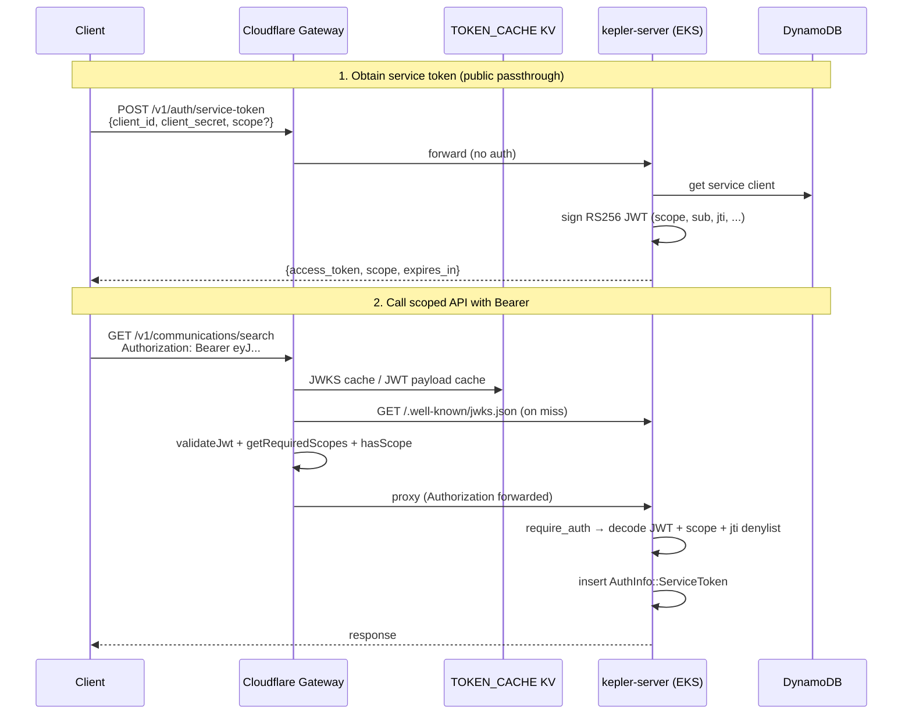

Tracing the gateway auth path from entry through validation and backend forwarding.
# Service-token and scope/identity flow

This is a two-credential, two-layer system. **Service tokens** are short-lived RS256 JWTs minted by the Rust API; **X-API-Key** credentials are long-lived DynamoDB-backed keys. Both carry space-separated `kepler:*` scopes. Enforcement happens at the **Cloudflare gateway** (edge) and again at the **Rust backend** (origin), using the same generated scope matrix.

---

## End-to-end picture



---

## Phase 1: Token issuance (public, no caller auth)

### Gateway: unauthenticated passthrough

`POST /v1/auth/service-token` is listed in `PUBLIC_BACKEND_PASSTHROUGH` in the generated scope matrix. The gateway forwards it without checking credentials:

```737:759:gateway/src/index.ts
    if (isPublicBackendPassthroughPath(url.pathname)) {
      const backendUrl = buildRequestBackendUrl(url, env);
      const originReq = new Request(backendUrl.toString(), {
        method: request.method,
        headers: sanitizeOriginHeaders(request.headers, trustedClientIp),
        body: request.body,
        redirect: 'manual'
      });
      // ...
    }
```

Public auth routes include service-token, JWKS, register-client, validate, etc. (`gateway/src/generated/scope-matrix.ts` lines 29–85).

### Backend: client credentials → signed JWT

`issue_service_token` in `crates/kepler-server/src/routes/service_auth.rs` supports:

1. **`client_credentials`** (default): `client_id` + `client_secret`
2. **`jwt-bearer`**: GitHub Actions OIDC assertion

For client credentials:

1. Look up client in DynamoDB via `ServiceClientManager::get_client` (`crates/kepler-identity/src/service_client.rs`)
2. Reject if disabled or secret hash mismatch (`verify_client_secret`)
3. Resolve scopes: requested subset must be ⊆ client’s registered scopes, else all client scopes
4. Update `last_used_at`
5. Sign JWT via `sign_and_respond`:

```388:416:crates/kepler-server/src/routes/service_auth.rs
    let claims = ServiceTokenClaims {
        iss: state.jwt_issuer.clone(),
        sub: subject,
        aud: state.jwt_audience.clone(),
        exp: exp.timestamp(),
        iat: now.timestamp(),
        jti: Uuid::new_v4().to_string(),
        scope: scope_string.clone(),
        client_name,
    };
    // RS256 encode with kid from state.jwt_key_id
```

Token TTL is **15 minutes** (`SERVICE_TOKEN_TTL_MINUTES`). JWKS for verification is served at `GET /.well-known/jwks.json` (also public passthrough).

The route is mounted without auth middleware in `main.rs`:

```736:744:crates/kepler-server/src/main.rs
    let public_auth_routes = Router::new()
        .route(
            "/v1/auth/service-token",
            post(routes::service_auth::issue_service_token),
        )
```

It is IP rate-limited (30 req/min) via `auth_rate_limit_middleware`.

---

## Phase 2: Gateway entry for authenticated API calls

Every request hits `gateway/src/index.ts` → `fetch` → `handleRequest`. Order matters:

| Step | Condition | Action |
|------|-----------|--------|
| 1 | `OPTIONS` | CORS only |
| 2 | OpenAPI paths | Serve bundled spec locally |
| 3 | `/v1/auth/session` | Optional Okta introspection, then forward |
| 4 | Public gateway passthrough (`/health`) | Forward unauthenticated |
| 5 | Public backend passthrough (JWKS, service-token, validate, portal, …) | Forward unauthenticated |
| 6 | Everything else | Require `Authorization: Bearer` **or** `X-API-Key` |

`X-Request-Id` is injected at the outer `fetch` wrapper and forwarded through `sanitizeOriginHeaders`.

---

## Phase 3A: Bearer JWT path (service tokens)

### Credential extraction

```762:770:gateway/src/index.ts
    const apiKey = request.headers.get('X-API-Key');
    const authHeader = request.headers.get('Authorization');
    const bearerToken = authHeader?.startsWith('Bearer ') ? authHeader.substring(7) : null;

    if (!apiKey && !bearerToken) {
      return new Response('Missing X-API-Key or Authorization header', { status: 401, ... });
    }
```

**Bearer takes priority** when present (JWT branch runs before X-API-Key).

### JWT validation at the edge (`validateJwt`)

`validateJwt` in `gateway/src/index.ts`:

1. Runtime cache keyed by `sha256(issuers + audience + token)`
2. Parse header/payload; require RS256, `kid`, unexpired `exp`
3. Check `iss` against `JWT_ISSUER` / `JWT_ISSUERS` and `aud` against `JWT_AUDIENCE`
4. Fetch JWKS from backend `/.well-known/jwks.json` (KV + in-memory cache via `getJwksForJwtValidation`)
5. Verify RS256 signature with Web Crypto

The gateway does **not** check the JTI denylist; that happens only on the backend.

### Scope enforcement at the edge

After JWT validation:

```785:807:gateway/src/index.ts
        const requiredScopes = getRequiredScopes(url.pathname, request.method);
        if (requiredScopes && jwtPayload.scope) {
          const requiredArr = Array.isArray(requiredScopes) ? requiredScopes : [requiredScopes];
          const missing = requiredArr.filter((s) => !hasScope(jwtPayload!.scope!, s));
          if (missing.length > 0) {
            return new Response(JSON.stringify({ error: 'insufficient_scope', required: requiredArr }), { status: 403, ... });
          }
        } else if (requiredScopes && !jwtPayload.scope) {
          // deny — JWT has no scope claim
        }
```

Scope lookup comes from generated `ROUTE_SCOPES` in `gateway/src/generated/scope-matrix.ts` (`getRequiredScopes`, `hasScope`). Wildcards like `kepler:admin:*` and aliases (e.g. `kepler:communications:read` → `kepler:communications:content:read`) are supported.

### Forwarding to backend

On success, the gateway proxies with **original headers preserved** (minus hop-by-hop/proxy identity headers), including `Authorization: Bearer …`:

```809:819:gateway/src/index.ts
        const backendUrl = buildRequestBackendUrl(url, env);
        const fwdHeaders = sanitizeOriginHeaders(request.headers, trustedClientIp);
        const originReq = new Request(backendUrl.toString(), {
          method: request.method,
          headers: fwdHeaders,
          body: request.body,
          redirect: 'manual'
        });
```

The gateway does **not** inject identity headers for JWT callers; identity is re-derived from the JWT at origin.

---

## Phase 3B: X-API-Key path (parallel auth mode)

If no Bearer token, the gateway validates `X-API-Key` via `fetchScopesForApiKey`:

1. KV cache: `token:{sha256(apiKey)}` → `{valid, granted, exp}` (45s TTL, positive results only)
2. On miss: `POST {BACKEND_URL}/v1/auth/validate` with `X-API-Key` header
3. Backend returns `{valid, scopes}` from DynamoDB token record
4. Gateway enforces scopes with the same `getRequiredScopes` + `hasScope`
5. On 401/403 from origin, gateway purges the KV cache entry

Backend validate handler (`crates/kepler-server/src/routes/auth.rs`):

```542:558:crates/kepler-server/src/routes/auth.rs
pub async fn validate_token(...) -> Result<Json<ValidateResponse>, StatusCode> {
    let token = headers.get("x-api-key")...;
    match state.auth_token_manager.validate_token(token).await {
        Ok(Some(info)) => Ok(Json(ValidateResponse {
            valid: true,
            scopes: info.kepler_scopes,
            ...
        })),
```

`AuthTokenManager::validate_token` (`crates/kepler-identity/src/auth.rs`) hashes the key, looks up DynamoDB, checks expiry, returns `TokenInfo` including `kepler_scopes`. Keys without `kepler_scopes` are rejected (no unscoped fallback).

X-API-Key requests also get rate limiting, optional response caching, and SSE concurrency controls before proxying.

---

## Phase 4: Backend validation and identity materialization

Protected routes live under `/v1/*` with per-group `require_auth(Some(scope))` middleware (`crates/kepler-server/src/main.rs` lines 478–733).

### Unified auth middleware (`require_auth`)

`crates/kepler-server/src/middleware.rs`:

1. **Try Bearer first** → `handle_bearer_auth`
2. **Else X-API-Key** → DynamoDB validate + scope check

For Bearer service tokens, `handle_bearer_auth`:

```389:445:crates/kepler-server/src/middleware.rs
async fn handle_bearer_auth(...) {
    let result = match required_scope {
        Some(scope) => jwt::validate_service_jwt_with_scope(...),
        None => jwt::validate_service_jwt_no_scope(...),
    };
    // Check jti denylist
    // audit allow/deny
    let auth_info = AuthInfo::ServiceToken {
        client_id: claims.sub,
        client_name: claims.client_name,
        scopes: claims.scope,
    };
    request.extensions_mut().insert(auth_info);
    next.run(request).await
}
```

JWT validation in `crates/kepler-server/src/middleware/jwt.rs`:

- RS256 decode with pinned `kid`, issuer, audience
- Scope check via `scopes::has_scope` (wildcard-aware)
- JTI denylist check (revoked via `POST /v1/auth/revoke-jwt`)

### Identity envelope

After auth, handlers can extract:

```37:46:crates/kepler-server/src/middleware.rs
pub enum AuthInfo {
    ApiKey { token_info: TokenInfo },
    ServiceToken {
        client_id: String,
        client_name: String,
        scopes: String,
    },
}
```

For service tokens, identity comes from JWT claims (`sub` = client_id, `client_name`, `scope`). For API keys, it comes from DynamoDB `TokenInfo` (Okta uid/username, principal hash, etc.).

Audit events are written on allow/deny via `middleware/audit.rs`.

---

## Scope matrix: shared source of truth

| Layer | File | Role |
|-------|------|------|
| Canonical | `policy/scope-matrix.json` | Route → scope mappings |
| Gateway | `gateway/src/generated/scope-matrix.ts` | `getRequiredScopes`, `hasScope`, public passthrough lists |
| Backend | `crates/kepler-server/src/generated/scope_matrix.rs` | Scope constants + `has_scope` |
| Docs | `docs/service-auth.md` | Operational guide |

Regenerate with `just generate-scope-matrix`.

---

## Error shapes (by layer and credential type)

| Situation | Gateway | Backend |
|-----------|---------|---------|
| Missing credential | 401 plain text | 401 |
| Invalid/expired JWT | 401 "Invalid or expired JWT" | 401 |
| Valid JWT, wrong scope | 403 `{error:"insufficient_scope", required:[...]}` | 403 `{error:"insufficient_scope", required:"..."}` |
| Valid API key, wrong scope | 403 `{error:"legacy_key_scope_required", ...}` | 403 same shape |
| API key without scopes | 401 (validate returns empty scopes) | 401 `{error:"missing_scopes", ...}` |

---

## Important files/functions

| Purpose | Location |
|---------|----------|
| Gateway entry + routing | `gateway/src/index.ts` — `fetch`, `handleRequest` |
| Edge JWT validation | `gateway/src/index.ts` — `validateJwt`, `getJwksForJwtValidation` |
| Edge API-key scope fetch | `gateway/src/index.ts` — `fetchScopesForApiKey` |
| Edge scope map | `gateway/src/generated/scope-matrix.ts` — `getRequiredScopes`, `hasScope` |
| Token issuance | `crates/kepler-server/src/routes/service_auth.rs` — `issue_service_token`, `sign_and_respond` |
| JWKS endpoint | `crates/kepler-server/src/routes/service_auth.rs` — `jwks` |
| Backend auth middleware | `crates/kepler-server/src/middleware.rs` — `require_auth`, `handle_bearer_auth`, `AuthInfo` |
| Backend JWT decode/scope | `crates/kepler-server/src/middleware/jwt.rs` — `validate_service_jwt_with_scope`, `decode_and_validate` |
| API-key validation (gateway + backend) | `crates/kepler-server/src/routes/auth.rs` — `validate_token`; `crates/kepler-identity/src/auth.rs` — `validate_token` |
| Service client registry | `crates/kepler-identity/src/service_client.rs` — `get_client` |
| Route wiring + scopes | `crates/kepler-server/src/main.rs` — scoped routers + public auth routes |
| Architecture docs | `docs/service-auth.md`, `gateway/AGENTS.md` |

---

## Design notes

1. **Defense in depth**: Gateway blocks bad traffic early; backend re-validates JWTs and enforces scopes independently.
2. **Service tokens are self-contained**: Edge verifies signature via JWKS; backend verifies again and checks JTI revocation.
3. **Identity is not forwarded as headers for JWTs**: The backend reconstructs `AuthInfo::ServiceToken` from JWT claims on each request.
4. **Bearer preferred over X-API-Key** at both gateway and backend when both headers are present.
5. **Public bootstrap paths** (service-token, JWKS, validate, register-client) bypass edge auth so clients can mint and validate credentials before calling scoped routes.
