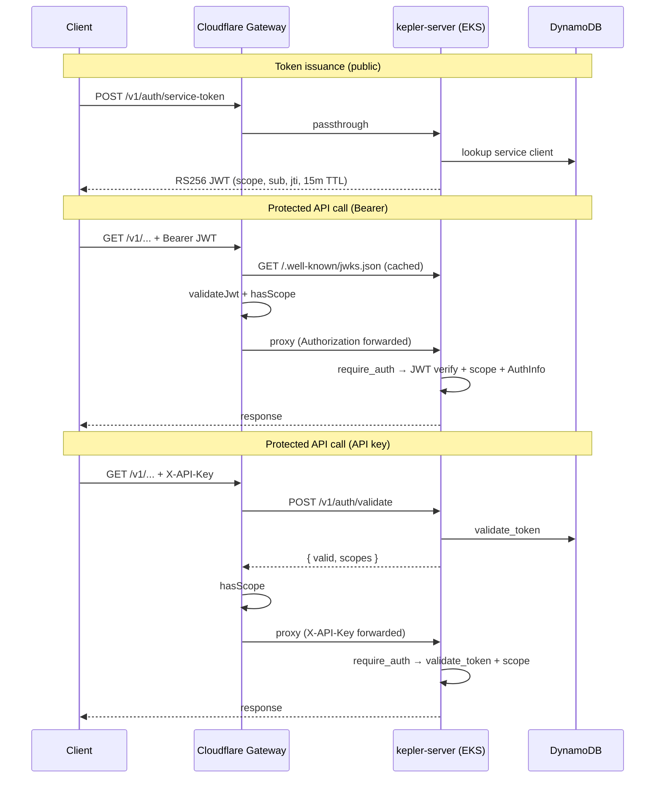

Tracing the gateway auth path: searching the codebase for service-token validation, scope handling, and backend forwarding.
Here is the end-to-end trace of **service-token and scope/identity** from `api.keplr.sh` through the Cloudflare gateway to the Rust backend.

## Architecture overview

Auth is enforced at **two layers** with the same scope vocabulary (`policy/scope-matrix.json` → generated artifacts in gateway and backend):

1. **Cloudflare Worker** (`gateway/src/index.ts`) — validate credential, resolve scopes, reject before origin if insufficient.
2. **Rust API** (`crates/kepler-server/src/middleware.rs`) — re-validate credential, enforce route scope again, attach identity to the request.

There are two caller credential types:

| Credential | Typical use | Scope source |
|---|---|---|
| `Authorization: Bearer <JWT>` | M2M integrations (`/v1/auth/service-token`) | JWT `scope` claim |
| `X-API-Key: kp_...` | Portal/session/managed keys | DynamoDB `kepler_scopes` |



---

## 1. Token issuance (`POST /v1/auth/service-token`)

### Gateway: public passthrough

`/v1/auth/service-token` is in `PUBLIC_BACKEND_PASSTHROUGH`, so the gateway proxies it **without** checking Bearer/API key:

```29:45:gateway/src/generated/scope-matrix.ts
const PUBLIC_BACKEND_PASSTHROUGH: readonly PathPolicyRule[] = [
  // ...
  {
    "path": "/v1/auth/service-token",
    "match": "exact"
  },
```

In `handleRequest`, that hits `isPublicBackendPassthroughPath()` and is forwarded with `sanitizeOriginHeaders()` (see forwarding section below).

### Backend: client credentials → signed JWT

`issue_service_token` in `crates/kepler-server/src/routes/service_auth.rs` supports:

- **`client_credentials`** (default): `client_id` + `client_secret`
- **`jwt-bearer`**: GitHub Actions OIDC assertion

For client credentials:

1. Look up client in DynamoDB via `ServiceClientManager::get_client` (`crates/kepler-identity/src/service_client.rs`).
2. Reject if disabled or secret hash mismatch (`verify_client_secret`).
3. Resolve scopes: requested subset must be ⊆ client’s registered scopes, or all client scopes if none requested.
4. Sign RS256 JWT via `sign_and_respond`.

JWT claims (`ServiceTokenClaims`):

```58:77:crates/kepler-server/src/routes/service_auth.rs
pub struct ServiceTokenClaims {
    pub iss: String,
    pub sub: String,        // client_id or GitHub subject
    pub aud: String,
    pub exp: i64,
    pub iat: i64,
    pub jti: String,
    pub scope: String,      // space-separated Kepler scopes
    pub client_name: String,
}
```

- TTL: **15 minutes** (`SERVICE_TOKEN_TTL_MINUTES`)
- Signed with server RSA key; public key exposed at `GET /.well-known/jwks.json` (`jwks` handler in same file)
- Issuer/audience come from `AppState` (`jwt_issuer`, `jwt_audience`)

The route is mounted **without** `require_auth`, but with per-IP rate limiting (30/min):

```735:758:crates/kepler-server/src/main.rs
let public_auth_routes = Router::new()
    .route("/v1/auth/service-token", post(routes::service_auth::issue_service_token))
    .layer(..., auth_middleware::auth_rate_limit::auth_rate_limit_middleware)
```

---

## 2. Gateway entry: request routing order

The Worker handler (`gateway/src/index.ts`) processes requests in this order:

1. `OPTIONS` → CORS
2. Unsafe path check
3. Public OpenAPI (served locally)
4. `/v1/auth/session` → Okta introspection branch (human session, not M2M)
5. Public gateway passthrough (`/health`)
6. **Public backend passthrough** (JWKS, service-token, portal auth, `/v1/auth/validate`, etc.)
7. **Authenticated paths** — require `Authorization: Bearer` **or** `X-API-Key`

For protected routes:

```762:770:gateway/src/index.ts
const apiKey = request.headers.get('X-API-Key');
const authHeader = request.headers.get('Authorization');
const bearerToken = authHeader?.startsWith('Bearer ') ? authHeader.substring(7) : null;

if (!apiKey && !bearerToken) {
  return new Response('Missing X-API-Key or Authorization header', { status: 401, ... });
}
```

**Bearer is tried first** when present; API key is the fallback path.

---

## 3. Bearer JWT path at the gateway

### Validation: `validateJwt()`

```195:276:gateway/src/index.ts
async function validateJwt(token: string, env: Env, ctx: ExecutionContext): Promise<JwtPayload | null> {
  // Parse header/payload; require RS256, kid, exp, iss, aud
  const jwks = await getJwksForJwtValidation(env, ctx);  // backend /.well-known/jwks.json, KV-cached
  // Import RSA key, crypto.subtle.verify signature
  // Cache validated payload in runtime map until exp
}
```

Checks:

- Algorithm pinned to **RS256**
- Issuer in `JWT_ISSUER` / `JWT_ISSUERS`
- Audience matches `JWT_AUDIENCE`
- Signature against JWKS (fetched from backend, cached in `TOKEN_CACHE` KV + in-memory)

### Scope enforcement at edge

```785:807:gateway/src/index.ts
const requiredScopes = getRequiredScopes(url.pathname, request.method);
if (requiredScopes && jwtPayload.scope) {
  const missing = requiredArr.filter((s) => !hasScope(jwtPayload!.scope!, s));
  if (missing.length > 0) {
    return new Response(JSON.stringify({ error: 'insufficient_scope', required: requiredArr }), { status: 403, ... });
  }
} else if (requiredScopes && !jwtPayload.scope) {
  // deny — no scope claim
}
```

Scope lookup uses generated `ROUTE_SCOPES` + `getRequiredScopes()` / `hasScope()` from `gateway/src/generated/scope-matrix.ts` (from `policy/scope-matrix.json`). Wildcards like `kepler:admin:*` and alias `kepler:communications:read` → `kepler:communications:content:read` are supported.

### Forward to backend

On success, the gateway proxies with **original headers intact** (including `Authorization: Bearer`):

```809:829:gateway/src/index.ts
const fwdHeaders = sanitizeOriginHeaders(request.headers, trustedClientIp);
const originReq = new Request(backendUrl.toString(), {
  method: request.method,
  headers: fwdHeaders,
  body: request.body,
});
const originRes = await withFetchTimeout(originReq, backendTimeout, 'Backend timeout');
```

JWT path skips gateway rate limiting and response caching (those apply only to the API-key branch).

---

## 4. X-API-Key path at the gateway

### Scope resolution: `fetchScopesForApiKey()`

The gateway does **not** trust the key locally. It calls the backend validate endpoint:

```302:328:gateway/src/index.ts
const validateUrl = buildBackendUrl(env, '/v1/auth/validate');
const res = await fetch(new Request(validateUrl, {
  method: 'POST',
  headers: { 'X-API-Key': apiKey, 'Content-Type': 'application/json' },
}));
const data = await res.json() as { valid: boolean; scopes?: string };
// Require explicit scopes — empty/missing → invalid
```

Positive results are cached in KV for **45 seconds** keyed by SHA-256 of the key (never the raw key).

Backend validate handler:

```542:558:crates/kepler-server/src/routes/auth.rs
pub async fn validate_token(...) -> Result<Json<ValidateResponse>, StatusCode> {
    let token = headers.get("x-api-key")...;
    match state.auth_token_manager.validate_token(token).await {
        Ok(Some(info)) => Ok(Json(ValidateResponse {
            valid: true,
            scopes: info.kepler_scopes,
            ...
        })),
```

`AuthTokenManager::validate_token` (`crates/kepler-identity/src/auth.rs`) looks up `api_key_hash` in DynamoDB, checks expiry, returns `TokenInfo.kepler_scopes`.

### Scope enforcement + extras

```846:866:gateway/src/index.ts
const scopesResult = await fetchScopesForApiKey(apiKey, env, ctx);
if (!scopesResult.valid) return 401;
const requiredScopes = getRequiredScopes(url.pathname, request.method);
// missing scope → 403 legacy_key_scope_required
```

Then: rate limiting (Durable Object), optional GET caching, proxy to backend. On backend 401/403, gateway purges the KV scope cache for that key hash.

---

## 5. Backend forwarding: what identity crosses the hop

`sanitizeOriginHeaders()` copies client auth headers through and adds trusted edge metadata:

```442:458:gateway/src/index.ts
function sanitizeOriginHeaders(incomingHeaders: Headers, trustedClientIp?: string): Headers {
  // Strips hop-by-hop, cf-*, spoofable proxy headers (x-forwarded-for, etc.)
  // Keeps Authorization and X-API-Key
  if (trustedClientIp) {
    headers.set('X-Kepler-Client-IP', trustedClientIp);
  }
}
```

The outer fetch wrapper also sets `X-Request-Id` for tracing:

```1086:1094:gateway/src/index.ts
tracedHeaders.set('X-Request-Id', requestId);
const tracedRequest = new Request(request, { headers: tracedHeaders });
const res = await handleRequest(tracedRequest, env, ctx, log, sentry);
```

**Important:** the gateway does **not** inject scope or client identity as separate headers for M2M JWT. Identity for Bearer auth lives entirely in the JWT; for API keys, in `X-API-Key`.

---

## 6. Backend second enforcement: `require_auth`

Protected routes are nested under `/v1` with per-group scope middleware in `main.rs`:

```478:485:crates/kepler-server/src/main.rs
// 1. Public - No auth required (health, JWKS, service-token)
// 2. Scoped - require_auth(scope) accepts Bearer JWT OR X-API-Key
```

Example: communications routes use `require_auth(Some(SCOPE_COMMUNICATIONS_CONTENT_READ))`.

### Unified middleware flow

```125:128:crates/kepler-server/src/middleware.rs
// 1. Try Bearer JWT first (preferred for M2M service tokens)
if let Some(token) = jwt::extract_bearer_token(&request) {
    return handle_bearer_auth(&state, token, request, next, required_scope).await;
}
```

**Bearer path** (`handle_bearer_auth`):

1. `jwt::validate_service_jwt_with_scope` or `validate_service_jwt_no_scope` — RS256 decode, kid/iss/aud/exp, wildcard scope check via `scopes::has_scope`
2. JTI denylist check (`jti_denylist`) for revoked tokens
3. Audit: `audit_jwt_allow` with `ActorType::ServiceToken`, `client_id = claims.sub`
4. Insert `AuthInfo::ServiceToken { client_id, client_name, scopes }` into request extensions

**API key path**:

1. `auth_token_manager.validate_token`
2. Reject if `kepler_scopes` is missing (no unscoped fallback)
3. `scopes::has_scope(granted, required)`
4. Audit as `ActorType::ApiKey`
5. Insert `AuthInfo::ApiKey { token_info }` + `TokenInfo`

JWT validation core (`crates/kepler-server/src/middleware/jwt.rs`):

```32:70:crates/kepler-server/src/middleware/jwt.rs
fn decode_and_validate(...) -> Result<ServiceTokenClaims, JwtValidationError> {
    // kid must match expected_kid
    // RS256, iss, aud, exp (10s leeway)
    decode::<ServiceTokenClaims>(token, decoding_key, &validation)
}
```

Backend audit uses `X-Kepler-Client-IP` as the trusted client IP (not `X-Forwarded-For`):

```22:26:crates/kepler-server/src/middleware/audit.rs
/// The public proxy headers x-forwarded-for ... are intentionally ignored
/// because clients can spoof them when they reach the backend outside the gateway path.
const TRUSTED_GATEWAY_CLIENT_IP_HEADER: &str = "x-kepler-client-ip";
```

---

## 7. Scope source of truth

| Artifact | Role |
|---|---|
| `policy/scope-matrix.json` | Canonical route→scope map |
| `gateway/src/generated/scope-matrix.ts` | `getRequiredScopes`, `hasScope`, public passthrough lists |
| `crates/kepler-server/src/generated/scope_matrix.rs` | Same constants for backend |
| `crates/kepler-server/src/middleware/scopes.rs` | Re-exports generated scope helpers |

Regenerate with `just generate-scope-matrix`.

---

## 8. Error shapes (by layer and credential)

| Situation | Gateway | Backend |
|---|---|---|
| Missing auth | 401 plain text | 401 |
| Invalid/expired JWT | 401 `Invalid or expired JWT` | 401 |
| Valid JWT, wrong scope | 403 `{ error: "insufficient_scope", required: [...] }` | 403 `{ error: "insufficient_scope", required: "..." }` |
| Invalid/unscoped API key | 401 | 401 `{ error: "missing_scopes", ... }` |
| Valid key, wrong scope | 403 `{ error: "legacy_key_scope_required", ... }` | 403 same shape |

---

## Key files/functions referenced

| Area | File | Functions / types |
|---|---|---|
| Gateway entry | `gateway/src/index.ts` | `handleRequest`, `validateJwt`, `fetchScopesForApiKey`, `sanitizeOriginHeaders` |
| Gateway scopes | `gateway/src/generated/scope-matrix.ts` | `getRequiredScopes`, `hasScope`, `isPublicBackendPassthroughPath` |
| Token issuance | `crates/kepler-server/src/routes/service_auth.rs` | `issue_service_token`, `sign_and_respond`, `jwks` |
| Service clients | `crates/kepler-identity/src/service_client.rs` | `ServiceClientManager::get_client` |
| API key store | `crates/kepler-identity/src/auth.rs` | `AuthTokenManager::validate_token`, `TokenInfo` |
| Key validate API | `crates/kepler-server/src/routes/auth.rs` | `validate_token` |
| Backend auth | `crates/kepler-server/src/middleware.rs` | `require_auth`, `handle_bearer_auth`, `AuthInfo` |
| JWT verify | `crates/kepler-server/src/middleware/jwt.rs` | `validate_service_jwt_with_scope`, `extract_bearer_token` |
| Route wiring | `crates/kepler-server/src/main.rs` | public vs scoped routers |
| Audit / identity | `crates/kepler-server/src/middleware/audit.rs` | `audit_jwt_allow`, `audit_api_key_allow` |
| Docs | `docs/service-auth.md` | Operator-facing overview |

---

## Summary

1. **Mint token:** Client hits public `POST /v1/auth/service-token` → backend validates DynamoDB service client → returns 15-minute RS256 JWT with `scope`, `sub`, `jti`.
2. **Call API with Bearer:** Gateway validates JWT locally (JWKS + iss/aud/exp) and checks scopes from generated matrix → forwards `Authorization: Bearer` unchanged → backend `require_auth` re-validates JWT, checks JTI denylist, enforces scope again, sets `AuthInfo::ServiceToken`.
3. **Call API with X-API-Key:** Gateway calls backend `/v1/auth/validate` for scopes (KV-cached 45s), enforces scope at edge → forwards `X-API-Key` → backend validates DynamoDB token + scopes again, sets `AuthInfo::ApiKey`.
4. **Identity propagation:** JWT identity is in the token claims (`sub`, `client_name`, `scope`); API key identity is in DynamoDB `TokenInfo` (Okta/GitHub fields + `kepler_scopes`). The gateway adds `X-Kepler-Client-IP` and `X-Request-Id`; it does not translate scopes into separate auth headers for M2M JWTs.
