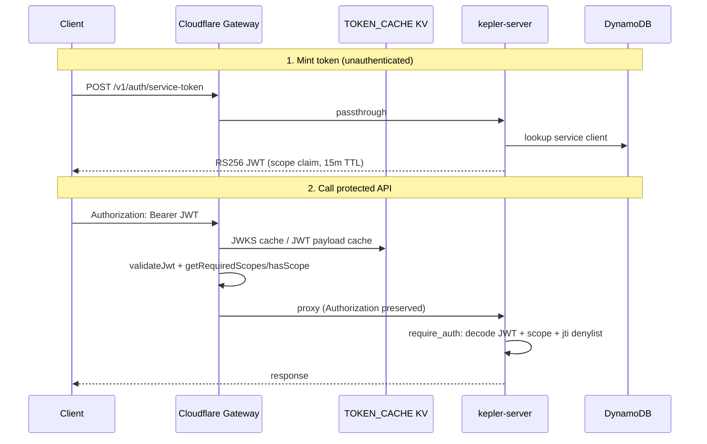

Tracing the gateway entry point through token validation and backend forwarding.
Here is the end-to-end trace of **service-token (M2M Bearer JWT)** auth, with the parallel **X-API-Key** path where the gateway also enforces scopes.

## Overview

Kepler uses a **two-layer** model: the Cloudflare Worker at `api.keplr.sh` validates credentials and scopes at the edge, then proxies to the Rust API, which **re-validates** and attaches identity to the request. The canonical route→scope map is generated from `policy/scope-matrix.json` into both `gateway/src/generated/scope-matrix.ts` and `crates/kepler-server/src/generated/scope_matrix.rs`.



---

## 1. Token minting: `POST /v1/auth/service-token`

This endpoint is **public at the gateway** — listed in `PUBLIC_BACKEND_PASSTHROUGH` and forwarded without auth:

```43:45:gateway/src/generated/scope-matrix.ts
  {
    "path": "/v1/auth/service-token",
    "match": "exact"
```

Gateway branch:

```735:759:gateway/src/index.ts
    // Allow unauthenticated access to OAuth M2M endpoints (JWKS and token issuance)
    // and self-serve portal endpoints (auth via GitHub OAuth token in X-GitHub-Token header)
    if (isPublicBackendPassthroughPath(url.pathname)) {
      const backendUrl = buildRequestBackendUrl(url, env);
      const originReq = new Request(backendUrl.toString(), {
        method: request.method,
        headers: sanitizeOriginHeaders(request.headers, trustedClientIp),
        body: request.body,
        redirect: 'manual'
      });
```

Backend handler: `issue_service_token` in `crates/kepler-server/src/routes/service_auth.rs`.

**Client credentials flow:**
1. Look up `client_id` in DynamoDB via `ServiceClientManager::get_client` (`crates/kepler-identity/src/service_client.rs`).
2. Verify `enabled`, then constant-time SHA-256 secret check (`verify_client_secret`).
3. Resolve scopes: requested subset must be ⊆ client's allowed scopes, or default to all client scopes.
4. Sign RS256 JWT via `sign_and_respond` with claims:

```58:77:crates/kepler-server/src/routes/service_auth.rs
pub struct ServiceTokenClaims {
    pub iss: String,
    pub sub: String,
    pub aud: String,
    pub exp: i64,
    pub iat: i64,
    pub jti: String,
    pub scope: String,
    pub client_name: String,
}
```

Issuer/audience come from env (`JWT_ISSUER`, `JWT_AUDIENCE`), defaulting to `https://api.keplr.sh` / `api://kepler` in prod (`crates/kepler-server/src/main.rs` lines 173–185). TTL is fixed at 15 minutes.

**Alternate grant:** GitHub Actions OIDC (`jwt-bearer`) via `issue_jwt_bearer_token` — verifies assertion, replay-protects via JTI denylist, grants CI scope set.

Public JWKS for verification: `GET /.well-known/jwks.json` → `service_auth::jwks`, also public passthrough.

---

## 2. Gateway entry: `fetch` → `handleRequest`

Every request gets `X-Request-Id` injected before routing:

```1086:1094:gateway/src/index.ts
    const tracedHeaders = new Headers(request.headers);
    tracedHeaders.set('X-Request-Id', requestId);
    const tracedRequest = new Request(request, { headers: tracedHeaders });
```

`handleRequest` branches in fixed order (see `gateway/AGENTS.md`):

| Branch | Paths | Auth |
|--------|-------|------|
| OpenAPI | `/openapi.json`, `/v1/openapi.json` | None (served at edge) |
| Session exchange | `/v1/auth/session` | Optional Okta introspection |
| Health passthrough | `/health` | None |
| Public backend | JWKS, service-token, validate, portal bootstrap, etc. | None |
| **Protected** | Everything else | Bearer JWT **or** X-API-Key |

---

## 3. Bearer JWT path (service tokens)

### 3a. Credential extraction

```762:770:gateway/src/index.ts
    const apiKey = request.headers.get('X-API-Key');
    const authHeader = request.headers.get('Authorization');
    const bearerToken = authHeader?.startsWith('Bearer ') ? authHeader.substring(7) : null;

    if (!apiKey && !bearerToken) {
      return new Response('Missing X-API-Key or Authorization header', { status: 401, ... });
    }
```

Bearer takes precedence when present (`if (bearerToken)` before the API-key branch).

### 3b. JWT validation at edge — `validateJwt()`

```195:276:gateway/src/index.ts
async function validateJwt(token: string, env: Env, ctx: ExecutionContext): Promise<JwtPayload | null> {
```

Steps:
1. **Runtime cache** keyed by `sha256(issuers + audience + token)`.
2. Parse header/payload; require `alg=RS256`, `kid`, unexpired `exp`.
3. Check `iss` against `JWT_ISSUER` / `JWT_ISSUERS` and `aud` against `JWT_AUDIENCE`.
4. Fetch JWKS from backend `/.well-known/jwks.json` via `getJwksForJwtValidation` (KV + in-memory cache).
5. Import RSA key by `kid`, verify RS256 signature with Web Crypto.

The gateway does **not** check the JTI denylist — that happens only on the backend.

### 3c. Scope enforcement at edge

Uses generated helpers from `scope-matrix.ts`:

```786:807:gateway/src/index.ts
        const requiredScopes = getRequiredScopes(url.pathname, request.method);
        if (requiredScopes && jwtPayload.scope) {
          const requiredArr = Array.isArray(requiredScopes) ? requiredScopes : [requiredScopes];
          const missing = requiredArr.filter((s) => !hasScope(jwtPayload!.scope!, s));
          if (missing.length > 0) {
            return new Response(JSON.stringify({ error: 'insufficient_scope', required: requiredArr }), { status: 403, ... });
          }
        } else if (requiredScopes && !jwtPayload.scope) {
          return new Response(JSON.stringify({ error: 'insufficient_scope', required: requiredArr }), { status: 403, ... });
        }
```

`getRequiredScopes` longest-prefix-matches `ROUTE_SCOPES` (e.g. `/v1/communications/` → `kepler:communications:content:read`). `hasScope` supports wildcards (`kepler:admin:*`) and aliases (`kepler:communications:content:read` accepts legacy `kepler:communications:read`).

### 3d. Forward to backend

```809:819:gateway/src/index.ts
        const backendUrl = buildRequestBackendUrl(url, env);
        const fwdHeaders = sanitizeOriginHeaders(request.headers, trustedClientIp);
        const originReq = new Request(backendUrl.toString(), {
          method: request.method,
          headers: fwdHeaders,
          body: request.body,
          redirect: 'manual'
        });
```

`sanitizeOriginHeaders` strips hop-by-hop and client-supplied proxy identity headers, preserves `Authorization`, and adds `X-Kepler-Client-IP` from `CF-Connecting-IP`:

```444:459:gateway/src/index.ts
function sanitizeOriginHeaders(incomingHeaders: Headers, trustedClientIp?: string): Headers {
  // ... strips cf-*, x-forwarded-*, etc.
  if (trustedClientIp) {
    headers.set('X-Kepler-Client-IP', trustedClientIp);
  }
  return headers;
}
```

**Identity is not translated** into custom backend headers for service tokens — the original `Authorization: Bearer <jwt>` is forwarded as-is.

JWT path skips gateway rate limiting and response caching (those apply only to the X-API-Key branch).

---

## 4. X-API-Key path (parallel scope flow)

When no Bearer token is present:

1. **`fetchScopesForApiKey`** calls backend `POST /v1/auth/validate` with the raw key:

```302:328:gateway/src/index.ts
  const validateUrl = buildBackendUrl(env, '/v1/auth/validate');
  const res = await withFetchTimeout(
    new Request(validateUrl.toString(), {
      method: 'POST',
      headers: { 'X-API-Key': apiKey, 'Content-Type': 'application/json' },
```

2. Backend `validate_token` (`crates/kepler-server/src/routes/auth.rs`) looks up the key hash in DynamoDB via `auth_token_manager.validate_token` and returns `{ valid, scopes }`.
3. Gateway caches positive results in KV for 45s (keyed by `sha256(apiKey)`).
4. Same `getRequiredScopes` / `hasScope` check; failures return `legacy_key_scope_required` (403).
5. Forwards with `X-API-Key` preserved; on backend 401/403, gateway purges the KV cache entry.

---

## 5. Backend: second validation + identity attachment

Protected routes are nested under `/v1` with per-group `require_auth(Some(scope))` layers in `crates/kepler-server/src/main.rs` (e.g. comms → `SCOPE_COMMUNICATIONS_CONTENT_READ`).

Unified middleware in `crates/kepler-server/src/middleware.rs`:

```125:128:crates/kepler-server/src/middleware.rs
    // 1. Try Bearer JWT first (preferred for M2M service tokens)
    if let Some(token) = jwt::extract_bearer_token(&request) {
        return handle_bearer_auth(&state, token, request, next, required_scope).await;
    }
```

`handle_bearer_auth` → `jwt::validate_service_jwt_with_scope` or `validate_service_jwt_no_scope` (`crates/kepler-server/src/middleware/jwt.rs`):
- RS256 decode with `jsonwebtoken`, pin `kid`, check iss/aud/exp
- Scope check via `scopes::has_scope` (same wildcard logic as gateway)
- **JTI denylist** check (`jti_denylist.is_revoked`) — revocation only enforced here
- Audit log via `audit::audit_jwt_allow` / `audit_jwt_deny_scope`
- Attach `AuthInfo::ServiceToken { client_id, client_name, scopes }` to request extensions:

```439:445:crates/kepler-server/src/middleware.rs
            let auth_info = AuthInfo::ServiceToken {
                client_id: claims.sub,
                client_name: claims.client_name,
                scopes: claims.scope,
            };
            request.extensions_mut().insert(auth_info);
            next.run(request).await
```

Handlers can read `AuthInfo` or `TokenInfo` from extensions; identity does not arrive via special proxy headers for JWT auth.

For X-API-Key, backend re-validates against DynamoDB, rejects keys without `kepler_scopes`, and attaches `AuthInfo::ApiKey { token_info }`.

---

## 6. Scope source of truth

| Artifact | Role |
|----------|------|
| `policy/scope-matrix.json` | Canonical definitions |
| `gateway/src/generated/scope-matrix.ts` | Edge `getRequiredScopes`, `hasScope`, public-path allowlists |
| `crates/kepler-server/src/generated/scope_matrix.rs` | Backend scope constants + same matching logic |
| `docs/service-auth.md` | Operational docs for minting and scope vocabulary |

Regenerate with `just generate-scope-matrix`.

---

## 7. Key behavioral details

**Dual enforcement:** Gateway and backend both validate credentials and scopes independently. A token that passes the edge can still fail at origin (e.g. revoked JTI, clock skew beyond gateway cache, or scope matrix drift).

**Service token vs API key:** Service integrations should use short-lived Bearer JWTs from `/v1/auth/service-token`. `X-API-Key` (`kp_...` portal keys) is the legacy/scoped-credential path; gateway validates it via the validate endpoint, not local crypto.

**Public auth endpoints** (service-token, validate, JWKS, register-client) are IP rate-limited on the backend via `auth_rate_limit_middleware` (`crates/kepler-server/src/middleware/auth_rate_limit.rs`): 30 req/min for service-token.

**Error shapes differ by credential type:**
- Bearer: `{ "error": "insufficient_scope", "required": "..." }`
- API key: `{ "error": "legacy_key_scope_required", "required_scopes": [...] }`

---

## Files/functions reference

| Layer | File | Key symbols |
|-------|------|-------------|
| Gateway entry | `gateway/src/index.ts` | `fetch`, `handleRequest`, `validateJwt`, `fetchScopesForApiKey`, `sanitizeOriginHeaders` |
| Gateway scopes | `gateway/src/generated/scope-matrix.ts` | `getRequiredScopes`, `hasScope`, `isPublicBackendPassthroughPath` |
| Token issuance | `crates/kepler-server/src/routes/service_auth.rs` | `issue_service_token`, `sign_and_respond`, `jwks` |
| Client registry | `crates/kepler-identity/src/service_client.rs` | `ServiceClientManager::get_client` |
| Backend auth | `crates/kepler-server/src/middleware.rs` | `require_auth`, `handle_bearer_auth`, `AuthInfo` |
| JWT decode | `crates/kepler-server/src/middleware/jwt.rs` | `validate_service_jwt_with_scope`, `decode_and_validate` |
| API key validate | `crates/kepler-server/src/routes/auth.rs` | `validate_token` |
| Route wiring | `crates/kepler-server/src/main.rs` | public auth routes, scoped `/v1/*` groups |
| Docs | `docs/service-auth.md` | End-to-end M2M OAuth guide |
