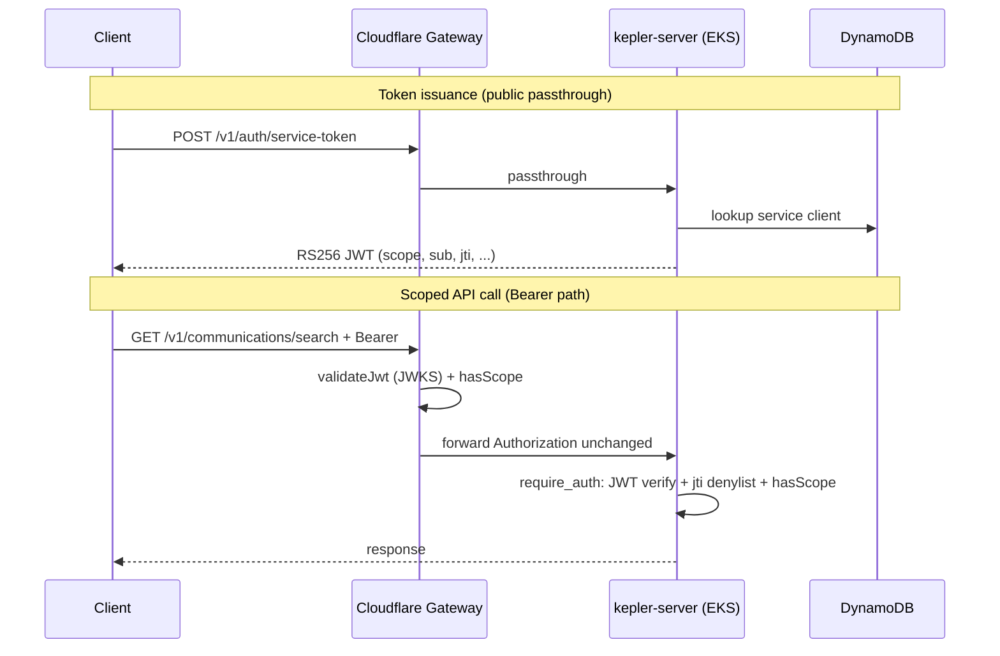

Tracing the gateway-to-backend auth path: I'll search the repo for service-token validation, scope handling, and request forwarding.
## End-to-end flow

Kepler uses a **two-layer, dual-credential** model:

1. **Issuance** happens on the Rust backend (reachable through the Cloudflare gateway as public passthrough).
2. **Enforcement** happens at **both** the gateway (`gateway/src/index.ts`) and the backend (`crates/kepler-server/src/middleware.rs`), using the same generated scope matrix from `policy/scope-matrix.json`.

Supported caller credentials:

| Credential | Typical use | TTL | Scope carrier |
|---|---|---|---|
| `Authorization: Bearer <JWT>` | M2M service integrations | 15 min | JWT `scope` claim |
| `X-API-Key: kp_...` | Portal/session/managed keys | 30 days | DynamoDB `kepler_scopes` |



---

## 1. Service-token issuance (before any scoped call)

### Gateway: public passthrough

`POST /v1/auth/service-token` is listed in `PUBLIC_BACKEND_PASSTHROUGH` and bypasses edge auth. The gateway proxies the request unchanged to `BACKEND_URL`:

```735:759:gateway/src/index.ts
    // Allow unauthenticated access to OAuth M2M endpoints (JWKS and token issuance)
    // and self-serve portal endpoints (auth via GitHub OAuth token in X-GitHub-Token header)
    if (isPublicBackendPassthroughPath(url.pathname)) {
      const backendUrl = buildRequestBackendUrl(url, env);
      const originReq = new Request(backendUrl.toString(), {
        method: request.method,
        headers: sanitizeOriginHeaders(request.headers, trustedClientIp),
        body: request.body,
        redirect: 'manual'
      });
      // ...
    }
```

Same passthrough list includes `/.well-known/jwks.json`, client registration, and `/v1/auth/validate` (used by the gateway for API-key scope lookup).

### Backend: mint RS256 JWT

`issue_service_token` in `crates/kepler-server/src/routes/service_auth.rs` supports two grant types:

- **`client_credentials`**: looks up `client_id` in DynamoDB via `ServiceClientManager`, verifies SHA-256 hashed secret, checks requested scopes are a subset of the client's registered scopes.
- **`jwt-bearer`**: verifies a GitHub Actions OIDC assertion and grants CI scopes.

Both paths call `sign_and_respond`, which builds `ServiceTokenClaims` and signs with RS256:

```379:416:crates/kepler-server/src/routes/service_auth.rs
fn sign_and_respond(
    state: &AppState,
    subject: String,
    client_name: String,
    scope_string: String,
) -> Result<Json<ServiceTokenResponse>, (StatusCode, Json<TokenErrorResponse>)> {
    let claims = ServiceTokenClaims {
        iss: state.jwt_issuer.clone(),
        sub: subject,
        aud: state.jwt_audience.clone(),
        exp: exp.timestamp(),
        iat: now.timestamp(),
        jti: Uuid::new_v4().to_string(),
        scope: scope_string.clone(),
        client_name,
    };
    // RS256 encode with kid -> access_token
}
```

Identity embedded in the token:

- **`sub`**: service `client_id` (or GitHub OIDC subject for CI)
- **`client_name`**: human-readable name (for audit/logging)
- **`scope`**: space-separated Kepler scopes
- **`jti`**: unique ID for revocation via `POST /v1/auth/revoke-jwt`

JWKS for verification is served at `GET /.well-known/jwks.json` (`service_auth::jwks`).

Service clients are registered via portal/GitHub (`client_registration.rs`) or operator scripts, stored in DynamoDB (`kepler-identity/src/service_client.rs`).

---

## 2. Gateway entry (`api.keplr.sh`)

The Worker export wraps every request with `X-Request-Id` tracing, then delegates to `handleRequest`:

```1062:1094:gateway/src/index.ts
export default {
  async fetch(request: Request, env: Env, ctx: ExecutionContext): Promise<Response> {
    const requestId = getOrCreateRequestId(request);
    // ...
    tracedHeaders.set('X-Request-Id', requestId);
    const res = await handleRequest(tracedRequest, env, ctx, log, sentry);
```

`handleRequest` applies this branch order (`gateway/AGENTS.md`):

1. `OPTIONS` → CORS
2. OpenAPI spec → served locally
3. `/v1/auth/session` → optional Okta introspection, then backend passthrough with `X-Okta-*` headers
4. Public gateway passthrough (`/health`)
5. Public backend passthrough (service-token, JWKS, registration, validate, portal routes)
6. **Authenticated paths** → require `Authorization: Bearer` **or** `X-API-Key`

---

## 3. Gateway auth: Bearer JWT path (service tokens)

### Extract and validate

```762:783:gateway/src/index.ts
    const apiKey = request.headers.get('X-API-Key');
    const bearerToken = authHeader?.startsWith('Bearer ') ? authHeader.substring(7) : null;
    if (!apiKey && !bearerToken) {
      return new Response('Missing X-API-Key or Authorization header', { status: 401, ... });
    }
    if (bearerToken) {
      jwtPayload = await validateJwt(bearerToken, env, ctx);
```

`validateJwt` (`gateway/src/index.ts:195-281`):

1. Fetches JWKS from backend `/.well-known/jwks.json` (cached in KV + in-memory)
2. Verifies RS256 signature, `kid`, `iss` (from `JWT_ISSUER`/`JWT_ISSUERS`), `aud` (from `JWT_AUDIENCE`), and `exp`
3. Caches validated payloads until token expiry

**Note:** The gateway does **not** check the backend's JTI denylist. Revoked tokens can pass the edge until expiry; the backend rejects them.

### Scope enforcement at edge

Uses generated helpers from `gateway/src/generated/scope-matrix.ts`:

```217:239:gateway/src/generated/scope-matrix.ts
export function getRequiredScopes(pathname: string, method: string): string | string[] | null {
  // prefix-longest match against ROUTE_SCOPES
}
export function hasScope(granted: string, required: string): boolean {
  // exact match, trailing :* wildcards, SCOPE_ALIASES
}
```

```785:807:gateway/src/index.ts
        const requiredScopes = getRequiredScopes(url.pathname, request.method);
        if (requiredScopes && jwtPayload.scope) {
          const missing = requiredArr.filter((s) => !hasScope(jwtPayload!.scope!, s));
          if (missing.length > 0) {
            return new Response(JSON.stringify({ error: 'insufficient_scope', required: requiredArr }), { status: 403, ... });
          }
        }
```

On success, the gateway **forwards the original request** (including `Authorization: Bearer`) to the backend via `sanitizeOriginHeaders`, which strips hop-by-hop/proxy identity headers and adds `X-Kepler-Client-IP`:

```442:459:gateway/src/index.ts
function sanitizeOriginHeaders(incomingHeaders: Headers, trustedClientIp?: string): Headers {
  // strips cf-*, x-forwarded-*, etc.
  // preserves Authorization and X-API-Key
}
```

Bearer path skips gateway rate limiting and response caching (those apply only to the X-API-Key branch).

---

## 4. Gateway auth: X-API-Key path (secondary credential)

When no Bearer token is present, the gateway validates the key against the backend:

```286:332:gateway/src/index.ts
async function fetchScopesForApiKey(apiKey, env, ctx) {
  // KV cache keyed on sha256(apiKey), 45s TTL
  const res = await fetch(buildBackendUrl(env, '/v1/auth/validate'), {
    method: 'POST',
    headers: { 'X-API-Key': apiKey },
  });
  const granted = data.scopes?.trim() ?? '';
  if (!granted) return { valid: false, granted: '' };  // no unscoped fallback
}
```

Backend handler `validate_token` (`routes/auth.rs:542-570`) calls `AuthTokenManager::validate_token`, which looks up the key hash in DynamoDB and returns `kepler_scopes`.

Gateway then runs the same `getRequiredScopes` + `hasScope` check, returning `legacy_key_scope_required` on 403 (distinct error code from JWT's `insufficient_scope`).

On 401/403 from origin, the gateway purges its KV scope cache for that key.

---

## 5. Backend: second enforcement layer + identity

### Route wiring

Public routes (no `require_auth`):

```826:838:crates/kepler-server/src/main.rs
    let app = Router::new()
        .route("/health", get(...))
        .route("/.well-known/jwks.json", get(routes::service_auth::jwks))
        .merge(public_auth_routes)   // service-token, session, register-client
        .merge(portal_auth_routes)   // validate, revoke, api-keys, portal
```

Scoped routes are nested under `/v1` with per-group `require_auth(Some(scope))`:

```507:505:crates/kepler-server/src/main.rs
    let comms_routes = Router::new()
        .route("/communications/search", get(...))
        // ...
        .layer(axum_middleware::from_fn_with_state(
            state.clone(),
            auth_middleware::require_auth(Some(scopes::SCOPE_COMMUNICATIONS_CONTENT_READ)),
        ));
```

Scope constants re-export from the same generated matrix (`middleware/scopes.rs`).

### Unified auth middleware

`require_auth_inner` (`middleware.rs:118-218`):

1. **Bearer first** → `handle_bearer_auth`
2. **Fallback** → `X-API-Key` via `auth_token_manager.validate_token`

For Bearer JWT:

```389:445:crates/kepler-server/src/middleware.rs
async fn handle_bearer_auth(...) {
    let result = jwt::validate_service_jwt_with_scope(...);  // or no_scope if route has none
    if state.jti_denylist.is_revoked(&claims.jti).await { return 401; }
    let auth_info = AuthInfo::ServiceToken {
        client_id: claims.sub,
        client_name: claims.client_name,
        scopes: claims.scope,
    };
    request.extensions_mut().insert(auth_info);
    next.run(request).await
}
```

JWT validation (`middleware/jwt.rs`):

- RS256 decode with pinned `kid`
- Validates `iss`, `aud`, `exp`, required claims
- Scope check via `scopes::has_scope` (wildcard-aware)

For X-API-Key:

- Rejects keys with no `kepler_scopes` (401 `missing_scopes`)
- Checks `has_scope(granted, required)` → 403 `legacy_key_scope_required`
- Inserts `AuthInfo::ApiKey { token_info }` plus raw `TokenInfo` into request extensions

Audit events are written on allow/deny via `middleware/audit.rs`.

---

## 6. Scope matrix (shared contract)

Single source of truth: `policy/scope-matrix.json`, regenerated with `just generate-scope-matrix` into:

| Artifact | Path |
|---|---|
| Gateway TS helpers | `gateway/src/generated/scope-matrix.ts` |
| Backend Rust constants | `crates/kepler-server/src/generated/scope_matrix.rs` |
| Identity allowlist | `crates/kepler-identity/src/generated/scope_matrix.rs` |

Both gateway and backend use identical prefix matching and wildcard rules (`kepler:admin:*`, `kepler:*`).

---

## Key files/functions reference

| Stage | File | Functions |
|---|---|---|
| Gateway entry | `gateway/src/index.ts` | `fetch`, `handleRequest`, `sanitizeOriginHeaders` |
| Gateway JWT verify | `gateway/src/index.ts` | `validateJwt`, `getJwksForJwtValidation` |
| Gateway API-key scopes | `gateway/src/index.ts` | `fetchScopesForApiKey` |
| Gateway scope map | `gateway/src/generated/scope-matrix.ts` | `getRequiredScopes`, `hasScope`, `isPublicBackendPassthroughPath` |
| Token issuance | `crates/kepler-server/src/routes/service_auth.rs` | `issue_service_token`, `sign_and_respond`, `jwks` |
| Client registry | `crates/kepler-identity/src/service_client.rs` | `ServiceClientManager::get_client` |
| API-key validation | `crates/kepler-server/src/routes/auth.rs` | `validate_token` |
| API-key store | `crates/kepler-identity/src/auth.rs` | `AuthTokenManager::validate_token` |
| Backend auth middleware | `crates/kepler-server/src/middleware.rs` | `require_auth`, `handle_bearer_auth`, `AuthInfo` |
| Backend JWT verify | `crates/kepler-server/src/middleware/jwt.rs` | `validate_service_jwt_with_scope`, `decode_and_validate` |
| JWT revocation | `crates/kepler-server/src/middleware/jti_denylist.rs` | `JtiDenylist::is_revoked` |
| Route wiring | `crates/kepler-server/src/main.rs` | public vs scoped router merge |
| Docs | `docs/service-auth.md` | architecture overview |

---

## Practical implications

- **Double enforcement**: a token with valid signature but wrong scope is blocked at the gateway (403) and would also be blocked at the backend if it somehow reached origin.
- **Identity is credential-derived, not re-minted**: the gateway never transforms Bearer tokens; it validates and forwards. Backend reconstructs identity from JWT claims or DynamoDB into `AuthInfo` extensions.
- **Revocation is backend-only for JWTs**: `POST /v1/auth/revoke-jwt` adds `jti` to an in-memory denylist checked only in `require_auth`. Gateway JWKS/payload caches can briefly mask revocation at the edge.
- **No unscoped fallback**: API keys without `kepler_scopes` are rejected at both layers; service integrations should prefer short-lived Bearer tokens from `/v1/auth/service-token`.
