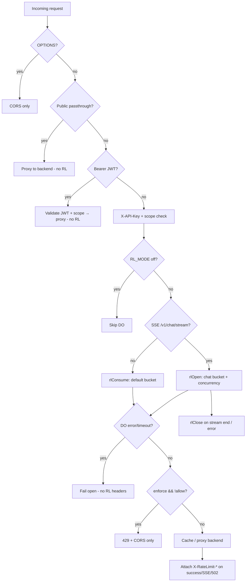

Tracing the gateway rate limiter from route handling through headers and fallback behavior.
## End-to-end flow

The gateway rate limiter lives at the Cloudflare Worker edge. It runs **only on the `X-API-Key` path**, after scope checks and before cache lookup / backend proxy. JWT Bearer requests skip it entirely.



---

## 1. Route handling and where RL runs

Entry point is `handleRequest` in `gateway/src/index.ts`. Request order:

1. `OPTIONS` → CORS
2. Public paths (OpenAPI, session exchange, health, JWKS, OAuth bootstrap, etc.) → direct backend proxy, **no rate limit**
3. Auth required: `X-API-Key` **or** `Authorization: Bearer`
4. **Bearer JWT path** (lines 772–836): validate JWT, enforce scopes, proxy — **no DO rate limit**
5. **API-key path** (lines 838+): validate key + scopes, then rate limit

Rate limiting is gated by `RL_MODE` from env (`off | observe | enforce`), read via `limitsFromEnv()`:

```543:551:gateway/src/index.ts
function limitsFromEnv(env: Env) {
  return {
    cacheEnabled: (env.CACHE_ENABLED || 'false').toLowerCase() === 'true',
    rlMode: (env.RL_MODE || 'off').toLowerCase() as 'off' | 'observe' | 'enforce',
    sseCap: Number(env.SSE_CONCURRENCY_LIMIT || '5'),
    defaultPerMin: Number(env.RL_DEFAULT_LIMIT || '1000'),
    chatPerMin: Number(env.RL_CHAT_LIMIT || '100'),
  };
}
```

Prod defaults in `gateway/wrangler.toml`: `RL_MODE = "observe"`, `RL_DEFAULT_LIMIT = "1000"`, `RL_CHAT_LIMIT = "100"`, `SSE_CONCURRENCY_LIMIT = "5"`.

---

## 2. Per-key identity and Durable Object wiring

Each API key is hashed with SHA-256 (`sha256hex(apiKey)`). That hash is the DO instance name:

```555:567:gateway/src/index.ts
async function rlConsume(env: Env, apiKeyHash: string, defaultPerMin: number) {
  const id = env.RATE_LIMITER.idFromName(apiKeyHash);
  const stub = env.RATE_LIMITER.get(id);
  const controller = new AbortController();
  const timeoutId = setTimeout(() => controller.abort(), 2000);
  try {
    const res = await stub.fetch('https://do/check', {
      method: 'POST',
      body: JSON.stringify({ type: 'consume', limits: { defaultPerMin } }),
      signal: controller.signal
    });
```

Binding: `RATE_LIMITER` → `RateLimiter` class in `wrangler.toml`. Each DO holds one key’s state in SQLite-backed storage.

Three RPC helpers in `index.ts`:

| Function | DO payload | Purpose |
|----------|------------|---------|
| `rlConsume` | `{ type: 'consume', limits: { defaultPerMin } }` | Normal requests |
| `rlOpen` | `{ type: 'open', sid, limits: { chatPerMin, concurrency } }` | SSE stream start |
| `rlClose` | `{ type: 'close', sid }` | SSE stream end (best-effort) |

All DO calls use a **2s abort timeout**.

---

## 3. Durable Object algorithm (`RateLimiter`)

Implementation: `gateway/src/rate_limiter.ts`.

**State** (hydrated once from DO storage):

- `tokensDefault` / `lastRefillDefault` — general request bucket  
- `tokensChat` / `lastRefillChat` — chat/SSE start bucket  
- `streams` — active SSE session IDs (concurrency tracking)

**Token bucket refill** (`refill`): continuous refill at `limitPerMin / 60000` tokens/ms, capped at `limitPerMin`.

**`consume`** (regular requests):

1. Refill default bucket  
2. If `tokens >= 1`, decrement and `allow = true`  
3. Persist bucket state  
4. Return `{ allow, headers }`

**`open`** (SSE `/v1/chat/stream`):

1. Reject if `streams.size >= concurrencyCap` (concurrency before tokens)  
2. Refill chat bucket  
3. If token available, decrement, add `sid` to `streams`, `allow = true`  
4. Persist chat bucket + streams  
5. Return `{ allow, headers }`

**`close`**: remove `sid` from `streams`; errors are swallowed at the caller.

**Rate limit headers** from the DO:

```108:116:gateway/src/rate_limiter.ts
  private headers(limit: number, remaining: number): Record<string, string> {
    const nowSec = Math.floor(Date.now() / 1000);
    const secs = new Date().getUTCSeconds();
    const reset = nowSec + (60 - secs);
    return {
      'X-RateLimit-Limit': String(limit),
      'X-RateLimit-Remaining': String(Math.max(0, Math.floor(remaining))),
      'X-RateLimit-Reset': String(reset),
    };
  }
```

`X-RateLimit-Reset` is seconds until the next UTC minute boundary. There is **no `Retry-After`**.

---

## 4. Gateway decision logic (observe vs enforce)

```873:900:gateway/src/index.ts
    // Rate limiting (observe/enforce)
    let rlHeaders: Record<string, string> | undefined;
    let limited = false;
    let sid: string | undefined;
    if (rlMode !== 'off') {
      try {
        if (sse) {
          sid = newSid();
          const r = await rlOpen(env, apiKeyHash, chatPerMin, sseCap, sid);
          rlHeaders = r.headers;
          limited = !r.allow;
          if (rlMode === 'enforce' && !r.allow) return new Response('Too Many Requests', { status: 429, headers: errorCorsHeaders() });
        } else {
          const r = await rlConsume(env, apiKeyHash, defaultPerMin);
          rlHeaders = r.headers;
          limited = !r.allow;
          if (rlMode === 'enforce' && !r.allow) return new Response('Too Many Requests', { status: 429, headers: errorCorsHeaders() });
        }
      } catch (e) {
        // Rate limiter timeout or error - log but allow request to proceed (fail open)
        console.warn('Rate limiter error, allowing request', { ... });
        // Continue without rate limiting headers
      }
    }
```

| Mode | Over limit | DO error/timeout |
|------|------------|------------------|
| `off` | No DO call | N/A |
| `observe` | Request proceeds; `limited=true` in analytics | Fail open |
| `enforce` | **429** immediately | Fail open |

**429 responses** use `errorCorsHeaders()` only — plain text body `"Too Many Requests"`, CORS, **no `X-RateLimit-*` headers** (documented in `docs/backpressure-guards.md`).

---

## 5. Header attachment and SSE lifecycle

**When headers are attached**

- Successful backend proxy: merge `rlHeaders` into response headers (line 980)  
- SSE stream established: attach to SSE response (line 1036)  
- Backend fetch failure (502): attach `rlHeaders` if present (line 960)  

**When headers are not attached**

- 429 enforce rejections  
- DO fail-open path (`rlHeaders` stays undefined)  
- Cache **HIT** path: DO `consume` still runs, but the cached response return path does not merge `rlHeaders`  

**SSE concurrency release** (`rlClose`):

- Backend error before stream starts  
- Stream ends (monitored via `tee()` + reader loop)  
- 30-minute SSE timeout  
- Backend fetch error during setup  

`rlClose` is best-effort: errors are logged at debug and do not fail the client response.

---

## 6. Fallback / fail-open behavior

Two explicit fail-open paths:

1. **DO timeout or error** (2s): warn log, proceed without RL headers, request not blocked even in `enforce` mode (`gateway/AGENTS.md`: “Fail open on limiter timeout”).  
2. **`rlClose` failures**: debug log only; slot may leak until manual reconciliation or stream set cleanup.

Analytics records `limited ? 1 : 0` in the `doubles` field for observability in `observe` mode without blocking.

---

## 7. Separate layer: server auth rate limit (not the gateway DO)

The sigmap also points at `crates/kepler-server/src/middleware/auth_rate_limit.rs`. That is a **different** limiter:

- In-memory, per-process, per-IP  
- Only on auth bootstrap routes (`/register-client`, `/service-token`, GitHub OAuth)  
- Those routes are **public passthrough** at the gateway, so they never hit the DO limiter  
- Returns JSON 429 with `Retry-After` (unlike the gateway DO path)

That middleware uses `X-Kepler-Client-Ip` from the gateway (via `audit::client_ip`) and denies with 429 if IP is `"unknown"`.

---

## Key files

| File | Role |
|------|------|
| `gateway/src/index.ts` | Request routing, `rlConsume`/`rlOpen`/`rlClose`, mode logic, header merge, SSE lifecycle |
| `gateway/src/rate_limiter.ts` | DO token buckets, concurrency set, header generation |
| `gateway/wrangler.toml` | `RATE_LIMITER` binding, `RL_*` env defaults |
| `gateway/AGENTS.md` | Operational summary (modes, fail-open, SSE) |
| `docs/backpressure-guards.md` | Layer-1 inventory and 429/header behavior |
| `crates/kepler-server/src/middleware/auth_rate_limit.rs` | Separate server-side auth endpoint limits |

**Summary:** Gateway rate limiting is a per-API-key Cloudflare Durable Object with two token buckets (default + chat) plus an SSE concurrency cap. It runs only for scoped `X-API-Key` traffic when `RL_MODE != off`. In `enforce`, over-limit requests get 429 without rate-limit headers; otherwise headers are forwarded on proxied responses. DO failures always fail open. JWT Bearer and all public routes bypass this entirely.
