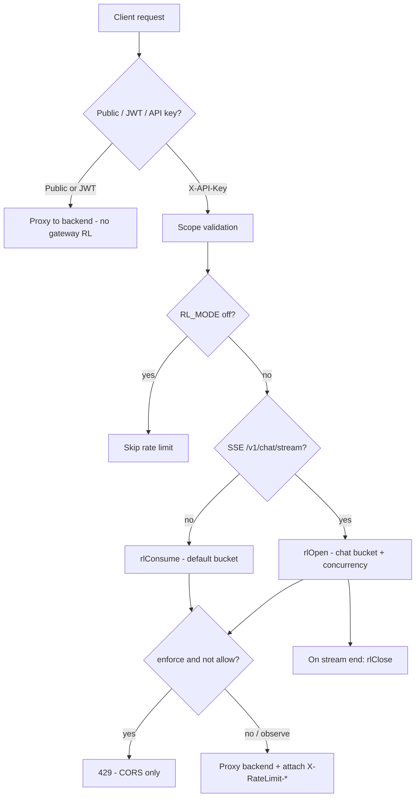

Tracing the gateway rate limiter end-to-end: reading the gateway implementation and how it connects to the API server.
The gateway rate limiter is an edge-layer, **per-API-key** system built on a Cloudflare **Durable Object** (`RateLimiter`). It runs only on the **`X-API-Key` path** after scope checks; JWT Bearer requests and public passthrough routes skip it entirely.

---

## Architecture overview



Two separate limiters also exist elsewhere (not the gateway DO):
- **Backend auth rate limit** — per-IP on `/v1/auth/register-client`, `/service-token`, GitHub OAuth (`auth_rate_limit.rs`)
- **MCP gateway** — separate repo, D1-backed

---

## Configuration

From `gateway/wrangler.toml` and `limitsFromEnv()` in `gateway/src/index.ts`:

| Env var | Default (prod config) | Purpose |
|---------|----------------------|---------|
| `RL_MODE` | `observe` | `off` \| `observe` \| `enforce` |
| `RL_DEFAULT_LIMIT` | `1000` | Requests/min per API key (non-SSE) |
| `RL_CHAT_LIMIT` | `100` | Chat stream starts/min per key |
| `SSE_CONCURRENCY_LIMIT` | `5` | Max concurrent `/v1/chat/stream` per key |

The Durable Object is bound as `RATE_LIMITER` in `wrangler.toml` and exported from `gateway/src/index.ts`.

---

## Route handling: when rate limiting runs

In `handleRequest()` (`gateway/src/index.ts`), the handler order is:

1. **OPTIONS** → CORS, no RL  
2. **Public paths** (health, JWKS, OAuth bootstrap, session exchange, etc.) → passthrough, no RL  
3. **Bearer JWT** → validate + scope → proxy; **no gateway rate limit**  
4. **`X-API-Key`** → scope check → **rate limit** → cache → backend proxy  

Relevant gate:

```873:901:gateway/src/index.ts
    // Rate limiting (observe/enforce)
    let rlHeaders: Record<string, string> | undefined;
    let limited = false;
    let sid: string | undefined;
    if (rlMode !== 'off') {
      try {
        if (sse) {
          sid = newSid();
          const r = await rlOpen(env, apiKeyHash, chatPerMin, sseCap, sid);
          rlHeaders = r.headers;
          limited = !r.allow;
          if (rlMode === 'enforce' && !r.allow) return new Response('Too Many Requests', { status: 429, headers: errorCorsHeaders() });
        } else {
          const r = await rlConsume(env, apiKeyHash, defaultPerMin);
          rlHeaders = r.headers;
          limited = !r.allow;
          if (rlMode === 'enforce' && !r.allow) return new Response('Too Many Requests', { status: 429, headers: errorCorsHeaders() });
        }
      } catch (e) {
        // Rate limiter timeout or error - log but allow request to proceed (fail open)
        console.warn('Rate limiter error, allowing request', { ... });
        // Continue without rate limiting headers
      }
    }
```

**Identity key:** `apiKeyHash = sha256hex(apiKey)`. One Durable Object instance per hash via `env.RATE_LIMITER.idFromName(apiKeyHash)`.

**SSE detection:** `isSSE()` is true only for `url.pathname === '/v1/chat/stream'`.

---

## Worker → Durable Object integration

Three helpers POST JSON to the DO stub with a **2 second timeout**:

| Helper | Payload type | DO method |
|--------|--------------|-----------|
| `rlConsume()` | `{ type: 'consume', limits: { defaultPerMin } }` | Token bucket for normal requests |
| `rlOpen()` | `{ type: 'open', sid, limits: { chatPerMin, concurrency } }` | Chat bucket + concurrency slot |
| `rlClose()` | `{ type: 'close', sid }` | Release concurrency slot (best-effort) |

On timeout, `rlConsume`/`rlOpen` throw; `rlClose` logs and swallows errors.

---

## Durable Object algorithm (`gateway/src/rate_limiter.ts`)

The `RateLimiter` class is a Durable Object with **SQLite-backed storage** (migration `v1-rate-limiter`).

### State (per API key)

- `tokensDefault` / `lastRefillDefault` — general request bucket  
- `tokensChat` / `lastRefillChat` — chat stream start bucket  
- `streams` — `Set<string>` of active stream IDs (concurrency tracking)

State is lazy-loaded once per DO instance (`ensureStateLoaded()` with a hydration mutex), then persisted after each mutation.

### Token bucket refill

```99:106:gateway/src/rate_limiter.ts
  private refill(now: number, limitPerMin: number, lastRefill: number, tokens: number): { tokens: number; lastRefill: number } {
    const capacity = limitPerMin;
    const elapsed = Math.max(0, now - lastRefill);
    // Refill rate per ms
    const rate = capacity / 60000;
    const newTokens = Math.min(capacity, tokens + elapsed * rate);
    return { tokens: newTokens, lastRefill: now };
  }
```

Continuous refill at `limitPerMin / 60_000` tokens/ms, capped at capacity. Each allowed request costs 1 token.

### Operations

- **`consume`**: refill default bucket → deduct 1 token if available → persist → `{ allow, headers }`
- **`open`**:  
  1. Reject if `streams.size >= concurrencyCap` (concurrency checked first)  
  2. Refill chat bucket → deduct 1 token if available → add `sid` to `streams`  
  3. Persist chat tokens + streams array  
- **`close`**: remove `sid` from `streams`, persist

### Rate limit headers (computed in DO)

```108:117:gateway/src/rate_limiter.ts
  private headers(limit: number, remaining: number): Record<string, string> {
    const nowSec = Math.floor(Date.now() / 1000);
    const secs = new Date().getUTCSeconds();
    const reset = nowSec + (60 - secs);
    return {
      'X-RateLimit-Limit': String(limit),
      'X-RateLimit-Remaining': String(Math.max(0, Math.floor(remaining))),
      'X-RateLimit-Reset': String(reset),
    };
  }
```

`X-RateLimit-Reset` is the **next UTC minute boundary**, not a token-bucket-specific timestamp. There is **no `Retry-After`** header anywhere in the gateway path (`docs/backpressure-guards.md` confirms this).

---

## Response header attachment

Rate limit headers are merged onto **successful proxy responses**, not onto early 429s:

```978:980:gateway/src/index.ts
    const headers = new Headers(originRes.headers);
    if (rlHeaders) for (const [k, v] of Object.entries(rlHeaders)) headers.set(k, v);
```

Same pattern for SSE (`sseHeaders`) and backend 502 errors (`errHeaders`).

**429 in enforce mode** uses `errorCorsHeaders()` only — plain text body `"Too Many Requests"`, **no `X-RateLimit-*` headers**, even though the DO computed them. This is documented in `docs/backpressure-guards.md`.

---

## SSE lifecycle and concurrency release

For `/v1/chat/stream`:

1. **`rlOpen`** acquires a concurrency slot before backend fetch  
2. If backend fails or returns non-OK / no body → `ctx.waitUntil(rlClose(...))`  
3. If stream succeeds → body is **teed**; a background task reads the monitor side until done, timeout (30 min), or error, then always calls **`rlClose`**

```1005:1033:gateway/src/index.ts
    if (sse && sid) {
      if (!originRes.ok || !originRes.body) {
        ctx.waitUntil(rlClose(env, apiKeyHash, sid));
      } else {
        const [clientStream, monitorStream] = originRes.body.tee();
        ctx.waitUntil((async () => {
          // ... read until done or 30min timeout ...
          finally {
            await rlClose(env, apiKeyHash, sid);
          }
        })());
```

Concurrency is therefore tied to **active open streams**, not just successful HTTP responses.

---

## Modes and fallback behavior

| Mode | Over limit behavior | Headers on allowed responses |
|------|---------------------|------------------------------|
| `off` | No DO call | None from RL |
| `observe` | Request proceeds; `limited=true` logged to Analytics Engine | `X-RateLimit-*` attached |
| `enforce` | Immediate **429** (CORS only, no RL headers) | N/A for blocked requests |

**Fail-open (DO unavailable):** Any error or 2s timeout in `rlConsume`/`rlOpen` is caught, logged with `console.warn`, and the request **continues without rate limiting** and **without `X-RateLimit-*` headers**. This is intentional — the gateway prefers availability over strict enforcement when the DO is slow or down.

**Close is best-effort:** `rlClose` failures are debug-logged only; a stuck slot could theoretically leak until the DO is reset or the stream set is manually reconciled (no automatic TTL on stream IDs in the DO code).

---

## Observability

When cache is involved, Analytics Engine records include a `limited` flag (`doubles: [status, limited ? 1 : 0]`). In `observe` mode you can measure would-be 429s without blocking traffic.

---

## Related: backend auth rate limit (not the gateway DO)

The repo_map also points at `crates/kepler-server/src/middleware/auth_rate_limit.rs`. That is a **separate, in-memory per-IP** limiter on auth bootstrap endpoints that hit the **origin directly** (often via public gateway passthrough):

- `/v1/auth/register-client`: 10/min  
- `/v1/auth/service-token`, GitHub OAuth: 30/min  
- Returns JSON 429 with **`Retry-After`** (seconds until window reset)  
- Uses `X-Kepler-Client-Ip` from the gateway when present  

It does not share state with the Cloudflare Durable Object and applies to unauthenticated auth routes, not general API traffic.

---

## Key files

| File | Role |
|------|------|
| `gateway/src/index.ts` | Request routing, `limitsFromEnv`, `rlConsume`/`rlOpen`/`rlClose`, mode logic, header merge, SSE teardown |
| `gateway/src/rate_limiter.ts` | Durable Object: token buckets, concurrency set, persistence, header computation |
| `gateway/wrangler.toml` | DO binding, env defaults, SQLite migration |
| `gateway/AGENTS.md` | High-level flow summary |
| `docs/backpressure-guards.md` | Canonical behavior doc (429 header omission, no Retry-After) |
| `crates/kepler-server/src/middleware/auth_rate_limit.rs` | Separate origin auth endpoint limiter |
