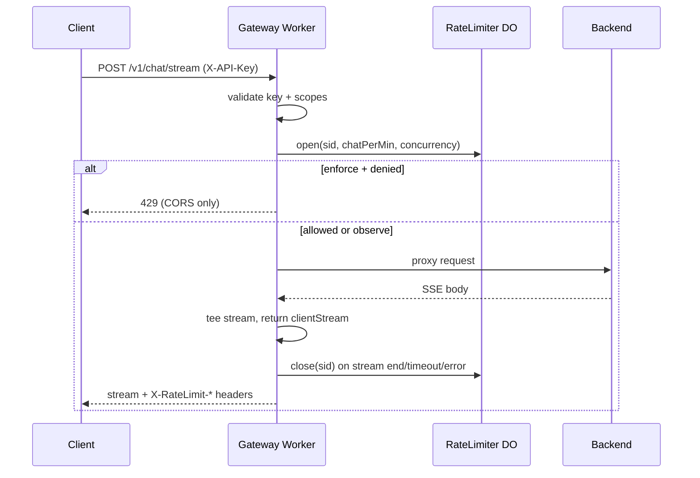

Tracing the gateway rate limiter end-to-end: reading the gateway implementation and how it connects to the server.
There are two rate-limiting layers in Kepler. The **gateway** layer (Cloudflare Worker + Durable Object) limits authenticated API-key traffic at the edge. A separate **server** layer limits specific unauthenticated auth bootstrap routes by IP. Below is the gateway path end to end, with the server layer noted where it picks up traffic the gateway skips.

---

## Where rate limiting runs in the gateway

Gateway rate limiting applies only on the **X-API-Key** path, after auth and scope checks. It does **not** run for:

- `OPTIONS`, public passthrough routes (health, JWKS, GitHub OAuth, register-client, etc.)
- `/v1/auth/session` (Okta exchange)
- **JWT Bearer** requests (validated and proxied with no DO call)

The handler order in `gateway/src/index.ts` is: public routes → Bearer JWT (no RL) → API key validation + scopes → **rate limit** → cache → backend proxy.

```843:901:gateway/src/index.ts
    const { cacheEnabled, rlMode, sseCap, defaultPerMin, chatPerMin } = limitsFromEnv(env);
    // ...
    const apiKeyHash = await sha256hex(apiKey);
    const sse = isSSE(url, request);
    // ...
    if (rlMode !== 'off') {
      try {
        if (sse) {
          sid = newSid();
          const r = await rlOpen(env, apiKeyHash, chatPerMin, sseCap, sid);
          rlHeaders = r.headers;
          limited = !r.allow;
          if (rlMode === 'enforce' && !r.allow) return new Response('Too Many Requests', { status: 429, headers: errorCorsHeaders() });
        } else {
          const r = await rlConsume(env, apiKeyHash, defaultPerMin);
          rlHeaders = r.headers;
          limited = !r.allow;
          if (rlMode === 'enforce' && !r.allow) return new Response('Too Many Requests', { status: 429, headers: errorCorsHeaders() });
        }
      } catch (e) {
        // Rate limiter timeout or error - log but allow request to proceed (fail open)
        console.warn('Rate limiter error, allowing request', { ... });
        // Continue without rate limiting headers
      }
    }
```

---

## Configuration

Env vars are read by `limitsFromEnv()` and set in `gateway/wrangler.toml`:

| Variable | Default | Role |
|----------|---------|------|
| `RL_MODE` | `observe` | `off` \| `observe` \| `enforce` |
| `RL_DEFAULT_LIMIT` | `1000` | Requests/min per API key (non-SSE) |
| `RL_CHAT_LIMIT` | `100` | Chat stream starts/min per API key |
| `SSE_CONCURRENCY_LIMIT` | `5` | Max concurrent `/v1/chat/stream` per key |

The Durable Object is bound as `RATE_LIMITER` in `wrangler.toml` and exported from `gateway/src/index.ts`.

---

## Durable Object: one bucket per API key

Each key gets its own DO instance via `env.RATE_LIMITER.idFromName(apiKeyHash)` where `apiKeyHash = sha256hex(apiKey)`.

The Worker calls the DO over stub fetch with a **2 second timeout** (`rlConsume`, `rlOpen`, `rlClose` in `index.ts`). Payload types:

- **`consume`** — normal requests
- **`open`** — SSE stream start (`/v1/chat/stream`)
- **`close`** — SSE stream end (release concurrency slot)

Implementation: `gateway/src/rate_limiter.ts` (`RateLimiter` class).

### State (persisted in DO storage)

- `tokensDefault` / `lastRefillDefault` — general request bucket
- `tokensChat` / `lastRefillChat` — chat-start bucket
- `streams` — `Set<string>` of active stream IDs (concurrency tracking)

State is hydrated once per DO instance (mutex via `hydrationPromise`) and written back after each operation.

### Token bucket algorithm

```99:106:gateway/src/rate_limiter.ts
  private refill(now: number, limitPerMin: number, lastRefill: number, tokens: number): { tokens: number; lastRefill: number } {
    const capacity = limitPerMin;
    const elapsed = Math.max(0, now - lastRefill);
    const rate = capacity / 60000;
    const newTokens = Math.min(capacity, tokens + elapsed * rate);
    return { tokens: newTokens, lastRefill: now };
  }
```

On each check: refill continuously, then if `tokens >= 1`, decrement and allow; otherwise deny.

### SSE `open` path (concurrency + chat rate)

```140:168:gateway/src/rate_limiter.ts
  private async open(sid: string, chatPerMin: number, concurrencyCap: number): Promise<Response> {
    if (this.streams.size >= concurrencyCap) {
      return Response.json({ allow: false, headers: this.headers(chatPerMin, this.tokensChat) });
    }
    // ... refill chat bucket, consume 1 token, add sid to streams ...
  }
```

Concurrency is checked **before** the chat token bucket. A denied open still returns rate-limit headers computed against the chat limit.

### SSE `close` path

Removes `sid` from `streams` and persists. Called best-effort from the Worker when the stream ends, times out (30 min), or the backend fails before a body is established. Close errors are logged at debug and never fail the client response.

---

## Modes: observe vs enforce vs off

| Mode | DO called? | Over limit behavior |
|------|------------|---------------------|
| `off` | No | Always proxied |
| `observe` | Yes | Request still proxied; `limited=true` for analytics |
| `enforce` | Yes | Immediate `429 Too Many Requests`, no backend call |

Production default is **`observe`** (`RL_MODE = "observe"` in wrangler.toml), so limits are measured and headers emitted but traffic is not blocked unless mode is switched to `enforce`.

---

## Response headers and 429 behavior

The DO builds standard headers in `headers()`:

```108:117:gateway/src/rate_limiter.ts
  private headers(limit: number, remaining: number): Record<string, string> {
    const nowSec = Math.floor(Date.now() / 1000);
    const secs = new Date().getUTCSeconds();
    const reset = nowSec + (60 - secs);
    return {
      'X-RateLimit-Limit': String(limit),
      'X-RateLimit-Remaining': String(Math.max(0, Math.floor(remaining))),
      'X-RateLimit-Reset': String(reset),
    };
  }
```

**When headers are attached**

- Successful proxied responses (including cache MISS/HIT paths that reach the client)
- SSE responses
- Backend `502` errors (headers merged in if the DO call succeeded)

```978:980:gateway/src/index.ts
    const headers = new Headers(originRes.headers);
    if (rlHeaders) for (const [k, v] of Object.entries(rlHeaders)) headers.set(k, v);
```

**When headers are omitted**

- **`enforce` 429**: returns `errorCorsHeaders()` only — plain text `"Too Many Requests"`, **no** `X-RateLimit-*` (documented in `docs/backpressure-guards.md`)
- **Fail-open** (DO timeout/error): request proceeds with **no** rate-limit headers
- **`Retry-After`**: never sent by the gateway limiter

The `limited` boolean (would-have-been-limited in observe mode) is written to Cloudflare Analytics Engine as the second double in analytics data points.

---

## Fail-open fallback

If the DO call throws or hits the 2s abort timeout, the catch block logs a warning and **allows the request through** without rate-limit headers. This is intentional edge fail-open behavior (`gateway/AGENTS.md`: "Fail open on limiter timeout").

`rlClose` is also fail-soft: errors are swallowed so stream teardown never breaks the client.

---

## SSE end-to-end lifecycle



1. Generate random 16-byte hex `sid`
2. `rlOpen` — concurrency cap, then chat token bucket
3. Proxy to backend with 30-minute timeout
4. If backend fails before body: `waitUntil(rlClose)`
5. If stream OK: tee body; `waitUntil` monitors until done or 30 min, then `rlClose`

---

## Server auth rate limiter (related, not gateway DO)

Public auth routes that bypass gateway RL (e.g. `/v1/auth/register-client`, `/v1/auth/service-token`, GitHub OAuth) are limited **on the Axum server** by `auth_rate_limit_middleware` in `crates/kepler-server/src/middleware/auth_rate_limit.rs`:

- In-memory, per-process, per-IP fixed window (60s)
- Limits: register-client **10/min**, service-token and GitHub OAuth **30/min**
- IP from trusted `X-Kepler-Client-IP` (set by gateway from `CF-Connecting-IP`) or direct `ConnectInfo`; spoofable proxy headers ignored
- Unknown IP → **429** with `rate_limit_unknown_client` (fail closed for auth)
- Over limit → **429** with `Retry-After` and JSON `rate_limit_exceeded`

The gateway sets that trusted IP header in `sanitizeOriginHeaders()`:

```434:458:gateway/src/index.ts
function trustedClientIpFromHeaders(incomingHeaders: Headers): string | undefined {
  const cfConnectingIp = incomingHeaders.get('CF-Connecting-IP');
  if (cfConnectingIp && /^[0-9a-fA-F:.]+$/.test(cfConnectingIp)) {
    return cfConnectingIp;
  }
  return undefined;
}
// ...
  if (trustedClientIp) {
    headers.set('X-Kepler-Client-IP', trustedClientIp);
  }
```

---

## Key files

| File | Role |
|------|------|
| `gateway/src/index.ts` | Request routing, `rlConsume`/`rlOpen`/`rlClose`, mode handling, header attachment, fail-open |
| `gateway/src/rate_limiter.ts` | DO token buckets, concurrency set, persistence, header computation |
| `gateway/wrangler.toml` | DO binding, `RL_*` env defaults |
| `gateway/AGENTS.md` | Operational summary (modes, fail-open, SSE) |
| `docs/backpressure-guards.md` | Cross-layer guard inventory and 429/header semantics |
| `crates/kepler-server/src/middleware/auth_rate_limit.rs` | Server-side IP limits on auth bootstrap routes |
| `crates/kepler-server/tests/rate_limit_tests.rs` | Server auth limiter tests |

**Bottom line:** Gateway rate limiting is a per-API-key Durable Object with separate default and chat token buckets plus an SSE concurrency cap. It runs only on the X-API-Key path, respects `RL_MODE`, attaches `X-RateLimit-*` on proxied responses, returns bare CORS 429s in enforce mode, and fails open on DO errors. Auth bootstrap traffic skips this entirely and is throttled separately on the server by client IP.
