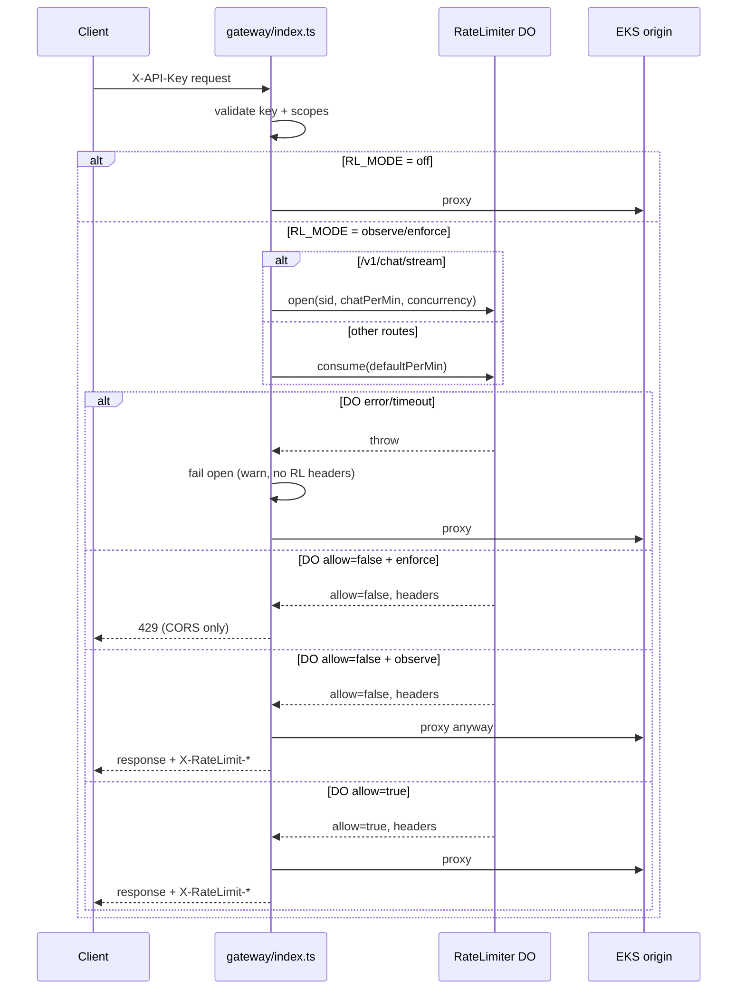

Tracing the gateway rate limiter end-to-end: reading core implementation files and where they're wired into routing.
The gateway rate limiter is a **Cloudflare Durable Object (DO) token bucket** keyed per API key. It runs only on the **`X-API-Key` path** after scope validation, before cache lookup and backend proxy. JWT Bearer requests skip it entirely.

---

## Where it sits in the request path

`handleRequest` in `gateway/src/index.ts` processes requests in this order:

1. CORS `OPTIONS`, unsafe paths, public routes (health, JWKS, OAuth bootstrap, session exchange) — **no rate limiting**
2. Auth: `Authorization: Bearer` **or** `X-API-Key`
3. **JWT path** — validate JWT + scopes, proxy to backend — **no gateway rate limiting**
4. **API-key path** — validate key + scopes, then rate limit → cache → proxy

Rate limiting is wired here:

```868:901:gateway/src/index.ts
    const apiKeyHash = await sha256hex(apiKey);
    const sse = isSSE(url, request);
    let cacheStatus = 'NONE';


    // Rate limiting (observe/enforce)
    let rlHeaders: Record<string, string> | undefined;
    let limited = false;
    let sid: string | undefined;
    if (rlMode !== 'off') {
      try {
        if (sse) {
          sid = newSid();
          const r = await rlOpen(env, apiKeyHash, chatPerMin, sseCap, sid);
          rlHeaders = r.headers;
          limited = !r.allow;
          if (rlMode === 'enforce' && !r.allow) return new Response('Too Many Requests', { status: 429, headers: errorCorsHeaders() });
        } else {
          const r = await rlConsume(env, apiKeyHash, defaultPerMin);
          rlHeaders = r.headers;
          limited = !r.allow;
          if (rlMode === 'enforce' && !r.allow) return new Response('Too Many Requests', { status: 429, headers: errorCorsHeaders() });
        }
      } catch (e) {
        // Rate limiter timeout or error - log but allow request to proceed (fail open)
        console.warn('Rate limiter error, allowing request', {
          error: e instanceof Error ? e.message : String(e),
          apiKeyHash: apiKeyHash.substring(0, 8) + '...',
          sse,
          sid: sid?.substring(0, 8) + '...'
        });
        // Continue without rate limiting headers
      }
    }
```

**Identity key:** `sha256hex(apiKey)` — one DO instance per hashed key via `env.RATE_LIMITER.idFromName(apiKeyHash)`.

**SSE detection:** only `/v1/chat/stream` (`isSSE()`).

---

## Configuration

From `limitsFromEnv()` and `gateway/wrangler.toml`:

| Env var | Default | Role |
|---------|---------|------|
| `RL_MODE` | `off` (prod: `observe`) | `off` \| `observe` \| `enforce` |
| `RL_DEFAULT_LIMIT` | `1000` | Non-SSE requests/min per key |
| `RL_CHAT_LIMIT` | `100` | Chat stream starts/min per key |
| `SSE_CONCURRENCY_LIMIT` | `5` | Max concurrent open SSE streams per key |

```543:551:gateway/src/index.ts
function limitsFromEnv(env: Env) {
  return {
    cacheEnabled: (env.CACHE_ENABLED || 'false').toLowerCase() === 'true',
    rlMode: (env.RL_MODE || 'off').toLowerCase() as 'off' | 'observe' | 'enforce',
    sseCap: Number(env.SSE_CONCURRENCY_LIMIT || '5'),
    defaultPerMin: Number(env.RL_DEFAULT_LIMIT || '1000'),
    chatPerMin: Number(env.RL_CHAT_LIMIT || '100'),
  };
}
```

The DO is bound in `wrangler.toml` as `RATE_LIMITER` → class `RateLimiter` (SQLite-backed DO migration `v1-rate-limiter`).

---

## Worker → Durable Object integration

Three helper functions POST JSON to the DO stub with a **2s abort timeout**:

```555:621:gateway/src/index.ts
async function rlConsume(env: Env, apiKeyHash: string, defaultPerMin: number) {
  const id = env.RATE_LIMITER.idFromName(apiKeyHash);
  const stub = env.RATE_LIMITER.get(id);
  // ... 2s timeout ...
  const res = await stub.fetch('https://do/check', {
    method: 'POST',
    body: JSON.stringify({ type: 'consume', limits: { defaultPerMin } }),
    // ...
  });
  return (await res.json()) as { allow: boolean; headers: Record<string, string> };
}
// rlOpen: type 'open' with sid + chatPerMin + concurrency
// rlClose: type 'close' with sid (best-effort, errors logged only)
```

Payload types are defined in `gateway/src/rate_limiter.ts`: `consume`, `open`, `close`.

---

## Durable Object algorithm (`RateLimiter`)

The DO keeps **two independent token buckets** plus **SSE concurrency state**, persisted in DO storage:

| State | Used for |
|-------|----------|
| `tokensDefault` / `lastRefillDefault` | Regular API requests (`consume`) |
| `tokensChat` / `lastRefillChat` | Chat stream opens (`open`) |
| `streams` (Set of stream IDs) | Concurrent SSE cap |

**Hydration:** first request loads persisted state; a mutex (`hydrationPromise`) prevents concurrent double-loads.

**Refill** (continuous token bucket):

```99:106:gateway/src/rate_limiter.ts
  private refill(now: number, limitPerMin: number, lastRefill: number, tokens: number): { tokens: number; lastRefill: number } {
    const capacity = limitPerMin;
    const elapsed = Math.max(0, now - lastRefill);
    const rate = capacity / 60000;
    const newTokens = Math.min(capacity, tokens + elapsed * rate);
    return { tokens: newTokens, lastRefill: now };
  }
```

**`consume`:** refill default bucket → if ≥1 token, decrement and allow → persist → return `{ allow, headers }`.

**`open` (SSE):**
1. Reject if `streams.size >= concurrencyCap` (concurrency check first)
2. Refill chat bucket → if ≥1 token, decrement, add `sid` to `streams`, allow
3. Persist chat tokens + streams array

**`close`:** remove `sid` from `streams` (releases concurrency slot; does not refund chat tokens).

Buckets start at **0 tokens** on a cold DO; tokens accrue over time at `limitPerMin / 60_000` per ms.

---

## Rate-limit headers

The DO builds standard headers in `headers()`:

```108:117:gateway/src/rate_limiter.ts
  private headers(limit: number, remaining: number): Record<string, string> {
    const nowSec = Math.floor(Date.now() / 1000);
    const secs = new Date().getUTCSeconds();
    const reset = nowSec + (60 - secs);
    return {
      'X-RateLimit-Limit': String(limit),
      'X-RateLimit-Remaining': String(Math.max(0, Math.floor(remaining))),
      'X-RateLimit-Reset': String(reset),
    };
  }
```

`Reset` is the next UTC minute boundary (not a sliding window end). There is **no `Retry-After`** anywhere in the gateway limiter.

---

## Three operating modes

| Mode | Over limit | Headers on allowed responses |
|------|------------|------------------------------|
| `off` | N/A — DO not called | None |
| `observe` | Request **still proceeds**; `limited=true` logged to Analytics Engine | `X-RateLimit-*` attached if DO succeeded |
| `enforce` | **429** immediately; plain text `"Too Many Requests"` + CORS only | N/A (request never proxied) |

429 responses use `errorCorsHeaders()` — CORS + `Content-Type: text/plain` — **without** the `X-RateLimit-*` headers the DO computed. That matches `docs/backpressure-guards.md`.

In **observe** mode, a over-limit request still gets rate-limit headers on the proxied response (showing depleted remaining), and analytics records `limited ? 1 : 0`.

---

## Fallback / fail-open behavior

If the DO call **times out (2s)** or throws for any other reason:

- Request is **allowed through** (fail open)
- Warning logged with truncated key hash
- **No** `X-RateLimit-*` headers
- SSE concurrency slot is **not** opened (since `rlOpen` failed)

`rlClose` is also fail-soft: errors are `console.debug` only.

Backend failures still attach RL headers if they were computed:

```959:968:gateway/src/index.ts
      if (sse && sid) ctx.waitUntil(rlClose(env, apiKeyHash, sid));
      const errHeaders = new Headers(); addCors(errHeaders); if (rlHeaders) for (const [k, v] of Object.entries(rlHeaders)) errHeaders.set(k, v);
      // ...
      return new Response('Bad Gateway', { status: 502, headers: errHeaders });
```

---

## Response header attachment (success paths)

After a successful backend fetch, RL headers are merged onto the outgoing response:

```978:980:gateway/src/index.ts
    const headers = new Headers(originRes.headers);
    if (rlHeaders) for (const [k, v] of Object.entries(rlHeaders)) headers.set(k, v);
```

**SSE lifecycle:** on successful stream establishment, the body is `tee()`'d; a background task reads the monitor side until done/30min timeout, then calls `rlClose`. If the backend returns non-OK or no body, the slot is released immediately via `ctx.waitUntil(rlClose(...))`.

**Cache hit caveat:** rate limit is consumed **before** cache lookup, but a cache **HIT** response does **not** merge `rlHeaders` — only `X-Cache-Status: HIT` and CORS are added.

---

## End-to-end flow (diagram)



---

## Related but separate: server auth rate limit

The sigmap also points at `crates/kepler-server/src/middleware/auth_rate_limit.rs`. That is **not** part of the gateway DO limiter. It is an in-memory, per-IP fixed-window limit on auth bootstrap routes (`register-client`, `service-token`, GitHub OAuth) that return **429 with `Retry-After`**. Those routes are public passthrough at the gateway, so they never hit the per-API-key DO.

---

## Key files

| File | Role |
|------|------|
| `gateway/src/index.ts` | Route gating, `rlConsume`/`rlOpen`/`rlClose`, mode handling, header merge, SSE close |
| `gateway/src/rate_limiter.ts` | DO token buckets, concurrency, persistence, header generation |
| `gateway/wrangler.toml` | DO binding, `RL_MODE`, limits |
| `gateway/AGENTS.md` | Operational summary |
| `docs/backpressure-guards.md` | Cross-layer guard inventory and 429/header behavior |
