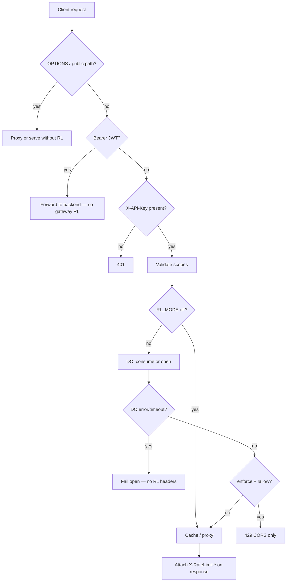

Tracing the gateway rate limiter from route handling through headers and fallback behavior.
The gateway rate limiter is a **Cloudflare Durable Object (DO) token bucket** keyed by **hashed API key**. It runs only on the **`X-API-Key` path** after scope validation — not on JWT Bearer, public passthrough, or OPTIONS.

---

## Request flow (where it sits)



Entry is `handleRequest` in `gateway/src/index.ts`, exported from the Worker's default `fetch` handler.

**Skipped entirely:**
- `OPTIONS`, OpenAPI, health/JWKS/OAuth bootstrap, session exchange
- Any request authenticated with `Authorization: Bearer` (JWT M2M)

**Applied only when:** `X-API-Key` is present, scopes pass, and `RL_MODE !== 'off'`.

---

## Configuration

From `gateway/wrangler.toml` and `limitsFromEnv()`:

| Env var | Default (wrangler) | Role |
|---------|-------------------|------|
| `RL_MODE` | `observe` | `off` \| `observe` \| `enforce` |
| `RL_DEFAULT_LIMIT` | `1000` | Requests/min per key (non-SSE) |
| `RL_CHAT_LIMIT` | `100` | Chat stream starts/min per key |
| `SSE_CONCURRENCY_LIMIT` | `5` | Max concurrent `/v1/chat/stream` per key |

The DO is bound as `RATE_LIMITER` with class `RateLimiter` (`wrangler.toml` lines 51–64).

---

## Worker → Durable Object integration

Three helpers in `gateway/src/index.ts` talk to the DO:

```554:621:gateway/src/index.ts
async function rlConsume(env: Env, apiKeyHash: string, defaultPerMin: number) {
  const id = env.RATE_LIMITER.idFromName(apiKeyHash);
  const stub = env.RATE_LIMITER.get(id);
  // ... 2s timeout ...
  const res = await stub.fetch('https://do/check', {
    method: 'POST',
    body: JSON.stringify({ type: 'consume', limits: { defaultPerMin } }),
    signal: controller.signal
  });
  return (await res.json()) as { allow: boolean; headers: Record<string, string> };
}
// rlOpen / rlClose — same pattern with type: 'open' | 'close'
```

Important details:
- **Identity:** `apiKeyHash = sha256hex(apiKey)` — one DO instance per API key (`idFromName(apiKeyHash)`).
- **Timeout:** 2 seconds on consume/open/close; abort → throws.
- **Close is best-effort:** errors are logged, never fail the client response.

The rate-limit gate in the handler:

```873:900:gateway/src/index.ts
    if (rlMode !== 'off') {
      try {
        if (sse) {
          sid = newSid();
          const r = await rlOpen(env, apiKeyHash, chatPerMin, sseCap, sid);
          rlHeaders = r.headers;
          limited = !r.allow;
          if (rlMode === 'enforce' && !r.allow) return new Response('Too Many Requests', { status: 429, headers: errorCorsHeaders() });
        } else {
          const r = await rlConsume(env, apiKeyHash, defaultPerMin);
          rlHeaders = r.headers;
          limited = !r.allow;
          if (rlMode === 'enforce' && !r.allow) return new Response('Too Many Requests', { status: 429, headers: errorCorsHeaders() });
        }
      } catch (e) {
        // Rate limiter timeout or error - log but allow request to proceed (fail open)
        console.warn('Rate limiter error, allowing request', { ... });
        // Continue without rate limiting headers
      }
    }
```

---

## Durable Object algorithm (`gateway/src/rate_limiter.ts`)

The `RateLimiter` class holds **two independent token buckets** plus **stream concurrency state**, persisted in DO SQLite storage:

| State | Used for |
|-------|----------|
| `tokensDefault` / `lastRefillDefault` | Regular API requests (`consume`) |
| `tokensChat` / `lastRefillChat` | SSE stream opens (`open`) |
| `streams` (Set of session IDs) | Concurrent `/v1/chat/stream` cap |

**Token bucket refill** (`refill()`): continuous refill at `limitPerMin / 60000` tokens/ms, capped at `limitPerMin`. Each allowed request costs 1 token.

**Three RPC types** via POST JSON body:

1. **`consume`** — default bucket; returns `{ allow, headers }`.
2. **`open`** — checks concurrency first (`streams.size >= concurrencyCap` → deny), then chat bucket; on success adds `sid` to `streams`.
3. **`close`** — removes `sid` from `streams` (releases concurrency slot).

**Rate limit headers** (`headers()`):

```108:116:gateway/src/rate_limiter.ts
  private headers(limit: number, remaining: number): Record<string, string> {
    const nowSec = Math.floor(Date.now() / 1000);
    const secs = new Date().getUTCSeconds();
    const reset = nowSec + (60 - secs);
    return {
      'X-RateLimit-Limit': String(limit),
      'X-RateLimit-Remaining': String(Math.max(0, Math.floor(remaining))),
      'X-RateLimit-Reset': String(reset),
    };
  }
```

Reset is **end of current UTC minute** (not a rolling window). There is **no `Retry-After`** anywhere in the gateway path (`docs/backpressure-guards.md` confirms this).

---

## Response behavior after the limit check

### `RL_MODE` semantics

| Mode | Over limit | Headers on allowed responses |
|------|-----------|------------------------------|
| `off` | Never checked | None from RL |
| `observe` | Request still proxied; `limited=true` logged to Analytics | `X-RateLimit-*` attached |
| `enforce` | Immediate **429** `"Too Many Requests"` | N/A (blocked) |

### 429 response shape

On enforce rejection, the gateway returns **plain text** with **CORS only** — the DO-computed `X-RateLimit-*` headers are **not** forwarded on 429:

```884:884:gateway/src/index.ts
          if (rlMode === 'enforce' && !r.allow) return new Response('Too Many Requests', { status: 429, headers: errorCorsHeaders() });
```

### Successful / proxied responses

When the request continues, `rlHeaders` are merged onto the outgoing response:

- Normal JSON: lines 978–980
- SSE stream: lines 1035–1036
- Backend failure (502): line 960 — RL headers still attached

Analytics records `limited ? 1 : 0` in the `doubles` field for observability even in `observe` mode.

### Fail-open fallback

If the DO times out (2s) or throws for any other reason, the catch block **logs a warning and proceeds without rate limiting** — no 429, no `X-RateLimit-*`. This is explicit fail-open behavior documented in `gateway/AGENTS.md`.

---

## SSE (`/v1/chat/stream`) lifecycle

SSE is detected by pathname only (`isSSE()` → `/v1/chat/stream`):

1. **`rlOpen`** before backend fetch — reserves a concurrency slot + consumes a chat token.
2. If backend fetch fails or response is not OK/no body → **`rlClose`** via `ctx.waitUntil`.
3. If stream starts → body is **teed**; a background task reads the monitor side until done/30min timeout, then **`rlClose`** in `finally`.
4. Cache is never used for SSE.

This keeps the concurrency cap accurate for long-lived streams.

---

## Separate layer: server auth rate limiting

The sigmap also surfaced `crates/kepler-server/src/middleware/auth_rate_limit.rs`. That is **not** the gateway DO limiter — it is **Layer 2**, in-process per-IP limits on auth bootstrap endpoints (`register-client` 10/min, `service-token` and GitHub OAuth 30/min). Those routes are **public passthrough at the gateway** (no API-key DO check) but hit Axum middleware on the origin, returning JSON 429 **with `Retry-After`**.

---

## Key files summary

| File | Role |
|------|------|
| `gateway/src/index.ts` | Route gating, `rlConsume`/`rlOpen`/`rlClose`, mode logic, header attachment, fail-open |
| `gateway/src/rate_limiter.ts` | DO token buckets, concurrency tracking, header computation |
| `gateway/wrangler.toml` | DO binding, `RL_*` env defaults |
| `gateway/AGENTS.md` | Operational summary (modes, fail-open, SSE) |
| `docs/backpressure-guards.md` | Cross-layer guard inventory and 429/header contract |
| `crates/kepler-server/src/middleware/auth_rate_limit.rs` | Separate origin auth-endpoint rate limit (not gateway DO) |

**Bottom line:** Gateway rate limiting is a per-API-key Durable Object with dual token buckets plus SSE concurrency, controlled by `RL_MODE`. It fails open on DO errors, attaches `X-RateLimit-*` on responses that reach the proxy stage, strips those headers on gateway 429s, and never sends `Retry-After`. JWT Bearer traffic bypasses it entirely.
