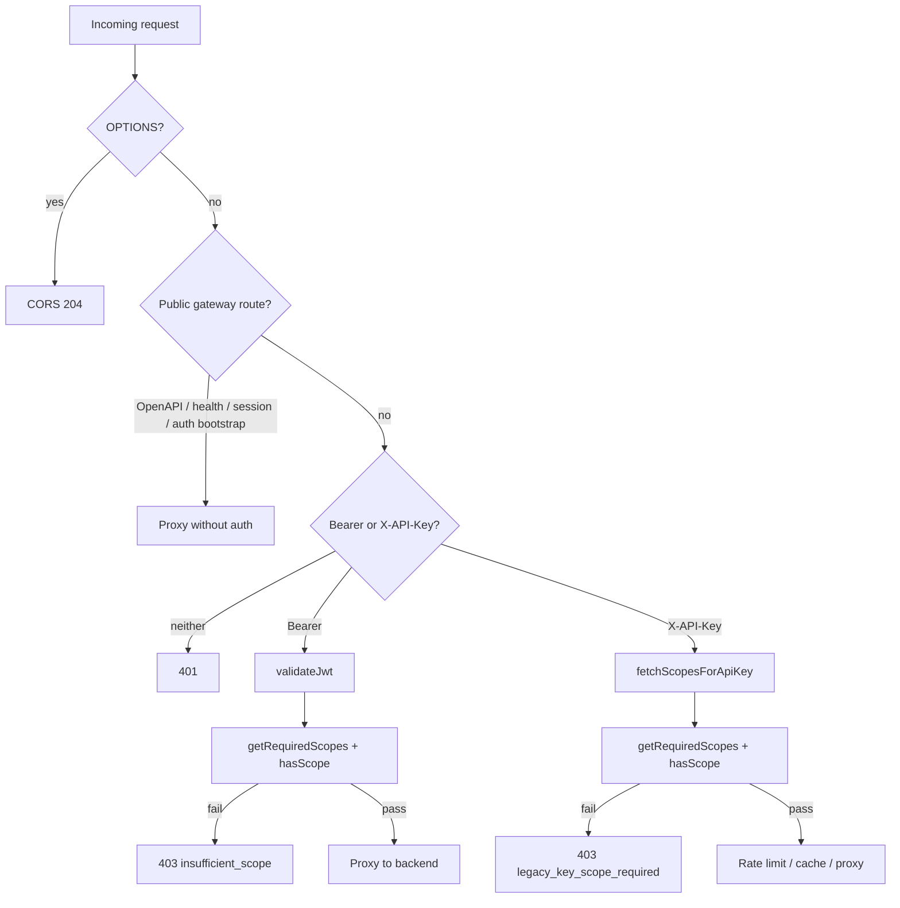

Tracing gateway scope lookup and enforcement through the codebase.
## Overview

Gateway scope enforcement is a **two-step process**: (1) look up the required scope(s) for the request path/method from a generated route map, then (2) compare them against the caller’s granted scopes using wildcard-aware matching. Public routes bypass this entirely.

The canonical policy lives in `policy/scope-matrix.json` and is compiled into `gateway/src/generated/scope-matrix.ts` by `policy/generate.mjs` (`just generate-scope-matrix`).

---

## 1. Policy source and code generation

`policy/scope-matrix.json` defines:

- **Scope vocabulary** (`scopes`, `aliases`)
- **Public unauthenticated paths** (`public_backend_passthrough`, `public_gateway_routes`)
- **Route → scope mappings** (`routes` array)

The generator (`policy/generate.mjs`) emits the gateway helpers. Prefix routes (`method: "*"`) become the `ROUTE_SCOPES` map; method-specific admin read routes are handled as a special case in generated `getRequiredScopes`:

```54:54:policy/generate.mjs
const prefixRoutes = m.routes.filter((r) => r.method === "*");
```

```17:27:gateway/src/generated/scope-matrix.ts
const ROUTE_SCOPES: Record<string, string> = {
  '/v1/health': 'kepler:health:read',
  '/v1/admin/': 'kepler:admin:write',
  '/v1/communications/': 'kepler:communications:content:read',
  '/v1/kg/admin/': 'kepler:admin:write',
  '/v1/kg/': 'kepler:communications:content:read',
  '/v1/team/': 'kepler:communications:content:read',
  '/v1/accounts/': 'kepler:accounts:read',
  '/v1/accounts': 'kepler:accounts:read',
  '/v1/salesforce/': 'kepler:salesforce:read',
};
```

---

## 2. Scope lookup: `getRequiredScopes(pathname, method)`

The lookup function is in the generated scope matrix:

```217:225:gateway/src/generated/scope-matrix.ts
export function getRequiredScopes(pathname: string, method: string): string | string[] | null {
  if (pathname === '/v1/admin/providers/health' || pathname === '/v1/admin/providers/config' || pathname === '/v1/admin/diagnostics/scope-mismatch')
    return method === 'GET' ? ADMIN_READ_SCOPE : ADMIN_WRITE_SCOPE;
  const sorted = Object.entries(ROUTE_SCOPES).sort((a, b) => b[0].length - a[0].length);
  for (const [prefix, scope] of sorted) {
    if (pathname === prefix || pathname.startsWith(prefix)) return scope;
  }
  return null;
}
```

**How it works:**

1. **Admin read exceptions** — three exact paths return `kepler:admin:read` on `GET`, `kepler:admin:write` otherwise.
2. **Longest-prefix wins** — `ROUTE_SCOPES` entries are sorted by path length descending so `/v1/kg/admin/` beats `/v1/kg/`.
3. **Match rule** — exact match or `pathname.startsWith(prefix)`.
4. **No match → `null`** — gateway does not enforce a scope for unmapped paths (backend may still require one).

Public routes are excluded earlier via helpers like `isPublicBackendPassthroughPath()` and `isPublicGatewayOpenApiPath()`, which use `matchesPathPolicy()` against separate allowlists — not `ROUTE_SCOPES`.

---

## 3. Scope matching: `hasScope(granted, required)`

Once a required scope is known, matching is done by `hasScope`:

```227:239:gateway/src/generated/scope-matrix.ts
export function hasScope(granted: string, required: string): boolean {
  if (!required) return false;
  const grantedScopes = granted.split(/\s+/);
  const matches = (req: string): boolean =>
    grantedScopes.some((s) => {
      if (s === req) return true;
      if (s.endsWith(':*') && req.startsWith(s.slice(0, -1))) return true;
      return false;
    });
  if (matches(required)) return true;
  const aliases = SCOPE_ALIASES[required];
  if (aliases) return aliases.some((alt) => matches(alt));
  return false;
}
```

**Matching rules:**

- Granted scopes are a **space-separated string** (OAuth-style).
- **Exact match** or **trailing wildcard** (`kepler:admin:*` covers `kepler:admin:write`).
- **Aliases** — e.g. `kepler:communications:read` satisfies `kepler:communications:content:read` (one direction only).

The backend uses equivalent logic in `crates/kepler-runtime/src/scopes.rs` (delegated from `crates/kepler-server/src/generated/scope_matrix.rs`).

---

## 4. Request flow and enforcement in `gateway/src/index.ts`

The worker entry is `handleRequest()` in `gateway/src/index.ts`. Scope checks happen only **after** public-route short-circuits.



### Public routes (no scope check)

Handled before auth in order:

1. `isPublicGatewayOpenApiPath` — serve bundled OpenAPI
2. `isPublicGatewaySessionExchangePath` — Okta session exchange
3. `isPublicGatewayBackendPassthroughPath` — e.g. `/health`
4. `isPublicBackendPassthroughPath` — JWKS, auth bootstrap, portal access, Codex OAuth, etc.

These paths never call `getRequiredScopes`.

### Bearer JWT path

After `validateJwt()` succeeds:

```785:807:gateway/src/index.ts
        // Enforce scope at gateway level (mirrors backend enforcement)
        const requiredScopes = getRequiredScopes(url.pathname, request.method);
        if (requiredScopes && jwtPayload.scope) {
          const requiredArr = Array.isArray(requiredScopes) ? requiredScopes : [requiredScopes];
          const missing = requiredArr.filter((s) => !hasScope(jwtPayload!.scope!, s));
          if (missing.length > 0) {
            // ... 403 insufficient_scope
          }
        } else if (requiredScopes && !jwtPayload.scope) {
          // JWT has no scope claim at all -- deny access to scoped routes
          // ... 403 insufficient_scope
        }
```

- If the route requires scopes and the JWT lacks a `scope` claim → **403**.
- If the route requires scopes and any are missing → **403** with `{ error: "insufficient_scope", required: [...] }`.
- If `getRequiredScopes` returns `null` → no gateway scope gate (request proceeds if JWT is valid).

### X-API-Key path

Scopes are fetched from the backend validate endpoint, then checked the same way:

```846:866:gateway/src/index.ts
    const scopesResult = await fetchScopesForApiKey(apiKey, env, ctx);
    if (!scopesResult.valid) {
      return new Response('Unauthorized', { status: 401, headers: errorCorsHeaders() });
    }
    const requiredScopes = getRequiredScopes(url.pathname, request.method);
    if (requiredScopes) {
      const requiredArr = Array.isArray(requiredScopes) ? requiredScopes : [requiredScopes];
      const missing = requiredArr.filter((s) => !hasScope(scopesResult.granted, s));
      if (missing.length > 0) {
        // ... 403 legacy_key_scope_required
      }
    }
```

`fetchScopesForApiKey()` (`gateway/src/index.ts:286`) POSTs to `/v1/auth/validate`, requires a non-empty `scopes` field, and caches positive results in KV for ~45s keyed by SHA-256 of the API key.

---

## 5. Backend second layer (context)

The gateway mirrors backend enforcement; the backend does **not** use dynamic path lookup. Instead, Axum route groups get explicit scopes at router setup via `require_auth(Some(scopes::SCOPE_*))` in `crates/kepler-server/src/main.rs`, with matching in `crates/kepler-server/src/middleware.rs`.

So a request can be blocked at the edge (gateway) and again at origin (backend) if it somehow bypasses the edge check.

---

## Key files summary

| Role | File |
|------|------|
| Canonical policy | `policy/scope-matrix.json` |
| Codegen | `policy/generate.mjs` |
| Route lookup + `hasScope` | `gateway/src/generated/scope-matrix.ts` |
| Request orchestration | `gateway/src/index.ts` (`handleRequest`, `fetchScopesForApiKey`, `validateJwt`) |
| Operational docs | `gateway/AGENTS.md`, `docs/service-auth.md` |
| Shared matching logic (backend) | `crates/kepler-runtime/src/scopes.rs` |

**Design takeaway:** scope requirements are **declarative** in JSON, **compiled** into a prefix map, **looked up per request** by path/method at the edge, and **enforced** by comparing granted vs required scopes for both JWT and API-key auth — with public routes explicitly excluded upstream.
