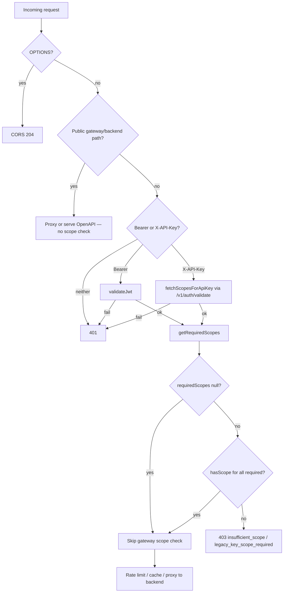

Tracing the gateway request path and how scope requirements are resolved and enforced.
Finding how the scope matrix is generated and how API key scopes are fetched.
## Overview

Gateway scope enforcement is a two-stage process: **lookup** (pathname + HTTP method → required scope(s) from a generated matrix) and **enforcement** (compare required scope(s) against the caller’s granted scopes). Both happen in the Cloudflare Worker at `gateway/src/index.ts`, after public/unauthenticated routes are handled and before the request is proxied to the backend.

The canonical policy lives in `policy/scope-matrix.json`. Codegen (`policy/generate.mjs`, run via `just generate-scope-matrix`) emits `gateway/src/generated/scope-matrix.ts`, which the worker imports at the edge.

---

## 1. Policy source and code generation

`policy/scope-matrix.json` defines:

- **Scope vocabulary** (`scopes`, `aliases`)
- **Public bypass lists** (`public_backend_passthrough`, `public_gateway_routes`) — no scope check
- **Route→scope mappings** (`routes`) — used for enforcement

Prefix routes with `"method": "*"` become the `ROUTE_SCOPES` table. Method-specific admin read routes are special-cased in generated lookup logic.

```244:304:policy/scope-matrix.json
    "routes": [
        {
            "path": "/v1/health",
            "method": "*",
            "scope": "kepler:health:read"
        },
        {
            "path": "/v1/admin/providers/health",
            "method": "GET",
            "scope": "kepler:admin:read"
        },
        // ...
        {
            "path": "/v1/salesforce/",
            "method": "*",
            "scope": "kepler:salesforce:read"
        }
    ],
```

`policy/generate.mjs` filters wildcard-method routes into `ROUTE_SCOPES` and emits `getRequiredScopes`, `hasScope`, and public-path helpers into the gateway artifact.

---

## 2. Scope lookup: `getRequiredScopes(pathname, method)`

The lookup function is in the generated scope matrix:

```217:225:gateway/src/generated/scope-matrix.ts
export function getRequiredScopes(pathname: string, method: string): string | string[] | null {
  if (pathname === '/v1/admin/providers/health' || pathname === '/v1/admin/providers/config' || pathname === '/v1/admin/diagnostics/scope-mismatch')
    return method === 'GET' ? ADMIN_READ_SCOPE : ADMIN_WRITE_SCOPE;
  const sorted = Object.entries(ROUTE_SCOPES).sort((a, b) => b[0].length - a[0].length);
  for (const [prefix, scope] of sorted) {
    if (pathname === prefix || pathname.startsWith(prefix)) return scope;
  }
  return null;
}
```

**Lookup rules:**

1. **Admin read exceptions** — Three exact admin paths use `kepler:admin:read` on `GET`, `kepler:admin:write` otherwise.
2. **Longest-prefix wins** — Remaining routes match against `ROUTE_SCOPES`, sorted longest-first so `/v1/kg/admin/` beats `/v1/kg/`.
3. **No match → `null`** — Gateway skips scope enforcement for that path; the backend may still enforce scopes via its own route middleware.

Matching is prefix-based: `pathname === prefix || pathname.startsWith(prefix)`.

---

## 3. Scope matching: `hasScope(granted, required)`

Once a required scope is known, the worker checks whether the caller’s space-separated scope string satisfies it:

```227:240:gateway/src/generated/scope-matrix.ts
export function hasScope(granted: string, required: string): boolean {
  if (!required) return false;
  const grantedScopes = granted.split(/\s+/);
  const matches = (req: string): boolean =>
    grantedScopes.some((s) => {
      if (s === req) return true;
      if (s.endsWith(':*') && req.startsWith(s.slice(0, -1))) return true;
      return false;
    });
  if (matches(required)) return true;
  const aliases = SCOPE_ALIASES[required];
  if (aliases) return aliases.some((alt) => matches(alt));
  return false;
}
```

**Matching supports:**

- Exact match (`kepler:accounts:read`)
- Trailing wildcards (`kepler:admin:*`)
- Aliases (e.g. `kepler:communications:read` satisfies `kepler:communications:content:read`)

The backend uses equivalent logic in `crates/kepler-runtime/src/scopes.rs` (slightly stricter segment parsing), generated from the same policy.

---

## 4. Request flow and where enforcement happens

All requests enter `handleRequest` in `gateway/src/index.ts`:

```625:633:gateway/src/index.ts
async function handleRequest(request: Request, env: Env, ctx: ExecutionContext, log: Logger, sentry: Toucan | null): Promise<Response> {
    const url = new URL(request.url);
    // ...
    if (request.method === 'OPTIONS') return new Response(null, { headers: corsHeaders() });
```

### Phase A: Public routes (no scope check)

These return before any credential or scope logic:

| Check | Examples | Behavior |
|---|---|---|
| `isPublicGatewayOpenApiPath` | `/openapi.json` | Serve bundled OpenAPI |
| `isPublicGatewaySessionExchangePath` | `/v1/auth/session` | Okta introspection + backend proxy |
| `isPublicGatewayBackendPassthroughPath` | `/health` | Direct backend proxy |
| `isPublicBackendPassthroughPath` | JWKS, auth bootstrap, portal, Codex OAuth | Direct backend proxy |

Public paths are defined in generated lists from `public_gateway_routes` and `public_backend_passthrough` in the policy JSON, matched via `matchesPathPolicy` (exact, prefix, or prefix+suffix).

### Phase B: Authenticated routes

After public bypass, the worker requires `Authorization: Bearer` or `X-API-Key`.

#### Bearer JWT path

1. `validateJwt()` — signature (JWKS), issuer, audience, expiry
2. `getRequiredScopes(url.pathname, request.method)`
3. If required scopes exist, every one must pass `hasScope(jwtPayload.scope, s)`; missing scope claim → 403
4. On success, proxy to backend with the Bearer token intact

```785:807:gateway/src/index.ts
        const requiredScopes = getRequiredScopes(url.pathname, request.method);
        if (requiredScopes && jwtPayload.scope) {
          const requiredArr = Array.isArray(requiredScopes) ? requiredScopes : [requiredScopes];
          const missing = requiredArr.filter((s) => !hasScope(jwtPayload!.scope!, s));
          if (missing.length > 0) {
            // ... 403 { error: 'insufficient_scope', required: [...] }
          }
        } else if (requiredScopes && !jwtPayload.scope) {
          // ... 403 insufficient_scope
        }
```

Bearer is preferred: if both Bearer and `X-API-Key` are present, the JWT branch runs.

#### X-API-Key path

1. `fetchScopesForApiKey()` — POST to backend `/v1/auth/validate`, returns `{ valid, scopes }`
2. Results cached in KV (`TOKEN_CACHE`) for 45s keyed on SHA-256 of the key
3. Same `getRequiredScopes` + `hasScope` check against `scopesResult.granted`
4. On failure → 403 with `legacy_key_scope_required`

```845:866:gateway/src/index.ts
    const scopesResult = await fetchScopesForApiKey(apiKey, env, ctx);
    if (!scopesResult.valid) {
      return new Response('Unauthorized', { status: 401, headers: errorCorsHeaders() });
    }
    const requiredScopes = getRequiredScopes(url.pathname, request.method);
    if (requiredScopes) {
      const requiredArr = Array.isArray(requiredScopes) ? requiredScopes : [requiredScopes];
      const missing = requiredArr.filter((s) => !hasScope(scopesResult.granted, s));
      if (missing.length > 0) {
        // ... 403 legacy_key_scope_required
      }
    }
```

`fetchScopesForApiKey` rejects keys with no explicit scopes (no legacy fallback):

```316:318:gateway/src/index.ts
    const granted = data.scopes?.trim() ?? '';
    if (!granted) return { valid: false, granted: '' };
```

After scope checks pass, the API-key path continues to rate limiting, optional GET caching, and backend proxy.

---

## 5. End-to-end flow



---

## 6. Backend mirror (defense in depth)

The gateway enforces scopes at the edge, but the backend re-enforces per route group via `require_auth(Some(SCOPE_...))` in `crates/kepler-server/src/middleware.rs` and route wiring in `main.rs`. Backend scopes are compile-time constants from the same `policy/scope-matrix.json`, not runtime path lookup like the gateway.

So:

- **Gateway**: dynamic path→scope lookup via `getRequiredScopes`
- **Backend**: static scope per router layer via `require_auth`

Both use the same scope vocabulary and `has_scope` semantics.

---

## Key files

| File | Role |
|---|---|
| `policy/scope-matrix.json` | Canonical route/scope policy |
| `policy/generate.mjs` | Codegen into gateway TS, backend RS, portal JS |
| `gateway/src/generated/scope-matrix.ts` | `getRequiredScopes`, `hasScope`, public-path helpers |
| `gateway/src/index.ts` | Request handler, JWT/API-key auth, scope enforcement |
| `gateway/src/index.ts` → `fetchScopesForApiKey` | Resolves API-key scopes from backend |
| `crates/kepler-server/src/middleware.rs` | Backend `require_auth` scope enforcement |
| `crates/kepler-runtime/src/scopes.rs` | Shared wildcard + alias matching logic |
| `gateway/AGENTS.md` | Documents flow and fail-closed 403 behavior |

---

## Behavioral notes

- **Fail-closed on scoped routes**: If a route requires scopes and the caller lacks them → 403, never silent downgrade.
- **Unmapped routes**: `getRequiredScopes` returns `null` → gateway does not scope-check; backend middleware may still require a scope.
- **Public routes never reach scope logic** — they are identified by generated public-path lists, not by “missing from `ROUTE_SCOPES`”.
- **To change mappings**: Edit `policy/scope-matrix.json`, run `just generate-scope-matrix`; do not hand-edit `gateway/src/generated/scope-matrix.ts`.
