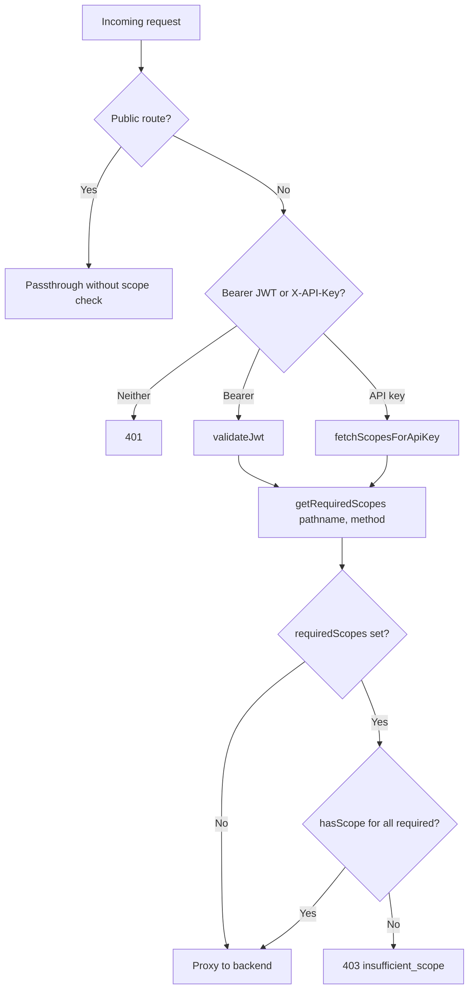

Tracing the gateway codebase for how route scope requirements are looked up and enforced on incoming requests.
Here is how gateway route scope requirements are looked up and enforced end to end.

## Overview

The Cloudflare Worker in `gateway/src/index.ts` enforces scopes at the edge **after** authentication and **before** proxying to the backend. The route→scope mapping is not hand-maintained in the gateway; it is generated from a single policy file and imported as lookup helpers.



---

## 1. Policy source and codegen

**Canonical source:** `policy/scope-matrix.json`

That file defines:
- **`routes`** — path prefixes (and a few method-specific entries) mapped to scopes
- **`public_backend_passthrough`** — auth bootstrap / portal paths that skip gateway auth entirely
- **`public_gateway_routes`** — gateway-handled public paths (OpenAPI, health, session exchange)
- **`aliases`** — acceptable alternate granted scopes (e.g. `kepler:communications:read` satisfies `kepler:communications:content:read`)

**Codegen:** `policy/generate.mjs` (via `just generate-scope-matrix`) emits `gateway/src/generated/scope-matrix.ts` (and `.js`). Prefix routes (`method: "*"`) become the `ROUTE_SCOPES` map; method-specific admin read routes are emitted as hardcoded exceptions inside `getRequiredScopes`.

```54:55:policy/generate.mjs
const prefixRoutes = m.routes.filter((r) => r.method === "*");
const routeScopesTs = prefixRoutes.map((r) => `  '${r.path}': '${r.scope}',`).join("\n");
```

---

## 2. Scope lookup: `getRequiredScopes(pathname, method)`

The gateway imports lookup helpers from the generated module:

```51:59:gateway/src/index.ts
// ===== Scope Registry (from policy/scope-matrix.json) =====
import {
  getRequiredScopes,
  hasScope,
  isPublicBackendPassthroughPath,
  isPublicGatewayBackendPassthroughPath,
  isPublicGatewayOpenApiPath,
  isPublicGatewaySessionExchangePath,
} from './generated/scope-matrix';
```

**Lookup algorithm** in `getRequiredScopes`:

1. **Admin read exceptions** — three exact paths use method-dependent scopes:
   - `GET` → `kepler:admin:read`
   - anything else → `kepler:admin:write`

2. **Prefix table** — otherwise, match against `ROUTE_SCOPES`, sorted **longest prefix first** so `/v1/kg/admin/` wins over `/v1/kg/`:

```217:225:gateway/src/generated/scope-matrix.ts
export function getRequiredScopes(pathname: string, method: string): string | string[] | null {
  if (pathname === '/v1/admin/providers/health' || pathname === '/v1/admin/providers/config' || pathname === '/v1/admin/diagnostics/scope-mismatch')
    return method === 'GET' ? ADMIN_READ_SCOPE : ADMIN_WRITE_SCOPE;
  const sorted = Object.entries(ROUTE_SCOPES).sort((a, b) => b[0].length - a[0].length);
  for (const [prefix, scope] of sorted) {
    if (pathname === prefix || pathname.startsWith(prefix)) return scope;
  }
  return null;
}
```

3. **`null` means no gateway scope requirement** — if the path is not in the matrix, enforcement is skipped (request still needs auth, but no scope check at the gateway).

Current prefix mappings (from generated `ROUTE_SCOPES`):

| Path prefix | Required scope |
|---|---|
| `/v1/health` | `kepler:health:read` |
| `/v1/admin/` | `kepler:admin:write` |
| `/v1/communications/` | `kepler:communications:content:read` |
| `/v1/kg/admin/` | `kepler:admin:write` |
| `/v1/kg/` | `kepler:communications:content:read` |
| `/v1/team/` | `kepler:communications:content:read` |
| `/v1/accounts`, `/v1/accounts/` | `kepler:accounts:read` |
| `/v1/salesforce/` | `kepler:salesforce:read` |

---

## 3. Scope matching: `hasScope(granted, required)`

Granted scopes are a **space-delimited string** (OAuth-style). Matching supports:

- **Exact match**
- **Wildcard prefixes** — e.g. `kepler:admin:*` satisfies `kepler:admin:write`
- **Aliases** — from `SCOPE_ALIASES` in the generated file

```227:239:gateway/src/generated/scope-matrix.ts
export function hasScope(granted: string, required: string): boolean {
  if (!required) return false;
  const grantedScopes = granted.split(/\s+/);
  const matches = (req: string): boolean =>
    grantedScopes.some((s) => {
      if (s === req) return true;
      if (s.endsWith(':*') && req.startsWith(s.slice(0, -1))) return true;
      return false;
    });
  if (matches(required)) return true;
  const aliases = SCOPE_ALIASES[required];
  if (aliases) return aliases.some((alt) => matches(alt));
  return false;
}
```

---

## 4. Request flow and where enforcement happens

All requests enter through `handleRequest` in `gateway/src/index.ts` (called from the Worker's `fetch` export).

### Routes that skip scope checks entirely

Before auth, several path classes return early with **no scope lookup**:

| Check | Purpose |
|---|---|
| `isPublicGatewayOpenApiPath` | Serve bundled OpenAPI locally |
| `isPublicGatewaySessionExchangePath` | Okta session exchange (optional introspection) |
| `isPublicGatewayBackendPassthroughPath` | e.g. `/health` |
| `isPublicBackendPassthroughPath` | JWKS, auth bootstrap, portal codex/access routes |

These use `matchesPathPolicy` against lists generated from `public_gateway_routes` / `public_backend_passthrough` in the policy JSON.

### Bearer JWT path

After `validateJwt` (issuer, audience, expiry, RS256/JWKS signature):

```785:807:gateway/src/index.ts
        // Enforce scope at gateway level (mirrors backend enforcement)
        const requiredScopes = getRequiredScopes(url.pathname, request.method);
        if (requiredScopes && jwtPayload.scope) {
          const requiredArr = Array.isArray(requiredScopes) ? requiredScopes : [requiredScopes];
          const missing = requiredArr.filter((s) => !hasScope(jwtPayload!.scope!, s));
          if (missing.length > 0) {
            // ... 403 { error: 'insufficient_scope', required: ... }
          }
        } else if (requiredScopes && !jwtPayload.scope) {
          // JWT has no scope claim at all -- deny access to scoped routes
          // ... 403
        }
```

- Scopes come from the JWT `scope` claim (validated payload, not re-fetched).
- Missing claim on a scoped route → **403**, not silent allow.

### X-API-Key path

After key validation via `fetchScopesForApiKey`:

```845:866:gateway/src/index.ts
    const scopesResult = await fetchScopesForApiKey(apiKey, env, ctx);
    if (!scopesResult.valid) {
      return new Response('Unauthorized', { status: 401, headers: errorCorsHeaders() });
    }
    const requiredScopes = getRequiredScopes(url.pathname, request.method);
    if (requiredScopes) {
      const requiredArr = Array.isArray(requiredScopes) ? requiredScopes : [requiredScopes];
      const missing = requiredArr.filter((s) => !hasScope(scopesResult.granted, s));
      if (missing.length > 0) {
        // ... 403 { error: 'legacy_key_scope_required', required_scopes: ... }
      }
    }
```

`fetchScopesForApiKey` resolves granted scopes by POSTing to backend `/v1/auth/validate`, requiring a non-empty `scopes` field, with a 45s KV read-through cache keyed on the SHA-256 of the key:

```286:328:gateway/src/index.ts
async function fetchScopesForApiKey(apiKey: string, env: Env, ctx: ExecutionContext): Promise<{ valid: boolean; granted: string }> {
  const cacheKey = `token:${await sha256hex(apiKey)}`;
  // ... KV cache read ...
  const validateUrl = buildBackendUrl(env, '/v1/auth/validate');
  // ... POST with X-API-Key ...
  const granted = data.scopes?.trim() ?? '';
  if (!granted) return { valid: false, granted: '' };
  // ... cache positive result ...
}
```

---

## 5. Failure modes (fail-closed on scoped routes)

| Condition | Result |
|---|---|
| No auth header on non-public route | **401** |
| Invalid JWT / API key | **401** |
| Scoped route, insufficient granted scopes | **403** JSON with required scope(s) |
| Scoped route, JWT has no `scope` claim | **403** |
| Unscoped route (`getRequiredScopes` → `null`) | Passes gateway scope check after auth |
| Public passthrough route | No auth, no scope check |

The gateway comment explicitly says this **mirrors backend enforcement**; the backend has its own generated copy in `crates/kepler-server/src/generated/scope_matrix.rs` from the same policy file.

---

## Key files

| File | Role |
|---|---|
| `policy/scope-matrix.json` | Source of truth for routes, public paths, aliases |
| `policy/generate.mjs` | Codegen into gateway/backend/portal artifacts |
| `gateway/src/generated/scope-matrix.ts` | `getRequiredScopes`, `hasScope`, public-path helpers |
| `gateway/src/index.ts` | `handleRequest`, `validateJwt`, `fetchScopesForApiKey`, enforcement |
| `gateway/AGENTS.md` | Documents branch order: public → session → bearer → API key → proxy |
