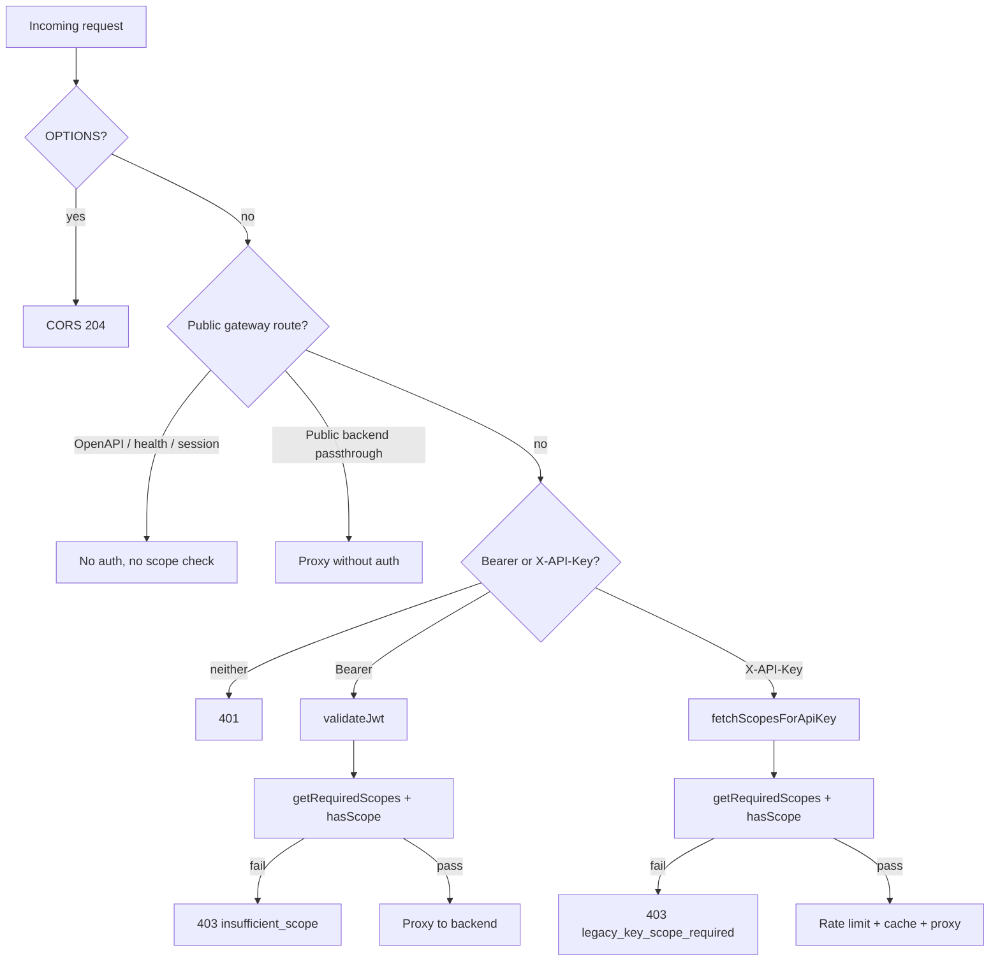

I'll trace the gateway request path from route matching through scope lookup and enforcement.
## Overview

Gateway scope enforcement is a **two-step pipeline**: (1) resolve the required scope(s) for `(pathname, method)` from a generated route map, then (2) compare against the caller’s granted scopes after auth. Public routes skip both steps entirely.

The canonical policy lives in `policy/scope-matrix.json`. `policy/generate.mjs` (via `just generate-scope-matrix`) emits `gateway/src/generated/scope-matrix.ts`, which the Worker imports in `gateway/src/index.ts`.

---

## 1. Where route → scope mappings come from

`policy/scope-matrix.json` defines:

- **`routes`**: path prefixes (and a few method-specific admin read routes)
- **`aliases`**: e.g. `kepler:communications:content:read` accepts `kepler:communications:read`
- **`public_backend_passthrough`** / **`public_gateway_routes`**: paths that bypass auth/scope checks

The generator builds `ROUTE_SCOPES` from routes where `method === "*"` only:

```54:55:policy/generate.mjs
const prefixRoutes = m.routes.filter((r) => r.method === "*");
const routeScopesTs = prefixRoutes.map((r) => `  '${r.path}': '${r.scope}',`).join("\n");
```

Method-specific admin read routes (`GET` on `/v1/admin/providers/health`, etc.) are **hardcoded** into the generated `getRequiredScopes()` template so they win over the broader `/v1/admin/` write prefix.

---

## 2. How scope lookup works (`getRequiredScopes`)

The lookup function in the generated module:

```217:225:gateway/src/generated/scope-matrix.ts
export function getRequiredScopes(pathname: string, method: string): string | string[] | null {
  if (pathname === '/v1/admin/providers/health' || pathname === '/v1/admin/providers/config' || pathname === '/v1/admin/diagnostics/scope-mismatch')
    return method === 'GET' ? ADMIN_READ_SCOPE : ADMIN_WRITE_SCOPE;
  const sorted = Object.entries(ROUTE_SCOPES).sort((a, b) => b[0].length - a[0].length);
  for (const [prefix, scope] of sorted) {
    if (pathname === prefix || pathname.startsWith(prefix)) return scope;
  }
  return null;
}
```

Important behaviors:

| Behavior | Detail |
|---|---|
| **Longest-prefix wins** | Prefixes are sorted by length descending before matching |
| **Admin read exceptions** | Three admin paths use `kepler:admin:read` on `GET`, `kepler:admin:write` otherwise |
| **Unmapped routes** | Returns `null` → gateway skips scope enforcement (backend still enforces per route group) |

The `ROUTE_SCOPES` map itself (from JSON `routes` with `method: "*"`):

```17:27:gateway/src/generated/scope-matrix.ts
const ROUTE_SCOPES: Record<string, string> = {
  '/v1/health': 'kepler:health:read',
  '/v1/admin/': 'kepler:admin:write',
  '/v1/communications/': 'kepler:communications:content:read',
  '/v1/kg/admin/': 'kepler:admin:write',
  '/v1/kg/': 'kepler:communications:content:read',
  '/v1/team/': 'kepler:communications:content:read',
  '/v1/accounts/': 'kepler:accounts:read',
  '/v1/accounts': 'kepler:accounts:read',
  '/v1/salesforce/': 'kepler:salesforce:read',
};
```

---

## 3. How granted scopes are matched (`hasScope`)

```227:239:gateway/src/generated/scope-matrix.ts
export function hasScope(granted: string, required: string): boolean {
  if (!required) return false;
  const grantedScopes = granted.split(/\s+/);
  const matches = (req: string): boolean =>
    grantedScopes.some((s) => {
      if (s === req) return true;
      if (s.endsWith(':*') && req.startsWith(s.slice(0, -1))) return true;
      return false;
    });
  if (matches(required)) return true;
  const aliases = SCOPE_ALIASES[required];
  if (aliases) return aliases.some((alt) => matches(alt));
  return false;
}
```

Granted scopes are a **space-separated string**. Matching supports exact match, `kepler:foo:*` wildcards, and alias fallback via `SCOPE_ALIASES`.

---

## 4. Request flow and where enforcement happens

All logic is in `handleRequest()` in `gateway/src/index.ts`. Order matters:



### Public routes (no scope check)

Before auth, these helpers from `scope-matrix.ts` short-circuit:

- `isPublicGatewayOpenApiPath` — serves bundled OpenAPI
- `isPublicGatewaySessionExchangePath` — Okta session exchange
- `isPublicGatewayBackendPassthroughPath` — e.g. `/health`
- `isPublicBackendPassthroughPath` — JWKS, auth bootstrap, portal access, etc.

These paths never call `getRequiredScopes`.

### Bearer JWT path

After `validateJwt()` succeeds, the gateway enforces scope:

```785:807:gateway/src/index.ts
        // Enforce scope at gateway level (mirrors backend enforcement)
        const requiredScopes = getRequiredScopes(url.pathname, request.method);
        if (requiredScopes && jwtPayload.scope) {
          const requiredArr = Array.isArray(requiredScopes) ? requiredScopes : [requiredScopes];
          const missing = requiredArr.filter((s) => !hasScope(jwtPayload!.scope!, s));
          if (missing.length > 0) {
            // ... 403 { error: 'insufficient_scope', required: requiredArr }
          }
        } else if (requiredScopes && !jwtPayload.scope) {
          // JWT has no scope claim at all -- deny access to scoped routes
          // ... 403 insufficient_scope
        }
```

JWT `scope` claim comes from the validated payload (`validateJwt` in the same file). Scoped routes with a JWT missing `scope` are denied; unmapped routes (`requiredScopes === null`) proceed without a gateway scope check.

### X-API-Key path

API keys are validated against the backend, which returns granted scopes:

```286:328:gateway/src/index.ts
async function fetchScopesForApiKey(apiKey: string, env: Env, ctx: ExecutionContext): Promise<{ valid: boolean; granted: string }> {
  const cacheKey = `token:${await sha256hex(apiKey)}`;
  // ... KV read-through cache (45s TTL) ...
  const validateUrl = buildBackendUrl(env, '/v1/auth/validate');
  // POST with X-API-Key → { valid, scopes }
  const granted = data.scopes?.trim() ?? '';
  if (!granted) return { valid: false, granted: '' };
  // cache positive result
}
```

Then scope is enforced the same way:

```850:866:gateway/src/index.ts
    const requiredScopes = getRequiredScopes(url.pathname, request.method);
    if (requiredScopes) {
      const requiredArr = Array.isArray(requiredScopes) ? requiredScopes : [requiredScopes];
      const missing = requiredArr.filter((s) => !hasScope(scopesResult.granted, s));
      if (missing.length > 0) {
        // ... 403 { error: 'legacy_key_scope_required', required_scopes: requiredArr }
      }
    }
```

Keys without explicit scopes are rejected at validation (`401`), not at scope check. On backend `401`/`403`, the gateway invalidates the KV cache entry so revocations propagate quickly.

---

## 5. Backend mirror (second enforcement layer)

The gateway is the **edge gate**; the Rust API re-checks scopes in middleware. Each route group in `crates/kepler-server/src/main.rs` uses `require_auth(Some(...))`, and `crates/kepler-server/src/middleware.rs` uses the same `has_scope` logic from generated `crates/kepler-server/src/generated/scope_matrix.rs`.

Both layers share vocabulary and matching rules from `policy/scope-matrix.json` (documented in `docs/service-auth.md`).

---

## 6. Error responses

| Auth type | Error code | When |
|---|---|---|
| Bearer JWT | `insufficient_scope` | Valid JWT, missing required scope (or no `scope` claim on a scoped route) |
| X-API-Key | `legacy_key_scope_required` | Valid key, missing required scope |

Both return **403** with JSON body listing required scope(s). There is no silent fallback to a weaker scope.

---

## Key files summary

| File | Role |
|---|---|
| `policy/scope-matrix.json` | Canonical route/scope/public-route policy |
| `policy/generate.mjs` | Codegen for gateway + backend + portal |
| `gateway/src/generated/scope-matrix.ts` | `getRequiredScopes`, `hasScope`, public-route helpers |
| `gateway/src/index.ts` | `handleRequest`, `validateJwt`, `fetchScopesForApiKey`, enforcement |
| `gateway/AGENTS.md` | Request-flow and auth rules |
| `docs/service-auth.md` | Two-layer enforcement model and error formats |
| `crates/kepler-server/src/middleware.rs` | Origin-side scope enforcement |

**Note:** `isPortalProxyAllowedPath` and `PORTAL_PROXY_*` in the generated scope matrix are for the portal proxy path allowlist, not the main `api.keplr.sh` Worker enforcement path described above.
