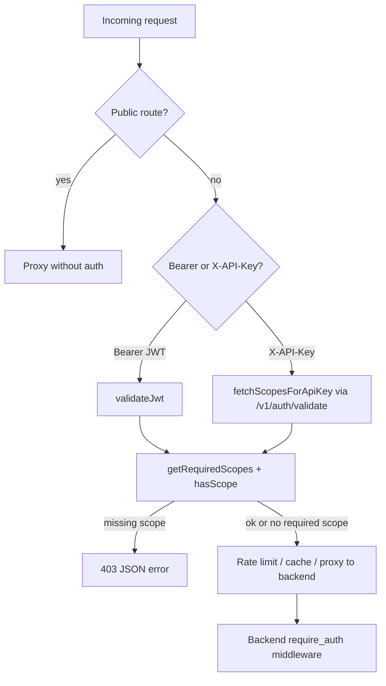

Tracing gateway scope lookup and enforcement through the codebase.
Gateway route scope enforcement is a two-layer system: a **canonical policy file** is codegen'd into lookup helpers, and the **Cloudflare Worker** applies those helpers at the edge before proxying to the Rust backend (which re-enforces per-route).

## Overview



---

## 1. Source of truth: `policy/scope-matrix.json`

All route→scope mappings live in one JSON policy file. The `routes` array defines path prefixes and scopes:

```244:304:policy/scope-matrix.json
    "routes": [
        {
            "path": "/v1/health",
            "method": "*",
            "scope": "kepler:health:read"
        },
        {
            "path": "/v1/admin/providers/health",
            "method": "GET",
            "scope": "kepler:admin:read"
        },
        // ...
        {
            "path": "/v1/admin/",
            "method": "*",
            "scope": "kepler:admin:write"
        },
        {
            "path": "/v1/communications/",
            "method": "*",
            "scope": "kepler:communications:content:read"
        },
        // ...
    ],
```

The same file also defines:

- **`public_backend_passthrough`** — auth bootstrap, JWKS, portal/Codex routes (no gateway auth)
- **`public_gateway_routes`** — gateway-handled public paths (OpenAPI inline, `/health`, Okta session exchange)
- **`aliases`** — e.g. `kepler:communications:content:read` accepts legacy `kepler:communications:read`

---

## 2. Codegen: policy → `gateway/src/generated/scope-matrix.ts`

`policy/generate.mjs` (via `just generate-scope-matrix`) emits the gateway helpers. Prefix routes (`method: "*"`) become the `ROUTE_SCOPES` map; public-route lists and aliases are embedded too:

```54:55:policy/generate.mjs
const prefixRoutes = m.routes.filter((r) => r.method === "*");
const routeScopesTs = prefixRoutes.map((r) => `  '${r.path}': '${r.scope}',`).join("\n");
```

The generated file must not be hand-edited (`gateway/AGENTS.md`).

---

## 3. Scope lookup: `getRequiredScopes()`

The gateway imports lookup/enforcement helpers from the generated module:

```51:59:gateway/src/index.ts
// ===== Scope Registry (from policy/scope-matrix.json) =====
import {
  getRequiredScopes,
  hasScope,
  isPublicBackendPassthroughPath,
  isPublicGatewayBackendPassthroughPath,
  isPublicGatewayOpenApiPath,
  isPublicGatewaySessionExchangePath,
} from './generated/scope-matrix';
```

**Lookup algorithm** in `getRequiredScopes(pathname, method)`:

1. **Method-specific admin exceptions** (hardcoded because they use `method: "GET"` in policy, not `"*"`):
   - `/v1/admin/providers/health`, `/v1/admin/providers/config`, `/v1/admin/diagnostics/scope-mismatch`
   - `GET` → `kepler:admin:read`; anything else → `kepler:admin:write`

2. **Longest-prefix wins**: sort `ROUTE_SCOPES` entries by path length descending, then first match where `pathname === prefix || pathname.startsWith(prefix)`.

3. **No match** → returns `null` (auth still required, but no gateway-level scope check).

```217:225:gateway/src/generated/scope-matrix.ts
export function getRequiredScopes(pathname: string, method: string): string | string[] | null {
  if (pathname === '/v1/admin/providers/health' || pathname === '/v1/admin/providers/config' || pathname === '/v1/admin/diagnostics/scope-mismatch')
    return method === 'GET' ? ADMIN_READ_SCOPE : ADMIN_WRITE_SCOPE;
  const sorted = Object.entries(ROUTE_SCOPES).sort((a, b) => b[0].length - a[0].length);
  for (const [prefix, scope] of sorted) {
    if (pathname === prefix || pathname.startsWith(prefix)) return scope;
  }
  return null;
}
```

Public routes are excluded from scope checks entirely via `matchesPathPolicy()` against `PUBLIC_BACKEND_PASSTHROUGH` and `PUBLIC_GATEWAY_ROUTES` (`isPublicBackendPassthroughPath`, etc.).

---

## 4. Scope matching: `hasScope()`

Granted scopes are a space-separated string (JWT `scope` claim or API-key validation response). Matching supports:

- Exact token match
- Wildcards (`kepler:admin:*` matches `kepler:admin:write`)
- Aliases from `SCOPE_ALIASES`

```227:239:gateway/src/generated/scope-matrix.ts
export function hasScope(granted: string, required: string): boolean {
  if (!required) return false;
  const grantedScopes = granted.split(/\s+/);
  const matches = (req: string): boolean =>
    grantedScopes.some((s) => {
      if (s === req) return true;
      if (s.endsWith(':*') && req.startsWith(s.slice(0, -1))) return true;
      return false;
    });
  if (matches(required)) return true;
  const aliases = SCOPE_ALIASES[required];
  if (aliases) return aliases.some((alt) => matches(alt));
  return false;
}
```

---

## 5. Enforcement in `handleRequest()` (`gateway/src/index.ts`)

Request handling follows a fixed branch order (`gateway/AGENTS.md`):

### Public bypass (no auth, no scope)

Early returns for OpenAPI, session exchange, health, JWKS, auth bootstrap, portal/Codex routes — checked before any credential extraction (~lines 636–760).

### Authenticated paths

Credentials: `Authorization: Bearer …` **or** `X-API-Key` (Bearer tried first if both present).

#### Bearer JWT path

1. `validateJwt()` — RS256, issuer/audience/exp, JWKS signature; returns payload including `scope`.
2. `getRequiredScopes(url.pathname, request.method)`.
3. If a scope is required:
   - Every required scope must pass `hasScope(jwtPayload.scope, s)`.
   - Missing `scope` claim on a scoped route → **403** `insufficient_scope`.
4. On success, forward to backend with original Bearer header.

```785:807:gateway/src/index.ts
        const requiredScopes = getRequiredScopes(url.pathname, request.method);
        if (requiredScopes && jwtPayload.scope) {
          const requiredArr = Array.isArray(requiredScopes) ? requiredScopes : [requiredScopes];
          const missing = requiredArr.filter((s) => !hasScope(jwtPayload!.scope!, s));
          if (missing.length > 0) {
            // ... 403 insufficient_scope
          }
        } else if (requiredScopes && !jwtPayload.scope) {
          // ... 403 insufficient_scope
        }
```

#### X-API-Key path

1. `fetchScopesForApiKey()` — POST to backend `/v1/auth/validate` with the key; response includes `scopes` string. Results cached in KV (~45s, keyed by SHA-256 of the key).
2. Invalid key or empty scopes → **401**.
3. Same `getRequiredScopes` + `hasScope` check; failure → **403** `legacy_key_scope_required`.

```845:866:gateway/src/index.ts
    const scopesResult = await fetchScopesForApiKey(apiKey, env, ctx);
    if (!scopesResult.valid) {
      return new Response('Unauthorized', { status: 401, headers: errorCorsHeaders() });
    }
    const requiredScopes = getRequiredScopes(url.pathname, request.method);
    if (requiredScopes) {
      const requiredArr = Array.isArray(requiredScopes) ? requiredScopes : [requiredScopes];
      const missing = requiredArr.filter((s) => !hasScope(scopesResult.granted, s));
      if (missing.length > 0) {
        // ... 403 legacy_key_scope_required
      }
    }
```

After scope checks pass, the API-key path continues to rate limiting, optional edge cache, and backend proxy.

---

## 6. Backend mirror (second enforcement line)

The gateway comment says it “mirrors backend enforcement.” The backend uses the same policy file, codegen'd to `crates/kepler-server/src/generated/scope_matrix.rs`, re-exported through `crates/kepler-server/src/middleware/scopes.rs`.

Routes in `main.rs` are wrapped with `require_auth(Some(scopes::SCOPE_…))`, which runs the same wildcard/alias logic via `scopes::has_scope()` for both Bearer and X-API-Key (`crates/kepler-server/src/middleware.rs`).

So: **gateway = edge auth + route-prefix scope gate**; **backend = per-route middleware scope gate**. A route with no entry in `ROUTE_SCOPES` skips gateway scope enforcement but still hits backend middleware if the route is scoped there.

---

## Key files summary

| Role | File |
|------|------|
| Canonical policy | `policy/scope-matrix.json` |
| Codegen | `policy/generate.mjs` |
| Lookup + `hasScope` | `gateway/src/generated/scope-matrix.ts` |
| Request flow + enforcement | `gateway/src/index.ts` — `handleRequest`, `validateJwt`, `fetchScopesForApiKey` |
| Backend equivalent | `crates/kepler-server/src/middleware/scopes.rs`, `middleware.rs`, `main.rs` |
| Operator docs | `gateway/AGENTS.md` |

**Design invariants:** no silent scope bypass; insufficient scope always **403** with JSON body; public/bootstrap routes bypass auth via path policy, not ad-hoc exceptions; policy changes require regenerating artifacts (`just generate-scope-matrix`), not editing generated TS/RS directly.
