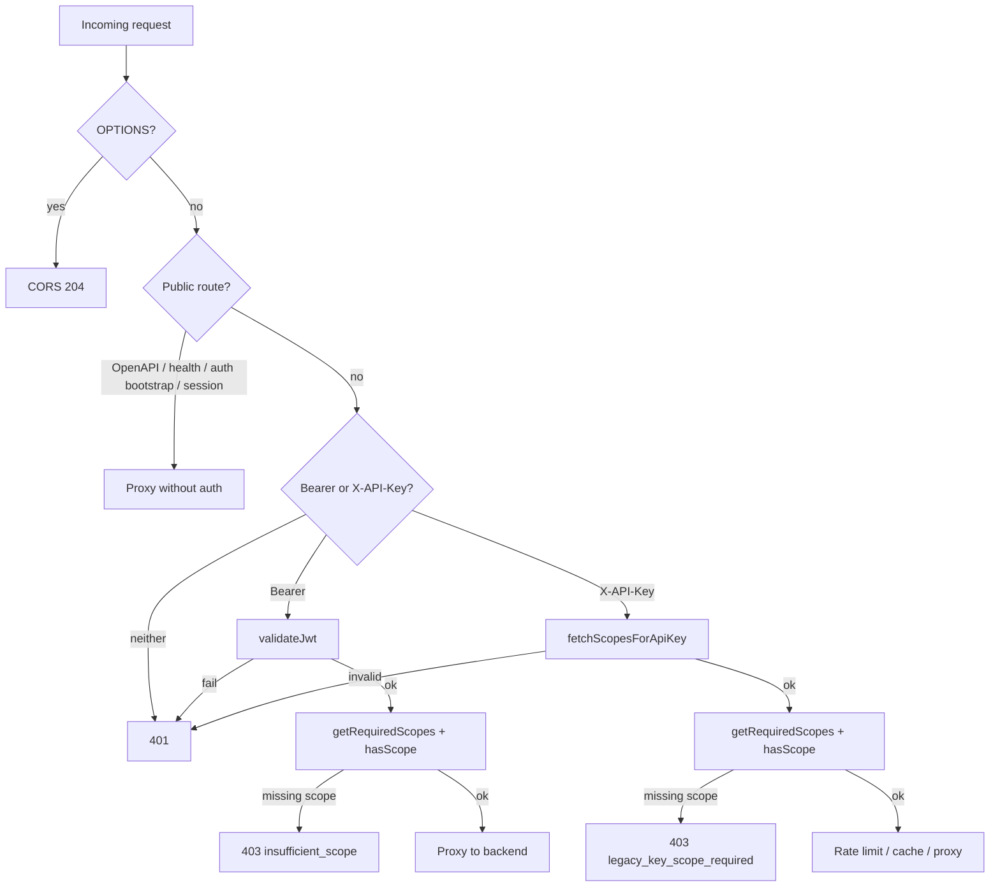

Tracing the gateway request path and how scope requirements are resolved and enforced.
## Overview

Gateway scope enforcement is a two-stage pipeline: **lookup** (which scope does this path need?) and **enforcement** (does the caller's granted scopes satisfy it?). Both stages draw from a single canonical policy file, `policy/scope-matrix.json`, which is codegen'd into `gateway/src/generated/scope-matrix.ts` by `policy/generate.mjs` (`just generate-scope-matrix`).

The gateway mirrors backend enforcement at the edge so under-scoped requests get **403** before they reach the Rust API.

---

## 1. Policy source and code generation

`policy/scope-matrix.json` defines:

- **`routes`**: path prefix → required scope (e.g. `/v1/communications/` → `kepler:communications:content:read`)
- **`aliases`**: alternate grants that satisfy a canonical requirement (e.g. `kepler:communications:read` satisfies `kepler:communications:content:read`)
- **`public_backend_passthrough`** / **`public_gateway_routes`**: paths that skip auth entirely

The generator (`policy/generate.mjs`) emits `ROUTE_SCOPES`, `SCOPE_ALIASES`, public-route helpers, and the lookup/enforcement functions into the gateway module:

```17:27:gateway/src/generated/scope-matrix.ts
const ROUTE_SCOPES: Record<string, string> = {
  '/v1/health': 'kepler:health:read',
  '/v1/admin/': 'kepler:admin:write',
  '/v1/communications/': 'kepler:communications:content:read',
  '/v1/kg/admin/': 'kepler:admin:write',
  '/v1/kg/': 'kepler:communications:content:read',
  '/v1/team/': 'kepler:communications:content:read',
  '/v1/accounts/': 'kepler:accounts:read',
  '/v1/accounts': 'kepler:accounts:read',
  '/v1/salesforce/': 'kepler:salesforce:read',
};
```

Only routes with `method: "*"` become prefix entries in `ROUTE_SCOPES`. Method-specific admin read routes are handled separately in lookup logic (below).

---

## 2. Scope lookup: `getRequiredScopes(pathname, method)`

Imported in the gateway handler from the generated module:

```51:59:gateway/src/index.ts
// ===== Scope Registry (from policy/scope-matrix.json) =====
import {
  getRequiredScopes,
  hasScope,
  isPublicBackendPassthroughPath,
  isPublicGatewayBackendPassthroughPath,
  isPublicGatewayOpenApiPath,
  isPublicGatewaySessionExchangePath,
} from './generated/scope-matrix';
```

Lookup logic in `getRequiredScopes`:

```217:225:gateway/src/generated/scope-matrix.ts
export function getRequiredScopes(pathname: string, method: string): string | string[] | null {
  if (pathname === '/v1/admin/providers/health' || pathname === '/v1/admin/providers/config' || pathname === '/v1/admin/diagnostics/scope-mismatch')
    return method === 'GET' ? ADMIN_READ_SCOPE : ADMIN_WRITE_SCOPE;
  const sorted = Object.entries(ROUTE_SCOPES).sort((a, b) => b[0].length - a[0].length);
  for (const [prefix, scope] of sorted) {
    if (pathname === prefix || pathname.startsWith(prefix)) return scope;
  }
  return null;
}
```

**How matching works:**

1. **Admin read exceptions** — three exact paths get `kepler:admin:read` on GET, `kepler:admin:write` otherwise (method-aware exceptions not represented as wildcard routes in `ROUTE_SCOPES`).
2. **Longest-prefix wins** — entries are sorted by path length descending, so `/v1/kg/admin/` beats `/v1/kg/` and `/v1/admin/`.
3. **`null` means no gateway scope gate** — if no prefix matches, the gateway skips scope enforcement for that path (auth may still be required; backend may enforce its own scope via `require_auth()`).

`getRequiredScope()` is a convenience wrapper that returns only the first scope when multiple are returned.

---

## 3. Scope matching: `hasScope(granted, required)`

After lookup, the gateway checks whether the caller's space-separated scope string satisfies the requirement:

```227:240:gateway/src/generated/scope-matrix.ts
export function hasScope(granted: string, required: string): boolean {
  if (!required) return false;
  const grantedScopes = granted.split(/\s+/);
  const matches = (req: string): boolean =>
    grantedScopes.some((s) => {
      if (s === req) return true;
      if (s.endsWith(':*') && req.startsWith(s.slice(0, -1))) return true;
      return false;
    });
  if (matches(required)) return true;
  const aliases = SCOPE_ALIASES[required];
  if (aliases) return aliases.some((alt) => matches(alt));
  return false;
}
```

Supports:

- **Exact match** (`kepler:accounts:read`)
- **Trailing wildcards** (`kepler:admin:*` matches `kepler:admin:write`)
- **Alias expansion** (grant `kepler:communications:read` satisfies required `kepler:communications:content:read`)

The backend uses the same alias/wildcard semantics via `crates/kepler-runtime/src/scopes.rs`, re-exported through `crates/kepler-server/src/generated/scope_matrix.rs`.

---

## 4. Request flow and enforcement in `handleRequest`

The gateway processes requests in a fixed order (`gateway/AGENTS.md`): public routes first, then authenticated routes.



### Public routes (no scope check)

These return before auth/scope logic:

- `isPublicGatewayOpenApiPath` — serves bundled OpenAPI locally
- `isPublicGatewaySessionExchangePath` — `/v1/auth/session` (Okta introspection)
- `isPublicGatewayBackendPassthroughPath` — e.g. `/health`
- `isPublicBackendPassthroughPath` — JWKS, auth bootstrap, portal access, Codex OAuth, etc.

### Bearer JWT path

After `validateJwt()` (RS256, issuer, audience, expiry, JWKS from backend):

```785:807:gateway/src/index.ts
        // Enforce scope at gateway level (mirrors backend enforcement)
        const requiredScopes = getRequiredScopes(url.pathname, request.method);
        if (requiredScopes && jwtPayload.scope) {
          const requiredArr = Array.isArray(requiredScopes) ? requiredScopes : [requiredScopes];
          const missing = requiredArr.filter((s) => !hasScope(jwtPayload!.scope!, s));
          if (missing.length > 0) {
            const errHeaders = new Headers(corsHeaders());
            errHeaders.set('Content-Type', 'application/json');
            return new Response(
              JSON.stringify({ error: 'insufficient_scope', required: requiredArr }),
              { status: 403, headers: errHeaders }
            );
          }
        } else if (requiredScopes && !jwtPayload.scope) {
          // JWT has no scope claim at all -- deny access to scoped routes
          ...
        }
```

- Scoped route + missing/forbidden scope → **403** with `insufficient_scope`
- Scoped route + JWT with no `scope` claim → **403** (fail closed)
- Unscoped route (`getRequiredScopes` returns `null`) → scope check skipped; request proxied if JWT is valid

### X-API-Key path

Scopes are fetched from the backend validate endpoint (with KV cache keyed on SHA-256 of the key):

```286:318:gateway/src/index.ts
async function fetchScopesForApiKey(apiKey: string, env: Env, ctx: ExecutionContext): Promise<{ valid: boolean; granted: string }> {
  ...
  const validateUrl = buildBackendUrl(env, '/v1/auth/validate');
  ...
    const data = (await res.json()) as { valid: boolean; scopes?: string };
    ...
    const granted = data.scopes?.trim() ?? '';
    if (!granted) return { valid: false, granted: '' };
```

Then the same lookup + `hasScope` check:

```850:866:gateway/src/index.ts
    const requiredScopes = getRequiredScopes(url.pathname, request.method);
    if (requiredScopes) {
      const requiredArr = Array.isArray(requiredScopes) ? requiredScopes : [requiredScopes];
      const missing = requiredArr.filter((s) => !hasScope(scopesResult.granted, s));
      if (missing.length > 0) {
        ...
          JSON.stringify({
            error: 'legacy_key_scope_required',
            message: 'This endpoint requires scoped authentication',
            required_scopes: requiredArr,
          }),
          { status: 403, headers: errHeaders }
```

Invalid key → **401**. Valid key but missing scope → **403** with `legacy_key_scope_required`.

---

## 5. Backend mirror (second enforcement layer)

The gateway is not the only enforcer. The Rust API applies scope per route group via `require_auth(Some(SCOPE_*))` in `crates/kepler-server/src/main.rs`, using the same scope constants from the same JSON policy. Example:

```501:504:crates/kepler-server/src/main.rs
        .layer(axum_middleware::from_fn_with_state(
            state.clone(),
            auth_middleware::require_auth(Some(scopes::SCOPE_HEALTH_READ)),
        ))
```

Backend middleware (`crates/kepler-server/src/middleware.rs`) validates Bearer JWT or X-API-Key and calls `scopes::has_scope()` — same vocabulary, same wildcard/alias rules. So a request that somehow bypassed gateway scope checks would still be blocked at the API layer.

---

## Key files summary

| Role | File |
|------|------|
| Canonical policy | `policy/scope-matrix.json` |
| Codegen | `policy/generate.mjs` |
| Lookup + matching helpers | `gateway/src/generated/scope-matrix.ts` |
| Request handler + enforcement | `gateway/src/index.ts` → `handleRequest`, `fetchScopesForApiKey`, `validateJwt` |
| Operator docs | `gateway/AGENTS.md`, `docs/service-auth.md` |
| Backend scope constants + `has_scope` | `crates/kepler-server/src/generated/scope_matrix.rs`, `crates/kepler-runtime/src/scopes.rs` |
| Backend per-route enforcement | `crates/kepler-server/src/main.rs`, `crates/kepler-server/src/middleware.rs` |

**Design takeaway:** scope requirements are **declared once** in JSON, **compiled into a prefix map** for gateway dynamic lookup, and **wired statically** into backend route layers — both use the same `hasScope` semantics so edge and origin agree on what "authorized" means.
