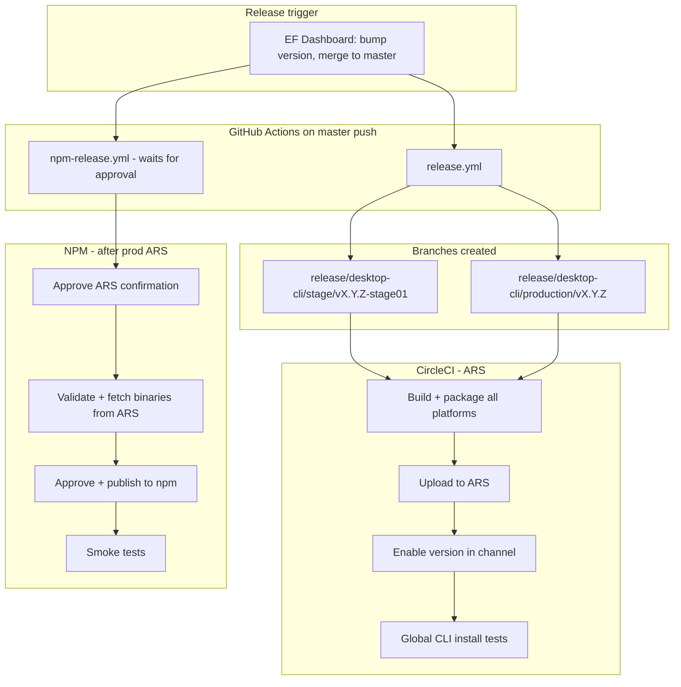

I'll trace the release path through docs, CI workflows, and release scripts to map beta/canary/stage → production and npm publish.
The release path splits into two **independent** distribution systems: **ARS (binary/curl install via CircleCI)** and **npm (re-distribution via GitHub Actions)**. ARS releases do not automatically publish to npm.

---

## High-level architecture



Primary references: [docs/release-workflow.md](docs/release-workflow.md), [docs/NPM_RELEASE_PROCESS.md](docs/NPM_RELEASE_PROCESS.md), [docs/CI_PIPELINE.md](docs/CI_PIPELINE.md).

---

## 1. Starting point: EF Dashboard → master

Production releases begin outside this repo’s CI:

1. Create a release in the **EF Dashboard** (version bump).
2. EF merges the bumped version to `develop` and **`master`**.

That `master` push is the fork for everything downstream. From [docs/release-workflow.md](docs/release-workflow.md):

- **`release.yml`** runs automatically — creates release branches.
- **`npm-release.yml`** also starts in parallel — but **blocks on human approval** until prod ARS is done.

---

## 2. GitHub Actions: branch creation (`release.yml`)

On every push to `master`, [`.github/workflows/release.yml`](.github/workflows/release.yml) reads the root `package.json` version and creates two branches:

| Branch | Purpose |
|--------|---------|
| `release/desktop-cli/stage/v{version}-stage01` | Stage build; version bumped to `{version}-stage01` |
| `release/desktop-cli/production/v{version}` | Production build; version stays at `{version}` |

```63:77:.github/workflows/release.yml
      - name: Create stage branch
        run: |
          BRANCH="release/desktop-cli/stage/v${{ needs.get-version.outputs.version }}-stage01"
          git checkout -b "$BRANCH"
          pnpm version "${{ needs.get-version.outputs.version }}-stage01" --no-git-tag-version
          ...
      - name: Create production branch
        run: |
          git checkout master
          BRANCH="release/desktop-cli/production/v${{ needs.get-version.outputs.version }}"
          git checkout -b "$BRANCH"
          git push origin "$BRANCH"
```

Those branch pushes trigger **CircleCI** (not GitHub Actions) for binary builds.

---

## 3. CircleCI: channel detection and ARS distribution

All binary packaging and ARS upload runs in [`.circleci/config.yml`](.circleci/config.yml). Channel is inferred from the branch name in the `set-channel` command:

| Branch pattern | Channel | Signing | Approval to enable? |
|----------------|---------|---------|---------------------|
| `develop`, `channel/beta`, `feature/*` | **beta** | No (Windows signing off) | No |
| `channel/canary` | **canary** | Yes | **Yes** (prod-style) |
| `release/desktop-cli/stage/*` | **stage** | Yes | No |
| `release/desktop-cli/production/*` | **prod** | Yes | **Yes** |

```19:63:.circleci/config.yml
              release_beta='develop'
              release_channel_beta='channel/beta'
              release_channel_canary='channel/canary'
              ...
              release_stage='^release/desktop-cli/stage/'
              release_prod='^release/desktop-cli/production/'
```

### Build naming

From `save-build-name` and [docs/CI_PIPELINE.md](docs/CI_PIPELINE.md):

- **Beta/canary:** `{semver}-beta-{timestamp}` or `{semver}-canary-{timestamp}`
- **Stage/prod:** exact version from `package.json` (e.g. `1.31.3` or `1.31.3-stage01` for stage branches)

### CircleCI pipeline stages

The `build_and_upload_manual` workflow runs on all release branches:

1. **create-build-name** — derive `BUILD_NAME`
2. **test** + **snyk**
3. **package_*** — Windows, macOS (Intel + ARM), Linux (x64 + ARM64); signed for stage/prod/canary
4. **upload-to-ARS** — `pnpm run upload-cli-artifacts -c $CHANNEL -p all -b $BUILD_NAME`
5. **enable-version-and-clear-cache** — `pnpm run enable-cli-version` + `pnpm run clearCLIDownloadCache`
6. **test-global-cli-*** — curl install tests (stage + production only)

Critical approval gate for **production** (and **canary**):

```635:663:.circleci/config.yml
      - hold:
          ...
          type: approval
          name: 'Approval for enabling in production'
      - enable-version-and-clear-cache:
          ...
          name: 'Enable Version and Clear Cache (Production)'
          requires:
            - 'Approval for enabling in production'
      - enable-version-and-clear-cache:
          ...
          name: 'Enable Version and Clear Cache (Non-Production)'
          requires:
            - 'Upload To ARS'
```

- **Stage, beta, develop:** version is enabled **automatically** after upload.
- **Production (and canary):** a human must approve **“Approval for enabling in production”** in CircleCI before the version goes live on ARS (`dl-cli.pstmn.io`).

---

## 4. Beta / canary vs stage / production

These are **different lanes**, not a strict linear “beta → canary → stage → prod” conveyor in code — but operationally they map to increasing rigor:

### Beta (internal, continuous)

- **Trigger:** merge to `develop`, push to `channel/beta`, or `feature/*` branches.
- **Channel:** `beta` (VPN required for some installs per docs).
- **Build ID:** timestamped (`1.2.3-beta-20250630120000`).
- **No manual approval** to enable on ARS.
- **Does not publish to npm** unless you separately create a `release/npm/beta/v*` branch.

### Canary (experimental)

- **Trigger:** push to `channel/canary`.
- **Channel:** `canary`.
- **Requires production-style approval** in CircleCI before enabling.
- Canary install scripts are served from production S3 (`publish-installers.yml` uploads `canary/unix.sh` alongside production).
- **Does not auto-publish to npm.**

### Stage (pre-production validation)

- **Trigger:** `release.yml` creates `release/desktop-cli/stage/vX.Y.Z-stage01` on master push.
- **Channel:** `stage`.
- **Automatic** enable after ARS upload.
- Human **sanity testing** on stage (documented in release-workflow.md step 4).

### Production (stable ARS release)

- **Trigger:** `release/desktop-cli/production/vX.Y.Z` from `release.yml`.
- **Channel:** `prod`.
- **Manual CircleCI approval** required.
- After enable: global CLI install tests on all platforms.
- This is the ARS release npm depends on.

From [docs/NPM_RELEASE_PROCESS.md](docs/NPM_RELEASE_PROCESS.md):

> ARS releases and NPM releases are **separate processes**. Releasing to ARS does NOT automatically publish to NPM.

---

## 5. NPM publication (`npm-release.yml`)

Triggered on:

- `master` → tag **`latest`** (production)
- `release/npm/beta/v*` → tag **`beta`**
- `release/npm/canary/v*` → tag **`canary`**
- `release/npm/preview/v*` → tag **`preview`**
- `release/npm/latest/v*` → tag **`latest`**

### Production npm flow (paired with master push)

[`.github/workflows/npm-release.yml`](.github/workflows/npm-release.yml) has four gated steps:

| Step | Job | Approval environment | What it does |
|------|-----|---------------------|--------------|
| 1 | `wait-for-ars` | `generic-approval` | Human confirms prod ARS binaries exist at `dl-cli.pstmn.io` |
| 2 | `validate` | — | Runs `npm run release` in `re-distribution/npm` |
| 3 | `publish` | `npm-release` | Runs release prep again + `npm run npm-publish -- --tag=latest` |
| 4 | `smoke-tests` | — | Reusable workflow: curl + `pnpm add -g postman-cli` on Ubuntu/macOS/Windows |

Tag resolution from branch name:

```65:79:.github/workflows/npm-release.yml
          if [[ $BRANCH_NAME == "master" ]]; then
            TAG="latest"
          elif [[ $BRANCH_NAME == release/npm/beta/* ]]; then
            TAG="beta"
          ...
```

### NPM release prep scripts

[`re-distribution/npm/scripts/release.js`](re-distribution/npm/scripts/release.js) orchestrates:

1. **`updatePackageVersion()`** — sync all 6 package versions from root `package.json`
2. **`fetchBinaries()`** — download platform binaries from ARS: `https://dl-cli.pstmn.io/download/version/{version}` ([`fetchBinaries.js`](re-distribution/npm/scripts/fetchBinaries.js))
3. **`validateRelease()`** — version consistency, binary presence, permissions ([`validate-release.js`](re-distribution/npm/scripts/validate-release.js))

[`re-distribution/npm/scripts/publish.js`](re-distribution/npm/scripts/publish.js) publishes via **OIDC** (no manual npm token):

1. All 5 `@postman/pm-bin-*` platform packages (sequential, ~60s delay between each)
2. Main `postman-cli` package last (depends on platform packages)

Publishing is idempotent — already-published versions are skipped.

### Manual npm beta/canary

Unlike production, npm pre-releases are **not** automatic. You must explicitly:

```bash
git checkout master && git pull
git checkout -b release/npm/beta/vX.Y.Z
git push -u origin release/npm/beta/vX.Y.Z
```

Then approve the same `npm-release.yml` workflow. Docs warn that npm beta/canary is **public worldwide**, unlike VPN-gated ARS beta.

---

## 6. Smoke tests (post-npm)

After npm publish, [`.github/workflows/smoke-tests.yml`](.github/workflows/smoke-tests.yml) runs a matrix on Ubuntu, macOS, and Windows:

- **curl install** from `https://dl-cli.pstmn.io/install/unix.sh` (or Windows PS1)
- **npm install** via `pnpm add -g postman-cli`
- Runs `postman -v`, login, collection run, monitor run, runner start

This verifies both ARS curl distribution and the freshly published npm packages.

---

## 7. Installer scripts (separate from binary release)

[`.github/workflows/publish-installers.yml`](.github/workflows/publish-installers.yml) is a **manual** `workflow_dispatch` job that regenerates curl/PowerShell install scripts and uploads them to S3 for beta, staging, or production environments. It does not build or release CLI binaries — it updates the install script endpoints that point at ARS.

---

## End-to-end production sequence (summary)

| # | Step | System | Automatic? |
|---|------|--------|------------|
| 1 | EF Dashboard release → version on `master` | EF | Semi-auto |
| 2 | Create stage + production branches | GitHub Actions `release.yml` | Yes |
| 3 | Build, upload, **enable stage** on ARS | CircleCI | Yes |
| 4 | Stage sanity testing | Human | Manual |
| 5 | Security review, release notes | Human | Manual |
| 6 | Approve **production enable** in CircleCI | CircleCI | Manual |
| 7 | Prod binaries live on ARS + global CLI tests | CircleCI | After approval |
| 8 | Approve npm **ARS confirmation** | GitHub Actions | Manual |
| 9 | Validate packages (fetch ARS binaries) | GitHub Actions | Yes |
| 10 | Approve npm **publish** | GitHub Actions | Manual |
| 11 | Publish 6 npm packages (`latest` tag) | GitHub Actions | Yes |
| 12 | Smoke tests (curl + npm) | GitHub Actions | Yes |
| 13 | Slack / website release notes | Human | Manual |

---

## Key files referenced

| File | Role |
|------|------|
| [docs/release-workflow.md](docs/release-workflow.md) | Operator runbook with ASCII flow diagram |
| [docs/NPM_RELEASE_PROCESS.md](docs/NPM_RELEASE_PROCESS.md) | ARS vs npm separation, package architecture, tags |
| [docs/CI_PIPELINE.md](docs/CI_PIPELINE.md) | Channel mapping, build naming, packaging overview |
| [.github/workflows/release.yml](.github/workflows/release.yml) | Creates stage/production branches on master |
| [.github/workflows/npm-release.yml](.github/workflows/npm-release.yml) | npm validate/publish with dual approvals |
| [.github/workflows/smoke-tests.yml](.github/workflows/smoke-tests.yml) | Post-publish verification |
| [.circleci/config.yml](.circleci/config.yml) | Channel detection, build/upload/enable, prod approval |
| [re-distribution/npm/scripts/release.js](re-distribution/npm/scripts/release.js) | Version sync, binary fetch, validation |
| [re-distribution/npm/scripts/fetchBinaries.js](re-distribution/npm/scripts/fetchBinaries.js) | Downloads from `dl-cli.pstmn.io` |
| [re-distribution/npm/scripts/publish.js](re-distribution/npm/scripts/publish.js) | Sequential npm publish with OIDC |

The essential design choice: **CircleCI owns binary lifecycle on ARS across beta/canary/stage/prod channels**, while **GitHub Actions owns npm re-distribution as a separate, approval-gated step that only consumes already-published ARS binaries.
