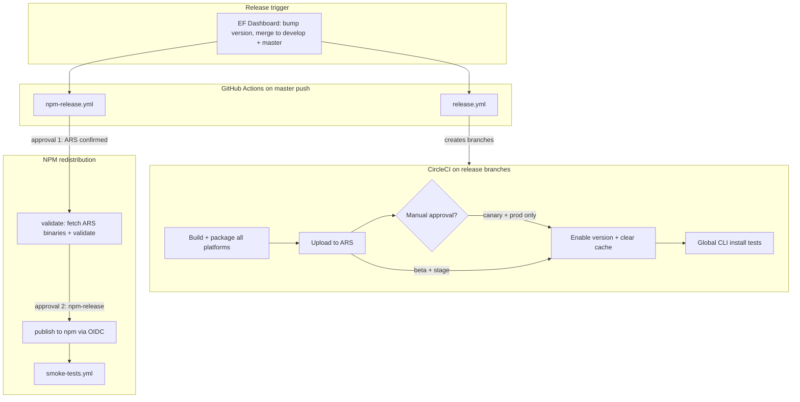

Tracing release documentation and CI workflows to map the beta/canary/stage → production → npm path.
The release path splits into **two independent pipelines**: CircleCI builds and publishes **primary binaries to ARS** (App Release Server at `dl-cli.pstmn.io`), and GitHub Actions **repackages those ARS binaries for npm**. ARS and npm are deliberately decoupled — shipping to ARS does not publish to npm.

---

## High-level architecture



Primary docs: [`docs/release-workflow.md`](docs/release-workflow.md), [`docs/NPM_RELEASE_PROCESS.md`](docs/NPM_RELEASE_PROCESS.md), [`docs/CI_PIPELINE.md`](docs/CI_PIPELINE.md).

---

## Channel model: branch → ARS channel

CircleCI’s `set-channel` command maps git branches to distribution channels:

| Branch pattern | ARS channel | Build name | Manual approval before enable? |
|---|---|---|---|
| `develop`, `channel/beta`, `feature/*` | `beta` | `{semver}-beta-{timestamp}` | No |
| `channel/canary` | `canary` | `{semver}-canary-{timestamp}` | **Yes** |
| `release/desktop-cli/stage/v*` | `stage` | version from `package.json` (e.g. `1.2.3-stage01`) | No |
| `release/desktop-cli/production/v*` | `prod` | semver (e.g. `1.2.3`) | **Yes** |

```19:62:.circleci/config.yml
              release_beta='develop'
              release_channel_beta='channel/beta'
              release_channel_canary='channel/canary'
              release_feature='^feature.*'
              release_stage='^release/desktop-cli/stage/'
              release_prod='^release/desktop-cli/production/'
              ...
              if [[ $CIRCLE_BRANCH =~ $release_stage ]];
              then
                ...
                CHANNEL="stage"
              fi
              if [[ $CIRCLE_BRANCH =~ $release_prod ]];
              then
                ...
                CHANNEL="prod"
              fi
```

Beta/canary builds also get timestamped build names:

```133:141:.circleci/config.yml
            if [[ $CHANNEL == 'beta' || $CHANNEL == 'canary' ]];
            then
              PACKAGE_VERSION="$(node -e "console.log(require('./package.json').version.match(/^\\d+\\.\\d+\\.\\d+/)[0]);")"
              CURRENT_TIMESTAMP=$(date "+%Y%m%d%H%M%S")
              echo export BUILD_NAME=$PACKAGE_VERSION-$CHANNEL-$CURRENT_TIMESTAMP >> ./dist/new-env-vars
            else
              PACKAGE_VERSION="$(node -e "console.log(require('./package.json').version);")"
              echo export BUILD_NAME=$PACKAGE_VERSION >> ./dist/new-env-vars
            fi
```

---

## CircleCI pipeline (ARS path)

The `build_and_upload_manual` workflow runs on all release branches. After tests and platform packaging:

1. **`upload-to-ARS`** — `pnpm run upload-cli-artifacts -c $CHANNEL -p all -b $BUILD_NAME`
2. **`hold`** (approval) — only for `channel/canary` and `release/desktop-cli/production/*`
3. **`enable-version-and-clear-cache`** — enables the build on the channel and clears download cache
4. **`test-global-cli-*`** — curl-based install tests on stage/production branches only

```618:663:.circleci/config.yml
      - upload-to-ARS:
          ...
          name: 'Upload To ARS'
      - hold:
          filters:
            branches:
              only:
                - channel/canary
                - /release\/desktop-cli\/production\/.*/
          type: approval
          requires:
            - 'Upload To ARS'
          name: 'Approval for enabling in production'
      - enable-version-and-clear-cache:
          filters:
            branches:
              only:
                - channel/canary
                - /release\/desktop-cli\/production\/.*/
          name: 'Enable Version and Clear Cache (Production)'
          requires:
            - 'Approval for enabling in production'
      - enable-version-and-clear-cache:
          filters:
            branches:
              only:
                - develop
                - channel/beta
                - /release\/desktop-cli\/stage\/.*/
          name: 'Enable Version and Clear Cache (Non-Production)'
          requires:
            - 'Upload To ARS'
```

**Beta/canary (internal):** Push to `develop`, `channel/beta`, or `channel/canary`. Binaries land on ARS; beta requires VPN for curl install. No npm publish unless you explicitly trigger the npm workflow (see below).

**Stage (pre-prod):** Created automatically by GitHub Actions when `master` is pushed after an EF release.

**Production:** Same automatic branch creation, but CircleCI waits for a human approval before enabling the version on the prod channel.

---

## Production release flow (EF → stage → prod → npm)

Documented step-by-step in [`docs/release-workflow.md`](docs/release-workflow.md):

### 1. EF Dashboard kickoff
Create a release in EF; it bumps the version and merges to `develop` and `master`.

### 2. Master push triggers two GitHub Actions workflows in parallel

**`release.yml`** — creates CircleCI release branches:

```63:77:.github/workflows/release.yml
      - name: Create stage branch
        run: |
          BRANCH="release/desktop-cli/stage/v${{ needs.get-version.outputs.version }}-stage01"
          git checkout -b "$BRANCH"
          pnpm version "${{ needs.get-version.outputs.version }}-stage01" --no-git-tag-version
          ...
          git push origin "$BRANCH"

      - name: Create production branch
        run: |
          git checkout master
          BRANCH="release/desktop-cli/production/v${{ needs.get-version.outputs.version }}"
          git checkout -b "$BRANCH"
          git push origin "$BRANCH"
```

**`npm-release.yml`** — starts but blocks on approvals (does not publish yet).

### 3. Stage on CircleCI (automatic)
The stage branch triggers CircleCI → package → upload to ARS → auto-enable on stage channel → global CLI tests. Humans run sanity testing on stage.

### 4. Production on CircleCI (manual approval)
The production branch pipeline runs packaging and ARS upload, then pauses at **“Approval for enabling in production”**. After approval, the version is enabled on prod and global CLI tests run.

### 5. NPM publication (separate, two approvals)

`npm-release.yml` has four jobs:

| Step | Job | Gate |
|---|---|---|
| 1 | `wait-for-ars` | GitHub environment `generic-approval` — human confirms ARS prod release is done |
| 2 | `validate` | Runs `npm run release` in `re-distribution/npm` |
| 3 | `publish` | GitHub environment `npm-release` — human approves actual publish |
| 4 | `smoke-tests` | Calls `smoke-tests.yml` (curl + `pnpm add -g postman-cli` on 3 OSes) |

Branch → npm tag mapping (master → `latest`):

```65:79:.github/workflows/npm-release.yml
          BRANCH_NAME=${GITHUB_REF#refs/heads/}
          if [[ $BRANCH_NAME == "master" ]]; then
            TAG="latest"
          elif [[ $BRANCH_NAME == release/npm/beta/* ]]; then
            TAG="beta"
          elif [[ $BRANCH_NAME == release/npm/canary/* ]]; then
            TAG="canary"
          ...
```

---

## NPM redistribution mechanics

The npm path does **not** rebuild binaries. It **downloads already-published ARS artifacts** and wraps them in scoped platform packages.

### `release.js` — prepare packages
1. Sync all package versions from root `package.json` (`updatePackageVersion`)
2. Fetch platform binaries from ARS (`fetchBinaries.js`)
3. Validate structure (`validate-release.js`)

```83:114:re-distribution/npm/scripts/release.js
async function release () {
    ...
        updatePackageVersion();
        ...
            await fetchBinaries();
        ...
        validateRelease();
        ...
        console.log('\nNext step: Run npm run npm-publish -- --tag=<beta|canary|preview|latest>');
```

### `fetchBinaries.js` — pull from ARS
Downloads from `https://dl-cli.pstmn.io/download/version/{version}/{platform-slug}` for all five platforms, extracts into `re-distribution/npm/packages/*/bin/`.

```24:25:re-distribution/npm/scripts/fetchBinaries.js
const platforms = PLATFORMS,
    baseUrl = `https://dl-cli.pstmn.io/download/version/${version}`;
```

This is why npm publish must wait until prod ARS binaries exist — validation will 404 otherwise.

### `publish.js` — publish to registry
Publishes 5 platform packages sequentially (with 60s waits), then the main `postman-cli` package last. Uses OIDC auth, skips already-published versions (idempotent re-runs).

Package layout (from [`docs/NPM_RELEASE_PROCESS.md`](docs/NPM_RELEASE_PROCESS.md)):
- `postman-cli` — loader only, `optionalDependencies` on scoped bin packages
- `@postman/pm-bin-{platform}` — one native binary each

---

## Beta/canary npm (manual, public)

ARS beta/canary and npm beta/canary are **separate**:

> Releasing to ARS does NOT automatically publish to npm.

For npm pre-releases, create a branch manually:

```bash
git checkout master && git pull
git checkout -b release/npm/beta/vX.Y.Z
git push -u origin release/npm/beta/vX.Y.Z
```

Same for `release/npm/canary/v*`, `release/npm/preview/v*`, and `release/npm/latest/v*`. Then approve `npm-release.yml`. Docs warn that npm beta/canary is **public worldwide**, unlike VPN-gated ARS beta.

---

## Key files reference

| Purpose | File |
|---|---|
| Human runbook | `docs/release-workflow.md` |
| ARS vs npm separation | `docs/NPM_RELEASE_PROCESS.md` |
| CI channel/signing overview | `docs/CI_PIPELINE.md` |
| Auto-create stage/prod branches | `.github/workflows/release.yml` |
| NPM validate/publish/smoke | `.github/workflows/npm-release.yml` |
| Post-publish verification | `.github/workflows/smoke-tests.yml` |
| Channel detection + ARS upload + approvals | `.circleci/config.yml` |
| ARS upload / enable / cache scripts | `npm/upload-cli-artifacts.js`, `npm/enable-cli-version.js`, `npm/clearCLIDownloadCache.js` |
| NPM prep | `re-distribution/npm/scripts/release.js`, `fetchBinaries.js`, `validate-release.js` |
| NPM publish | `re-distribution/npm/scripts/publish.js` |

---

## Summary timeline for a production release

1. **EF Dashboard** → version bump → merge to `master`
2. **`release.yml`** → pushes `release/desktop-cli/stage/vX.Y.Z-stage01` and `release/desktop-cli/production/vX.Y.Z`
3. **CircleCI stage branch** → build → ARS → auto-enable → sanity test (human)
4. **CircleCI prod branch** → build → ARS → **approve** → enable → global CLI tests
5. **`npm-release.yml`** (started on master push) → **approve ARS confirmation** → validate/fetch binaries → **approve npm publish** → smoke tests
6. **Finalize** — Slack `#production`, release notes on website

Beta and canary are continuous/internal paths via branch pushes to `develop` / `channel/beta` / `channel/canary`; they never auto-flow into production or npm unless you explicitly run the production EF release or create an npm release branch.
