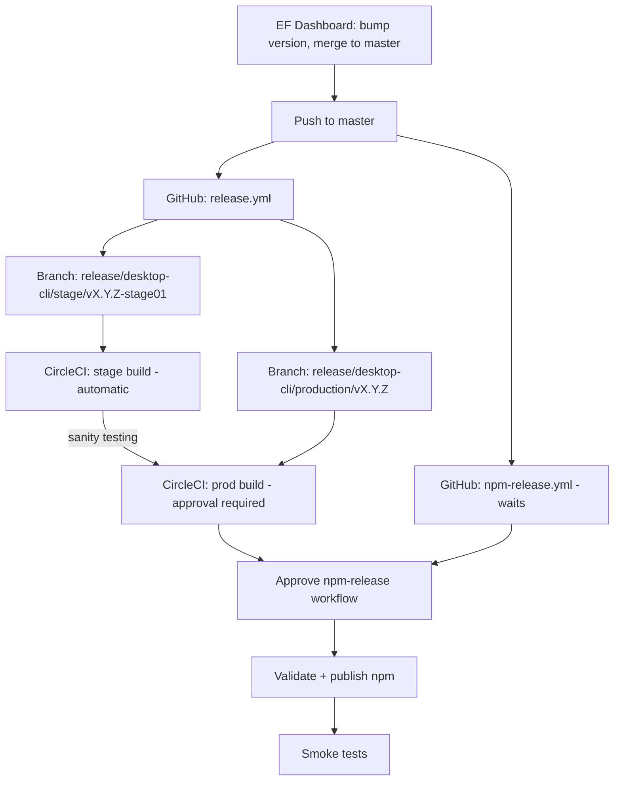

Tracing release documentation and CI workflows to map the beta/canary/stage → production → npm path.
The repo treats **binary distribution (ARS via CircleCI)** and **npm publication (GitHub Actions)** as two separate tracks. Beta, canary, and stage are ARS channels; production is both an ARS channel and the path that feeds npm `latest`. Here is how they connect.

---

## Two parallel distribution systems

| System | Trigger | Output | Docs |
|--------|---------|--------|------|
| **ARS (App Release Server)** | CircleCI on branch push | Signed binaries at `dl-cli.pstmn.io` (curl install) | [`docs/CI_PIPELINE.md`](docs/CI_PIPELINE.md) |
| **NPM re-distribution** | GitHub Actions | `postman-cli` + `@postman/pm-bin-*` on npm | [`docs/NPM_RELEASE_PROCESS.md`](docs/NPM_RELEASE_PROCESS.md) |

The docs are explicit: **ARS release does not publish to npm**. You must run the npm workflow separately.

```16:31:docs/NPM_RELEASE_PROCESS.md
> **Important:** ARS releases and NPM releases are **separate processes**. Releasing to ARS does NOT automatically publish to NPM.
...
When you do a beta or canary release via ARS (by pushing to `channel/beta` or `channel/canary`), the binaries are:
- ✅ Available via curl install (VPN required for beta)
- ❌ **NOT** automatically available on npm

To publish to npm, you must **explicitly trigger the npm release workflow**.
```

---

## ARS channel model (CircleCI)

CircleCI maps **git branches → release channels** in `.circleci/config.yml` (`set-channel` command):

| Branch pattern | Channel | Enablement |
|----------------|---------|------------|
| `develop`, `channel/beta`, `feature/*` | `beta` | Automatic after upload |
| `channel/canary` | `canary` | **Manual approval** before enable |
| `release/desktop-cli/stage/*` | `stage` | Automatic after upload |
| `release/desktop-cli/production/*` | `prod` | **Manual approval** before enable |

```18:65:.circleci/config.yml
              release_beta='develop'
              release_channel_beta='channel/beta'
              release_channel_canary='channel/canary'
              ...
              release_stage='^release/desktop-cli/stage/'
              release_prod='^release/desktop-cli/production/'
              if [[ $CIRCLE_BRANCH =~ $release_beta ]];
              ...
                CHANNEL="beta"
              ...
              if [[ $CIRCLE_BRANCH =~ $release_channel_canary ]];
              ...
                CHANNEL="canary"
              ...
              if [[ $CIRCLE_BRANCH =~ $release_stage ]];
              ...
                CHANNEL="stage"
              ...
              if [[ $CIRCLE_BRANCH =~ $release_prod ]];
              ...
                CHANNEL="prod"
```

### Build naming differs by channel

From [`docs/CI_PIPELINE.md`](docs/CI_PIPELINE.md) and `.circleci/config.yml`:

- **Beta / canary:** `{semver}-beta-{timestamp}` or `{semver}-canary-{timestamp}`
- **Stage / prod:** exact version from `package.json` (stage uses suffix like `1.2.3-stage01`)

```133:141:.circleci/config.yml
            if [[ $CHANNEL == 'beta' || $CHANNEL == 'canary' ]];
            then
              PACKAGE_VERSION="$(node -e "console.log(require('./package.json').version.match(/^\\d+\\.\\d+\\.\\d+/)[0]);")"
              CURRENT_TIMESTAMP=$(date "+%Y%m%d%H%M%S")
              echo export BUILD_NAME=$PACKAGE_VERSION-$CHANNEL-$CURRENT_TIMESTAMP >> ./dist/new-env-vars
            else
              PACKAGE_VERSION="$(node -e "console.log(require('./package.json').version);")"
              echo export BUILD_NAME=$PACKAGE_VERSION >> ./dist/new-env-vars
            fi
```

### CircleCI pipeline stages (all release branches)

For branches listed in the workflow filters (`develop`, `channel/beta`, `channel/canary`, stage, production):

1. **Test + package** (Windows, macOS x64/ARM, Linux x64/ARM) — signing enabled for stage, prod, and canary
2. **Upload to ARS** — `pnpm run upload-cli-artifacts -c $CHANNEL -p all -b $BUILD_NAME`
3. **Enable version + clear cache** — `enable-cli-version` then `clearCLIDownloadCache`
4. **Global CLI install tests** — only on stage and production branches

Approval gates in the workflow:

```635:663:.circleci/config.yml
      - hold:
          filters:
            branches:
              only:
                - channel/canary
                - /release\/desktop-cli\/production\/.*/
          type: approval
          ...
          name: 'Approval for enabling in production'
      - enable-version-and-clear-cache:
          filters:
            branches:
              only:
                - channel/canary
                - /release\/desktop-cli\/production\/.*/
          ...
      - enable-version-and-clear-cache:
          filters:
            branches:
              only:
                - develop
                - channel/beta
                - /release\/desktop-cli\/stage\/.*/
          name: 'Enable Version and Clear Cache (Non-Production)'
```

So **beta and stage auto-enable** after upload; **canary and production require a human approval** in CircleCI before binaries go live on ARS.

---

## Beta and canary (ongoing pre-release channels)

These are **not** part of the formal EF → master release train. They are independent branch pushes:

- **Beta:** merge to `develop`, push `channel/beta`, or work on `feature/*` → builds land on beta ARS (`dl-cli.pstmn-beta.io` per [`docs/installers.md`](docs/installers.md))
- **Canary:** push to `channel/canary` → builds land on the **production CDN** (`dl-cli.pstmn.io/install/canary_*`) after CircleCI approval

Installer scripts for each environment are published separately via [`.github/workflows/publish-installers.yml`](.github/workflows/publish-installers.yml) (manual workflow_dispatch to S3).

**NPM beta/canary is manual and separate:** create `release/npm/beta/vX.Y.Z` or `release/npm/canary/vX.Y.Z` — it does **not** follow automatically from ARS beta/canary.

---

## Formal production release: stage → production → npm

This is documented end-to-end in [`docs/release-workflow.md`](docs/release-workflow.md).



### Step 1 — EF Dashboard bumps version to `master`

Human steps in EF create the release, bump semver, and merge to `develop` and `master` ([`docs/release-workflow.md`](docs/release-workflow.md) steps 1–3).

### Step 2 — `master` push creates release branches (GitHub Actions)

[`.github/workflows/release.yml`](.github/workflows/release.yml) runs on every `master` push:

1. Reads version from root `package.json`
2. Creates **`release/desktop-cli/stage/v{version}-stage01`** — bumps `package.json` to `{version}-stage01` and pushes
3. Creates **`release/desktop-cli/production/v{version}`** — same version as master, pushes without extra bump

```63:77:.github/workflows/release.yml
      - name: Create stage branch
        run: |
          BRANCH="release/desktop-cli/stage/v${{ needs.get-version.outputs.version }}-stage01"
          ...
          pnpm version "${{ needs.get-version.outputs.version }}-stage01" --no-git-tag-version
          ...
      - name: Create production branch
        run: |
          ...
          BRANCH="release/desktop-cli/production/v${{ needs.get-version.outputs.version }}"
          git checkout -b "$BRANCH"
          git push origin "$BRANCH"
```

### Step 3 — Stage CircleCI (automatic)

The stage branch push triggers CircleCI with `CHANNEL=stage`. Pipeline runs tests, packages all platforms, uploads to ARS, **auto-enables** the version, and runs global install tests. Humans perform sanity testing on the stage environment (~12 minutes per the workflow summary).

### Step 4 — Production CircleCI (manual approval)

The production branch pipeline runs in parallel but **waits at an approval step** (`Approval for enabling in production`) before `enable-cli-version` makes binaries available at `dl-cli.pstmn.io` for the stable channel.

Prerequisites documented before approval: security review, release notes, TW review ([`docs/release-workflow.md`](docs/release-workflow.md) steps 5–6).

### Step 5 — NPM publication (separate GitHub workflow, two approvals)

[`.github/workflows/npm-release.yml`](.github/workflows/npm-release.yml) also triggers on `master` push (in parallel with `release.yml`), but does not publish immediately:

| Job | Environment gate | Purpose |
|-----|------------------|---------|
| `wait-for-ars` | `generic-approval` | Human confirms ARS prod release finished |
| `validate` | (after step 1) | Fetch binaries, validate packages |
| `publish` | `npm-release` | OIDC publish to npm |
| `smoke-tests` | — | Calls [`.github/workflows/smoke-tests.yml`](.github/workflows/smoke-tests.yml) (curl + `pnpm add -g postman-cli`) |

Branch → npm tag mapping:

```65:79:.github/workflows/npm-release.yml
          if [[ $BRANCH_NAME == "master" ]]; then
            TAG="latest"
          elif [[ $BRANCH_NAME == release/npm/beta/* ]]; then
            TAG="beta"
          elif [[ $BRANCH_NAME == release/npm/canary/* ]]; then
            TAG="canary"
          ...
```

For production, **`master` → `latest` tag**. Approval should happen **after** CircleCI production completes so binaries exist at ARS.

---

## How npm packages are built from ARS

The npm scripts under `re-distribution/npm/` repackage ARS binaries:

1. **`release.js`** — syncs versions from root `package.json` into all packages, fetches binaries, validates
2. **`fetchBinaries.js`** — downloads from `https://dl-cli.pstmn.io/download/version/{version}/{platform}`
3. **`validate-release.js`** — checks version consistency, binary size, permissions
4. **`publish.js`** — publishes 5 platform packages sequentially, then `postman-cli` main package via OIDC

```83:110:re-distribution/npm/scripts/release.js
async function release () {
    ...
        updatePackageVersion();
        ...
            await fetchBinaries();
        ...
        validateRelease();
```

```24:25:re-distribution/npm/scripts/fetchBinaries.js
const platforms = PLATFORMS,
    baseUrl = `https://dl-cli.pstmn.io/download/version/${version}`;
```

```162:196:re-distribution/npm/scripts/publish.js
async function publishPlatformPackages () {
    ...
    for (const pkg of PLATFORM_PACKAGES) {
        publishPackage(pkg);
        await waitForPropagation();
    }
}
...
        publishMainPackage();
```

That is why npm publish **must** wait for production ARS: `fetchBinaries.js` pulls from the production download URL for the semver in `package.json`.

---

## Summary: what moves where

| Stage | Mechanism | Goes live on | NPM? |
|-------|-----------|--------------|------|
| **Beta** | Push `develop` / `channel/beta` / `feature/*` | `dl-cli.pstmn-beta.io` (VPN) | Only if you push `release/npm/beta/v*` |
| **Canary** | Push `channel/canary` + CircleCI approval | `dl-cli.pstmn.io/canary_*` | Only if you push `release/npm/canary/v*` |
| **Stage** | Auto branch from `release.yml` on `master` | Stage ARS channel | No |
| **Production** | Auto branch from `release.yml` + CircleCI approval | `dl-cli.pstmn.io` stable | Yes — approve `npm-release.yml` on `master` → `@latest` |
| **Post-release verification** | `smoke-tests.yml` | curl install + `pnpm add -g postman-cli` on ubuntu/macos/windows | Confirms both paths |

The **formal release train** is: **EF → master → (stage branch → stage ARS → test) → (production branch → prod ARS approval) → (npm-release approval × 2 → npm `latest`)**. Beta and canary are **parallel internal/experimental ARS channels** with optional, manually triggered npm counterparts — they do not automatically advance into the stage/production/npm pipeline.
