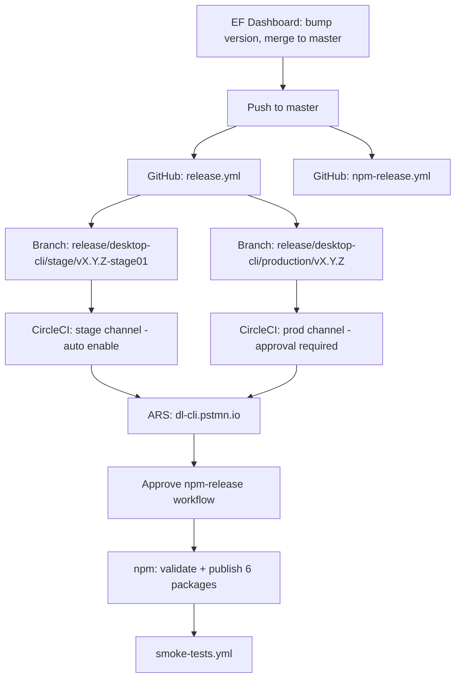

Tracing release documentation and CI workflows to map the beta/canary/stage → production → npm path.
The release path splits into two **independent** tracks: **ARS** (primary binary distribution via CircleCI and `dl-cli.pstmn.io`) and **npm** (re-packaging those ARS binaries for public install). ARS promotion does **not** auto-publish npm — that is a separate GitHub Actions workflow with its own approvals.

---

## High-level picture

Production releases start in the **EF Dashboard**, which bumps version and merges to `master`. That single push kicks off **two parallel GitHub Actions workflows**:

1. **`release.yml`** — creates stage + production release branches (automatic)
2. **`npm-release.yml`** — waits for human approval, then validates/publishes npm (manual gates)

CircleCI builds and uploads binaries to **ARS** when those release branches (or beta/canary branches) are pushed. npm publication only happens after someone confirms ARS is ready and approves the npm workflow.



Source: [`docs/release-workflow.md`](docs/release-workflow.md)

---

## Phase 1: Kickoff (EF → master)

Per [`docs/release-workflow.md`](docs/release-workflow.md):

1. Create release in EF Dashboard (`ef.postmanlabs.com`)
2. EF bumps `package.json` version and merges to `develop` and **`master`**
3. Push to `master` triggers both workflows in parallel

---

## Phase 2: GitHub branch creation (`release.yml`)

[`.github/workflows/release.yml`](.github/workflows/release.yml) runs on every `master` push:

| Job | What it does |
|-----|--------------|
| `get-version` | Reads version from root `package.json` |
| `create-desktop-branches` | Creates two branches and pushes them |
| `desktop-summary` | Writes next-step instructions to the workflow summary |

Branches created:

- **Stage:** `release/desktop-cli/stage/v{version}-stage01` — also bumps `package.json` to `{version}-stage01`
- **Production:** `release/desktop-cli/production/v{version}` — no version bump, uses master’s version

```63:77:.github/workflows/release.yml
      - name: Create stage branch
        run: |
          BRANCH="release/desktop-cli/stage/v${{ needs.get-version.outputs.version }}-stage01"
          git checkout -b "$BRANCH"
          pnpm version "${{ needs.get-version.outputs.version }}-stage01" --no-git-tag-version
          ...
      - name: Create production branch
        run: |
          git checkout master
          BRANCH="release/desktop-cli/production/v${{ needs.get-version.outputs.version }}"
          git checkout -b "$BRANCH"
          git push origin "$BRANCH"
```

Pushing those branches triggers CircleCI (see below).

---

## Phase 3: CircleCI — channel detection and ARS distribution

Implementation: [`.circleci/config.yml`](.circleci/config.yml), documented in [`docs/CI_PIPELINE.md`](docs/CI_PIPELINE.md).

### Channel mapping from branch name

The `set-channel` command maps branches to ARS channels:

| Branch pattern | ARS channel | Windows signing |
|----------------|-------------|-----------------|
| `develop`, `channel/beta`, `feature/*` | **beta** | off |
| `channel/canary` | **canary** | on |
| `release/desktop-cli/stage/*` | **stage** | on |
| `release/desktop-cli/production/*` | **prod** | on |

```19:63:.circleci/config.yml
              release_beta='develop'
              release_channel_beta='channel/beta'
              release_channel_canary='channel/canary'
              ...
              if [[ $CIRCLE_BRANCH =~ $release_stage ]];
              then
                CHANNEL="stage"
              fi
              if [[ $CIRCLE_BRANCH =~ $release_prod ]];
              then
                CHANNEL="prod"
              fi
```

### Build naming

- **beta / canary:** `{semver}-beta-{timestamp}` or `{semver}-canary-{timestamp}`
- **stage / prod:** exact `package.json` version (stage branch already has `-stage01` suffix)

### Pipeline steps (`build_and_upload_manual` workflow)

1. **Test + Snyk**
2. **Package** all 5 platforms (Windows, macOS x64/ARM, Linux x64/ARM)
3. **`upload-to-ARS`** — `pnpm run upload-cli-artifacts -c $CHANNEL -p all -b $BUILD_NAME`
4. **Enable version + clear cache** — two paths:
   - **Non-production (auto):** `develop`, `channel/beta`, stage branches → enable immediately after upload
   - **Production (manual approval):** `channel/canary` and production branches → blocked on approval hold

```635:663:.circleci/config.yml
      - hold:
          filters:
            branches:
              only:
                - channel/canary
                - /release\/desktop-cli\/production\/.*/
          type: approval
          requires:
            - 'Upload To ARS'
          name: 'Approval for enabling in production'
      - enable-version-and-clear-cache:
          ...
          name: 'Enable Version and Clear Cache (Production)'
          requires:
            - 'Approval for enabling in production'
      - enable-version-and-clear-cache:
          ...
          name: 'Enable Version and Clear Cache (Non-Production)'
          requires:
            - 'Upload To ARS'
```

5. **Global CLI install tests** — only on stage and production branches, across all platforms via `install-and-test-global-cli.js`

### Promotion path for a formal release

| Step | Channel | Approval? | Human action |
|------|---------|-----------|--------------|
| Stage branch pushed | **stage** | No | Sanity test on stage |
| Prod branch pushed | **prod** | **Yes** — CircleCI hold | Approve in CircleCI after stage passes |
| Beta/canary (adhoc) | **beta** / **canary** | canary only | Push to `channel/beta` or `channel/canary` |

---

## Phase 4: npm publication (separate from ARS)

Documented in [`docs/NPM_RELEASE_PROCESS.md`](docs/NPM_RELEASE_PROCESS.md). Key point:

> **ARS releases and NPM releases are separate processes.** Releasing to ARS does NOT automatically publish to npm.

### Architecture

- Binaries live on ARS (`dl-cli.pstmn.io`)
- npm re-distributes them as 6 packages: `postman-cli` + 5 scoped `@postman/pm-bin-*` platform packages
- `optionalDependencies` pattern — users only download their platform binary

### Workflow: `npm-release.yml`

Triggers on:

- `master` → tag **`latest`** (production)
- `release/npm/beta/v*` → **`beta`**
- `release/npm/canary/v*` → **`canary`**
- `release/npm/preview/v*` → **`preview`**
- `release/npm/latest/v*` → **`latest`**

Four gated jobs:

| Step | Job | Environment gate | Purpose |
|------|-----|------------------|---------|
| 1 | `wait-for-ars` | `generic-approval` | Human confirms ARS release finished |
| 2 | `validate` | (after step 1) | Runs `npm run release` in `re-distribution/npm` |
| 3 | `publish` | `npm-release` | Runs `npm run npm-publish -- --tag=<tag>` via OIDC |
| 4 | `smoke-tests` | — | curl + `pnpm add -g postman-cli` on ubuntu/macos/windows |

### What `npm run release` does

[`re-distribution/npm/scripts/release.js`](re-distribution/npm/scripts/release.js):

1. **`updatePackageVersion()`** — sync all 6 package versions from root `package.json`
2. **`fetchBinaries()`** — download from `https://dl-cli.pstmn.io/download/version/{version}` ([`fetchBinaries.js`](re-distribution/npm/scripts/fetchBinaries.js))
3. **`validateRelease()`** — check versions, binaries, permissions ([`validate-release.js`](re-distribution/npm/scripts/validate-release.js))

### What `npm run npm-publish` does

[`re-distribution/npm/scripts/publish.js`](re-distribution/npm/scripts/publish.js):

1. Publish all 5 platform packages sequentially (60s wait between each)
2. Wait for registry propagation
3. Publish main `postman-cli` package last

Uses OIDC auth (no manual npm token in CI).

### Production vs beta/canary npm

| | Production | Beta/Canary/Preview |
|--|-----------|---------------------|
| Trigger | Automatic on `master` push (with approvals) | **Manual** — create `release/npm/beta/vX.Y.Z` branch and push |
| npm tag | `latest` | `beta`, `canary`, or `preview` |
| Visibility | Public worldwide | Public worldwide (docs warn: think twice before npm beta/canary) |

Manual beta/canary npm branch creation (from docs):

```bash
git checkout master && git pull
git checkout -b release/npm/beta/vX.Y.Z
git push -u origin release/npm/beta/vX.Y.Z
# Then approve npm-release.yml in GitHub Actions
```

---

## End-to-end production release sequence

From [`docs/release-workflow.md`](docs/release-workflow.md), the human-operated order is:

1. **EF Dashboard** → version bump → merge to `master`
2. **`release.yml`** auto-creates stage + prod branches
3. **CircleCI on stage branch** → builds, uploads ARS, auto-enables stage → **sanity test**
4. Security review + release notes (if applicable)
5. **CircleCI on prod branch** → builds, uploads ARS → **approve hold** → enable prod channel
6. **Approve `npm-release.yml`** (started in parallel with step 2, but should wait until prod ARS is done):
   - Approve `wait-for-ars` (confirm binaries at `dl-cli.pstmn.io`)
   - Approve `publish` (actual npm publish)
7. **`smoke-tests.yml`** runs automatically after npm publish
8. Post to `#production` Slack, update website release notes

---

## Beta and canary outside the formal release train

These are **adhoc internal channels**, not part of the EF → master → stage → prod path:

| Channel | How to trigger | ARS approval | npm |
|---------|---------------|--------------|-----|
| **beta** | Push to `develop`, `channel/beta`, or `feature/*` | Auto-enable | Manual branch `release/npm/beta/v*` only |
| **canary** | Push to `channel/canary` | **Approval required** (same hold as prod) | Manual branch `release/npm/canary/v*` only |
| **stage** | Created automatically by `release.yml` | Auto-enable | Not a standard npm tag |
| **prod** | Created automatically by `release.yml` | **Approval required** | Auto via `master` + npm workflow approval |

Beta builds get timestamped version strings; stage/prod use clean semver (stage adds `-stage01` suffix on the stage branch).

---

## Installer scripts (related but separate)

[`.github/workflows/publish-installers.yml`](.github/workflows/publish-installers.yml) is a **manual** `workflow_dispatch` that publishes curl install scripts to S3 for beta/staging/production environments. That is distinct from binary packaging and npm — it updates the install shell/PowerShell scripts at `dl-cli.pstmn.io/install/*`.

---

## Key files referenced

| File | Role |
|------|------|
| [`docs/release-workflow.md`](docs/release-workflow.md) | Operator runbook; end-to-end flow diagram |
| [`docs/NPM_RELEASE_PROCESS.md`](docs/NPM_RELEASE_PROCESS.md) | ARS vs npm separation, package architecture, tags |
| [`docs/CI_PIPELINE.md`](docs/CI_PIPELINE.md) | CircleCI channel mapping, packaging, signing |
| [`.github/workflows/release.yml`](.github/workflows/release.yml) | Auto-creates stage + prod branches on `master` |
| [`.github/workflows/npm-release.yml`](.github/workflows/npm-release.yml) | npm validate/publish with approval gates |
| [`.github/workflows/smoke-tests.yml`](.github/workflows/smoke-tests.yml) | Post-publish curl + npm install verification |
| [`.circleci/config.yml`](.circleci/config.yml) | Channel detection, ARS upload, prod/canary approval hold |
| [`re-distribution/npm/scripts/release.js`](re-distribution/npm/scripts/release.js) | Fetch ARS binaries, sync versions, validate |
| [`re-distribution/npm/scripts/publish.js`](re-distribution/npm/scripts/publish.js) | Sequential npm publish with OIDC |
| [`re-distribution/npm/scripts/fetchBinaries.js`](re-distribution/npm/scripts/fetchBinaries.js) | Downloads from `dl-cli.pstmn.io/download/version/{version}` |
| [`npm/scripts/install-and-test-global-cli.js`](npm/scripts/install-and-test-global-cli.js) | CircleCI global install smoke tests per platform/channel |
