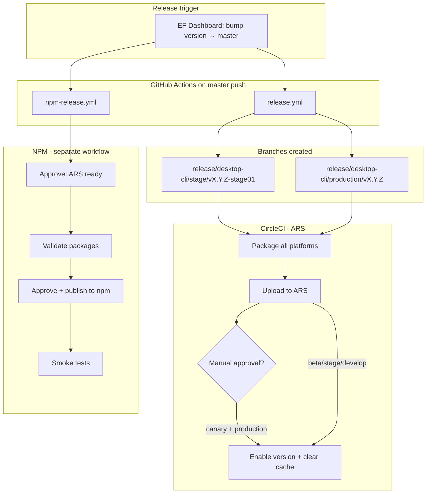

I'll trace the release path through docs and CI workflows, starting with release/npm documentation and GitHub Actions.
The release path splits into two **independent** distribution systems: **ARS** (primary binaries via CircleCI) and **npm** (re-packaged binaries via GitHub Actions). ARS releases do not automatically publish to npm.

---

## High-level picture



The canonical human runbook is [`docs/release-workflow.md`](docs/release-workflow.md). Technical npm details are in [`docs/NPM_RELEASE_PROCESS.md`](docs/NPM_RELEASE_PROCESS.md). CI channel mapping is in [`docs/CI_PIPELINE.md`](docs/CI_PIPELINE.md).

---

## 1. Channel detection: how beta / canary / stage / prod are chosen

CircleCI maps **branch name → channel** in the `set-channel` command (`.circleci/config.yml`):

| Branch pattern | Channel | Notes |
|---|---|---|
| `develop` | `beta` | Dev builds |
| `channel/beta` | `beta` | Explicit beta channel |
| `channel/canary` | `canary` | Windows signing enabled |
| `feature/*` | `beta` | Feature branches |
| `release/desktop-cli/stage/*` | `stage` | Pre-prod validation |
| `release/desktop-cli/production/*` | `prod` | Production |

```19:62:.circleci/config.yml
              release_beta='develop'
              release_channel_beta='channel/beta'
              release_channel_canary='channel/canary'
              // ...
              release_stage='^release/desktop-cli/stage/'
              release_prod='^release/desktop-cli/production/'
              // ... sets CHANNEL=beta|canary|stage|prod
```

Build naming differs by channel:

- **beta / canary**: `{semver}-beta-{timestamp}` or `{semver}-canary-{timestamp}`
- **stage / prod**: exact version from `package.json` (stage gets `-stage01` suffix on the branch)

```133:141:.circleci/config.yml
            if [[ $CHANNEL == 'beta' || $CHANNEL == 'canary' ]];
            then
              // BUILD_NAME=$PACKAGE_VERSION-$CHANNEL-$CURRENT_TIMESTAMP
            else
              // BUILD_NAME=$PACKAGE_VERSION
            fi
```

---

## 2. Beta and canary (internal ARS only)

Pushing to `develop`, `channel/beta`, or `channel/canary` triggers the CircleCI workflow `build_and_upload_manual`:

1. **Create build name** (`create-build-name`)
2. **Snyk + tests**
3. **Package** all 5 platforms (Windows, macOS x64/ARM, Linux x64/ARM)
4. **Upload to ARS** via `pnpm run upload-cli-artifacts`
5. **Enable version** + clear download cache

For **canary** (and production), there is a **manual approval gate** before enablement:

```635:663:.circleci/config.yml
      - hold:
          filters:
            branches:
              only:
                - channel/canary
                - /release\/desktop-cli\/production\/.*/
          type: approval
          name: 'Approval for enabling in production'
      - enable-version-and-clear-cache:
          // canary + production: requires approval
      - enable-version-and-clear-cache:
          // develop, beta, stage: auto after upload
```

**Important:** These ARS beta/canary builds are **not** published to npm automatically. From [`docs/NPM_RELEASE_PROCESS.md`](docs/NPM_RELEASE_PROCESS.md):

> Releasing to ARS does NOT automatically publish to NPM.

ARS beta requires VPN; npm beta/canary would be **public worldwide**.

---

## 3. Production release: EF Dashboard → stage → prod

### Step A: Version bump and master push (external to this repo)

Per [`docs/release-workflow.md`](docs/release-workflow.md):

1. Create release in **EF Dashboard** (bumps version, merges to `develop` and `master`)
2. Push to `master` triggers **two parallel GitHub Actions workflows**

### Step B: `release.yml` creates release branches

[`.github/workflows/release.yml`](.github/workflows/release.yml) runs on every `master` push:

1. Reads version from root `package.json`
2. Creates **`release/desktop-cli/stage/v{X.Y.Z}-stage01`**, bumps `package.json` to `{version}-stage01`, commits, pushes
3. Creates **`release/desktop-cli/production/v{X.Y.Z}`** from `master` (no version suffix)

```63:77:.github/workflows/release.yml
      - name: Create stage branch
        run: |
          BRANCH="release/desktop-cli/stage/v${{ needs.get-version.outputs.version }}-stage01"
          // pnpm version ...-stage01
          git push origin "$BRANCH"

      - name: Create production branch
        run: |
          BRANCH="release/desktop-cli/production/v${{ needs.get-version.outputs.version }}"
          git push origin "$BRANCH"
```

### Step C: CircleCI on stage branch (automatic)

Pushing the stage branch triggers the same CircleCI pipeline with `CHANNEL=stage`:

- Package → upload ARS → **auto-enable** on stage channel (no approval)
- Global CLI install tests run on stage/production branches only

Human step: **sanity test on stage** (documented in release-workflow.md step 4).

### Step D: CircleCI on production branch (manual approval)

Production branch pipeline is the same, but:

- Windows signing enabled
- **Manual approval** required at `'Approval for enabling in production'` before `enable-cli-version` runs on the `prod` channel

Enablement calls:

```377:383:.circleci/config.yml
            pnpm run enable-cli-version --channel=$CHANNEL --version-name=$BUILD_NAME
            pnpm run clearCLIDownloadCache -c $CHANNEL
```

After approval, binaries are live at `dl-cli.pstmn.io` for curl install.

---

## 4. npm publication (separate workflow, also triggered by master)

[`docs/NPM_RELEASE_PROCESS.md`](docs/NPM_RELEASE_PROCESS.md) describes a **multi-package architecture**:

- `postman-cli` (main, no binaries)
- `@postman/pm-bin-{platform}` (one per OS/arch, via `optionalDependencies`)

Binaries are **not built in the npm workflow** — they are **fetched from ARS** at `https://dl-cli.pstmn.io/download/version/{version}` by [`re-distribution/npm/scripts/fetchBinaries.js`](re-distribution/npm/scripts/fetchBinaries.js).

### Production npm flow (on `master` push)

[`.github/workflows/npm-release.yml`](.github/workflows/npm-release.yml) has **two approval gates**:

| Step | Job | Environment | Purpose |
|---|---|---|
| 1 | `wait-for-ars` | `generic-approval` | Confirm ARS prod release finished |
| 2 | `validate` | (auto) | Prepare + validate packages |
| 3 | `publish` | `npm-release` | Publish to npm registry |
| 4 | `smoke-tests` | (auto) | curl + npm install on 3 OSes |

Branch → npm tag mapping:

```65:79:.github/workflows/npm-release.yml
          if [[ $BRANCH_NAME == "master" ]]; then
            TAG="latest"
          elif [[ $BRANCH_NAME == release/npm/beta/* ]]; then
            TAG="beta"
          elif [[ $BRANCH_NAME == release/npm/canary/* ]]; then
            TAG="canary"
          // ...
```

**Validate + prepare** runs `npm run release` in `re-distribution/npm/`, which orchestrates [`release.js`](re-distribution/npm/scripts/release.js):

1. `updatePackageVersion()` — sync all package versions from root `package.json`
2. `fetchBinaries()` — download from ARS
3. `validateRelease()` — check binaries, sizes, structure ([`validate-release.js`](re-distribution/npm/scripts/validate-release.js))

**Publish** runs `npm run npm-publish -- --tag={tag}` via [`publish.js`](re-distribution/npm/scripts/publish.js):

- Publishes 5 platform packages **sequentially** with ~60s delays
- Publishes `postman-cli` **last** (depends on platform packages)
- Uses **OIDC** auth (no manual token)
- Idempotent: skips already-published versions

**Smoke tests** ([`.github/workflows/smoke-tests.yml`](.github/workflows/smoke-tests.yml)) verify both curl install from `dl-cli.pstmn.io` and `pnpm add -g postman-cli` on Ubuntu, macOS, and Windows.

### Manual npm beta / canary / preview

Unlike production, npm pre-releases are **not automatic**. You explicitly create a branch:

```bash
git checkout -b release/npm/beta/vX.Y.Z
git push -u origin release/npm/beta/vX.Y.Z
```

Then approve the same `npm-release.yml` workflow. Tag mapping: `beta`, `canary`, `preview`, or `latest` (for `release/npm/latest/v*`).

---

## 5. End-to-end production timeline

From [`docs/release-workflow.md`](docs/release-workflow.md), the intended sequence is:

```
EF Dashboard (version bump)
    → master push
        ├─ release.yml → stage branch → CircleCI (auto) → ARS stage
        └─ npm-release.yml → waits (parallel, not yet publishing)

Stage sanity testing (human)

Production branch → CircleCI → upload ARS → APPROVE → enable prod channel

npm-release.yml → APPROVE (ARS confirmed) → validate → APPROVE (npm-release) → publish → smoke tests

Slack #production announcement (human)
```

---

## Key files referenced

| Area | File | Role |
|---|---|---|
| Human runbook | `docs/release-workflow.md` | Full prod release steps |
| npm architecture | `docs/NPM_RELEASE_PROCESS.md` | ARS vs npm separation, tags, manual beta flow |
| CI overview | `docs/CI_PIPELINE.md` | Channel mapping, packaging, signing |
| Branch creation | `.github/workflows/release.yml` | Stage + production branch automation |
| npm CI | `.github/workflows/npm-release.yml` | Validate, publish, smoke tests |
| CircleCI pipeline | `.circleci/config.yml` | Channel detection, ARS upload, approvals |
| npm prep | `re-distribution/npm/scripts/release.js` | Version sync, fetch, validate |
| npm publish | `re-distribution/npm/scripts/publish.js` | Sequential platform → main publish |
| Binary fetch | `re-distribution/npm/scripts/fetchBinaries.js` | Pulls from `dl-cli.pstmn.io` |
| Post-publish verify | `.github/workflows/smoke-tests.yml` | curl + npm install matrix |

---

## Takeaways

1. **Beta/canary (ARS)** = push to `develop` / `channel/beta` / `channel/canary` → CircleCI → ARS. Canary needs approval; beta/stage auto-enable.
2. **Stage → prod (ARS)** = EF bump → `master` → `release.yml` branches → CircleCI stage (auto) → human testing → CircleCI prod (**approval**) → ARS prod channel.
3. **npm is always separate** — even after prod ARS is live, you must approve `npm-release.yml`. Production uses tag `latest` on `master`; beta/canary npm requires explicit `release/npm/{tag}/v*` branches.
4. **npm depends on ARS** — `fetchBinaries.js` downloads prod binaries by semver from `dl-cli.pstmn.io`, so npm publish must happen **after** the ARS production release completes (hence the first approval gate).
