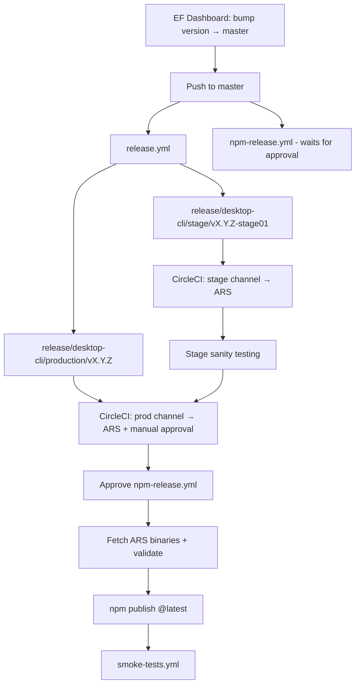

I'll trace the release path through docs and CI workflows—starting with release/npm scripts and any beta/canary/stage → production documentation.
The release path splits into two **independent** pipelines: **ARS (binary distribution via CircleCI)** and **npm (re-distribution via GitHub Actions)**. Docs are explicit that shipping to ARS does not publish to npm.

---

## Big picture



Primary references: [docs/release-workflow.md](docs/release-workflow.md), [docs/NPM_RELEASE_PROCESS.md](docs/NPM_RELEASE_PROCESS.md), [docs/CI_PIPELINE.md](docs/CI_PIPELINE.md).

---

## 1. Production release kickoff (EF → master)

Human process starts in the **EF Dashboard**, which bumps the version and merges to `develop` and `master`. That push to `master` triggers **two GitHub Actions workflows in parallel**:

| Workflow | Role |
|----------|------|
| `.github/workflows/release.yml` | Creates release branches (automatic) |
| `.github/workflows/npm-release.yml` | Starts npm pipeline but **blocks on approvals** |

### `release.yml` branch creation

```63:77:.github/workflows/release.yml
      - name: Create stage branch
        run: |
          BRANCH="release/desktop-cli/stage/v${{ needs.get-version.outputs.version }}-stage01"
          git checkout -b "$BRANCH"
          pnpm version "${{ needs.get-version.outputs.version }}-stage01" --no-git-tag-version
          ...
          git push origin "$BRANCH"

      - name: Create production branch
        run: |
          git checkout master
          BRANCH="release/desktop-cli/production/v${{ needs.get-version.outputs.version }}"
          git checkout -b "$BRANCH"
          git push origin "$BRANCH"
```

- **Stage branch**: `release/desktop-cli/stage/vX.Y.Z-stage01` with version `X.Y.Z-stage01` in `package.json`
- **Production branch**: `release/desktop-cli/production/vX.Y.Z` (version stays `X.Y.Z` from master)

Those branch pushes are what drive CircleCI builds for stage and production.

---

## 2. Beta / canary / stage / production on ARS (CircleCI)

All binary builds run in **CircleCI** (`.circleci/config.yml`). Channel is inferred from the branch name in `set-channel`:

| Branch pattern | Channel | Build name | Enable step |
|----------------|---------|------------|-------------|
| `develop`, `channel/beta`, `feature/*` | `beta` | `{semver}-beta-{timestamp}` | Automatic |
| `channel/canary` | `canary` | `{semver}-canary-{timestamp}` | **Manual approval** |
| `release/desktop-cli/stage/*` | `stage` | version from `package.json` (e.g. `X.Y.Z-stage01`) | Automatic |
| `release/desktop-cli/production/*` | `prod` | semver from `package.json` | **Manual approval** |

Channel detection logic:

```19:62:.circleci/config.yml
              release_beta='develop'
              release_channel_beta='channel/beta'
              release_channel_canary='channel/canary'
              ...
              release_stage='^release/desktop-cli/stage/'
              release_prod='^release/desktop-cli/production/'
              ...
              if [[ $CIRCLE_BRANCH =~ $release_channel_canary ]];
              then
                CHANNEL="canary"
              ...
              if [[ $CIRCLE_BRANCH =~ $release_stage ]];
              then
                CHANNEL="stage"
              ...
              if [[ $CIRCLE_BRANCH =~ $release_prod ]];
              then
                CHANNEL="prod"
```

### CircleCI pipeline stages

1. **Test + package** all platforms (Windows, macOS x64/ARM, Linux x64/ARM)
2. **`upload-to-ARS`** — `pnpm run upload-cli-artifacts -c $CHANNEL -p all -b $BUILD_NAME`
3. **Enable version + clear cache** — `enable-cli-version` then `clearCLIDownloadCache`
   - **Non-production** (beta, stage): runs immediately after upload
   - **Production + canary**: gated behind approval job `Approval for enabling in production`

```635:663:.circleci/config.yml
      - hold:
          filters:
            branches:
              only:
                - channel/canary
                - /release\/desktop-cli\/production\/.*/
          type: approval
          name: 'Approval for enabling in production'
      - enable-version-and-clear-cache:
          ...
          name: 'Enable Version and Clear Cache (Production)'
          requires:
            - 'Approval for enabling in production'
      - enable-version-and-clear-cache:
          ...
          name: 'Enable Version and Clear Cache (Non-Production)'
          requires:
            - 'Upload To ARS'
```

4. **Global CLI install tests** — only on stage and production branches, after enablement

Beta/canary are **internal ARS channels** (beta needs VPN per [docs/NPM_RELEASE_PROCESS.md](docs/NPM_RELEASE_PROCESS.md)). Stage is pre-production validation; production is the stable ARS channel at `dl-cli.pstmn.io`.

---

## 3. Stage → production human gate

From [docs/release-workflow.md](docs/release-workflow.md):

1. Monitor CircleCI on the **stage** branch (~12 min), run sanity tests on staging (`dl-cli.pstmn-staging.io` per [docs/installers.md](docs/installers.md))
2. Security review, release notes, TW review
3. Open CircleCI on the **production** branch and **approve** the production enable step
4. Wait for production pipeline to finish (binaries live on ARS)

Stage builds automatically; production requires explicit CircleCI approval.

---

## 4. npm publication (separate from ARS)

### Key separation

From [docs/NPM_RELEASE_PROCESS.md](docs/NPM_RELEASE_PROCESS.md):

> ARS releases and NPM releases are **separate processes**. Releasing to ARS does NOT automatically publish to NPM.

Pushing `channel/beta` or `channel/canary` puts binaries on ARS only. npm is a **re-packaging** of those ARS binaries into scoped platform packages plus `postman-cli`.

### Production npm flow (triggered by `master` push)

`.github/workflows/npm-release.yml` runs four steps:

| Step | Job | Gate |
|------|-----|------|
| 1 | `wait-for-ars` | GitHub environment `generic-approval` — confirms ARS release is done |
| 2 | `validate` | Runs `npm run release` in `re-distribution/npm/` |
| 3 | `publish` | GitHub environment `npm-release` — runs `npm run npm-publish -- --tag=latest` |
| 4 | `smoke-tests` | Reuses `.github/workflows/smoke-tests.yml` (curl + npm install on 3 OSes) |

Branch → npm tag mapping (for `master`, tag is `latest`):

```65:82:.github/workflows/npm-release.yml
          BRANCH_NAME=${GITHUB_REF#refs/heads/}
          if [[ $BRANCH_NAME == "master" ]]; then
            TAG="latest"
          elif [[ $BRANCH_NAME == release/npm/beta/* ]]; then
            TAG="beta"
          ...
```

### What `npm run release` does

`re-distribution/npm/scripts/release.js`:

1. Sync all package versions from root `package.json`
2. **Fetch binaries from ARS** (`fetchBinaries.js` hits `https://dl-cli.pstmn.io/download/version/${version}`)
3. Validate packages (`validate-release.js`)

Then `publish.js` publishes all 5 `@postman/pm-bin-*` platform packages sequentially (with propagation delays), then `postman-cli` last, using **OIDC** auth.

---

## 5. npm beta / canary / preview (manual, not tied to ARS channels)

These are **explicit npm-only** releases:

```bash
git checkout master && git pull
git checkout -b release/npm/beta/vX.Y.Z
git push -u origin release/npm/beta/vX.Y.Z
```

Then approve `npm-release.yml`. Tags:

| npm tag | Source branch |
|---------|---------------|
| `latest` | `master` or `release/npm/latest/v*` |
| `beta` | `release/npm/beta/v*` |
| `canary` | `release/npm/canary/v*` |
| `preview` | `release/npm/preview/v*` |

Docs warn that npm beta/canary are **public worldwide**, unlike internal ARS beta (VPN).

---

## 6. Installer scripts (adjacent, not the main release train)

`.github/workflows/publish-installers.yml` is a **manual** `workflow_dispatch` job that generates installer scripts and uploads them to S3 for beta/staging/production. That updates curl-install URLs; it is not the same as the EF → CircleCI → npm production path.

---

## End-to-end production checklist

1. **EF Dashboard** → version bump → merge to `master`
2. **`release.yml`** → stage + production branches
3. **CircleCI stage branch** → build → ARS stage → sanity test
4. **CircleCI production branch** → build → ARS upload → **approve** → enable prod
5. **`npm-release.yml`** (started at step 1, waiting):
   - Approve ARS confirmation
   - Validate (pull prod binaries from ARS)
   - Approve npm publish → `@latest`
6. **Smoke tests** → curl + `pnpm add -g postman-cli`
7. Slack / release notes (human steps in [docs/release-workflow.md](docs/release-workflow.md))

---

## Files/functions traced

| Area | Path |
|------|------|
| Human runbook | `docs/release-workflow.md` |
| ARS vs npm separation | `docs/NPM_RELEASE_PROCESS.md` |
| CI channel mapping | `docs/CI_PIPELINE.md`, `.circleci/config.yml` (`set-channel`, `upload-to-ARS`, `enable-version-and-clear-cache`, workflow approvals) |
| Branch creation | `.github/workflows/release.yml` |
| npm CI | `.github/workflows/npm-release.yml` |
| npm prep | `re-distribution/npm/scripts/release.js`, `fetchBinaries.js`, `validate-release.js` |
| npm publish | `re-distribution/npm/scripts/publish.js` |
| Post-publish verification | `.github/workflows/smoke-tests.yml` |
| Installers / environments | `docs/installers.md`, `.github/workflows/publish-installers.yml` |

The central design choice: **binary promotion (beta → canary → stage → prod) is branch-driven on CircleCI/ARS**, while **npm is a downstream, approval-gated republish** that always pulls the semver version’s binaries from production ARS (`dl-cli.pstmn.io`), except when you manually cut `release/npm/*` branches for pre-release npm tags.
