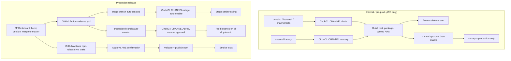

Tracing the release flow through docs and CI workflows.
The release path splits into two **independent** pipelines: **ARS** (primary binary distribution via CircleCI) and **npm** (public re-packaging via GitHub Actions). ARS releases do not automatically publish to npm.

---

## High-level picture



---

## 1. ARS binary distribution (CircleCI)

All binary builds run in CircleCI on the `build_and_upload_manual` workflow. Channel is inferred from the git branch in the `set-channel` command:

| Branch pattern | ARS channel | Signing | Enable gate |
|---|---|---|---|
| `develop`, `channel/beta`, `feature/*` | `beta` | unsigned (Windows) | automatic |
| `channel/canary` | `canary` | signed | **manual approval** |
| `release/desktop-cli/stage/*` | `stage` | signed | automatic |
| `release/desktop-cli/production/*` | `prod` | signed | **manual approval** |

```19:63:.circleci/config.yml
              release_beta='develop'
              release_channel_beta='channel/beta'
              release_channel_canary='channel/canary'
              release_feature='^feature.*'
              release_stage='^release/desktop-cli/stage/'
              release_prod='^release/desktop-cli/production/'
              if [[ $CIRCLE_BRANCH =~ $release_beta ]];
              then
                ...
                CHANNEL="beta"
              ...
              if [[ $CIRCLE_BRANCH =~ $release_channel_canary ]];
              then
                ...
                CHANNEL="canary"
                echo 'export ENABLE_WINDOWS_SIGNING="true"' >> $BASH_ENV
              ...
              if [[ $CIRCLE_BRANCH =~ $release_stage ]];
              then
                ...
                CHANNEL="stage"
              ...
              if [[ $CIRCLE_BRANCH =~ $release_prod ]];
              then
                ...
                CHANNEL="prod"
```

### Build version naming

- **Beta / canary:** `{semver}-{channel}-{timestamp}` (e.g. `1.31.3-beta-20250630120000`)
- **Stage / prod:** exact semver from `package.json` (stage branch gets `-stage01` suffix applied by GitHub Actions before CircleCI runs)

```133:141:.circleci/config.yml
            if [[ $CHANNEL == 'beta' || $CHANNEL == 'canary' ]];
            then
              PACKAGE_VERSION="$(node -e "console.log(require('./package.json').version.match(/^\\d+\\.\\d+\\.\\d+/)[0]);")"
              CURRENT_TIMESTAMP=$(date "+%Y%m%d%H%M%S")
              echo export BUILD_NAME=$PACKAGE_VERSION-$CHANNEL-$CURRENT_TIMESTAMP >> ./dist/new-env-vars
            else
              PACKAGE_VERSION="$(node -e "console.log(require('./package.json').version);")"
              echo export BUILD_NAME=$PACKAGE_VERSION >> ./dist/new-env-vars
            fi
```

### CircleCI pipeline steps

1. **Create build version** (`create-build-name`)
2. **Test** (lint, unit, integration, Snyk)
3. **Package** all platforms (Windows, macOS x64/ARM, Linux x64/ARM)
4. **Upload to ARS** via `pnpm run upload-cli-artifacts`
5. **Enable version + clear cache** — automatic for beta/stage; gated by approval for canary/production
6. **Global CLI install tests** — only on stage and production branches

```618:663:.circleci/config.yml
      - upload-to-ARS:
          ...
      - hold:
          filters:
            branches:
              only:
                - channel/canary
                - /release\/desktop-cli\/production\/.*/
          type: approval
          name: 'Approval for enabling in production'
      - enable-version-and-clear-cache:
          filters:
            branches:
              only:
                - channel/canary
                - /release\/desktop-cli\/production\/.*/
          name: 'Enable Version and Clear Cache (Production)'
          requires:
            - 'Approval for enabling in production'
      - enable-version-and-clear-cache:
          filters:
            branches:
              only:
                - develop
                - channel/beta
                - /release\/desktop-cli\/stage\/.*/
          name: 'Enable Version and Clear Cache (Non-Production)'
          requires:
            - 'Upload To ARS'
```

Enabling a version calls `enable-cli-version.js`, which hits the ARS API to set `disabled: false`:

```28:60:npm/enable-cli-version.js
function enableVersion (cb) {
    let channel = args.channel,
        versionName = args['version-name'];
    ...
    arsHelpers.getVersion(arsOptions, versionName, (error, version) => {
        ...
        updateVersion(channel, arsOptions, version, (error) => {
            ...
            console.info(`Version ${versionName} successfully enabled`);
```

Download URLs differ by channel (`install-and-test-global-cli.js`):

- Beta → `dl-cli.pstmn-beta.io`
- Stage → `dl-cli.pstmn-stage.io`
- Prod → `dl-cli.pstmn.io`

---

## 2. Production release orchestration (EF → master → branches)

Production releases start in the **EF Dashboard** (external release tooling), which bumps the version and merges to `develop` and `master`. Pushing `master` triggers **two GitHub Actions workflows in parallel**:

### `release.yml` — creates CircleCI release branches

```63:77:.github/workflows/release.yml
      - name: Create stage branch
        run: |
          BRANCH="release/desktop-cli/stage/v${{ needs.get-version.outputs.version }}-stage01"
          git checkout -b "$BRANCH"
          pnpm version "${{ needs.get-version.outputs.version }}-stage01" --no-git-tag-version
          ...
          git push origin "$BRANCH"

      - name: Create production branch
        run: |
          git checkout master
          BRANCH="release/desktop-cli/production/v${{ needs.get-version.outputs.version }}"
          git checkout -b "$BRANCH"
          git push origin "$BRANCH"
```

That push kicks off CircleCI automatically. The human-operated sequence (from `docs/release-workflow.md`) is:

1. Monitor **stage** pipeline (~12 min), run sanity tests
2. Security review + release notes
3. **Approve production** in CircleCI when the production branch pipeline reaches the hold step
4. **Approve npm release** in GitHub Actions after prod ARS is complete
5. Post to Slack, update website release notes

Note: CircleCI never runs on `master` itself — only on the release branches it creates.

---

## 3. npm publication (separate from ARS)

Documented explicitly in `docs/NPM_RELEASE_PROCESS.md`: ARS and npm are **separate processes**. Beta/canary ARS builds are internal (beta requires VPN); npm packages are **public worldwide**.

### Trigger branches and tags

| Source branch | npm dist-tag |
|---|---|
| `master` | `latest` |
| `release/npm/beta/v*` | `beta` |
| `release/npm/canary/v*` | `canary` |
| `release/npm/preview/v*` | `preview` |
| `release/npm/latest/v*` | `latest` |

Production (`master`) is automatic-but-gated. Beta/canary/preview npm releases require **manually creating** a `release/npm/{tag}/vX.Y.Z` branch.

### `npm-release.yml` — four steps, two approvals

```17:171:.github/workflows/npm-release.yml
  wait-for-ars:
    environment: generic-approval        # Step 1: human confirms ARS is done
  validate:
    needs: wait-for-ars                  # Step 2: fetch binaries, validate packages
  publish:
    needs: validate
    environment: npm-release             # Step 3: human approves actual publish
  smoke-tests:
    needs: publish                       # Step 4: curl + npm install on 3 OSes
```

Tag resolution and prep happen in the validate/publish jobs:

```65:85:.github/workflows/npm-release.yml
          if [[ $BRANCH_NAME == "master" ]]; then
            TAG="latest"
          elif [[ $BRANCH_NAME == release/npm/beta/* ]]; then
            TAG="beta"
          ...
          cd re-distribution/npm
          npm run release
```

### npm re-distribution scripts

**`release.js`** orchestrates prep:

1. Sync all package versions from root `package.json`
2. Fetch platform binaries from ARS (`fetchBinaries.js` → `https://dl-cli.pstmn.io/download/version/{version}`)
3. Validate packages (`validate-release.js`)

**`publish.js`** publishes sequentially:

1. Five `@postman/pm-bin-*` platform packages (with 60s waits between each)
2. Main `postman-cli` package last (depends on platform packages via `optionalDependencies`)

Auth uses **OIDC** (no manual npm token in CI).

### Smoke tests after publish

`smoke-tests.yml` runs a matrix on Ubuntu/macOS/Windows for both curl install (`dl-cli.pstmn.io`) and `pnpm add -g postman-cli`, exercising login, collection run, monitor run, and runner start.

---

## 4. How the channels relate end-to-end

| Stage | What happens | Who triggers | Approval needed |
|---|---|---|---|
| **Beta** | Push to `develop` / `channel/beta` / `feature/*` → ARS beta channel | Developers | None (ARS) |
| **Canary** | Push to `channel/canary` → ARS canary channel | Developers | CircleCI approval before enable |
| **Stage** | EF release → `release/desktop-cli/stage/v*-stage01` branch | Automatic from `master` push | None (ARS) |
| **Production (ARS)** | `release/desktop-cli/production/v*` branch | Automatic from `master` push | CircleCI approval |
| **Production (npm)** | `master` push → `npm-release.yml` | Automatic trigger | Two GitHub environment approvals |
| **npm beta/canary** | Manual `release/npm/{tag}/v*` branch | Developer | Same two GitHub approvals |

---

## Key files referenced

| File | Role |
|---|---|
| `docs/release-workflow.md` | Human runbook for production releases |
| `docs/NPM_RELEASE_PROCESS.md` | ARS vs npm separation, package architecture, manual beta/canary npm flow |
| `docs/CI_PIPELINE.md` | Channel detection summary, packaging, distribution overview |
| `.circleci/config.yml` | Channel detection, build naming, ARS upload/enable, approval gates |
| `.github/workflows/release.yml` | Auto-creates stage + production branches on `master` push |
| `.github/workflows/npm-release.yml` | Validate, publish, smoke-test npm packages |
| `npm/upload-cli-artifacts.js` | Uploads built binaries to ARS |
| `npm/enable-cli-version.js` | Enables a version on an ARS channel |
| `re-distribution/npm/scripts/release.js` | npm prep (version sync, fetch, validate) |
| `re-distribution/npm/scripts/fetchBinaries.js` | Downloads prod binaries from `dl-cli.pstmn.io` |
| `re-distribution/npm/scripts/publish.js` | Publishes 6 packages to npm registry |
| `npm/scripts/install-and-test-global-cli.js` | Post-enable curl-install verification per channel |

The critical design choice: **moving to production means enabling binaries on ARS first** (stage → approved prod), then **explicitly approving npm publication** that re-packages those same prod binaries for public `npm install`. Beta and canary on ARS are continuous/internal; getting them onto npm requires a separate, deliberate branch push to `release/npm/{tag}/v*`.
