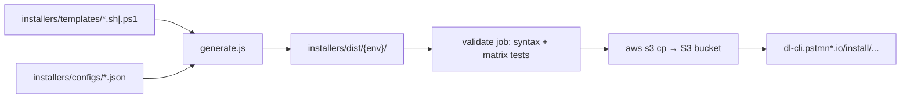

I'll trace the installer template generation and publish pipeline in the repo.
Here is how installer script generation and publishing work in this repo.

## Overview

Installer scripts are **not hand-written per environment**. They are **templates + JSON configs**, rendered by a Node generator into `installers/dist/[environment]/`, then **published to S3** via a manual GitHub Actions workflow. Generated output is **gitignored**; only templates and configs live in the repo.



---

## 1. Source material

| Layer | Location | Role |
|-------|----------|------|
| Templates | `installers/templates/` | 6 files: `unix.sh`, `linux64.sh`, `linux_arm64.sh`, `macos_amd64.sh`, `macos_arm64.sh`, `win64.ps1` |
| Configs | `installers/configs/` | One JSON per env: `production`, `beta`, `staging`, `canary` |
| Generator | `installers/scripts/generate.js` | Substitutes placeholders and writes `installers/dist/` |

Templates use placeholders:

- **`{{ENVIRONMENT}}`** — telemetry tag (e.g. `production`, `canary`)
- **`{{DOWNLOAD_URL}}`** — single URL for platform-specific scripts
- **`{{BASE_URL}}/download/latest/...{{CHANNEL_PARAM}}`** — multi-platform patterns in `unix.sh` only (replaced with full URLs from config)

Example platform-specific template:

```8:8:installers/templates/linux64.sh
URL='{{DOWNLOAD_URL}}'
```

Example universal template:

```11:11:installers/templates/unix.sh
ENVIRONMENT="{{ENVIRONMENT}}"
```

```141:144:installers/templates/unix.sh
        linux_amd64)    echo "{{BASE_URL}}/download/latest/linux64{{CHANNEL_PARAM}}" ;;
        linux_arm64)    echo "{{BASE_URL}}/download/latest/linux_arm64{{CHANNEL_PARAM}}" ;;
        macos_amd64)    echo "{{BASE_URL}}/download/latest/osx_64{{CHANNEL_PARAM}}" ;;
        macos_arm64)    echo "{{BASE_URL}}/download/latest/osx_arm64{{CHANNEL_PARAM}}" ;;
```

Configs supply environment name and per-platform download URLs. Production uses stable URLs; canary adds `?channel=canary`:

```1:10:installers/configs/production.json
{
  "environment": "production",
  "description": "Production environment configuration",
  "downloadUrls": {
    "linux64": "https://dl-cli.pstmn.io/download/latest/linux64",
    "linux_arm64": "https://dl-cli.pstmn.io/download/latest/linux_arm64",
    "osx_64": "https://dl-cli.pstmn.io/download/latest/osx_64",
    "osx_arm64": "https://dl-cli.pstmn.io/download/latest/osx_arm64",
    "win64": "https://dl-cli.pstmn.io/download/latest/win64"
  }
}
```

---

## 2. Generation (`installers/scripts/generate.js`)

The generator is the core logic.

**`PLATFORM_MAP`** maps each template filename to a config key (or `null` for the universal `unix.sh`):

```19:26:installers/scripts/generate.js
const PLATFORM_MAP = {
    'linux64.sh': 'linux64',
    'linux_arm64.sh': 'linux_arm64',
    'macos_amd64.sh': 'osx_64',
    'macos_arm64.sh': 'osx_arm64',
    'win64.ps1': 'win64',
    'unix.sh': null
};
```

**`processTemplateContent`** does string substitution:

- Always replaces `{{ENVIRONMENT}}`
- Platform scripts: replaces `{{DOWNLOAD_URL}}` with `config.downloadUrls[platformKey]`
- `unix.sh`: replaces each `{{BASE_URL}}/download/latest/...{{CHANNEL_PARAM}}` pattern with the matching full URL

**`generateEnvironmentScripts(environment)`**:

1. Reads `installers/configs/{environment}.json`
2. Creates `installers/dist/{environment}/`
3. Reads every `.sh` / `.ps1` in `templates/`
4. Processes and writes output; sets `chmod 755` on `.sh` files

**`main()`**:

- No args → generates all four envs: `production`, `beta`, `staging`, `canary`
- With args → only those envs, e.g. `node installers/scripts/generate.js production canary`

```96:110:installers/scripts/generate.js
function main () {
    const environments = process.argv.slice(2);

    if (environments.length === 0) {
        environments.push('production', 'beta', 'staging', 'canary');
    }

    let total = 0;

    environments.forEach((env) => {
        total += generateEnvironmentScripts(env);
    });

    console.log(`Generated ${total} scripts in ${DIST_DIR}`);
}
```

Local usage (from `docs/installers.md`):

```bash
node installers/scripts/generate.js              # all envs
node installers/scripts/generate.js production beta
./installers/dist/production/unix.sh --verbose
```

`installers/dist/` is in `.gitignore`, so generated scripts are built at CI/publish time, not committed.

---

## 3. After you change installers (dev workflow)

1. Edit templates in `installers/templates/`
2. Adjust `installers/configs/*.json` if URLs or environment names change
3. Regenerate locally and test
4. Open a PR with **template + config changes only**
5. CI can exercise installers via `.github/workflows/install.yml` (branches matching `**installation-script-test**`, workflow dispatch, or when called from publish workflow)

---

## 4. Publishing (`.github/workflows/publish-installers.yml`)

Publishing is **manual**: Actions → **“Publish Installer Scripts to S3”** → choose `beta`, `staging`, or `production`.

The workflow has four stages:

### Job 1: `validate`

1. `node installers/scripts/generate.js` (all envs)
2. Asserts all 6 scripts exist under each of `production`, `beta`, `staging`, `canary`
3. Syntax check: `bash -n` for `.sh`, PowerShell tokenizer for `.ps1`

### Job 2: `test`

Calls `.github/workflows/install.yml`, which also runs `generate.js` then runs a large matrix (Windows CMD/PowerShell/Pwsh, macOS Intel/ARM/Rosetta, Linux curl/wget, read-only envs).

### Jobs 3–5: `publish-beta` / `publish-staging` / `publish-production`

Each runs only when `workflow_dispatch` selects that environment. Pattern:

1. Checkout
2. Regenerate for target env (+ `canary` when relevant)
3. AWS OIDC credentials (`BETA_AWS_ROLE_ARN`, etc.)
4. `aws s3 cp` with correct content types

**What actually gets uploaded today:**

| Environment | Scripts published to S3 |
|-------------|-------------------------|
| **Beta** | All 6: `unix.sh`, `linux64.sh`, `linux_arm64.sh`, `osx_64.sh`, `osx_arm64.sh`, `win64.ps1` |
| **Staging** | Same full set as beta |
| **Production** | `unix.sh` + canary `canary/unix.sh` and `canary/win64.ps1` only; platform-specific production uploads are commented out pending monitoring |

Production upload excerpt:

```190:194:.github/workflows/publish-installers.yml
      - name: Upload production scripts to S3
        run: |
          aws s3 cp installers/dist/production/unix.sh "s3://$PRODUCTION_S3_BUCKET/install/unix.sh" --content-type "text/x-shellscript"
          aws s3 cp installers/dist/canary/unix.sh "s3://$PRODUCTION_S3_BUCKET/install/canary/unix.sh" --content-type "text/x-shellscript"
          aws s3 cp installers/dist/canary/win64.ps1 "s3://$PRODUCTION_S3_BUCKET/install/canary/win64.ps1" --content-type "application/x-powershell"
```

S3 buckets come from GitHub secrets (`BETA_S3_BUCKET`, `STAGING_S3_BUCKET`, `PRODUCTION_S3_BUCKET`). Staging and production use GitHub **environment protection** (approval required); beta does not.

After S3 upload, scripts are served at URLs like `https://dl-cli.pstmn.io/install/unix.sh`. The README notes that CDN cache invalidation may occasionally be needed manually; there is no automated invalidation step yet.

---

## 5. Key files referenced

| File | Purpose |
|------|---------|
| `installers/scripts/generate.js` | Template engine: `processTemplateContent`, `generateEnvironmentScripts`, `main` |
| `installers/templates/*` | Source templates with placeholders |
| `installers/configs/*.json` | Per-environment download URLs |
| `docs/installers.md` | Developer docs for generation, testing, deployment |
| `.github/workflows/publish-installers.yml` | Validate → test → S3 publish pipeline |
| `.github/workflows/install.yml` | Cross-platform install test matrix |
| `README.md` (Installers section) | Pointer to manual publish workflow |

**Important distinction:** Publishing installer **scripts** to S3 is separate from releasing CLI **binaries** (ARS/npm). The README explicitly states that ARS releases do not auto-publish npm or installer scripts; the publish workflow must be run after template changes.
