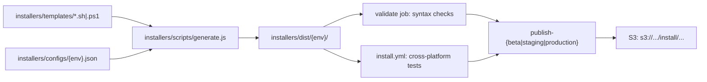

Tracing how installer templates become published scripts — searching the repo for generation and publish flows.
## Overview

Installer scripts follow a **template + config → generate → validate/test → S3 publish** pipeline. Source lives in git under `installers/templates/` and `installers/configs/`; generated output goes to `installers/dist/` (gitignored) and is built fresh in CI before upload.



---

## 1. Templates and configs (source of truth)

**Templates** (`installers/templates/`) are shell/PowerShell scripts with placeholders:

| Template | Placeholders |
|----------|--------------|
| Platform-specific (`linux64.sh`, `win64.ps1`, etc.) | `{{DOWNLOAD_URL}}`, `{{ENVIRONMENT}}` |
| Universal (`unix.sh`) | `{{ENVIRONMENT}}`, plus `{{BASE_URL}}` / `{{CHANNEL_PARAM}}` patterns that get replaced with full URLs |

Example from a platform-specific template:

```8:8:installers/templates/linux64.sh
URL='{{DOWNLOAD_URL}}'
```

**Configs** (`installers/configs/{production,beta,staging,canary}.json`) supply per-environment values — environment name and platform download URLs. Example:

```1:10:installers/configs/production.json
{
  "environment": "production",
  "description": "Production environment configuration",
  "downloadUrls": {
    "linux64": "https://dl-cli.pstmn.io/download/latest/linux64",
    "linux_arm64": "https://dl-cli.pstmn.io/download/latest/linux_arm64",
    "osx_64": "https://dl-cli.pstmn.io/download/latest/osx_64",
    "osx_arm64": "https://dl-cli.pstmn.io/download/latest/osx_arm64",
    "win64": "https://dl-cli.pstmn.io/download/latest/win64"
  }
}
```

Canary adds `?channel=canary` to each URL (`installers/configs/canary.json`).

---

## 2. Generation (`installers/scripts/generate.js`)

The generator is the core logic. Key pieces:

**`PLATFORM_MAP`** — maps each template filename to a config key (or `null` for the universal `unix.sh`):

```19:26:installers/scripts/generate.js
const PLATFORM_MAP = {
    'linux64.sh': 'linux64',
    'linux_arm64.sh': 'linux_arm64',
    'macos_amd64.sh': 'osx_64',
    'macos_arm64.sh': 'osx_arm64',
    'win64.ps1': 'win64',
    'unix.sh': null
};
```

**`processTemplateContent()`** — substitutes placeholders:

- `{{ENVIRONMENT}}` → config environment name (all templates)
- Platform-specific: `{{DOWNLOAD_URL}}` → `config.downloadUrls[platformKey]`
- `unix.sh`: replaces combined `{{BASE_URL}}/download/latest/...{{CHANNEL_PARAM}}` patterns with full URLs from config

**`generateEnvironmentScripts(environment)`** — for one environment:

1. Reads `installers/configs/{environment}.json`
2. Creates `installers/dist/{environment}/`
3. Processes every `.sh` / `.ps1` template
4. Writes output and `chmod 755` on shell scripts

**`main()`** — CLI entry point:

```96:109:installers/scripts/generate.js
function main () {
    const environments = process.argv.slice(2);

    if (environments.length === 0) {
        environments.push('production', 'beta', 'staging', 'canary');
    }

    let total = 0;

    environments.forEach((env) => {
        total += generateEnvironmentScripts(env);
    });

    console.log(`Generated ${total} scripts in ${DIST_DIR}`);
}
```

**Local usage:**

```bash
node installers/scripts/generate.js                    # all 4 environments
node installers/scripts/generate.js production beta  # specific environments
```

Output: 6 scripts × N environments under `installers/dist/{env}/`. That directory is **gitignored** (`.gitignore` line 50), so PRs commit templates/configs only; CI regenerates `dist/` at runtime.

---

## 3. Development workflow after installer changes

From `docs/installers.md` and `README.md`:

1. **Edit templates** in `installers/templates/`
2. **Adjust configs** in `installers/configs/` if URLs or environment metadata change
3. **Generate locally** with `node installers/scripts/generate.js` and test (e.g. `./installers/dist/production/unix.sh --verbose`)
4. **Open a PR** with template/config changes
5. **Publish to S3** manually after merge (see below)

Note: `docs/installers.md` says to include generated scripts in the PR, but `.gitignore` excludes `installers/dist/` — in practice only templates and configs are committed; generation happens in CI.

---

## 4. Publishing (GitHub Actions → S3)

Publishing is **manual** via workflow dispatch: **Actions → "Publish Installer Scripts to S3"** (`.github/workflows/publish-installers.yml`).

### Job 1: `validate`

1. Runs `node installers/scripts/generate.js` for all environments
2. Asserts all 6 scripts exist per environment (`production`, `beta`, `staging`, `canary`)
3. Syntax-checks `.sh` with `bash -n` and `.ps1` with PowerShell tokenizer

### Job 2: `test`

Calls `.github/workflows/install.yml`, which:

- Regenerates scripts
- Runs a cross-platform matrix (Windows CMD/PowerShell/pwsh, macOS Intel/ARM/Rosetta, Linux curl/wget, read-only env)
- Executes `./installers/dist/production/unix.sh` (Unix) or `win64.ps1` (Windows)

### Jobs 3–5: `publish-beta`, `publish-staging`, `publish-production`

Each runs only when `workflow_dispatch` selects that environment. Flow:

1. Checkout
2. Regenerate scripts for target env (+ `canary` where applicable)
3. AWS OIDC auth via environment-specific role
4. `aws s3 cp` from `installers/dist/` to the S3 bucket

**What gets uploaded varies by environment:**

| Environment | Scripts uploaded |
|-------------|------------------|
| **Beta** | All 6: `unix.sh`, `linux64.sh`, `linux_arm64.sh`, `osx_64.sh`, `osx_arm64.sh`, `win64.ps1` |
| **Staging** | All 6 (same as beta) |
| **Production** | `unix.sh`, `canary/unix.sh`, `canary/win64.ps1` only — platform-specific prod scripts are commented out pending unix installer monitoring |

Production upload (lines 190–199 of `publish-installers.yml`):

```190:194:.github/workflows/publish-installers.yml
      - name: Upload production scripts to S3
        run: |
          aws s3 cp installers/dist/production/unix.sh "s3://$PRODUCTION_S3_BUCKET/install/unix.sh" --content-type "text/x-shellscript"
          aws s3 cp installers/dist/canary/unix.sh "s3://$PRODUCTION_S3_BUCKET/install/canary/unix.sh" --content-type "text/x-shellscript"
          aws s3 cp installers/dist/canary/win64.ps1 "s3://$PRODUCTION_S3_BUCKET/install/canary/win64.ps1" --content-type "application/x-powershell"
```

**Environment protection:** staging and production require GitHub environment approval; beta can run without it.

**CDN:** README notes that CDN cache invalidation may be needed manually in rare cases — not automated in the workflow yet.

---

## 5. End-to-end flow after a change

```
Edit templates/configs
        ↓
PR (templates + configs only; dist/ not committed)
        ↓
Merge
        ↓
Manual: Run "Publish Installer Scripts to S3"
        ↓
validate → generate all envs + syntax check
        ↓
test → install.yml matrix against production/unix.sh + win64.ps1
        ↓
publish-{env} → regenerate target env → aws s3 cp → dl-cli.pstmn*.io/install/...
```

Users then install via curl/PowerShell from URLs like `https://dl-cli.pstmn.io/install/unix.sh`.

---

## Key files referenced

| File | Role |
|------|------|
| `installers/templates/*.sh`, `*.ps1` | Source templates with placeholders |
| `installers/configs/*.json` | Per-environment URLs and metadata |
| `installers/scripts/generate.js` | `processTemplateContent`, `generateEnvironmentScripts`, `main` |
| `docs/installers.md` | Developer docs, env matrix, local testing |
| `.github/workflows/publish-installers.yml` | Validate → test → S3 publish |
| `.github/workflows/install.yml` | Cross-platform installation test matrix |
| `README.md` (Installers section) | How to trigger publish workflow |
| `.gitignore` | Excludes `installers/dist/` from version control |
