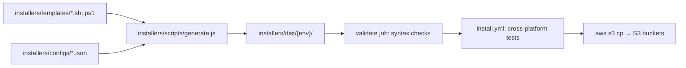

Tracing how installer templates become published scripts — searching the repo for generation and publish flows.
Here is how installer script generation and publishing work in this repo.

## Overview

Installers use a **template + config → generate → validate/test → S3 publish** pipeline. Source lives under `installers/`; generated output goes to `installers/dist/` (gitignored). Publishing is **manual** via GitHub Actions, not tied to npm or ARS releases.



---

## 1. Templates and configs

**Templates** (`installers/templates/`) are shell/PowerShell scripts with placeholders:

| Template | Placeholders |
|----------|--------------|
| `linux64.sh`, `linux_arm64.sh`, `macos_amd64.sh`, `macos_arm64.sh`, `win64.ps1` | `{{DOWNLOAD_URL}}`, `{{ENVIRONMENT}}` |
| `unix.sh` (multi-platform) | `{{ENVIRONMENT}}`, and URL patterns like `{{BASE_URL}}/download/latest/linux64{{CHANNEL_PARAM}}` |

Example platform-specific template:

```8:8:installers/templates/linux64.sh
URL='{{DOWNLOAD_URL}}'
```

Example universal template:

```11:11:installers/templates/unix.sh
ENVIRONMENT="{{ENVIRONMENT}}"
```

```141:144:installers/templates/unix.sh
        linux_amd64)    echo "{{BASE_URL}}/download/latest/linux64{{CHANNEL_PARAM}}" ;;
        linux_arm64)    echo "{{BASE_URL}}/download/latest/linux_arm64{{CHANNEL_PARAM}}" ;;
        macos_amd64)    echo "{{BASE_URL}}/download/latest/osx_64{{CHANNEL_PARAM}}" ;;
        macos_arm64)    echo "{{BASE_URL}}/download/latest/osx_arm64{{CHANNEL_PARAM}}" ;;
```

**Configs** (`installers/configs/`) define per-environment download URLs and telemetry environment name. Four environments: `production`, `beta`, `staging`, `canary`.

```1:11:installers/configs/production.json
{
  "environment": "production",
  "description": "Production environment configuration",
  "downloadUrls": {
    "linux64": "https://dl-cli.pstmn.io/download/latest/linux64",
    "linux_arm64": "https://dl-cli.pstmn.io/download/latest/linux_arm64",
    "osx_64": "https://dl-cli.pstmn.io/download/latest/osx_64",
    "osx_arm64": "https://dl-cli.pstmn.io/download/latest/osx_arm64",
    "win64": "https://dl-cli.pstmn.io/download/latest/win64"
  }
}
```

Canary adds `?channel=canary` on each URL (`installers/configs/canary.json`). Beta/staging use different hostnames (`dl-cli.pstmn-beta.io`, `dl-cli.pstmn-staging.io`).

---

## 2. Generation (`installers/scripts/generate.js`)

The generator is a Node script with three main pieces:

### `PLATFORM_MAP`

Maps each template filename to a config `downloadUrls` key. `unix.sh` is special (`null` = multi-URL handling):

```19:26:installers/scripts/generate.js
const PLATFORM_MAP = {
    'linux64.sh': 'linux64',
    'linux_arm64.sh': 'linux_arm64',
    'macos_amd64.sh': 'osx_64',
    'macos_arm64.sh': 'osx_arm64',
    'win64.ps1': 'win64',
    'unix.sh': null
};
```

### `processTemplateContent(content, config, platformKey)`

- Always replaces `{{ENVIRONMENT}}` with the config’s environment name.
- **Platform-specific templates:** replaces `{{DOWNLOAD_URL}}` with `config.downloadUrls[platformKey]`.
- **`unix.sh`:** replaces each full URL pattern (e.g. `{{BASE_URL}}/download/latest/linux64{{CHANNEL_PARAM}}`) with the corresponding entry from `downloadUrls` — so canary’s `?channel=canary` comes from the config, not separate placeholder logic.

### `generateEnvironmentScripts(environment)`

For one environment:

1. Loads `installers/configs/{environment}.json`
2. Creates `installers/dist/{environment}/`
3. Reads every `.sh`/`.ps1` template, runs `processTemplateContent`, writes output
4. Sets mode `755` on `.sh` files

### `main()`

- With no args: generates all four environments (`production`, `beta`, `staging`, `canary`)
- With args: generates only those environments, e.g. `node installers/scripts/generate.js production canary`

Local usage:

```bash
node installers/scripts/generate.js
node installers/scripts/generate.js production beta
```

Generated output is in `.gitignore` (`installers/dist/`), so it is **not** committed; CI regenerates it at publish/test time.

---

## 3. Developer workflow after template changes

From `docs/installers.md` and `README.md`:

1. Edit templates in `installers/templates/`
2. Update configs in `installers/configs/` if URLs or environment names change
3. Regenerate locally for testing: `node installers/scripts/generate.js`
4. Test generated scripts (e.g. `./installers/dist/production/unix.sh --verbose`)
5. Open a PR with **template and config changes** (not `dist/`)
6. Optionally trigger installation tests via branch name `**installation-script-test**`, workflow dispatch, or as part of the publish workflow

---

## 4. Publishing (GitHub Actions → S3)

Publishing is **manual** via [`.github/workflows/publish-installers.yml`](.github/workflows/publish-installers.yml) — “Publish Installer Scripts to S3”.

Trigger: `workflow_dispatch` with environment choice: `beta`, `staging`, or `production`.

### Job 1: `validate`

1. `node installers/scripts/generate.js` — all environments
2. Asserts all 6 scripts exist per env (`unix.sh`, `linux64.sh`, `linux_arm64.sh`, `macos_amd64.sh`, `macos_arm64.sh`, `win64.ps1`)
3. Syntax check: `bash -n` for `.sh`, PowerShell tokenizer for `.ps1`

### Job 2: `test`

Calls [`.github/workflows/install.yml`](.github/workflows/install.yml), which also runs `generate.js`, then runs a large matrix (Windows/macOS/Linux, curl/wget, read-only env, etc.) against **production** generated scripts.

### Jobs 3–5: `publish-beta`, `publish-staging`, `publish-production`

Each runs only when the selected environment matches. Flow:

1. Regenerate scripts for that env (+ `canary` where needed)
2. AWS OIDC auth via environment-specific role (`BETA_AWS_ROLE_ARN`, etc.)
3. `aws s3 cp` to the matching bucket (`BETA_S3_BUCKET`, `STAGING_S3_BUCKET`, `PRODUCTION_S3_BUCKET`)

**What actually gets uploaded varies by environment:**

| Environment | Scripts uploaded to S3 |
|-------------|------------------------|
| **Beta** | All 6: `unix.sh`, `linux64.sh`, `linux_arm64.sh`, `osx_64.sh`, `osx_arm64.sh`, `win64.ps1` |
| **Staging** | Same full set as beta |
| **Production** | `unix.sh`, plus canary scripts at `install/canary/unix.sh` and `install/canary/win64.ps1` |

Production platform-specific scripts are **commented out** pending monitoring of the unified `unix.sh` installer:

```192:199:.github/workflows/publish-installers.yml
          aws s3 cp installers/dist/production/unix.sh "s3://$PRODUCTION_S3_BUCKET/install/unix.sh" --content-type "text/x-shellscript"
          aws s3 cp installers/dist/canary/unix.sh "s3://$PRODUCTION_S3_BUCKET/install/canary/unix.sh" --content-type "text/x-shellscript"
          aws s3 cp installers/dist/canary/win64.ps1 "s3://$PRODUCTION_S3_BUCKET/install/canary/win64.ps1" --content-type "application/x-powershell"
        #   TODO: not uploading these for now, will add them after monitoring the unix installer for a while
        #   aws s3 cp installers/dist/production/linux64.sh ...
```

Note: macOS templates are uploaded as `osx_64.sh` / `osx_arm64.sh` on S3 (filename remap in the workflow).

**Environment protection:** staging and production GitHub environments require approval before upload; beta can deploy without that gate.

**CDN:** README notes that CDN cache invalidation may be needed manually in rare cases; automatic invalidation is still a TODO.

---

## 5. Important files/functions summary

| File | Role |
|------|------|
| `installers/templates/*.sh`, `win64.ps1` | Source templates with placeholders |
| `installers/configs/*.json` | Per-env download URLs and environment name |
| `installers/scripts/generate.js` | `processTemplateContent`, `generateEnvironmentScripts`, `main` |
| `docs/installers.md` | Developer docs for generation, testing, publishing |
| `.github/workflows/publish-installers.yml` | Generate → validate → test → S3 publish |
| `.github/workflows/install.yml` | Cross-platform installation test matrix |
| `README.md` | Points to publish workflow after installer changes |

---

## End-to-end after you change a template

1. Change `installers/templates/` (and configs if URLs change)
2. Merge PR (templates/configs only)
3. Run **Publish Installer Scripts to S3** in GitHub Actions, pick target env, approve if required
4. Workflow regenerates scripts, validates syntax, runs install tests, then uploads to S3
5. Users fetch scripts from CDN URLs like `https://dl-cli.pstmn.io/install/unix.sh`

This is separate from npm publishing and ARS binary releases — those do not auto-update installer scripts on S3.
