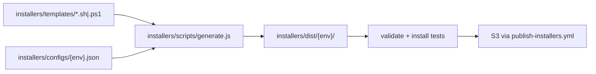

Tracing how installer templates become published scripts — searching the repo for generation and publish flows.
Here is how installer script generation and publishing work in this repo.

## Overview

Installer scripts are **not hand-maintained per environment**. You edit shared **templates** and **environment configs**, run a Node generator, and publish the generated output to S3 via a GitHub Actions workflow. Generated scripts live in `installers/dist/` and are **gitignored** — they are built at CI/publish time, not committed.



---

## 1. Templates and configs

**Templates** (`installers/templates/`) hold the install logic with placeholders:

| Template | Placeholder style |
|----------|-------------------|
| Platform-specific (`linux64.sh`, `macos_arm64.sh`, `win64.ps1`, etc.) | Single `{{DOWNLOAD_URL}}` |
| Universal (`unix.sh`) | `{{ENVIRONMENT}}` plus per-platform URL patterns like `{{BASE_URL}}/download/latest/linux64{{CHANNEL_PARAM}}` |

Example from a platform-specific template:

```8:8:installers/templates/linux64.sh
URL='{{DOWNLOAD_URL}}'
```

Example from the universal template:

```11:11:installers/templates/unix.sh
ENVIRONMENT="{{ENVIRONMENT}}"
```

**Configs** (`installers/configs/`) supply environment-specific values. Each file (e.g. `production.json`, `beta.json`, `canary.json`) defines:

- `environment` — name substituted into `{{ENVIRONMENT}}`
- `downloadUrls` — full URLs per platform key (`linux64`, `linux_arm64`, `osx_64`, `osx_arm64`, `win64`)

Production uses stable URLs; canary adds `?channel=canary`:

```1:10:installers/configs/production.json
{
  "environment": "production",
  "description": "Production environment configuration",
  "downloadUrls": {
    "linux64": "https://dl-cli.pstmn.io/download/latest/linux64",
    "linux_arm64": "https://dl-cli.pstmn.io/download/latest/linux_arm64",
    "osx_64": "https://dl-cli.pstmn.io/download/latest/osx_64",
    "osx_arm64": "https://dl-cli.pstmn.io/download/latest/osx_arm64",
    "win64": "https://dl-cli.pstmn.io/download/latest/win64"
  }
}
```

---

## 2. Generation (`installers/scripts/generate.js`)

The generator is the core of the system. Key pieces:

**`PLATFORM_MAP`** — maps each template filename to a config key (or `null` for `unix.sh`):

```19:26:installers/scripts/generate.js
const PLATFORM_MAP = {
    'linux64.sh': 'linux64',
    'linux_arm64.sh': 'linux_arm64',
    'macos_amd64.sh': 'osx_64',
    'macos_arm64.sh': 'osx_arm64',
    'win64.ps1': 'win64',
    'unix.sh': null
};
```

**`processTemplateContent()`** — substitutes placeholders:

- Always replaces `{{ENVIRONMENT}}`
- For platform templates: replaces `{{DOWNLOAD_URL}}` with `config.downloadUrls[platformKey]`
- For `unix.sh`: replaces each `{{BASE_URL}}/download/latest/...{{CHANNEL_PARAM}}` pattern with the corresponding full URL from config (so canary’s `?channel=canary` is baked in)

**`generateEnvironmentScripts(environment)`** — for one environment:

1. Reads `installers/configs/{environment}.json`
2. Creates `installers/dist/{environment}/`
3. Processes every `.sh` / `.ps1` template
4. Writes output and `chmod 755` on shell scripts

**`main()`** — CLI entry point:

```96:109:installers/scripts/generate.js
function main () {
    const environments = process.argv.slice(2);

    if (environments.length === 0) {
        environments.push('production', 'beta', 'staging', 'canary');
    }

    let total = 0;

    environments.forEach((env) => {
        total += generateEnvironmentScripts(env);
    });

    console.log(`Generated ${total} scripts in ${DIST_DIR}`);
}
```

Local usage:

```bash
node installers/scripts/generate.js                    # all 4 environments
node installers/scripts/generate.js production beta  # specific environments
```

---

## 3. After you change installers (dev workflow)

Documented in `docs/installers.md` and `README.md`:

1. Edit templates in `installers/templates/`
2. Adjust configs in `installers/configs/` if URLs or environment names change
3. Regenerate locally and test: `node installers/scripts/generate.js` then e.g. `./installers/dist/production/unix.sh --verbose`
4. Open a PR with template/config changes (generated `installers/dist/` is in `.gitignore`, so it is not committed)
5. **Publish to S3 manually** after merge — this is a separate step from merging the PR

---

## 4. Publishing (`.github/workflows/publish-installers.yml`)

Publishing is **manual** via workflow dispatch: Actions → **“Publish Installer Scripts to S3”** → choose `beta`, `staging`, or `production`.

The workflow has four stages:

### Job 1: `validate`
- Runs `node installers/scripts/generate.js` for all environments
- Checks all 6 scripts exist per environment (`unix.sh`, `linux64.sh`, `linux_arm64.sh`, `macos_amd64.sh`, `macos_arm64.sh`, `win64.ps1`)
- Syntax-checks `.sh` with `bash -n` and `.ps1` with PowerShell tokenizer

### Job 2: `test`
- Reuses `.github/workflows/install.yml` (cross-platform install matrix: Windows/macOS/Linux, curl/wget, read-only envs, etc.)
- That workflow also regenerates scripts from templates before running installs

### Jobs 3–5: `publish-beta`, `publish-staging`, `publish-production`
Each runs only when the selected environment matches. Each job:

1. Regenerates scripts for the target env (+ `canary` where needed)
2. Authenticates to AWS via OIDC (`role-to-assume` secrets)
3. Uploads to S3 with explicit content types

**What actually gets published varies by environment:**

| Environment | Scripts uploaded to S3 |
|-------------|------------------------|
| **Beta** | All 6 scripts under `install/` |
| **Staging** | All 6 scripts under `install/` |
| **Production** | `production/unix.sh` → `install/unix.sh`, plus `canary/unix.sh` and `canary/win64.ps1` under `install/canary/` |

Production platform-specific scripts (`linux64.sh`, `macos_*.sh`, `win64.ps1`) are **commented out** pending monitoring of the unified `unix.sh` installer:

```190:199:.github/workflows/publish-installers.yml
      - name: Upload production scripts to S3
        run: |
          aws s3 cp installers/dist/production/unix.sh "s3://$PRODUCTION_S3_BUCKET/install/unix.sh" --content-type "text/x-shellscript"
          aws s3 cp installers/dist/canary/unix.sh "s3://$PRODUCTION_S3_BUCKET/install/canary/unix.sh" --content-type "text/x-shellscript"
          aws s3 cp installers/dist/canary/win64.ps1 "s3://$PRODUCTION_S3_BUCKET/install/canary/win64.ps1" --content-type "application/x-powershell"
        #   TODO: not uploading these for now, will add them after monitoring the unix installer for a while
        #   aws s3 cp installers/dist/production/linux64.sh ...
```

**Environment protection:** staging and production use GitHub environment approvals; beta can deploy without that gate.

**CDN:** `README.md` notes that CDN cache invalidation is not automated yet — stale scripts can occasionally be served until cache expiry.

---

## 5. Automated install testing (separate from publish)

`.github/workflows/install.yml` runs on:

- Branches matching `**installation-script-test**`
- `workflow_dispatch`
- `workflow_call` (from the publish workflow)

It regenerates scripts, then runs real installs across a large OS/shell/downloader matrix using `installers/dist/production/` scripts.

---

## Key files summary

| File | Role |
|------|------|
| `installers/templates/*.sh`, `win64.ps1` | Source templates with placeholders |
| `installers/configs/*.json` | Per-environment download URLs |
| `installers/scripts/generate.js` | Template processor and generator |
| `installers/dist/` | Generated output (gitignored) |
| `.github/workflows/publish-installers.yml` | Validate → test → S3 publish |
| `.github/workflows/install.yml` | Cross-platform install tests |
| `docs/installers.md` | Developer and publishing documentation |
| `README.md` | Pointer to publish workflow after installer changes |

**Important distinction:** merging installer template changes does **not** update what users download. You must run the **Publish Installer Scripts to S3** workflow (and sometimes manually invalidate CDN) for changes to go live at `dl-cli.pstmn.io` and related domains.
