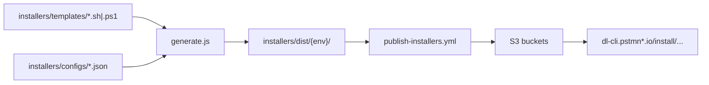

Tracing the installer template generation and publish flow in the codebase.
Here is how installer script generation and publishing work in this repo.

## Overview

Installers are **not hand-maintained per environment**. You edit **templates** and **JSON configs**, run a **Node generator**, and **GitHub Actions** regenerates, validates, tests, and uploads the output to **S3** (served at URLs like `https://dl-cli.pstmn.io/install/unix.sh`).



---

## 1. Source inputs

| Layer | Location | Role |
|-------|----------|------|
| Templates | `installers/templates/` | 6 scripts: `unix.sh`, `linux64.sh`, `linux_arm64.sh`, `macos_amd64.sh`, `macos_arm64.sh`, `win64.ps1` |
| Configs | `installers/configs/` | Per-environment JSON: `production`, `beta`, `staging`, `canary` |
| Generator | `installers/scripts/generate.js` | Substitutes placeholders and writes `installers/dist/{environment}/` |

Configs supply the environment name and platform download URLs. Example from production:

```1:11:installers/configs/production.json
{
  "environment": "production",
  "description": "Production environment configuration",
  "downloadUrls": {
    "linux64": "https://dl-cli.pstmn.io/download/latest/linux64",
    "linux_arm64": "https://dl-cli.pstmn.io/download/latest/linux_arm64",
    "osx_64": "https://dl-cli.pstmn.io/download/latest/osx_64",
    "osx_arm64": "https://dl-cli.pstmn.io/download/latest/osx_arm64",
    "win64": "https://dl-cli.pstmn.io/download/latest/win64"
  }
}
```

Beta uses `dl-cli.pstmn-beta.io`; canary adds `?channel=canary` on the production host (see `installers/configs/canary.json`).

---

## 2. Template placeholders

Two substitution styles in `processTemplateContent()`:

**Platform-specific templates** (`linux64.sh`, etc.) use `{{DOWNLOAD_URL}}`:

```8:8:installers/templates/linux64.sh
URL='{{DOWNLOAD_URL}}'
```

**Universal `unix.sh`** uses legacy patterns that the generator replaces with full URLs from config:

```138:144:installers/templates/unix.sh
get_download_url() {
    platform="$1"
    case "$platform" in
        linux_amd64)    echo "{{BASE_URL}}/download/latest/linux64{{CHANNEL_PARAM}}" ;;
        linux_arm64)    echo "{{BASE_URL}}/download/latest/linux_arm64{{CHANNEL_PARAM}}" ;;
        macos_amd64)    echo "{{BASE_URL}}/download/latest/osx_64{{CHANNEL_PARAM}}" ;;
        macos_arm64)    echo "{{BASE_URL}}/download/latest/osx_arm64{{CHANNEL_PARAM}}" ;;
```

All templates also get `{{ENVIRONMENT}}` (used for telemetry in `unix.sh`).

Mapping from template file to config key is in `PLATFORM_MAP`:

```19:26:installers/scripts/generate.js
const PLATFORM_MAP = {
    'linux64.sh': 'linux64',
    'linux_arm64.sh': 'linux_arm64',
    'macos_amd64.sh': 'osx_64',
    'macos_arm64.sh': 'osx_arm64',
    'win64.ps1': 'win64',
    'unix.sh': null
};
```

---

## 3. Generation (`generate.js`)

**Entry point:** `main()` in `installers/scripts/generate.js`

**Flow:**

1. **Environments** — CLI args, or default all four: `production`, `beta`, `staging`, `canary`.
2. **`generateEnvironmentScripts(environment)`** — loads `installers/configs/{environment}.json`, creates `installers/dist/{environment}/`, iterates every `.sh`/`.ps1` in `templates/`.
3. **`processTemplateContent()`** — replaces placeholders (see above).
4. **Permissions** — `.sh` outputs get `chmod 755`.

```68:88:installers/scripts/generate.js
function generateEnvironmentScripts (environment) {
    const config = JSON.parse(fs.readFileSync(path.join(CONFIGS_DIR, `${environment}.json`), 'utf8'));
    const envDistDir = path.join(DIST_DIR, environment);

    fs.mkdirSync(envDistDir, { recursive: true });

    const templates = fs.readdirSync(TEMPLATES_DIR).filter((f) => { return f.endsWith('.sh') || f.endsWith('.ps1'); });

    templates.forEach((templateFile) => {
        const templateContent = fs.readFileSync(path.join(TEMPLATES_DIR, templateFile), 'utf8');
        const processedContent = processTemplateContent(templateContent, config, PLATFORM_MAP[templateFile]);
        const outputPath = path.join(envDistDir, templateFile);

        fs.writeFileSync(outputPath, processedContent);

        if (templateFile.endsWith('.sh')) {
            fs.chmodSync(outputPath, 0o755);
        }
    });

    return templates.length;
}
```

**Local usage:**

```bash
node installers/scripts/generate.js                    # all environments
node installers/scripts/generate.js production beta  # subset
```

`installers/dist/` is **gitignored** — generated artifacts are not committed; CI regenerates them.

---

## 4. Development workflow after template changes

From `docs/installers.md` and `README.md`:

1. Edit `installers/templates/` (and `installers/configs/` if URLs/environment change).
2. Generate locally and test: `./installers/dist/production/unix.sh --verbose`.
3. Open a PR with **template/config changes** (not `dist/`).
4. Optional: push a branch whose name contains `installation-script-test` to trigger install tests via `install.yml`.

---

## 5. Publishing to S3

Publishing is **manual** via GitHub Actions: **“Publish Installer Scripts to S3”** (`.github/workflows/publish-installers.yml`), triggered with `workflow_dispatch` and environment choice: `beta`, `staging`, or `production`.

### Pipeline stages

**Job 1: `validate`**

- Runs `node installers/scripts/generate.js` for all environments.
- Checks all 6 scripts exist per env.
- Syntax: `bash -n` for `.sh`, PowerShell tokenizer for `.ps1`.

**Job 2: `test`**

- Reuses `.github/workflows/install.yml`.
- Regenerates scripts, then runs a matrix (Windows CMD/PowerShell/pwsh, macOS Intel/ARM/Rosetta, Linux curl/wget, read-only env).
- Tests **`installers/dist/production/`** scripts against live download URLs.

**Jobs 3–5: `publish-beta` / `publish-staging` / `publish-production`**

- Run only when the matching environment is selected.
- Regenerate for that env (+ `canary` where needed).
- AWS OIDC auth, then `aws s3 cp` into the env bucket under `install/`.

### What actually gets uploaded

| Environment | Scripts uploaded |
|-------------|------------------|
| **Beta** | All 6: `unix.sh`, `linux64.sh`, `linux_arm64.sh`, `osx_64.sh`, `osx_arm64.sh`, `win64.ps1` |
| **Staging** | Same 6 |
| **Production** | `unix.sh` only, plus canary at `install/canary/unix.sh` and `install/canary/win64.ps1` |

Production platform-specific uploads are commented out pending monitoring of the unified `unix.sh` installer:

```190:199:.github/workflows/publish-installers.yml
      - name: Upload production scripts to S3
        run: |
          aws s3 cp installers/dist/production/unix.sh "s3://$PRODUCTION_S3_BUCKET/install/unix.sh" --content-type "text/x-shellscript"
          aws s3 cp installers/dist/canary/unix.sh "s3://$PRODUCTION_S3_BUCKET/install/canary/unix.sh" --content-type "text/x-shellscript"
          aws s3 cp installers/dist/canary/win64.ps1 "s3://$PRODUCTION_S3_BUCKET/install/canary/win64.ps1" --content-type "application/x-powershell"
        #   TODO: not uploading these for now, will add them after monitoring the unix installer for a while
```

macOS templates are renamed on upload (`macos_amd64.sh` → `osx_64.sh`, etc.).

**Environment protection:** staging and production need GitHub environment approval; beta can deploy without that gate.

**Post-publish:** README notes occasional manual CDN invalidation if scripts look stale; automated invalidation is still TODO.

---

## Key files/functions

| File | Functions / role |
|------|------------------|
| `installers/scripts/generate.js` | `processTemplateContent`, `generateEnvironmentScripts`, `main` |
| `installers/templates/*` | Shell/PowerShell source with placeholders |
| `installers/configs/*.json` | Per-env download URLs and `environment` |
| `docs/installers.md` | Dev workflow, env matrix, publishing status |
| `.github/workflows/publish-installers.yml` | Generate → validate → test → S3 upload |
| `.github/workflows/install.yml` | Cross-platform install tests using generated `production` scripts |
| `README.md` | Operator steps to run the publish workflow |

---

## End-to-end summary

1. **Change** templates/configs in the repo.
2. **Generate** with `node installers/scripts/generate.js` (locally or in CI).
3. **Validate** syntax and run install tests (PR branch or publish workflow).
4. **Publish** by manually running the publish workflow for beta/staging/production.
5. **Serve** from S3/CDN at `dl-cli.pstmn*.io/install/...`.

Installer publishing is separate from npm/ARS CLI binary releases (called out in `README.md`).
