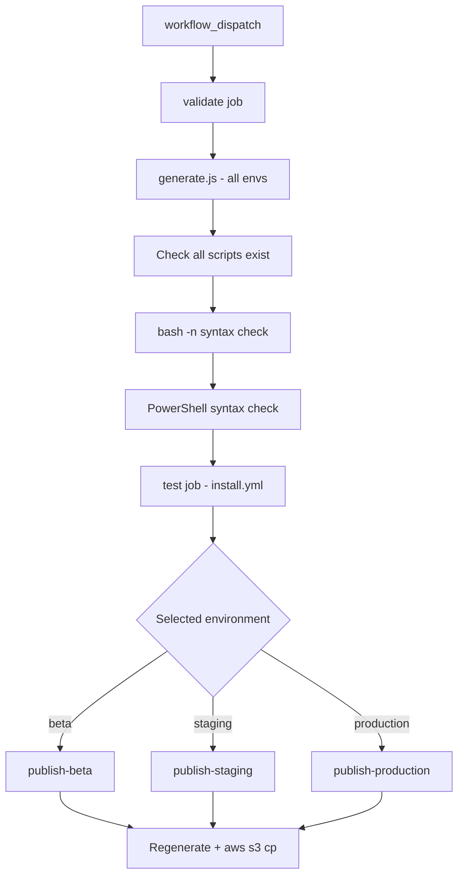

I'll trace the installer template generation and publish flow in the repo.
## Overview

Installer scripts are **not hand-written per environment**. They are **generated at build/publish time** from shared templates plus per-environment JSON configs. The generated output lives in `installers/dist/` (gitignored); what you commit is **templates + configs**.

---

## 1. Source layout

| Path | Role |
|------|------|
| `installers/templates/` | Shell/PowerShell templates with placeholders |
| `installers/configs/` | Per-environment download URLs and metadata |
| `installers/scripts/generate.js` | Template processor and generator |
| `installers/dist/[environment]/` | Generated scripts (not in git) |

There are **6 templates**: `unix.sh`, `linux64.sh`, `linux_arm64.sh`, `macos_amd64.sh`, `macos_arm64.sh`, `win64.ps1`.

There are **4 environments**: `production`, `beta`, `staging`, `canary`.

---

## 2. How generation works

Entry point: `installers/scripts/generate.js`.

### `main()` — which environments to build

```96:110:installers/scripts/generate.js
function main () {
    const environments = process.argv.slice(2);

    if (environments.length === 0) {
        environments.push('production', 'beta', 'staging', 'canary');
    }

    let total = 0;

    environments.forEach((env) => {
        total += generateEnvironmentScripts(env);
    });

    console.log(`Generated ${total} scripts in ${DIST_DIR}`);
}
```

- No args → all four environments.
- Args like `production canary` → only those.

### `generateEnvironmentScripts()` — per-environment loop

```68:88:installers/scripts/generate.js
function generateEnvironmentScripts (environment) {
    const config = JSON.parse(fs.readFileSync(path.join(CONFIGS_DIR, `${environment}.json`), 'utf8'));
    const envDistDir = path.join(DIST_DIR, environment);

    fs.mkdirSync(envDistDir, { recursive: true });

    const templates = fs.readdirSync(TEMPLATES_DIR).filter((f) => { return f.endsWith('.sh') || f.endsWith('.ps1'); });

    templates.forEach((templateFile) => {
        const templateContent = fs.readFileSync(path.join(TEMPLATES_DIR, templateFile), 'utf8');
        const processedContent = processTemplateContent(templateContent, config, PLATFORM_MAP[templateFile]);
        const outputPath = path.join(envDistDir, templateFile);

        fs.writeFileSync(outputPath, processedContent);

        if (templateFile.endsWith('.sh')) {
            fs.chmodSync(outputPath, 0o755);
        }
    });

    return templates.length;
}
```

For each environment it loads `installers/configs/{environment}.json`, reads every `.sh`/`.ps1` template, substitutes placeholders, writes to `installers/dist/{environment}/`, and chmods shell scripts to `755`.

### `processTemplateContent()` — placeholder substitution

Two template styles:

**Platform-specific** (`linux64.sh`, `win64.ps1`, etc.) — single `{{DOWNLOAD_URL}}`:

```8:8:installers/templates/linux64.sh
URL='{{DOWNLOAD_URL}}'
```

**Universal** (`unix.sh`) — OS/arch detection with URL patterns replaced as full strings:

```138:144:installers/templates/unix.sh
get_download_url() {
    platform="$1"
    case "$platform" in
        linux_amd64)    echo "{{BASE_URL}}/download/latest/linux64{{CHANNEL_PARAM}}" ;;
        linux_arm64)    echo "{{BASE_URL}}/download/latest/linux_arm64{{CHANNEL_PARAM}}" ;;
        macos_amd64)    echo "{{BASE_URL}}/download/latest/osx_64{{CHANNEL_PARAM}}" ;;
        macos_arm64)    echo "{{BASE_URL}}/download/latest/osx_arm64{{CHANNEL_PARAM}}" ;;
```

`processTemplateContent()` handles both:

```37:59:installers/scripts/generate.js
function processTemplateContent (content, config, platformKey) {
    let result = content.replace(/\{\{ENVIRONMENT\}\}/g, config.environment);

    if (platformKey) {
        result = result.replace(/\{\{DOWNLOAD_URL\}\}/g, config.downloadUrls[platformKey]);
    }
    else {
        // Handle unix.sh universal template
        result = result.replace(/\{\{BASE_URL\}\}\/download\/latest\/linux64\{\{CHANNEL_PARAM\}\}/g,
            config.downloadUrls.linux64);
        // ... same for linux_arm64, osx_64, osx_arm64
    }

    return result;
}
```

`PLATFORM_MAP` ties template filenames to config keys (e.g. `macos_amd64.sh` → `osx_64`).

### Config files — what gets injected

Example production config:

```1:11:installers/configs/production.json
{
  "environment": "production",
  "description": "Production environment configuration",
  "downloadUrls": {
    "linux64": "https://dl-cli.pstmn.io/download/latest/linux64",
    "linux_arm64": "https://dl-cli.pstmn.io/download/latest/linux_arm64",
    "osx_64": "https://dl-cli.pstmn.io/download/latest/osx_64",
    "osx_arm64": "https://dl-cli.pstmn.io/download/latest/osx_arm64",
    "win64": "https://dl-cli.pstmn.io/download/latest/win64"
  }
}
```

Canary adds `?channel=canary` on each URL. Beta/staging use different hostnames (`pstmn-beta.io`, `pstmn-stage.io`).

---

## 3. Local dev workflow after template changes

From `docs/installers.md`:

1. Edit `installers/templates/` (and optionally `installers/configs/`).
2. Generate locally:
   ```bash
   node installers/scripts/generate.js              # all envs
   node installers/scripts/generate.js production beta  # specific envs
   ```
3. Test generated scripts, e.g. `./installers/dist/production/unix.sh --verbose`.
4. Open a PR with **template/config changes** (not `installers/dist/` — it is gitignored).

---

## 4. How publishing works (CI)

Publishing is **manual** via the GitHub Actions workflow **"Publish Installer Scripts to S3"** (`.github/workflows/publish-installers.yml`), triggered with `workflow_dispatch` and an environment choice: `beta`, `staging`, or `production`.



### Phase 1: `validate` job

- Runs `node installers/scripts/generate.js` for all environments.
- Asserts all 6 scripts exist per env.
- Validates shell syntax (`bash -n`) and PowerShell tokenization.

### Phase 2: `test` job

Reuses `.github/workflows/install.yml`, which:

- Regenerates scripts again.
- Runs a cross-platform matrix (Windows CMD/PowerShell/pwsh, macOS Intel/ARM/Rosetta, Linux curl/wget, read-only env).
- Installs from `installers/dist/production/` and verifies `postman --version`.

Also runs on pushes to branches matching `**installation-script-test**` and on PRs via `workflow_call`.

### Phase 3: publish jobs (environment-specific)

Each publish job:

1. Regenerates scripts for that env (+ `canary` when relevant).
2. Authenticates to AWS via OIDC (`aws-actions/configure-aws-credentials`).
3. Uploads to S3 with `aws s3 cp` and correct content types.

**Beta** — all 6 scripts to the beta bucket:

```114:121:.github/workflows/publish-installers.yml
      - name: Upload beta scripts to S3
        run: |
          aws s3 cp installers/dist/beta/unix.sh "s3://$BETA_S3_BUCKET/install/unix.sh" ...
          aws s3 cp installers/dist/beta/linux64.sh ...
          # ... all platform scripts
```

**Staging** — same full set to the staging bucket.

**Production** — subset only:

```190:194:.github/workflows/publish-installers.yml
      - name: Upload production scripts to S3
        run: |
          aws s3 cp installers/dist/production/unix.sh "s3://$PRODUCTION_S3_BUCKET/install/unix.sh" ...
          aws s3 cp installers/dist/canary/unix.sh "s3://$PRODUCTION_S3_BUCKET/install/canary/unix.sh" ...
          aws s3 cp installers/dist/canary/win64.ps1 "s3://$PRODUCTION_S3_BUCKET/install/canary/win64.ps1" ...
```

Platform-specific production scripts are commented out pending monitoring of the unified `unix.sh` installer.

### Environment protection

- **Staging** and **production** use GitHub environment approvals.
- **Beta** can deploy without that gate.

Published URLs are served from CDN hosts like `https://dl-cli.pstmn.io/install/unix.sh` (see `docs/installers.md`).

---

## 5. End-to-end flow after you change a template

```
Edit installers/templates/*.sh|.ps1
        ↓
(Optional) Edit installers/configs/*.json
        ↓
PR with template/config changes
        ↓
CI: generate.js → validate syntax → install tests (on test branches / publish workflow)
        ↓
Merge
        ↓
Manual: Actions → "Publish Installer Scripts to S3" → pick environment
        ↓
generate.js (target env) → aws s3 cp → dl-cli.pstmn*.io/install/*
```

**Important files/functions:**

| File | Function / purpose |
|------|-------------------|
| `installers/scripts/generate.js` | `main`, `generateEnvironmentScripts`, `processTemplateContent` |
| `installers/templates/*` | Source templates with placeholders |
| `installers/configs/*.json` | Environment-specific URLs |
| `.github/workflows/publish-installers.yml` | Generate, validate, test, S3 publish |
| `.github/workflows/install.yml` | Cross-platform install testing |
| `docs/installers.md` | Developer docs for the full workflow |
