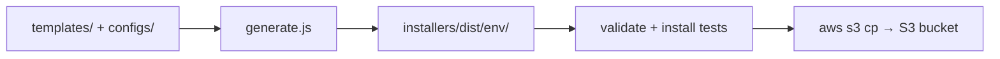

Tracing the installer template generation and publish flow in the codebase.
Here is how installer scripts are generated from templates and published in this repo.

## Overview

The system is **template + config → generate → validate/test → S3 upload**. Source of truth is `installers/templates/` and `installers/configs/`. Generated scripts land in `installers/dist/` (gitignored) and are built fresh in CI before publish.



---

## 1. Templates and configs

**Templates** (`installers/templates/`) are shell/PowerShell scripts with placeholders:

| Template | Placeholders |
|----------|--------------|
| Platform-specific (`linux64.sh`, `macos_amd64.sh`, `win64.ps1`, etc.) | `{{DOWNLOAD_URL}}`, sometimes `{{ENVIRONMENT}}` |
| Universal `unix.sh` | `{{ENVIRONMENT}}`, plus composite URL patterns like `{{BASE_URL}}/download/latest/linux64{{CHANNEL_PARAM}}` |

Example from a platform template:

```8:8:installers/templates/linux64.sh
URL='{{DOWNLOAD_URL}}'
```

Example from the universal template:

```11:11:installers/templates/unix.sh
ENVIRONMENT="{{ENVIRONMENT}}"
```

**Configs** (`installers/configs/*.json`) supply per-environment values: `environment` name and `downloadUrls` per platform key (`linux64`, `linux_arm64`, `osx_64`, `osx_arm64`, `win64`).

Example — production:

```1:11:installers/configs/production.json
{
  "environment": "production",
  "description": "Production environment configuration",
  "downloadUrls": {
    "linux64": "https://dl-cli.pstmn.io/download/latest/linux64",
    "linux_arm64": "https://dl-cli.pstmn.io/download/latest/linux_arm64",
    "osx_64": "https://dl-cli.pstmn.io/download/latest/osx_64",
    "osx_arm64": "https://dl-cli.pstmn.io/download/latest/osx_arm64",
    "win64": "https://dl-cli.pstmn.io/download/latest/win64"
  }
}
```

Canary is a separate config with `?channel=canary` on each URL (`installers/configs/canary.json`).

---

## 2. Generation: `installers/scripts/generate.js`

The generator is the core logic. Important pieces:

### `PLATFORM_MAP`

Maps template filenames to config keys. `unix.sh` is `null` (multi-platform):

```19:26:installers/scripts/generate.js
const PLATFORM_MAP = {
    'linux64.sh': 'linux64',
    'linux_arm64.sh': 'linux_arm64',
    'macos_amd64.sh': 'osx_64',
    'macos_arm64.sh': 'osx_arm64',
    'win64.ps1': 'win64',
    'unix.sh': null
};
```

### `processTemplateContent`

Substitutes placeholders:

- **`{{ENVIRONMENT}}`** → config environment name (all templates)
- **Platform templates:** `{{DOWNLOAD_URL}}` → `config.downloadUrls[platformKey]`
- **`unix.sh`:** whole URL patterns are replaced with full download URLs (not separate `BASE_URL` / `CHANNEL_PARAM` substitution):

```37:59:installers/scripts/generate.js
function processTemplateContent (content, config, platformKey) {
    let result = content.replace(/\{\{ENVIRONMENT\}\}/g, config.environment);

    if (platformKey) {
        result = result.replace(/\{\{DOWNLOAD_URL\}\}/g, config.downloadUrls[platformKey]);
    }
    else {
        // Handle unix.sh universal template
        result = result.replace(/\{\{BASE_URL\}\}\/download\/latest\/linux64\{\{CHANNEL_PARAM\}\}/g,
            config.downloadUrls.linux64);
        // ... same for linux_arm64, osx_64, osx_arm64
    }

    return result;
}
```

### `generateEnvironmentScripts`

For each environment:

1. Load `installers/configs/{environment}.json`
2. Create `installers/dist/{environment}/`
3. Read every `.sh` / `.ps1` in `templates/`
4. Process and write output
5. `chmod 755` on `.sh` files

```68:88:installers/scripts/generate.js
function generateEnvironmentScripts (environment) {
    const config = JSON.parse(fs.readFileSync(path.join(CONFIGS_DIR, `${environment}.json`), 'utf8'));
    const envDistDir = path.join(DIST_DIR, environment);
    // ...
    templates.forEach((templateFile) => {
        const templateContent = fs.readFileSync(path.join(TEMPLATES_DIR, templateFile), 'utf8');
        const processedContent = processTemplateContent(templateContent, config, PLATFORM_MAP[templateFile]);
        fs.writeFileSync(outputPath, processedContent);
        // ...
    });
}
```

### CLI usage

```96:109:installers/scripts/generate.js
function main () {
    const environments = process.argv.slice(2);

    if (environments.length === 0) {
        environments.push('production', 'beta', 'staging', 'canary');
    }
    // ...
}
```

- No args → all four environments
- Args → only those environments (e.g. `node installers/scripts/generate.js production canary`)

`installers/dist/` is in `.gitignore`; generated scripts are not committed — they are rebuilt in CI.

---

## 3. What to change locally

From `docs/installers.md` and `README.md`:

1. Edit `installers/templates/` (and configs if URLs/env change)
2. Generate locally: `node installers/scripts/generate.js`
3. Test: `./installers/dist/production/unix.sh --verbose`
4. Open a PR with **templates + configs** (not `dist/`)
5. After merge, **manually publish** via GitHub Actions

---

## 4. Publishing: `.github/workflows/publish-installers.yml`

Triggered by **workflow_dispatch** with environment choice: `beta`, `staging`, or `production`.

### Job 1: `validate`

1. **Generate** all environments: `node installers/scripts/generate.js`
2. **Check** all 6 scripts exist for each of `production`, `beta`, `staging`, `canary`
3. **Syntax:** `bash -n` for `.sh`, PowerShell tokenizer for `.ps1`

### Job 2: `test`

Reuses `.github/workflows/install.yml`, which also generates scripts and runs a cross-platform matrix (Linux/macOS/Windows, curl/wget, read-only env, Rosetta, etc.) against `installers/dist/production/*`.

### Jobs 3–5: `publish-beta`, `publish-staging`, `publish-production`

Each publish job:

1. Checks out repo
2. Regenerates scripts for target env (+ `canary` where needed)
3. Assumes AWS role via OIDC (`aws-actions/configure-aws-credentials`)
4. Uploads with `aws s3 cp` and explicit content-types

**What gets uploaded varies by environment:**

| Environment | Scripts uploaded to S3 |
|-------------|------------------------|
| **Beta** | All 6: `unix.sh`, `linux64.sh`, `linux_arm64.sh`, `osx_64.sh`, `osx_arm64.sh`, `win64.ps1` |
| **Staging** | Same full set as beta |
| **Production** | `unix.sh`, plus canary `canary/unix.sh` and `canary/win64.ps1` only — platform-specific production scripts are commented out pending monitoring |

Production upload (abbreviated):

```190:194:.github/workflows/publish-installers.yml
      - name: Upload production scripts to S3
        run: |
          aws s3 cp installers/dist/production/unix.sh "s3://$PRODUCTION_S3_BUCKET/install/unix.sh" --content-type "text/x-shellscript"
          aws s3 cp installers/dist/canary/unix.sh "s3://$PRODUCTION_S3_BUCKET/install/canary/unix.sh" --content-type "text/x-shellscript"
          aws s3 cp installers/dist/canary/win64.ps1 "s3://$PRODUCTION_S3_BUCKET/install/canary/win64.ps1" --content-type "application/x-powershell"
```

Note: macOS templates are uploaded as `osx_64.sh` / `osx_arm64.sh` on S3 (filename remap at upload time).

**Environment protection:** staging and production use GitHub environment approvals; beta can run without that gate.

**CDN:** `README.md` notes that stale CDN cache may require manual invalidation; there is no automated invalidation in the workflow yet.

---

## 5. End-to-end flow after installer changes

```
Edit templates/configs
        ↓
PR (templates + configs only)
        ↓
Merge
        ↓
Actions → "Publish Installer Scripts to S3" → Run workflow → pick env
        ↓
validate (generate + syntax check)
        ↓
test (install.yml matrix)
        ↓
publish-* (regenerate + aws s3 cp)
        ↓
Scripts served from dl-cli.pstmn*.io/install/...
```

---

## Key files referenced

| File | Role |
|------|------|
| `installers/scripts/generate.js` | Template processing and script generation |
| `installers/templates/*.sh`, `win64.ps1` | Source templates with placeholders |
| `installers/configs/*.json` | Per-environment download URLs |
| `docs/installers.md` | Developer docs and publishing status |
| `.github/workflows/publish-installers.yml` | Validate, test, S3 publish |
| `.github/workflows/install.yml` | Cross-platform install tests |
| `README.md` | Manual publish instructions |
| `.gitignore` | Excludes `installers/dist/` |

**Bottom line:** You change templates/configs in git; `generate.js` materializes environment-specific installers at build/CI time; the publish workflow validates, tests, then uploads the generated files to environment-specific S3 buckets for CDN serving.
