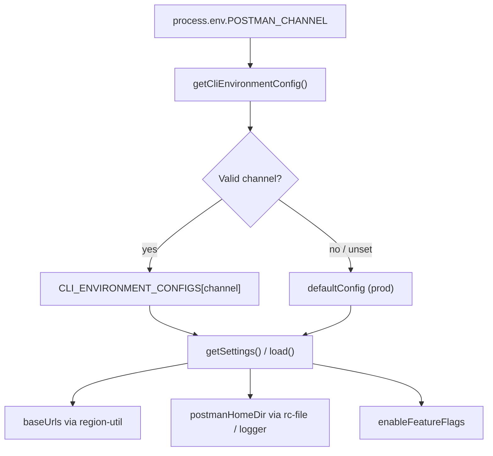

Tracing how `POSTMAN_CHANNEL` affects CLI runtime environment selection.
`POSTMAN_CHANNEL` is the single runtime switch that picks which **CLI environment profile** the Postman CLI uses. That profile controls API hostnames, where config and logs live on disk, and a few other environment-specific defaults. Nothing else in command code needs to branch on the channel directly — most of the CLI reads the selected profile through `cliEnvironment.getSettings()`.

## Overview



## 1. Detection and selection (`lib/config/cli-environment.js`)

The entry point is `getCliEnvironmentConfig()`. On first call it reads `process.env.POSTMAN_CHANNEL`, validates it against a fixed map, caches the result, and returns the matching config module:

```28:39:lib/config/cli-environment.js
function getCliEnvironmentConfig () {
    if (_cachedConfig) {
        return _cachedConfig;
    }

    // Detect CLI environment from POSTMAN_CHANNEL env var, default to prod
    const channel = process.env.POSTMAN_CHANNEL,
        env = VALID_CHANNELS.includes(channel) ? channel : 'prod';

    _cachedConfig = CLI_ENVIRONMENT_CONFIGS[env];

    return _cachedConfig;
}
```

The channel map is defined at module load:

```12:18:lib/config/cli-environment.js
    CLI_ENVIRONMENT_CONFIGS = {
        beta: betaConfig,
        stage: stageConfig,
        prod: defaultConfig,
        dev: betaConfig, // dev uses beta config
        test: betaConfig // test uses beta config
    },
```

| `POSTMAN_CHANNEL` | Config used | Effective `channel` in settings |
|---|---|---|
| *(unset)* | `default.js` | `prod` |
| `prod` | `default.js` | `prod` |
| `beta` | `beta.js` | `beta` |
| `stage` | `stage.js` | `stage` |
| `dev` | `beta.js` (alias) | `beta` |
| `test` | `beta.js` (alias) | `beta` |
| anything else (e.g. `canary`, `preview`) | `default.js` | `prod` |

Important behaviors:

- **Lazy, once-only**: Selection happens on the first call to `getSettings()` or `load()`, then `_cachedConfig` is reused for the rest of the process. Changing `POSTMAN_CHANNEL` mid-process has no effect.
- **Default is production**: Missing or invalid values fall back to `prod`.
- **Public API**: Only `load()` and `getSettings()` are exported; `getCliEnvironmentConfig()` is internal.

## 2. What each profile contains

Each profile is built by `createCliEnvironmentConfig()` in `lib/config/cli-environment/factory.js`, which wraps a `settings` object with `load()` (default CLI command options) and `getSettings()` (environment metadata).

The meaningful differences per channel are in three files:

| Setting | prod (`default.js`) | beta (`beta.js`) | stage (`stage.js`) |
|---|---|---|---|
| API hosts | `*.getpostman.com`, `*.postman.co` | `*-beta.com`, `*-beta.co` | `*-stage.com`, `*-stage.co` |
| `postmanHomeDir` | `.postman` | `.postman-beta` | `.postman-stage` |
| `logLevel` | `error` | `debug` | `info` |

Example (beta vs prod home dir and URLs):

```7:28:lib/config/cli-environment/beta.js
    settings = {
        channel: 'beta',
        baseUrls: {
            [REGIONS.US]: {
                api: 'https://api.getpostman-beta.com',
                artemis: 'https://go.postman-beta.co',
                iapub: 'https://iapub.postman-beta.co',
                gateway: 'https://gateway.postman-beta.com',
                // ...
            },
            // ...
        },
        postmanHomeDir: '.postman-beta',
        logLevel: 'debug',
```

```7:28:lib/config/cli-environment/default.js
    settings = {
        channel: 'prod',
        baseUrls: {
            [REGIONS.US]: {
                api: 'https://api.getpostman.com',
                artemis: 'https://go.postman.co',
                iapub: 'https://iapub.postman.co',
                gateway: 'https://gateway.postman.com',
                // ...
            },
            // ...
        },
        postmanHomeDir: '.postman',
        logLevel: 'error',
```

## 3. How the selected profile flows through the CLI

### Config file path (`lib/config/rc-file.js`)

`getHomeConfigDir()` reads `postmanHomeDir` from the active profile, so login state (`postmanrc`) is channel-isolated:

```28:31:lib/config/rc-file.js
    getHomeConfigDir = function () {
        const settings = cliEnvironment.getSettings();

        return join(os.homedir(), settings.postmanHomeDir);
```

With `POSTMAN_CHANNEL=beta`, credentials land in `~/.postman-beta/postmanrc` instead of `~/.postman/postmanrc`.

### API / service URLs (`lib/region-util.js` → `lib/util.js`)

`region-util.js` calls `cliEnvironment.getSettings()` in helpers like `getApiBaseUrls()`, `getGatewayBaseUrls()`, `getIapubBaseUrls()`, etc. Public helpers such as `util.POSTMAN_GATEWAY_BASE_URL()` and `util.POSTMAN_IAPUB_BASE_URL()` delegate to those.

Login is a concrete example — PKCE auth targets the channel-specific IAPUB host:

```30:36:lib/login/pkce-auth.js
    constructor (region = 'us') {
        // ...
        this.baseURL = util.POSTMAN_IAPUB_BASE_URL(region);
```

Most commands never touch `POSTMAN_CHANNEL`; they call `util.POSTMAN_*_BASE_URL()` and inherit the selected profile automatically.

Per-URL env overrides (e.g. `POSTMAN_GATEWAY_BASE_URL`) still take precedence over the profile’s `baseUrls`.

### Command option defaults (`lib/config/index.js`)

When merging CLI options, `config.get()` loads defaults via `cliEnvironment.load` alongside rc-file and process-env overrides. Channel affects those baked-in defaults, though the per-channel configs currently share the same base CLI options from the factory.

### Logs (`lib/logger/index.js`)

Logger init runs early in `bin/postman.js` and uses `postmanHomeDir` for log paths (`~/.postman-beta/logs/...` on beta).

### Feature flags (`lib/framework/feature-flags/index.js`)

`init()` reads `settings.enableFeatureFlags` from the active profile to decide which flags to fetch from the gateway features API.

### Runner working directory (`lib/commands/runner/utils/working-directory.js`)

Runner temp/data paths also use `postmanHomeDir`.

## 4. Build-time vs runtime

There are two ways `POSTMAN_CHANNEL` gets its value:

**Runtime (dev / unbundled):** `node dist/bin/postman.js` reads the live `process.env.POSTMAN_CHANNEL` when the config module is first loaded.

**Build-time (packaged/bundled CLI):** `npm/scripts/build.js` passes the channel into esbuild as a compile-time constant:

```26:26:npm/scripts/build.js
        channel = process.env.CHANNEL || process.env.POSTMAN_CHANNEL || 'prod';
```

```104:106:npm/scripts/build.js
            define: {
                'process.env.POSTMAN_CHANNEL': JSON.stringify(channel)
            },
```

For bundled binaries, the channel is **baked in at build time**. Setting `POSTMAN_CHANNEL=beta` at the shell when running a prod-built `dl-cli.pstmn.io` binary does not re-select the environment — which matches what your internal docs describe.

## 5. One-off direct read

`lib/api/integrations-service.ts` reads `process.env.POSTMAN_CHANNEL` directly (not via `cli-environment`) to decide whether to rewrite OAuth redirect URLs from `postman-beta.com` to `postman.com` — only in production:

```319:324:lib/api/integrations-service.ts
                    const channel = process.env.POSTMAN_CHANNEL;
                    const isProduction = !channel || channel === 'prod';

                    if (isProduction && body.redirectUrl) {
                        body.redirectUrl = body.redirectUrl.replace(/postman-beta\.com/g, 'postman.com');
                    }
```

## Summary

`POSTMAN_CHANNEL` selects a cached environment profile in `lib/config/cli-environment.js`. That profile drives:

1. **Backend endpoints** — via `region-util` / `util.POSTMAN_*_BASE_URL()`
2. **Local state** — `~/.postman`, `~/.postman-beta`, or `~/.postman-stage` for rcfile, logs, runner dirs
3. **Minor defaults** — log level, feature-flag fetch list, default CLI options

To target beta from source: `POSTMAN_CHANNEL=beta node dist/bin/postman.js <command>`. You must use the same channel on every invocation so rcfile, API hosts, and logs stay consistent. Unit tests in `tests/unit/framework/config/cli-environment.test.ts` document the full channel mapping and caching behavior.
