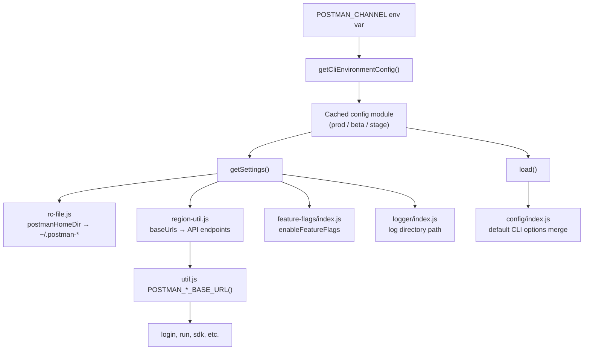

I'll trace how `POSTMAN_CHANNEL` is read and wired into CLI environment selection across the codebase.
`POSTMAN_CHANNEL` is the **runtime channel selector** for the CLI. It does not change command logic; it picks which **environment config module** supplies URLs, home directory, and feature-flag defaults for the whole process.

## Selection mechanism

The entry point is `lib/config/cli-environment.js`. On the **first** call to `getCliEnvironmentConfig()` (via `getSettings()` or `load()`), it reads `process.env.POSTMAN_CHANNEL`, validates it, caches the result, and never re-reads the env var.

```12:39:lib/config/cli-environment.js
    CLI_ENVIRONMENT_CONFIGS = {
        beta: betaConfig,
        stage: stageConfig,
        prod: defaultConfig,
        dev: betaConfig, // dev uses beta config
        test: betaConfig // test uses beta config
    },

    VALID_CHANNELS = Object.keys(CLI_ENVIRONMENT_CONFIGS);

let _cachedConfig = null;

function getCliEnvironmentConfig () {
    if (_cachedConfig) {
        return _cachedConfig;
    }

    // Detect CLI environment from POSTMAN_CHANNEL env var, default to prod
    const channel = process.env.POSTMAN_CHANNEL,
        env = VALID_CHANNELS.includes(channel) ? channel : 'prod';

    _cachedConfig = CLI_ENVIRONMENT_CONFIGS[env];

    return _cachedConfig;
}
```

**Mapping rules:**

| `POSTMAN_CHANNEL` | Config module | Effective `channel` in settings |
|---|---|---|
| unset / invalid | `default.js` | `prod` |
| `prod` | `default.js` | `prod` |
| `beta` | `beta.js` | `beta` |
| `stage` | `stage.js` | `stage` |
| `dev` | `beta.js` (alias) | `beta` |
| `test` | `beta.js` (alias) | `beta` |

Invalid values silently fall back to prod. `dev` and `test` deliberately reuse the beta config (same URLs and `~/.postman-beta` home dir).

The public API is two functions:

```46:56:lib/config/cli-environment.js
function load (callback) {
    return getCliEnvironmentConfig().load(callback);
}

function getSettings () {
    return getCliEnvironmentConfig().getSettings();
}
```

Each per-channel file (`default.js`, `beta.js`, `stage.js`) is built by `createCliEnvironmentConfig()` in `lib/config/cli-environment/factory.js`, which wraps a static `settings` object with `load()` (default Commander options) and `getSettings()`.

## What each channel config contains

Each settings object defines:

- **`channel`** — label (`prod`, `beta`, `stage`)
- **`baseUrls`** — per-region service URLs (`api`, `gateway`, `iapub`, `artemis`, `packman`, etc.)
- **`postmanHomeDir`** — config/log directory name under `$HOME`
- **`logLevel`** — declared per channel (though the main logger currently hardcodes `'info'`)
- **`enableFeatureFlags`** — list of flags to fetch from the Features API

Example for beta:

```7:33:lib/config/cli-environment/beta.js
    settings = {
        channel: 'beta',
        baseUrls: {
            [REGIONS.US]: {
                api: 'https://api.getpostman-beta.com',
                artemis: 'https://go.postman-beta.co',
                iapub: 'https://iapub.postman-beta.co',
                gateway: 'https://gateway.postman-beta.com',
                // ...
            },
            // ...
        },
        postmanHomeDir: '.postman-beta',
        logLevel: 'debug',
        enableFeatureFlags: [
            'grpc_protocol_execution_allowed',
            'graphql_v2_protocol_execution_allowed'
        ]
    };
```

Prod uses `~/.postman`; beta/dev/test use `~/.postman-beta`; stage uses `~/.postman-stage`.

## How the selected config propagates



### 1. Config file and credentials isolation

`lib/config/rc-file.js` resolves the rcfile path from `postmanHomeDir`:

```28:31:lib/config/rc-file.js
    getHomeConfigDir = function () {
        const settings = cliEnvironment.getSettings();

        return join(os.homedir(), settings.postmanHomeDir);
    },
```

So `POSTMAN_CHANNEL=beta` reads/writes `~/.postman-beta/postmanrc`, not `~/.postman/postmanrc`. Logins and profiles are **channel-scoped** — you must use the same channel on every invocation to see the same credentials.

### 2. API and service URLs

`lib/region-util.js` reads `cliEnvironment.getSettings().baseUrls` and exposes region-aware getters. `lib/util.js` re-exports them as `POSTMAN_API_BASE_URL()`, `POSTMAN_GATEWAY_BASE_URL()`, `POSTMAN_IAPUB_BASE_URL()`, etc.

Each getter checks for a **per-service override** env var first (e.g. `POSTMAN_API_BASE_URL`), then falls back to the channel config:

```274:281:lib/region-util.js
        getAPIBaseURL: function () {
            if (process.env.POSTMAN_API_BASE_URL) {
                return process.env.POSTMAN_API_BASE_URL;
            }
            const region = this.getCurrentRegion(),
                regionUrls = getApiBaseUrls();

            return regionUrls[region] || regionUrls[REGIONS.US];
        },
```

Login flows use these — e.g. PKCE auth sets `this.baseURL = util.POSTMAN_IAPUB_BASE_URL(region)` in `lib/login/pkce-auth.js`, and the login waterfall hits `iapub.postman-beta.co` (or prod equivalent) via `util.POSTMAN_IAPUB_BASE_URL()` in `lib/login/index.js`.

### 3. Default CLI options

`lib/config/index.js` merges config from four sources with priority **CLI args > env vars > rcfile > defaults**. The defaults layer calls `cliEnvironment.load`, which returns channel-specific default Commander options from the factory.

### 4. Feature flags

`lib/framework/feature-flags/index.js` reads `settings.enableFeatureFlags` and fetches only those flags from the channel's gateway URL.

### 5. Other consumers

- `lib/logger/index.js` — log path under `~/postmanHomeDir/logs`
- `lib/commands/runner/utils/working-directory.js` — runner working dirs under the channel home dir

## Startup timing and caching

Environment selection happens **lazily on first use**, not at module load. But it is **cached for the process lifetime** — changing `POSTMAN_CHANNEL` after the first `getSettings()` call has no effect (covered in `tests/unit/framework/config/cli-environment.test.ts`).

Early startup in `bin/postman.js` calls `require('../lib/logger').init()` before Commander parses args, which triggers `getSettings()` and locks in the channel immediately.

## Build-time vs runtime (important caveat)

When running from **source** (`node dist/bin/postman.js` after `tsc`), `POSTMAN_CHANNEL` is read from the shell at runtime — this is the path described above.

When building a **bundled binary**, `npm/scripts/build.js` uses esbuild's `define` to **replace** `process.env.POSTMAN_CHANNEL` with a compile-time string:

```26:26:npm/scripts/build.js
        channel = process.env.CHANNEL || process.env.POSTMAN_CHANNEL || 'prod';
```

```104:106:npm/scripts/build.js
            define: {
                'process.env.POSTMAN_CHANNEL': JSON.stringify(channel)
            },
```

That means a pre-built release artifact from `dl-cli.pstmn.io` may have `POSTMAN_CHANNEL` frozen to whatever was set at build time (typically `prod`), regardless of what you export in your shell. Source builds and unbundled `node dist/bin/postman.js` runs honor the runtime env var; bundled/pkg artifacts may not.

## Summary

`POSTMAN_CHANNEL` is a single env var that selects one of three environment profiles (with `dev`/`test` aliased to beta). That choice controls where the CLI stores credentials, which Postman stack it talks to, and which feature flags it considers — all through `cliEnvironment.getSettings()` / `load()` without branching in individual commands. Set it **before** starting the CLI, and use it consistently across sessions if you want the same auth profile and endpoints.
