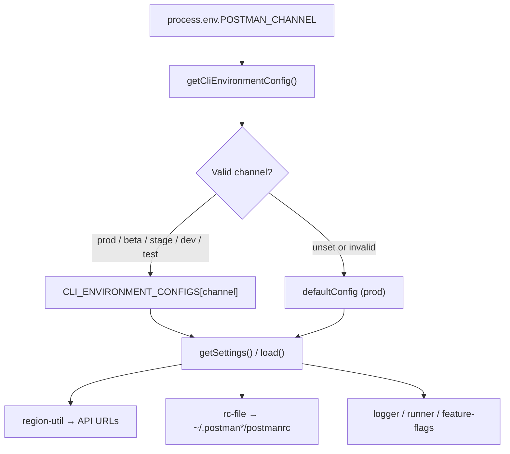

I'll trace how `POSTMAN_CHANNEL` flows through the CLI environment config and runtime selection.
`POSTMAN_CHANNEL` is the runtime switch that picks which **CLI environment profile** the process uses. That profile drives API hostnames, the home config directory, default command options, and feature-flag bootstrap — not individual Postman Environment files used in collections.

## Overview



The central resolver is `lib/config/cli-environment.js`. On the **first** call to `getCliEnvironmentConfig()` (via `getSettings()` or `load()`), it reads `process.env.POSTMAN_CHANNEL`, maps it to a config module, and caches that choice for the rest of the process lifetime.

```28:39:lib/config/cli-environment.js
function getCliEnvironmentConfig () {
    if (_cachedConfig) {
        return _cachedConfig;
    }

    // Detect CLI environment from POSTMAN_CHANNEL env var, default to prod
    const channel = process.env.POSTMAN_CHANNEL,
        env = VALID_CHANNELS.includes(channel) ? channel : 'prod';

    _cachedConfig = CLI_ENVIRONMENT_CONFIGS[env];

    return _cachedConfig;
}
```

## Channel → config mapping

Valid channels and their config modules are defined at module load time:

```12:20:lib/config/cli-environment.js
    CLI_ENVIRONMENT_CONFIGS = {
        beta: betaConfig,
        stage: stageConfig,
        prod: defaultConfig,
        dev: betaConfig, // dev uses beta config
        test: betaConfig // test uses beta config
    },

    VALID_CHANNELS = Object.keys(CLI_ENVIRONMENT_CONFIGS);
```

| `POSTMAN_CHANNEL` | Config module | Effective `channel` in settings |
|---|---|---|
| *(unset)* | `default.js` | `prod` |
| `prod` | `default.js` | `prod` |
| `beta` | `beta.js` | `beta` |
| `stage` | `stage.js` | `stage` |
| `dev` | `beta.js` (alias) | `beta` |
| `test` | `beta.js` (alias) | `beta` |
| anything else | `default.js` (fallback) | `prod` |

Unit tests in `tests/unit/framework/config/cli-environment.test.ts` lock in this behavior, including the cache semantics: once resolved, changing `POSTMAN_CHANNEL` later in the same process has no effect.

## What each environment profile contains

Each profile (`lib/config/cli-environment/default.js`, `beta.js`, `stage.js`) defines a `settings` object passed through `createCliEnvironmentConfig()` in `lib/config/cli-environment/factory.js`. That factory attaches two methods:

- `getSettings()` — returns environment-specific settings
- `load(callback)` — returns default CLI command options (merged with shared `BASE_CLI_OPTIONS`)

The settings differ mainly in:

1. **Service base URLs** (`baseUrls` per US/EU region) — e.g. beta uses `https://api.getpostman-beta.com`, prod uses `https://api.getpostman.com`
2. **`postmanHomeDir`** — `.postman`, `.postman-beta`, or `.postman-stage`
3. **`logLevel`** — `error` (prod), `debug` (beta), `info` (stage)
4. **`enableFeatureFlags`** — list of flags to fetch at startup

Example from beta:

```7:33:lib/config/cli-environment/beta.js
    settings = {
        channel: 'beta',
        baseUrls: {
            [REGIONS.US]: {
                api: 'https://api.getpostman-beta.com',
                artemis: 'https://go.postman-beta.co',
                iapub: 'https://iapub.postman-beta.co',
                gateway: 'https://gateway.postman-beta.com',
                // ...
            },
            // ...
        },
        postmanHomeDir: '.postman-beta',
        logLevel: 'debug',
        enableFeatureFlags: [
            'grpc_protocol_execution_allowed',
            'graphql_v2_protocol_execution_allowed'
        ]
    };
```

## How the selected profile affects runtime behavior

### 1. API and service URLs

`lib/region-util.js` calls `cliEnvironment.getSettings()` and reads `settings.baseUrls` for every service (API, gateway, IAPUB, packman, runtime agent, etc.). Those helpers are re-exported from `lib/util.js` as `POSTMAN_API_BASE_URL()`, `POSTMAN_GATEWAY_BASE_URL()`, and similar — so login, publish, collection run, and other commands all hit the channel-appropriate hosts without each command re-implementing URL logic.

Per-service env var overrides (e.g. `POSTMAN_GATEWAY_BASE_URL`) still take priority over the channel config when set.

### 2. Config file location (rcfile)

`lib/config/rc-file.js` uses `settings.postmanHomeDir` to resolve the home config path:

```28:31:lib/config/rc-file.js
    getHomeConfigDir = function () {
        const settings = cliEnvironment.getSettings();

        return join(os.homedir(), settings.postmanHomeDir);
    },
```

So `POSTMAN_CHANNEL=beta` stores credentials and profiles in `~/.postman-beta/postmanrc`, not `~/.postman/postmanrc`. You must use the same channel on every command to read/write the same login session.

### 3. Command default options

`lib/config/index.js` merges configuration from four sources when a command runs. The first parallel load is `cliEnvironment.load`, which supplies channel-specific default CLI options (reporters, timeouts, etc.):

```25:27:lib/config/index.js
    async.parallel([
        // Load the default options for all commands
        cliEnvironment.load,
```

### 4. Logs and working directories

- `lib/logger/index.js` writes logs under `~/{$postmanHomeDir}/logs/`
- `lib/commands/runner/utils/working-directory.js` uses `postmanHomeDir` for runner data paths

### 5. Feature flags

`lib/framework/feature-flags/index.js` reads `settings.enableFeatureFlags` and fetches those flags from the gateway URL for the active channel.

### 6. Direct read outside the config system

`lib/api/integrations-service.ts` reads `process.env.POSTMAN_CHANNEL` directly (not via `getSettings()`) to decide whether to rewrite OAuth redirect URLs from `postman-beta.com` to `postman.com` — treating unset or `prod` as production.

## Build-time vs runtime

There are two ways `POSTMAN_CHANNEL` can take effect:

**Runtime (source / dev):** Set the env var when invoking the CLI:

```bash
POSTMAN_CHANNEL=beta node dist/bin/postman.js login ...
```

**Build-time (bundled releases):** `npm/scripts/build.js` passes `process.env.CHANNEL || process.env.POSTMAN_CHANNEL || 'prod'` into esbuild’s `define`, baking the channel into the bundled binary:

```26:26:npm/scripts/build.js
        channel = process.env.CHANNEL || process.env.POSTMAN_CHANNEL || 'prod';
```

```104:106:npm/scripts/build.js
            define: {
                'process.env.POSTMAN_CHANNEL': JSON.stringify(channel)
            },
```

A release binary built with `CHANNEL=prod` will always behave as prod regardless of a runtime `POSTMAN_CHANNEL=beta` override — which is why docs note that some `dl-cli.pstmn.io` installs may not honor runtime channel switching.

## Key files

| File | Role |
|---|---|
| `lib/config/cli-environment.js` | Reads `POSTMAN_CHANNEL`, maps to config, caches |
| `lib/config/cli-environment/{default,beta,stage}.js` | Per-environment settings |
| `lib/config/cli-environment/factory.js` | Builds `load()` / `getSettings()` wrappers |
| `lib/region-util.js` | Resolves service URLs from active settings |
| `lib/config/rc-file.js` | Resolves `~/.postman*` home directory |
| `lib/config/index.js` | Wires `cliEnvironment.load` into command config merge |
| `npm/scripts/build.js` | Optional build-time channel inlining |
| `tests/unit/framework/config/cli-environment.test.ts` | Authoritative behavior tests |

In short: `POSTMAN_CHANNEL` selects one of three real backend environments (prod, beta, stage), with `dev`/`test` aliased to beta. That choice is fixed on first config access and propagates through URL resolution, credential storage paths, defaults, and feature-flag initialization for the entire CLI process.
