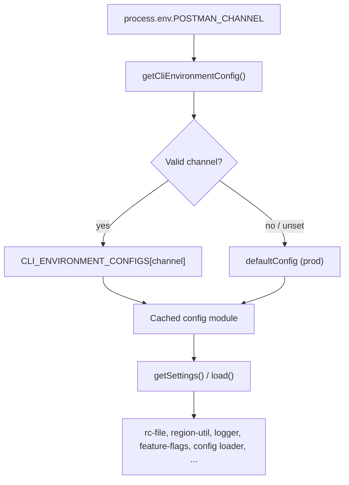

I'll trace how `POSTMAN_CHANNEL` flows through CLI environment selection by searching the codebase and reading the relevant config modules.
`POSTMAN_CHANNEL` is the single runtime switch that picks which **CLI environment profile** the Postman CLI uses. It does not change command logic; it changes config-derived values — API hosts, home directory, and related settings — that the rest of the codebase reads through one central module.

## Overview



---

## 1. Channel detection (the only place `POSTMAN_CHANNEL` is read)

All channel selection happens in `lib/config/cli-environment.js`. On the **first** call to `getCliEnvironmentConfig()`, the module reads `process.env.POSTMAN_CHANNEL`, validates it against a fixed map, caches the result, and returns the matching config module:

```12:39:lib/config/cli-environment.js
    CLI_ENVIRONMENT_CONFIGS = {
        beta: betaConfig,
        stage: stageConfig,
        prod: defaultConfig,
        dev: betaConfig, // dev uses beta config
        test: betaConfig // test uses beta config
    },

    VALID_CHANNELS = Object.keys(CLI_ENVIRONMENT_CONFIGS);

let _cachedConfig = null;

function getCliEnvironmentConfig () {
    if (_cachedConfig) {
        return _cachedConfig;
    }

    // Detect CLI environment from POSTMAN_CHANNEL env var, default to prod
    const channel = process.env.POSTMAN_CHANNEL,
        env = VALID_CHANNELS.includes(channel) ? channel : 'prod';

    _cachedConfig = CLI_ENVIRONMENT_CONFIGS[env];

    return _cachedConfig;
}
```

**Channel mapping:**

| `POSTMAN_CHANNEL` | Config module | Effective stack |
|---|---|---|
| *(unset)* or invalid | `default.js` | **prod** |
| `prod` | `default.js` | prod |
| `beta` | `beta.js` | beta |
| `stage` | `stage.js` | stage |
| `dev` | `beta.js` (same object) | beta |
| `test` | `beta.js` (same object) | beta |

Important behaviors:

- **Default is prod** — any missing or unrecognized value falls back to production.
- **`dev` and `test` are aliases for beta** — they load the exact same `betaConfig` module.
- **Selection is cached for the process lifetime** — changing `POSTMAN_CHANNEL` after the first `getSettings()` call has no effect (covered in `tests/unit/framework/config/cli-environment.test.ts`).

The public surface is two functions:

```46:56:lib/config/cli-environment.js
function load (callback) {
    return getCliEnvironmentConfig().load(callback);
}

function getSettings () {
    return getCliEnvironmentConfig().getSettings();
}
```

---

## 2. What each environment profile contains

Each profile (`default.js`, `beta.js`, `stage.js`) defines a `settings` object and wraps it with `createCliEnvironmentConfig()` from `lib/config/cli-environment/factory.js`, which adds `load()` (default CLI options) and `getSettings()`.

Example — **beta** settings:

```7:33:lib/config/cli-environment/beta.js
    settings = {
        channel: 'beta',
        baseUrls: {
            [REGIONS.US]: {
                api: 'https://api.getpostman-beta.com',
                artemis: 'https://go.postman-beta.co',
                iapub: 'https://iapub.postman-beta.co',
                gateway: 'https://gateway.postman-beta.com',
                packman: 'https://packman.pstmn-beta.io',
                runtimeAgent: 'https://ra.gw.postman-beta.com/v1',
                componentLibrary: 'https://components.pstmn-beta.io'
            },
            // ... EU URLs ...
        },
        postmanHomeDir: '.postman-beta',
        logLevel: 'debug',
        enableFeatureFlags: [
            'grpc_protocol_execution_allowed',
            'graphql_v2_protocol_execution_allowed'
        ]
    };
```

**Prod** (`default.js`) uses `https://api.getpostman.com`, `postmanHomeDir: '.postman'`, `logLevel: 'error'`.  
**Stage** (`stage.js`) uses `*.getpostman-stage.com` hosts and `postmanHomeDir: '.postman-stage'`.

So `POSTMAN_CHANNEL=beta` means: hit beta APIs, store credentials under `~/.postman-beta/`, and use beta-specific feature-flag and logging settings.

---

## 3. How the selected profile propagates through the CLI

Everything downstream calls `cliEnvironment.getSettings()` (or `load()`), never reads `POSTMAN_CHANNEL` directly.

### Config and credentials path

`lib/config/rc-file.js` uses `settings.postmanHomeDir` to resolve where `postmanrc` lives:

```28:31:lib/config/rc-file.js
    getHomeConfigDir = function () {
        const settings = cliEnvironment.getSettings();

        return join(os.homedir(), settings.postmanHomeDir);
    },
```

So `POSTMAN_CHANNEL=beta` → `~/.postman-beta/postmanrc`. Prod uses `~/.postman/postmanrc`. Logins are **channel-isolated** — a profile written under one channel is invisible to another.

### API base URLs

`lib/region-util.js` reads `settings.baseUrls` and exposes per-service URL getters. Those are wired into `lib/util.js` as `util.POSTMAN_API_BASE_URL()`, `util.POSTMAN_GATEWAY_BASE_URL()`, etc., which login, collection run, specs, monitors, SDK, and most other commands use.

Example for the API URL:

```68:75:lib/region-util.js
    getApiBaseUrls = function () {
        const settings = cliEnvironment.getSettings();

        return {
            [REGIONS.US]: settings.baseUrls[REGIONS.US].api,
            [REGIONS.EU]: settings.baseUrls[REGIONS.EU].api
        };
    },
```

Login (`lib/login/index.js`) calls `util.POSTMAN_IAPUB_BASE_URL(region)` for auth — so channel selection determines which IAM stack validates your API key.

**Note:** Individual `POSTMAN_*_BASE_URL` env vars (e.g. `POSTMAN_GATEWAY_BASE_URL`) can override channel-selected URLs in `region-util.js`. Those overrides are independent of `POSTMAN_CHANNEL`.

### Command option defaults

`lib/config/index.js` merges config from four sources with priority CLI > env > rcfile > defaults. The defaults layer comes from `cliEnvironment.load`:

```25:27:lib/config/index.js
    async.parallel([
        // Load the default options for all commands
        cliEnvironment.load,
```

### Logging, feature flags, runner paths

- `lib/logger/index.js` — log directory under `~/settings.postmanHomeDir/logs`
- `lib/framework/feature-flags/index.js` — reads `settings.enableFeatureFlags` and fetches flags from the channel's gateway
- `lib/commands/runner/utils/working-directory.js` — runner data under `~/settings.postmanHomeDir/cli`

### Startup order

`bin/postman.js` initializes the logger early (line 30), which triggers the first `getSettings()` call — so `POSTMAN_CHANNEL` must be set **before** the CLI process starts.

---

## 4. Build-time vs runtime (important caveat)

When the CLI is **bundled** via `npm/scripts/build.js`, esbuild replaces `process.env.POSTMAN_CHANNEL` with a **compile-time literal**:

```26:27:npm/scripts/build.js
        channel = process.env.CHANNEL || process.env.POSTMAN_CHANNEL || 'prod';
```

```104:106:npm/scripts/build.js
            define: {
                'process.env.POSTMAN_CHANNEL': JSON.stringify(channel)
            },
```

For release/bundled binaries, the channel is often **baked in at build time** (defaulting to `prod`), not read from the shell at runtime. That is why docs note that the `dl-cli.pstmn.io` binary may ignore `POSTMAN_CHANNEL=beta` even though the source in `cli-environment.js` supports it. Running from source/build output (`node dist/bin/postman.js`) honors the runtime env var normally.

---

## 5. Valid channel constants

Channel string values are defined in `npm/config/constants.js` under `CHANNELS` (`prod`, `beta`, `stage`, `dev`, `test`). These are used in tests and CI; runtime detection uses the string keys directly in `cli-environment.js`.

---

## Summary

`POSTMAN_CHANNEL` → `getCliEnvironmentConfig()` in `lib/config/cli-environment.js` → one of `{prod, beta, stage}` config modules (with `dev`/`test` aliased to beta) → cached for the process → consumed via `getSettings()` / `load()` by rc-file (credentials path), region-util/util (all API hosts), logger, feature flags, and the config merger. Command code stays the same; only the resolved environment values change. For bundled releases, check whether the channel was frozen at build time rather than assuming runtime override works.
