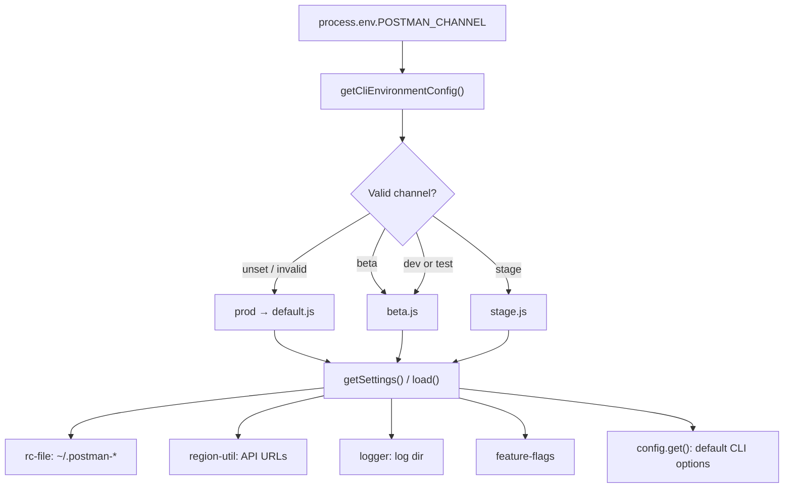

Tracing how `POSTMAN_CHANNEL` affects CLI runtime environment selection.
`POSTMAN_CHANNEL` is the runtime switch that picks which **CLI environment profile** the process uses. It does not change command code; it changes resolved config — API hosts, home directory, default CLI options, and feature-flag wiring.

## Overview

At a high level:

1. On first access, `lib/config/cli-environment.js` reads `process.env.POSTMAN_CHANNEL`.
2. It maps that value to one of five channel keys (`prod`, `beta`, `stage`, `dev`, `test`).
3. It loads the matching profile module (`default.js`, `beta.js`, or `stage.js`).
4. The rest of the CLI calls `getSettings()` or `load()` on that module and inherits channel-specific behavior.



## 1. Channel detection and selection

The entry point is `getCliEnvironmentConfig()` in `lib/config/cli-environment.js`:

```12:39:lib/config/cli-environment.js
    CLI_ENVIRONMENT_CONFIGS = {
        beta: betaConfig,
        stage: stageConfig,
        prod: defaultConfig,
        dev: betaConfig, // dev uses beta config
        test: betaConfig // test uses beta config
    },

    VALID_CHANNELS = Object.keys(CLI_ENVIRONMENT_CONFIGS);

let _cachedConfig = null;

function getCliEnvironmentConfig () {
    if (_cachedConfig) {
        return _cachedConfig;
    }

    // Detect CLI environment from POSTMAN_CHANNEL env var, default to prod
    const channel = process.env.POSTMAN_CHANNEL,
        env = VALID_CHANNELS.includes(channel) ? channel : 'prod';

    _cachedConfig = CLI_ENVIRONMENT_CONFIGS[env];

    return _cachedConfig;
}
```

**Rules:**

| `POSTMAN_CHANNEL` | Config module used | Effective `channel` in settings |
|---|---|---|
| unset or invalid | `default.js` | `prod` |
| `prod` | `default.js` | `prod` |
| `beta` | `beta.js` | `beta` |
| `stage` | `stage.js` | `stage` |
| `dev` | `beta.js` (alias) | `beta` |
| `test` | `beta.js` (alias) | `beta` |

Notes:

- **Default is production** when the variable is unset or not in `VALID_CHANNELS`.
- **`dev` and `test` are aliases for beta** — they load `beta.js`, so settings report `channel: 'beta'`.
- **Selection is cached for the process lifetime** — changing `POSTMAN_CHANNEL` after the first `getSettings()`/`load()` call has no effect (covered in `tests/unit/framework/config/cli-environment.test.ts`).

The public API is:

```46:56:lib/config/cli-environment.js
function load (callback) {
    return getCliEnvironmentConfig().load(callback);
}

function getSettings () {
    return getCliEnvironmentConfig().getSettings();
}
```

## 2. What each environment profile contains

Each profile (`default.js`, `beta.js`, `stage.js`) defines a `settings` object and passes it through `createCliEnvironmentConfig()` in `lib/config/cli-environment/factory.js`, which returns:

- `getSettings()` — channel-specific settings
- `load(callback)` — default Commander options (shared base options, optionally overridden per channel)

Production (`default.js`):

```7:33:lib/config/cli-environment/default.js
    settings = {
        channel: 'prod',
        baseUrls: {
            [REGIONS.US]: {
                api: 'https://api.getpostman.com',
                artemis: 'https://go.postman.co',
                // ...
            },
            // ...
        },
        postmanHomeDir: '.postman',
        logLevel: 'error',
        enableFeatureFlags: [
            'grpc_protocol_execution_allowed',
            'graphql_v2_protocol_execution_allowed'
        ]
    };
```

Beta (`beta.js`) — different hosts and home dir:

```7:33:lib/config/cli-environment/beta.js
    settings = {
        channel: 'beta',
        baseUrls: {
            [REGIONS.US]: {
                api: 'https://api.getpostman-beta.com',
                // ...
            },
            // ...
        },
        postmanHomeDir: '.postman-beta',
        logLevel: 'debug',
        enableFeatureFlags: [ /* same flags */ ]
    };
```

Stage (`stage.js`) uses `.postman-stage` and `*.postman-stage.com` hosts.

## 3. How the selected profile affects runtime behavior

### Config file location (credentials, profiles)

`lib/config/rc-file.js` resolves the home config dir from `getSettings().postmanHomeDir`:

```28:31:lib/config/rc-file.js
    getHomeConfigDir = function () {
        const settings = cliEnvironment.getSettings();

        return join(os.homedir(), settings.postmanHomeDir);
    },
```

So:

- `POSTMAN_CHANNEL=beta` → `~/.postman-beta/postmanrc`
- unset / `prod` → `~/.postman/postmanrc`

Logins and profiles are **channel-scoped** — a profile written under one home dir is invisible to another channel.

### API and service base URLs

`lib/region-util.js` reads `cliEnvironment.getSettings().baseUrls` and exposes getters like `getAPIBaseURL()`, `getGatewayBaseURL()`, etc. Those are bound in `lib/util.js` as `POSTMAN_API_BASE_URL()`, `POSTMAN_GATEWAY_BASE_URL()`, and used across login, collection run, cloud upload, integrations, and similar paths.

Each getter checks for an explicit override env var first (e.g. `POSTMAN_API_BASE_URL`), then falls back to the channel config:

```274:281:lib/region-util.js
        getAPIBaseURL: function () {
            if (process.env.POSTMAN_API_BASE_URL) {
                return process.env.POSTMAN_API_BASE_URL;
            }
            const region = this.getCurrentRegion(),
                regionUrls = getApiBaseUrls();

            return regionUrls[region] || regionUrls[REGIONS.US];
        },
```

So `POSTMAN_CHANNEL` sets the **default** stack; per-service env vars can still override individual URLs.

### Default CLI command options

`lib/config/index.js` merges config from several sources. The first parallel load is `cliEnvironment.load`, which supplies channel-specific default Commander options:

```25:27:lib/config/index.js
    async.parallel([
        // Load the default options for all commands
        cliEnvironment.load,
```

Priority: CLI args > process env > rc file > defaults from the selected channel profile.

### Logger home directory

`bin/postman.js` initializes the logger very early:

```29:30:bin/postman.js
require('../lib/node-version-check');
require('../lib/logger').init();
```

`lib/logger/index.js` uses `settings.postmanHomeDir` to pick the log path (`~/.postman/logs` vs `~/.postman-beta/logs`, etc.).

### Feature flags

`lib/framework/feature-flags/index.js` reads `settings.enableFeatureFlags` from the active channel profile and fetches only those flags from the Features API (using auth from the channel-scoped rc file).

### One direct `POSTMAN_CHANNEL` read outside the config system

`lib/api/integrations-service.ts` reads `process.env.POSTMAN_CHANNEL` directly to decide OAuth redirect URL normalization (beta → prod URL rewrite only when channel is unset or `prod`):

```317:324:lib/api/integrations-service.ts
                    const channel = process.env.POSTMAN_CHANNEL;
                    const isProduction = !channel || channel === 'prod';

                    if (isProduction && body.redirectUrl) {
                        body.redirectUrl = body.redirectUrl.replace(/postman-beta\.com/g, 'postman.com');
                    }
```

## 4. Build-time vs runtime (important caveat)

When you run from source (`node dist/bin/postman.js`), `POSTMAN_CHANNEL` is read at runtime from the environment.

When the CLI is **bundled**, `npm/scripts/build.js` can **freeze** the channel at build time via esbuild `define`:

```26:26:npm/scripts/build.js
        channel = process.env.CHANNEL || process.env.POSTMAN_CHANNEL || 'prod';
```

```104:106:npm/scripts/build.js
            define: {
                'process.env.POSTMAN_CHANNEL': JSON.stringify(channel)
            },
```

A pre-built binary shipped with `channel = 'prod'` baked in will not honor a runtime `POSTMAN_CHANNEL=beta` — which matches the behavior described in your untracked docs for the `dl-cli.pstmn.io` artifact.

## Summary

`POSTMAN_CHANNEL` selects a cached CLI environment profile in `lib/config/cli-environment.js`. That profile drives:

1. **Where config lives** — `postmanHomeDir` via `rc-file.js`
2. **Which Postman stack to talk to** — `baseUrls` via `region-util.js` → `util.js`
3. **Default command options** — `load()` via `config/index.js`
4. **Logging and feature flags** — `logger/index.js`, `feature-flags/index.js`

Command implementations stay the same; only resolved configuration changes. For local/source runs, set `POSTMAN_CHANNEL=beta` (or `dev`/`test`, which also route to beta) before invoking the CLI, and use it consistently so reads and writes hit the same rc file and API hosts.
