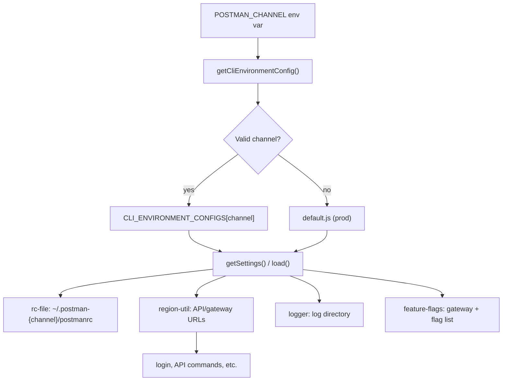

I'll trace how `POSTMAN_CHANNEL` is read and wired into CLI environment selection by searching the codebase and following the config path.
`POSTMAN_CHANNEL` is the runtime switch that picks which **CLI environment profile** the process uses. It does not change command logic; it changes config-derived values — API hosts, home directory, log paths, and feature-flag lists.

## Selection mechanism

The entire channel selection lives in `lib/config/cli-environment.js`. On the **first** call to `getSettings()` or `load()`, `getCliEnvironmentConfig()` reads `process.env.POSTMAN_CHANNEL`, validates it, and caches the result for the rest of the process:

```28:39:lib/config/cli-environment.js
function getCliEnvironmentConfig () {
    if (_cachedConfig) {
        return _cachedConfig;
    }

    // Detect CLI environment from POSTMAN_CHANNEL env var, default to prod
    const channel = process.env.POSTMAN_CHANNEL,
        env = VALID_CHANNELS.includes(channel) ? channel : 'prod';

    _cachedConfig = CLI_ENVIRONMENT_CONFIGS[env];

    return _cachedConfig;
}
```

The channel-to-config map is defined at module load time:

```12:18:lib/config/cli-environment.js
    CLI_ENVIRONMENT_CONFIGS = {
        beta: betaConfig,
        stage: stageConfig,
        prod: defaultConfig,
        dev: betaConfig, // dev uses beta config
        test: betaConfig // test uses beta config
    },
```

| `POSTMAN_CHANNEL` | Config module | Effective `channel` in settings |
|---|---|---|
| *(unset)* | `default.js` (prod) | `prod` |
| `prod` | `default.js` | `prod` |
| `beta` | `beta.js` | `beta` |
| `stage` | `stage.js` | `stage` |
| `dev` | `beta.js` | `beta` |
| `test` | `beta.js` | `beta` |
| anything else | `default.js` (prod) | `prod` |

Important behaviors:

1. **Lazy + cached** — selection happens on first use, not at import time. After that, changing `POSTMAN_CHANNEL` in the same process has no effect (confirmed in `tests/unit/framework/config/cli-environment.test.ts`).
2. **`dev` and `test` silently alias to beta** — they load `beta.js`, so settings report `channel: 'beta'`.
3. **Invalid values fall back to prod** — typos route to production config.

## What each environment profile contains

Each profile (`default.js`, `beta.js`, `stage.js`) is built by `createCliEnvironmentConfig()` in `lib/config/cli-environment/factory.js`, which wraps a static `settings` object with `load()` and `getSettings()` methods.

Example — beta vs prod:

```7:33:lib/config/cli-environment/beta.js
    settings = {
        channel: 'beta',
        baseUrls: {
            [REGIONS.US]: {
                api: 'https://api.getpostman-beta.com',
                artemis: 'https://go.postman-beta.co',
                // ...
            },
            // ...
        },
        postmanHomeDir: '.postman-beta',
        logLevel: 'debug',
        enableFeatureFlags: [
            'grpc_protocol_execution_allowed',
            'graphql_v2_protocol_execution_allowed'
        ]
    };
```

```7:33:lib/config/cli-environment/default.js
    settings = {
        channel: 'prod',
        baseUrls: {
            [REGIONS.US]: {
                api: 'https://api.getpostman.com',
                artemis: 'https://go.postman.co',
                // ...
            },
            // ...
        },
        postmanHomeDir: '.postman',
        logLevel: 'error',
        enableFeatureFlags: [ /* same flags */ ]
    };
```

Per-channel differences: `baseUrls`, `postmanHomeDir`, and `logLevel`. Feature-flag names are the same across channels; which gateway they hit depends on the channel's URLs.

## How the selected config propagates through the CLI

The public API is two functions exported from `cli-environment.js`:

- **`getSettings()`** — returns the channel's settings object
- **`load(callback)`** — returns channel-specific default CLI options (merged in config loading)

### 1. Startup (`bin/postman.js`)

Logger init runs early and calls `getSettings()` to pick the log directory:

```29:30:bin/postman.js
require('../lib/node-version-check');
require('../lib/logger').init();
```

```12:19:lib/logger/index.js
        init () {
            const settings = cliEnvironment.getSettings(),
                postmanHomeDir = settings.postmanHomeDir || '.postman';
            // ...
            logPath = path.join(homeDir, postmanHomeDir, 'logs');
```

With `POSTMAN_CHANNEL=beta`, logs go to `~/.postman-beta/logs/` instead of `~/.postman/logs/`.

### 2. Credentials and RC file (`lib/config/rc-file.js`)

The home config directory is derived from `postmanHomeDir`:

```28:31:lib/config/rc-file.js
    getHomeConfigDir = function () {
        const settings = cliEnvironment.getSettings();

        return join(os.homedir(), settings.postmanHomeDir);
    },
```

So `POSTMAN_CHANNEL=beta` reads/writes `~/.postman-beta/postmanrc`; prod uses `~/.postman/postmanrc`. Logins are **channel-isolated** — a profile saved under one channel is invisible to another.

### 3. API base URLs (`lib/region-util.js` → `lib/util.js`)

`region-util.js` reads `cliEnvironment.getSettings().baseUrls` for every service (API, gateway, artemis, packman, etc.). Individual URL getters (e.g. `getAPIBaseURL`) can still be overridden by per-service env vars like `POSTMAN_API_BASE_URL`, but the channel defaults come from the selected profile:

```274:281:lib/region-util.js
        getAPIBaseURL: function () {
            if (process.env.POSTMAN_API_BASE_URL) {
                return process.env.POSTMAN_API_BASE_URL;
            }
            const region = this.getCurrentRegion(),
                regionUrls = getApiBaseUrls();

            return regionUrls[region] || regionUrls[REGIONS.US];
        },
```

`lib/util.js` exposes these as `POSTMAN_API_BASE_URL()`, `POSTMAN_GATEWAY_BASE_URL()`, etc., which login, feature flags, and API commands use. For example, `postman login --with-api-key` validates keys against the channel-selected API host via `regionUtil.validateApiKeyForRegion` in `lib/login/index.js`.

### 4. Command default options (`lib/config/index.js`)

When any command loads merged config, `cliEnvironment.load` is one of the parallel sources:

```25:28:lib/config/index.js
    async.parallel([
        // Load the default options for all commands
        cliEnvironment.load,
```

This supplies channel-specific default CLI options (currently the same base options from `factory.js` for all channels, but the hook is channel-aware).

### 5. Feature flags (`lib/framework/feature-flags/index.js`)

Feature flag fetching uses the channel's gateway URL (via `util.POSTMAN_GATEWAY_BASE_URL()`) and the channel's `enableFeatureFlags` list:

```96:98:lib/framework/feature-flags/index.js
    const settings = cliEnvironment.getSettings(),
        featureNames = settings.enableFeatureFlags,
        profile = getDefaultProfile();
```

It also reads the RC file from the channel-specific home dir via `rcfile.loadSync`.

## End-to-end flow



## Build-time caveat

When the CLI is built via `npm/scripts/build.js`, esbuild **replaces** `process.env.POSTMAN_CHANNEL` with a compile-time string:

```104:106:npm/scripts/build.js
            define: {
                'process.env.POSTMAN_CHANNEL': JSON.stringify(channel)
            },
```

The build reads `process.env.CHANNEL || process.env.POSTMAN_CHANNEL || 'prod'`. A shipped binary may have the channel **frozen at build time**, so a runtime `POSTMAN_CHANNEL=beta` prefix may have no effect on that artifact. Source/dev runs (`node dist/bin/postman.js`) read the env var at runtime normally.

## One secondary direct read

`lib/api/integrations-service.ts` reads `POSTMAN_CHANNEL` directly (not via `getSettings()`) to decide whether to rewrite OAuth redirect URLs from `postman-beta.com` to `postman.com` — a prod-only normalization. The main routing path remains `cli-environment.js`.

## Practical usage

```bash
# Point at beta stack + beta credentials store
POSTMAN_CHANNEL=beta postman login --with-api-key "$SA_KEY"
POSTMAN_CHANNEL=beta postman collection run ...
```

Unset or `POSTMAN_CHANNEL=prod` → production URLs and `~/.postman/`.
