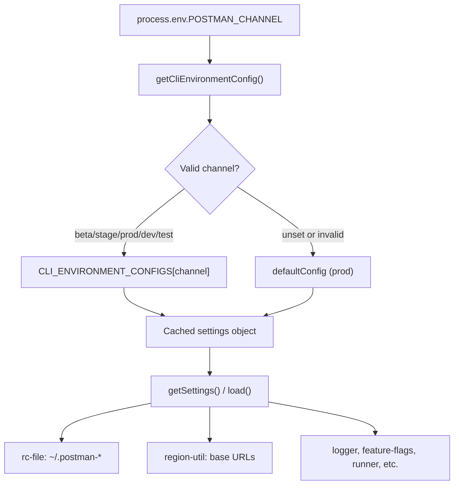

Tracing how `POSTMAN_CHANNEL` affects CLI runtime environment selection.
`POSTMAN_CHANNEL` is the runtime switch that picks which **CLI environment profile** the process uses. It does not change command logic; it changes resolved config: API hosts, home directory, log level, and feature-flag targets.

## Overview



---

## 1. Detection and selection (the core mechanism)

All channel selection lives in `lib/config/cli-environment.js`.

On **first** call to `getSettings()` or `load()`, `getCliEnvironmentConfig()` reads `process.env.POSTMAN_CHANNEL`, validates it against known keys, and caches the result for the rest of the process:

```28:39:lib/config/cli-environment.js
function getCliEnvironmentConfig () {
    if (_cachedConfig) {
        return _cachedConfig;
    }

    // Detect CLI environment from POSTMAN_CHANNEL env var, default to prod
    const channel = process.env.POSTMAN_CHANNEL,
        env = VALID_CHANNELS.includes(channel) ? channel : 'prod';

    _cachedConfig = CLI_ENVIRONMENT_CONFIGS[env];

    return _cachedConfig;
}
```

The channel-to-config map is defined at module load time:

```12:20:lib/config/cli-environment.js
    CLI_ENVIRONMENT_CONFIGS = {
        beta: betaConfig,
        stage: stageConfig,
        prod: defaultConfig,
        dev: betaConfig, // dev uses beta config
        test: betaConfig // test uses beta config
    },

    VALID_CHANNELS = Object.keys(CLI_ENVIRONMENT_CONFIGS);
```

| `POSTMAN_CHANNEL` | Config module | Effective `channel` in settings |
|---|---|---|
| *(unset)* | `default.js` | `prod` |
| `prod` | `default.js` | `prod` |
| `beta` | `beta.js` | `beta` |
| `stage` | `stage.js` | `stage` |
| `dev` | `beta.js` (alias) | `beta` |
| `test` | `beta.js` (alias) | `beta` |
| anything else | `default.js` (fallback) | `prod` |

**Important behaviors:**
- Selection is **lazy** (first use) and **cached** — changing `POSTMAN_CHANNEL` after the first read has no effect in the same process.
- `dev` and `test` are aliases for the beta profile, not separate environments.

Unit tests in `tests/unit/framework/config/cli-environment.test.ts` document this mapping.

---

## 2. What each environment profile contains

Each profile is built by `createCliEnvironmentConfig()` in `lib/config/cli-environment/factory.js`, which wraps a static `settings` object with `load()` and `getSettings()`.

The settings differ per environment. Example — **production** (`default.js`):

```7:33:lib/config/cli-environment/default.js
    settings = {
        channel: 'prod',
        baseUrls: {
            [REGIONS.US]: {
                api: 'https://api.getpostman.com',
                artemis: 'https://go.postman.co',
                iapub: 'https://iapub.postman.co',
                gateway: 'https://gateway.postman.com',
                // ...
            },
            // ...
        },
        postmanHomeDir: '.postman',
        logLevel: 'error',
        enableFeatureFlags: [ /* ... */ ]
    };
```

**Beta** (`beta.js`) changes hosts and local paths:

```7:33:lib/config/cli-environment/beta.js
    settings = {
        channel: 'beta',
        baseUrls: {
            [REGIONS.US]: {
                api: 'https://api.getpostman-beta.com',
                artemis: 'https://go.postman-beta.co',
                iapub: 'https://iapub.postman-beta.co',
                gateway: 'https://gateway.postman-beta.com',
                // ...
            },
            // ...
        },
        postmanHomeDir: '.postman-beta',
        logLevel: 'debug',
        enableFeatureFlags: [ /* ... */ ]
    };
```

**Stage** uses `.postman-stage` and `*-stage` hosts (`lib/config/cli-environment/stage.js`).

---

## 3. How the selected profile propagates through the CLI

### Config and credentials (rcfile)

`lib/config/rc-file.js` calls `cliEnvironment.getSettings()` to pick the home config directory:

```28:31:lib/config/rc-file.js
    getHomeConfigDir = function () {
        const settings = cliEnvironment.getSettings();

        return join(os.homedir(), settings.postmanHomeDir);
    },
```

So `POSTMAN_CHANNEL=beta` → `~/.postman-beta/postmanrc`, not `~/.postman/postmanrc`. Login profiles, API keys, and aliases are isolated per channel.

### API base URLs (region-util → util)

`lib/region-util.js` reads `settings.baseUrls` from the selected profile and exposes region-aware URL getters. Example for gateway:

```55:61:lib/region-util.js
    getGatewayBaseUrls = function () {
        const settings = cliEnvironment.getSettings();

        return {
            [REGIONS.US]: settings.baseUrls[REGIONS.US].gateway,
            [REGIONS.EU]: settings.baseUrls[REGIONS.EU].gateway
        };
    },
```

Those are wired into `lib/util.js` as `POSTMAN_GATEWAY_BASE_URL()`, `POSTMAN_API_BASE_URL()`, `POSTMAN_IAPUB_BASE_URL()`, etc., which most commands use for HTTP calls (login, collection run, SDK, specs, monitors, feature flags, and others).

Per-service env overrides (e.g. `POSTMAN_GATEWAY_BASE_URL`) still win over channel defaults in `region-util.js`.

### Command option defaults

`lib/config/index.js` merges config from several sources; the first parallel task is `cliEnvironment.load`, which supplies environment-specific default CLI options (reporters, timeouts, etc.) from the factory.

### Logger

`lib/logger/index.js` uses `settings.postmanHomeDir` so logs go to e.g. `~/.postman-beta/logs/` when on beta.

### Feature flags

`lib/framework/feature-flags/index.js` uses `settings.enableFeatureFlags` and `util.POSTMAN_GATEWAY_BASE_URL()` (channel-derived) to fetch flags from the right gateway.

### Auth / login

Login does not read `POSTMAN_CHANNEL` directly. It goes through `region-util` / `util.POSTMAN_IAPUB_BASE_URL()` (`lib/login/index.js`, `lib/login/pkce-auth.js`), so `--with-api-key` hits the beta IAPUB when `POSTMAN_CHANNEL=beta`.

### Runner working directory

`lib/commands/runner/utils/working-directory.js` uses `postmanHomeDir` for runner state paths.

---

## 4. Build-time vs runtime

There are two ways `POSTMAN_CHANNEL` can take effect:

**Runtime (source / `node dist/bin/postman.js`):**  
Set the env var before starting the process. `cli-environment.js` reads it at first config access.

**Build-time (bundled / pkg binaries):**  
`npm/scripts/build.js` reads `process.env.CHANNEL || process.env.POSTMAN_CHANNEL || 'prod'` and bakes it into the bundle via esbuild:

```26:26:npm/scripts/build.js
        channel = process.env.CHANNEL || process.env.POSTMAN_CHANNEL || 'prod';
```

```104:106:npm/scripts/build.js
            define: {
                'process.env.POSTMAN_CHANNEL': JSON.stringify(channel)
            },
```

A binary built with `POSTMAN_CHANNEL=prod` has that value compiled in; setting the env var at runtime may not override it if the bundler replaced `process.env.POSTMAN_CHANNEL` with a string literal. That matches the docs note that some `dl-cli.pstmn.io` installs do not honor runtime `POSTMAN_CHANNEL`.

---

## 5. Direct reads outside the config system

One place reads `POSTMAN_CHANNEL` directly instead of via `getSettings()`:

```317:324:lib/api/integrations-service.ts
                    const channel = process.env.POSTMAN_CHANNEL;
                    const isProduction = !channel || channel === 'prod';

                    if (isProduction && body.redirectUrl) {
                        body.redirectUrl = body.redirectUrl.replace(/postman-beta\.com/g, 'postman.com');
                    }
```

OAuth redirect URLs from the gateway are normalized for production only.

---

## Practical summary

To point the CLI at beta at runtime:

```bash
POSTMAN_CHANNEL=beta postman login --with-api-key "$KEY"
```

That causes:
1. Beta service URLs (via `region-util` / `util`)
2. Config/credentials under `~/.postman-beta/`
3. Beta log directory and debug log level from settings
4. Same command code paths as production — only resolved config changes

Every subsequent command in that session must also use `POSTMAN_CHANNEL=beta`, or it will read prod config from `~/.postman/` and talk to production hosts.

---

## Key files traced

| File | Role |
|---|---|
| `lib/config/cli-environment.js` | Reads `POSTMAN_CHANNEL`, maps to profile, caches |
| `lib/config/cli-environment/{default,beta,stage}.js` | Per-environment settings |
| `lib/config/cli-environment/factory.js` | Builds `load()` / `getSettings()` wrappers |
| `lib/config/rc-file.js` | Home dir → rcfile path |
| `lib/region-util.js` | Channel-specific base URLs (+ env overrides) |
| `lib/util.js` | Exposes URL helpers used across commands |
| `lib/config/index.js` | Merges channel defaults into command config |
| `lib/logger/index.js` | Channel-specific log paths |
| `lib/framework/feature-flags/index.js` | Channel-specific flag fetching |
| `npm/scripts/build.js` | Build-time channel injection |
| `tests/unit/framework/config/cli-environment.test.ts` | Authoritative channel mapping tests |
