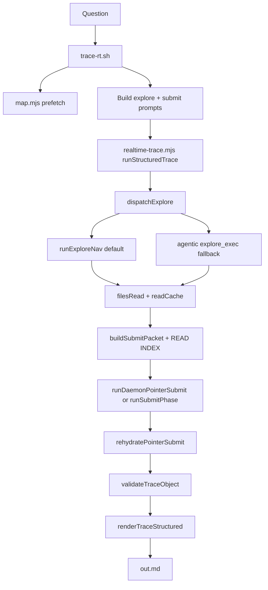

Tracing the trace-rt pipeline from question to rendered output. Searching the codebase for entry points and key stages.
Reading the explore, rehydrate, and render modules to complete the pipeline picture.
# How `trace-rt` turns a question into a rendered trace

`trace-rt` is a two-phase pipeline: **explore** (gather grounded code evidence) then **submit** (synthesize structured JSON, rehydrate pointer citations, render markdown). The shell wrapper prepares artifacts; `realtime-trace.mjs` orchestrates the rest.

## End-to-end flow



---

## 1. Entry: `trace-rt.sh` prepares the run

`trace-rt.sh` takes the question, sets up an isolated run directory, and launches Node.

**Key steps:**

1. **Repo map prefetch** — `map.mjs` runs in tandem mode (pagerank + sigmap) and optionally compacts the map for the explore prompt.
2. **Explore prompt** — Instructions to use `explore_exec` only, read 4–8 load-bearing files, stop after 2–3 turns.
3. **Submit prompt** — Instructions for structured output: `opening_summary`, `flow_steps`, `sections`, `key_files`, pointer citations (not full code).
4. **Invoke orchestrator** — Calls `realtime-trace.mjs` with `--prompt-file`, `--map-file`, `--question`, `--structured-out`, etc.

```343:397:skills/unitrace/scripts/trace-rt.sh
MAP_FILE="$WORK_DIR/map.txt"
// ... map generation ...
UNITRACE_PROMPT="${UNITRACE_PROMPT}
QUESTION: ${QUESTION}"

printf '%s' "$UNITRACE_PROMPT" > "$PROMPT_FILE"
// ...
RT_ARGS=(
  --prompt-file "$PROMPT_FILE"
  --map-file "$MAP_FILE"
  --question "$QUESTION"
  // ...
)
node "$SCRIPT_DIR/realtime-trace.mjs" "${RT_ARGS[@]}"
```

On success, `out.md` is written to the run directory and printed to stdout.

---

## 2. Orchestration: `runStructuredTrace` in `realtime-trace.mjs`

`main()` reads prompt files and calls `runStructuredTrace()`, which:

1. Warms the daemon pool (submit + nav models).
2. Runs explore via `dispatchExplore()`.
3. Prunes explore conversation items (fresh submit context).
4. Builds the submit packet via `buildSubmitPacket()`.
5. Submits via daemon pointer submit (default) or live-session fallback.
6. Renders markdown with `renderTraceStructured()`.

```1016:1127:skills/unitrace/scripts/realtime-trace.mjs
const exploreStats = await dispatchExplore({ ... });

const { text: submitPacket, orderedPaths } = buildSubmitPacket({ ... });

if (UNITRACE_RT_DAEMON && usePointerSubmit) {
  const daemonResult = await runDaemonPointerSubmit({ ... });
  if (daemonResult) {
    return { text: daemonResult.markdown, toolLog, structured: daemonResult.structured };
  }
}

structured = await runSubmitPhase(submitSession.connection, { ... });
const markdown = renderTraceStructured(workspace, structured);
return { text: markdown, toolLog, structured };
```

**Read cache** — `makeReadTracker()` maintains `filesRead` (set) and `readCache` (path → numbered excerpt). Pinned seeds stay at the front so later reads do not truncate definition windows.

---

## 3. Explore phase (default: `nav` mode)

`dispatchExplore()` routes by `UNITRACE_RT_UNITRACE_MODE` (default `nav`):

| Mode | Behavior |
|------|----------|
| `nav` | Host-driven micro-agent (`runExploreNav`) |
| `agentic` | Full-model `explore_exec` loop (daemon first, then live session) |
| `hybrid` | Nav + one agentic top-up if coverage is thin |

### 3a. Map-driven seeding (`rt-map-seed.mjs`)

Before navigators run, `seedExploreReads()` prefetches files from:

- Script names in the question (e.g. `trace-rt.sh`)
- Repo-map line ranges
- Pipeline-specific seeds (`rt-pipeline-seed.mjs`)

For a trace-rt question, it targets `trace-rt.sh` and `realtime-trace.mjs`.

### 3b. Nav explore (`rt-explore-nav.mjs`)

`runExploreNav()` is the default explore path:

1. **Explicit seeds** — `seedExploreReads()` from map + question.
2. **Host seed** — `retrieveCandidates()` (search-fast: combined ripgrep → classify → AST hydrate).
3. **Usage follow-ups** — Grep for symbols like `runStructuredTrace`, `rehydratePointerSubmit`.
4. **Parallel navigators** — 8× `gpt-realtime-mini` via `daemonAskBatch`, each with a different facet (entry point, callees, rendering, etc.).
5. **Host hydration** — Union navigator proposals; grep + read via `htools`; dedupe into `readCache`.

```509:603:skills/unitrace/scripts/lib/rt-explore-nav.mjs
const explicitSeeds = seedExploreReads({ ... });
const hostSeeds = await hostSeed(workspace, question, onRead, { ... });
// ...
const results = await daemonAskBatch(namespace, requests, { model: navModel });
const { terms, paths, allDone } = dedupNavProposals(results);
hydrateFromPaths(workspace, dedupPaths, onRead, { ... });
await hydrateFromTerms(workspace, dedupTerms, onRead, { ... });
```

Returns `{ seedPaths, toolTurnCount, exploreTurns, ... }` in the same shape `buildSubmitPacket` expects. Returns `null` on daemon failure → fail-open to agentic explore.

### 3c. Agentic fallback

`runExplorePhaseSession()` / `runExplorePhaseDaemon()` run a Realtime loop where the model calls `explore_exec` (JS that batches `tools.grep`, `tools.read`, etc.). Stops when `shouldStopExplore()` hits read/tool-call caps.

---

## 4. Submit packet + pointer index

`buildSubmitPacket()` assembles what the submit model sees:

- Original question
- Files read during explore
- High-priority seed paths
- Anchor symbols extracted from excerpts
- Tool log (last 8 entries)
- **READ INDEX** (when pointer mode is on) — numbered excerpts the model cites by `excerpt_index`

```643:750:skills/unitrace/scripts/realtime-trace.mjs
const orderedEntries = orderReadCacheEntries(readCache, seedPaths);
const readIndexEntries = buildReadIndexEntries(orderedEntries, { maxFiles: ... });
// ...
if (usePointerIndex) {
  parts.push(buildReadIndex(orderedEntries, { maxFiles: ..., previewLines: ... }), "");
  parts.push(
    `Call ${SUBMIT_POINTER_SCHEMA_NAME} once with prose fields and citation_spans ...`,
    "Do NOT include code_passages or grounding_manifest — host rehydrates citations from READ INDEX.",
  );
}
```

The model returns **prose + `citation_spans`** (index + line range + rationale), not full code blocks. Schema: `tracePointerSchema()` in `trace-schema.mjs`.

---

## 5. Pointer rehydrate (`rt-rehydrate-submit.mjs`)

Default submit path: `runDaemonPointerSubmit()` (warm `gpt-realtime-2` pool) with fail-open to `runSubmitPhase()` on the live session.

After the model returns pointer JSON, **`rehydratePointerSubmit()`** converts citations into grounded `code_passages`:

1. Map `citation_spans[].excerpt_index` → entry in `orderedPaths` (from READ INDEX).
2. **Bound** cited lines to the excerpt window (clamp/widen tiny spans).
3. **AST-clamp** via `expandLineRange()` and enforce max 40 lines per span.
4. **Fallback** — If no valid citations, `pickCodePassages()` picks host passages from `readCache`.
5. **Question-specific repair** — For known question shapes (including trace-render questions), backfill required passages and repair prose.
6. **`mergeProseWithPassages()`** — Attach `code_passages` + `grounding_manifest`.

```112:194:skills/unitrace/scripts/lib/rt-rehydrate-submit.mjs
export function rehydratePointerSubmit({ pointer, orderedPaths, workspace, filesRead, readCache, ... }) {
  for (const cite of pointer.citation_spans || []) {
    const entry = orderedPaths[cite.excerpt_index];
    // bound + clamp span ...
    passages.push({ file_path: rel, start_line: finalStart, end_line: finalEnd, rationale: ... });
  }
  if (!passages.length) {
    const fallback = pickCodePassages({ workspace, filesRead, readCache, seedPaths, question });
    return repairQuestionSpecificTrace(mergeProseWithPassages(pointer, ...), question);
  }
  return repairQuestionSpecificTrace(mergeProseWithPassages(out, ...), question);
}
```

Then **`validateTraceObject()`** enforces: every `code_passage.file_path` was read during explore, spans exist on disk, `grounding_manifest.tool_turns` matches explore stats. One reask on validation failure (`UNITRACE_RT_SUBMIT_REASK=1`).

---

## 6. Markdown rendering (`render-trace-structured.mjs`)

`renderTraceStructured(repo, data)` turns validated structured JSON into final markdown:

| Section | Source field |
|---------|----------------|
| Opening paragraph | `opening_summary` |
| `## Flow` | `flow_steps` bullet list |
| `## Key files` | table from `key_files` |
| Comparison tables | `comparison_tables` |
| `## {heading}` | `sections[]` |
| `## Code references` | `code_passages` hydrated from disk |

For each passage, **`hydratePassage()`** reads the file from the workspace, slices lines, and emits a fenced block with `start:end:path` header and optional rationale.

```43:90:skills/unitrace/scripts/lib/render-trace-structured.mjs
export function renderTraceStructured(repo, data) {
  // opening_summary, flow_steps, key_files, comparison_tables, sections ...
  const passages = Array.isArray(data.code_passages) ? data.code_passages : [];
  if (passages.length) {
    out.push("## Code references");
    for (let i = 0; i < passages.length; i++) {
      out.push(hydratePassage(repo, passages[i], i));
    }
  }
  return out.join("\n").replace(/\n{3,}/g, "\n\n").trim() + "\n";
}
```

Daemon submit returns `{ markdown: renderTraceStructured(...), structured }` directly; session submit renders after `runSubmitPhase()`.

---

## Important files and functions

| Stage | File | Key functions |
|-------|------|----------------|
| CLI wrapper | `skills/unitrace/scripts/trace-rt.sh` | map prefetch, prompt assembly, run dir layout |
| Orchestrator | `skills/unitrace/scripts/realtime-trace.mjs` | `runStructuredTrace`, `dispatchExplore`, `buildSubmitPacket`, `runDaemonPointerSubmit`, `runSubmitPhase` |
| Explore (nav) | `skills/unitrace/scripts/lib/rt-explore-nav.mjs` | `runExploreNav`, `hostSeed`, `buildNavIndex`, `hydrateFromPaths` |
| Map seeding | `skills/unitrace/scripts/lib/rt-map-seed.mjs` | `seedExploreReads`, `requiredSeedPaths`, `parseMapLineRanges` |
| Pointer rehydrate | `skills/unitrace/scripts/lib/rt-rehydrate-submit.mjs` | `buildReadIndex`, `buildReadIndexEntries`, `rehydratePointerSubmit`, `orderReadCacheEntries` |
| Passage fallback | `skills/unitrace/scripts/lib/rt-pick-passages.mjs` | `pickCodePassages`, `mergeProseWithPassages` |
| Schema / validation | `skills/unitrace/scripts/lib/trace-schema.mjs` | `tracePointerSchema`, `validateTraceObject`, `normalizeReadPath` |
| Markdown render | `skills/unitrace/scripts/lib/render-trace-structured.mjs` | `renderTraceStructured`, `hydratePassage` |
| Daemon pool | `skills/unitrace/scripts/lib/daemon-client.mjs` | `warmDaemonPool`, `daemonAsk`, `daemonAskBatch` |

---

## Design choices worth noting

1. **Pointer submit** — The model cites READ INDEX entries by index + line range; the host rehydrates verbatim code. That keeps submit tokens small and grounds citations in files actually read during explore.
2. **Three-tier fail-open** — nav explore → agentic explore; daemon submit → live-session submit. The daemon is never on the correctness path.
3. **Fresh submit context** — Explore conversation items are pruned before submit so synthesis sees the submit packet, not the full explore transcript.
4. **Wire format (optional)** — With `UNITRACE_WIRE_FORMAT=1`, submit returns wire plaintext and `explore-hydrate.sh` rehydrates file tokens; the default structured path above is what `trace-rt.sh` uses without that flag.

For your exact question (“How does trace-rt turn a question into a final rendered trace…”), the codebase even has a dedicated repair path in `rehydratePointerSubmit` (`isTraceRenderQuestion`) that ensures the answer cites `trace-rt.sh`, `realtime-trace.mjs`, `rt-rehydrate-submit.mjs`, and `render-trace-structured.mjs` — which mirrors the pipeline described above.
