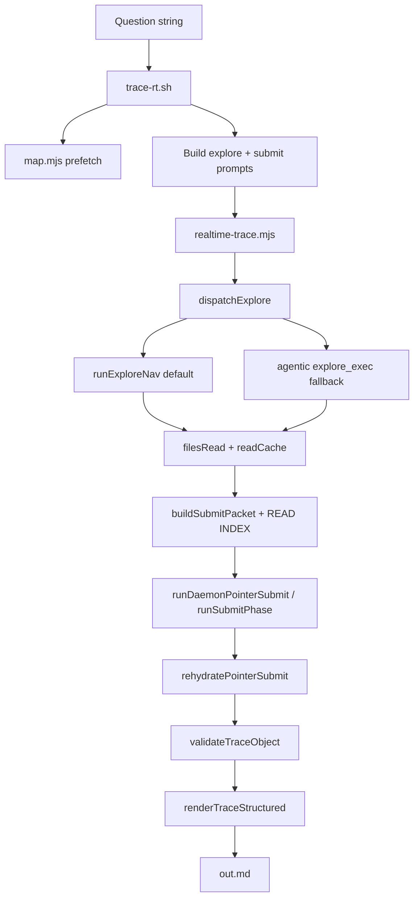

I'll trace the trace-rt pipeline through the codebase — starting from entry points and following explore, rehydrate, and render stages.
# How `trace-rt` turns a question into a rendered trace

The pipeline is a **shell wrapper → two-phase Realtime orchestrator → host rehydration → markdown renderer**. Default path: **nav explore** (host-driven, no model tool loop) + **pointer submit** (model cites indices, host fills code) + **`renderTraceStructured`**.



---

## 1. Entry and setup (`trace-rt.sh`)

`unitrace.sh` delegates to `trace-rt.sh`, which owns run state and prompt assembly.

For each question it:

1. Creates an isolated run directory (`$RUNS_DIR/$RUN_ID/`).
2. Builds an **explore prompt** telling the model to gather evidence only (via `explore_exec` in agentic mode; nav mode ignores this loop).
3. Builds a **submit prompt** with schema rules (summary, flow steps, sections, citations).
4. **Prefetches a repo map** with `map.mjs` (default mode `tandem`: pagerank + sigmap), optionally compacts it, and appends it to the explore prompt.
5. Launches `realtime-trace.mjs` with prompt files, workspace, map, and output paths.

```301:397:skills/unitrace/scripts/trace-rt.sh
read -r -d '' UNITRACE_PROMPT <<EOF || true
Explore the codebase to gather ground truth for the question below. Do NOT write the final answer yet.
...
QUESTION: ${QUESTION}"

printf '%s' "$UNITRACE_PROMPT" > "$PROMPT_FILE"
printf '%s' "$SUBMIT_PROMPT" > "$SUBMIT_PROMPT_FILE"
...
node "$SCRIPT_DIR/realtime-trace.mjs" "${RT_ARGS[@]}" || trace_status=$?
```

On success, markdown lands in `$RUN_DIR/out.md` and is printed with a run-id footer. If `UNITRACE_WIRE_FORMAT=1`, a second wire rehydration pass runs (see section 6).

---

## 2. Orchestrator (`realtime-trace.mjs`)

`main()` reads prompts, calls `runStructuredTrace()` (default), writes markdown to `--out`, JSON to `--structured-out`, and logs phase timings to `--raw`.

The core loop in `runStructuredTrace()`:

```917:1066:skills/unitrace/scripts/realtime-trace.mjs
async function runStructuredTrace({ ... }) {
  const filesRead = new Set();
  const readCache = new Map();
  ...
  // Warm daemon pools concurrently with connect + explore
  const exploreStats = await dispatchExplore({ ... });

  const { text: submitPacket, orderedPaths } = buildSubmitPacket({ ... });

  // Default: daemon pointer submit, fail-open to live session
  if (UNITRACE_RT_DAEMON && usePointerSubmit) {
    const daemonResult = await runDaemonPointerSubmit({ ... });
    if (daemonResult) return { text: daemonResult.markdown, ... };
  }

  structured = await runSubmitPhase(...);
  const markdown = renderTraceStructured(workspace, structured);
  return { text: markdown, toolLog, structured };
}
```

Two shared accumulators carry explore → submit:

- **`filesRead`**: set of repo-relative paths actually read.
- **`readCache`**: map of path → line-numbered excerpt (via `makeReadTracker()`), with pinned seed windows that survive truncation.

---

## 3. Explore phase (`dispatchExplore`)

Controlled by `UNITRACE_RT_UNITRACE_MODE` (default **`nav`**).

### 3a. Default: nav explore (`rt-explore-nav.mjs`)

Host-driven; the full model never runs an `explore_exec` tool loop here.

1. **Seed reads** (`seedExploreReads` in `rt-map-seed.mjs`): question-named scripts, curated trace seeds, map line ranges, pipeline-specific reads.
2. **Host retriever seed** (`retrieveCandidates` from `search-fast.mjs`): one combined ripgrep → classify/score → AST hydrate; pinned into `readCache`.
3. **Parallel navigators**: 8× `gpt-realtime-mini` calls via `daemonAskBatch`, each with a different “facet” (entry point, callees, config, etc.). Each returns `{ grep_terms, read_paths, done }`.
4. **Host hydration**: union navigator proposals → `hydrateFromPaths` (direct line-range reads) + `hydrateFromTerms` (another retriever pass).

```267:358:skills/unitrace/scripts/lib/rt-explore-nav.mjs
export async function runExploreNav({ workspace, question, mapBlock, filesRead, readCache, onRead, ... }) {
  const explicitSeeds = seedExploreReads({ ... });
  const hostSeeds = await hostSeed(workspace, question, onRead, { ... });
  ...
  for (let round = 0; round < rounds; round += 1) {
    const indexText = buildNavIndex(readCache, seedPaths, indexFiles);
    const results = await daemonAskBatch(namespace, requests, { model: navModel });
    const { terms, paths, allDone } = dedupNavProposals(results);
    hydrateFromPaths(workspace, paths, onRead);
    await hydrateFromTerms(workspace, terms, onRead, { ... });
    if (allDone || discovered === 0) break;
  }
  return { toolTurnCount, exploreTurns: navTurns, seedPaths, ... };
}
```

**Fail-open**: if nav returns `null`, falls back to **agentic** explore.

### 3b. Fallback: agentic explore (`runExplorePhaseSession` / `runExplorePhaseDaemon`)

Classic Realtime WebSocket (or `rtinferd`) loop:

1. Host **map seed reads** before turn 1 (`seedExploreReads`).
2. Model calls **`explore_exec`** (JavaScript that uses `tools.grep/read/batch_read/list_dir/shell` via `rt-explore-runtime.mjs`).
3. `dispatchToolBatch` runs tool calls; `onRead` fills `readCache`.
4. Stops when `shouldStopExplore()` hits read/tool-call caps or minimum coverage.

```246:413:skills/unitrace/scripts/realtime-trace.mjs
async function runExplorePhaseSession(session, { prompt, question, mapBlock, workspace, ... }) {
  ...
  seedPaths = seedExploreReads({ workspace, question, mapBlock, filesRead, readCache, onRead });
  for (let turn = 0; turn < maxTurns; turn++) {
    ({ functionCalls } = await waitForResponse(session.connection, { ... }));
    const dispatched = await dispatchToolBatch(functionCalls, workspace, { deadlineMs, onRead });
    ...
    if (stopNow()) break;
  }
}
```

---

## 4. Submit packet (`buildSubmitPacket`)

After explore, explore conversation items are pruned from the Realtime session (fresh context for submit). The host assembles a capped evidence packet:

- Original question
- Files read list
- High-priority seed paths
- Tool log (last 8 entries)
- **READ INDEX** (default pointer mode): numbered entries `[0] path (lines X-Y)` + 14-line previews — **not full excerpts**

```602:689:skills/unitrace/scripts/realtime-trace.mjs
function buildSubmitPacket({ ..., pointerIndex = false, hostPassages = false }) {
  const orderedEntries = orderReadCacheEntries(readCache, seedPaths);
  const orderedPaths = orderedEntries.map(([p]) => p);
  const usePointerIndex = pointerIndex && hostPassages && !wire;
  ...
  if (usePointerIndex) {
    parts.push(buildReadIndex(orderedEntries, { maxFiles: ..., previewLines: READ_INDEX_PREVIEW_LINES }), "");
    parts.push(`Call ${SUBMIT_POINTER_SCHEMA_NAME} once with prose fields and citation_spans ...`);
  }
  return { text: truncateText(parts.join("\n"), SUBMIT_PACKET_MAX), orderedPaths };
}
```

`orderReadCacheEntries()` ranks seed paths first so the most load-bearing files get low indices.

---

## 5. Pointer submit and rehydration

Defaults (`UNITRACE_RT_HOST_PASSAGES=1`, `UNITRACE_RT_SUBMIT_POINTER_INDEX=1`):

1. **Synth model** (`gpt-realtime-2`, reasoning `low`) calls `submit_trace_pointer` with prose fields + `citation_spans[]` referencing `excerpt_index` + line ranges — **no `code_passages` in the model output**.
2. Default synth path: **warm daemon pool** (`runDaemonPointerSubmit`); miss/invalid → live-session `runSubmitPhase`.
3. **Host rehydration** (`rehydratePointerSubmit`): maps each `citation_span.excerpt_index` → `orderedPaths[idx]`, clamps spans (AST-aware via `expandLineRange`), builds `code_passages[]`.
4. If model cites nothing valid, **fail-open to host pick** (`pickCodePassages`).
5. **`mergeProseWithPassages`** attaches passages + `grounding_manifest`.
6. **`validateTraceObject`** checks grounding; one reask on failure.

```758:791:skills/unitrace/scripts/realtime-trace.mjs
if (usePointerIndex) {
  parsed = rehydratePointerSubmit({
    pointer: parsed, orderedPaths, workspace, filesRead, readCache, toolTurns, seedPaths, question,
  });
}
const err = validateTraceObject(parsed, { workspace, filesRead, toolTurns });
```

```91:136:skills/unitrace/scripts/lib/rt-rehydrate-submit.mjs
export function rehydratePointerSubmit({ pointer, orderedPaths, workspace, filesRead, readCache, ... }) {
  for (const cite of pointer.citation_spans || []) {
    const rel = safeRelPath(workspace, orderedPaths[cite.excerpt_index]);
    ...
    passages.push({ file_path: rel, start_line, end_line, rationale });
  }
  if (!passages.length) {
    return mergeProseWithPassages(pointer, pickCodePassages({ ... }), filesRead, toolTurns);
  }
  const out = { ...pointer };
  delete out.citation_spans;
  return mergeProseWithPassages(out, passages, filesRead, toolTurns);
}
```

`buildReadIndex()` and `rehydratePointerSubmit()` share the same ordering so index `0` in submit means the same file in rehydrate.

---

## 6. Markdown rendering (`renderTraceStructured`)

Takes the validated structured object (now with full `code_passages`) and emits final markdown:

| Section | Source field |
|---|---|
| Opening paragraph | `opening_summary` |
| Bulleted pipeline | `flow_steps` |
| File table | `key_files` |
| Comparison tables | `comparison_tables` |
| Per-module prose | `sections[]` |
| Code fences | `code_passages[]` — **reads live from disk** |

```56:104:skills/unitrace/scripts/lib/render-trace-structured.mjs
export function renderTraceStructured(repo, data) {
  ...
  for (const sec of sections) out.push(`## ${sec.heading}`, "", sec.body, "");
  if (passages.length) {
    out.push("## Code references");
    for (let i = 0; i < passages.length; i++) {
      out.push(hydratePassage(repo, passages[i], i));  // reads file, emits ```start:end:path fence
    }
  }
  return out.join("\n").trim() + "\n";
}
```

Each code block gets a `<refN>` label and a fence header like `` ```190:340:scripts/realtime-trace.mjs ``.

---

## 7. Optional wire-format second pass

When `UNITRACE_WIRE_FORMAT=1`, submit returns wire plaintext with `<file:path:start-end>` tokens instead of structured JSON. `trace-rt.sh` then calls `explore_hydrate_trace_output()` → `rehydrate-explore-wire.mjs` to expand tokens into the same style of markdown fences.

```405:414:skills/unitrace/scripts/trace-rt.sh
if [ "${UNITRACE_WIRE_FORMAT:-0}" = "1" ]; then
  if explore_hydrate_trace_output "$WORKSPACE" "$TMP_OUT" "$TMP_OUT.hydrated" "$SCRIPT_DIR" ""; then
    mv -f "$TMP_OUT.hydrated" "$TMP_OUT"
  fi
fi
mv -f "$TMP_OUT" "$OUT_FILE"
```

Default path skips this; rendering happens inside `realtime-trace.mjs` via `renderTraceStructured`.

---

## Key files (quick reference)

| Role | File | Main symbols |
|---|---|---|
| Shell entry + map prefetch | `skills/unitrace/scripts/trace-rt.sh` | prompt assembly, `map.mjs`, post-hydrate |
| Two-phase orchestrator | `skills/unitrace/scripts/realtime-trace.mjs` | `runStructuredTrace`, `dispatchExplore`, `buildSubmitPacket`, `runSubmitPhase` |
| Nav explore (default) | `skills/unitrace/scripts/lib/rt-explore-nav.mjs` | `runExploreNav` |
| Map/question seeds | `skills/unitrace/scripts/lib/rt-map-seed.mjs` | `seedExploreReads`, `requiredSeedPaths` |
| Agentic explore tools | `skills/unitrace/scripts/lib/rt-tools.mjs` | `explore_exec`, `dispatchToolBatch` |
| Pointer rehydrate | `skills/unitrace/scripts/lib/rt-rehydrate-submit.mjs` | `buildReadIndex`, `rehydratePointerSubmit` |
| Passage fallback | `skills/unitrace/scripts/lib/rt-pick-passages.mjs` | `pickCodePassages`, `mergeProseWithPassages` |
| Markdown renderer | `skills/unitrace/scripts/lib/render-trace-structured.mjs` | `renderTraceStructured` |
| Schema/validation | `skills/unitrace/scripts/lib/trace-schema.mjs` | `tracePointerSchema`, `validateTraceObject` |
| Wire rehydrate (opt.) | `skills/unitrace/scripts/lib/rehydrate-explore-wire.mjs` | `rehydrateTraceWire` |

---

## End-to-end for your example question

For *“How does trace-rt turn a question into a final rendered trace…”*:

1. `trace-rt.sh` detects trace-related names → seeds `trace-rt.sh`, `realtime-trace.mjs` (`rt-map-seed.mjs` curated seeds + `rt-pipeline-seed.mjs` for submit/render helpers).
2. Repo map (tandem) orients explore toward those scripts.
3. Nav mode: retriever + 8 mini navigators read load-bearing spans into `readCache`.
4. Submit packet sends a **READ INDEX** of those excerpts.
5. Daemon synth returns prose + `citation_spans` pointing at index entries.
6. Host rehydrates spans → `code_passages`, validates, renders markdown with live code fences.
7. Final output: `$RUN_DIR/out.md` plus structured JSON at `$RUN_DIR/structured.json`.

I'll trace the trace-rt pipeline through the codebase — starting from entry points and following explore, rehydrate, and render stages.
# How `trace-rt` turns a question into a rendered trace

The pipeline is a **shell wrapper → two-phase Realtime orchestrator → host rehydration → markdown renderer**. Default path: **nav explore** (host-driven, no model tool loop) + **pointer submit** (model cites indices, host fills code) + **`renderTraceStructured`**.


---

## 1. Entry and setup (`trace-rt.sh`)

`unitrace.sh` delegates to `trace-rt.sh`, which owns run state and prompt assembly.

For each question it:

1. Creates an isolated run directory (`$RUNS_DIR/$RUN_ID/`).
2. Builds an **explore prompt** telling the model to gather evidence only (via `explore_exec` in agentic mode; nav mode ignores this loop).
3. Builds a **submit prompt** with schema rules (summary, flow steps, sections, citations).
4. **Prefetches a repo map** with `map.mjs` (default mode `tandem`: pagerank + sigmap), optionally compacts it, and appends it to the explore prompt.
5. Launches `realtime-trace.mjs` with prompt files, workspace, map, and output paths.

```301:397:skills/unitrace/scripts/trace-rt.sh
read -r -d '' UNITRACE_PROMPT <<EOF || true
Explore the codebase to gather ground truth for the question below. Do NOT write the final answer yet.
...
QUESTION: ${QUESTION}"

printf '%s' "$UNITRACE_PROMPT" > "$PROMPT_FILE"
printf '%s' "$SUBMIT_PROMPT" > "$SUBMIT_PROMPT_FILE"
...
node "$SCRIPT_DIR/realtime-trace.mjs" "${RT_ARGS[@]}" || trace_status=$?
```

On success, markdown lands in `$RUN_DIR/out.md` and is printed with a run-id footer. If `UNITRACE_WIRE_FORMAT=1`, a second wire rehydration pass runs (see section 6).

---

## 2. Orchestrator (`realtime-trace.mjs`)

`main()` reads prompts, calls `runStructuredTrace()` (default), writes markdown to `--out`, JSON to `--structured-out`, and logs phase timings to `--raw`.

The core loop in `runStructuredTrace()`:

```917:1066:skills/unitrace/scripts/realtime-trace.mjs
async function runStructuredTrace({ ... }) {
  const filesRead = new Set();
  const readCache = new Map();
  ...
  // Warm daemon pools concurrently with connect + explore
  const exploreStats = await dispatchExplore({ ... });

  const { text: submitPacket, orderedPaths } = buildSubmitPacket({ ... });

  // Default: daemon pointer submit, fail-open to live session
  if (UNITRACE_RT_DAEMON && usePointerSubmit) {
    const daemonResult = await runDaemonPointerSubmit({ ... });
    if (daemonResult) return { text: daemonResult.markdown, ... };
  }

  structured = await runSubmitPhase(...);
  const markdown = renderTraceStructured(workspace, structured);
  return { text: markdown, toolLog, structured };
}
```

Two shared accumulators carry explore → submit:

- **`filesRead`**: set of repo-relative paths actually read.
- **`readCache`**: map of path → line-numbered excerpt (via `makeReadTracker()`), with pinned seed windows that survive truncation.

---

## 3. Explore phase (`dispatchExplore`)

Controlled by `UNITRACE_RT_UNITRACE_MODE` (default **`nav`**).

### 3a. Default: nav explore (`rt-explore-nav.mjs`)

Host-driven; the full model never runs an `explore_exec` tool loop here.

1. **Seed reads** (`seedExploreReads` in `rt-map-seed.mjs`): question-named scripts, curated trace seeds, map line ranges, pipeline-specific reads.
2. **Host retriever seed** (`retrieveCandidates` from `search-fast.mjs`): one combined ripgrep → classify/score → AST hydrate; pinned into `readCache`.
3. **Parallel navigators**: 8× `gpt-realtime-mini` calls via `daemonAskBatch`, each with a different “facet” (entry point, callees, config, etc.). Each returns `{ grep_terms, read_paths, done }`.
4. **Host hydration**: union navigator proposals → `hydrateFromPaths` (direct line-range reads) + `hydrateFromTerms` (another retriever pass).

```267:358:skills/unitrace/scripts/lib/rt-explore-nav.mjs
export async function runExploreNav({ workspace, question, mapBlock, filesRead, readCache, onRead, ... }) {
  const explicitSeeds = seedExploreReads({ ... });
  const hostSeeds = await hostSeed(workspace, question, onRead, { ... });
  ...
  for (let round = 0; round < rounds; round += 1) {
    const indexText = buildNavIndex(readCache, seedPaths, indexFiles);
    const results = await daemonAskBatch(namespace, requests, { model: navModel });
    const { terms, paths, allDone } = dedupNavProposals(results);
    hydrateFromPaths(workspace, paths, onRead);
    await hydrateFromTerms(workspace, terms, onRead, { ... });
    if (allDone || discovered === 0) break;
  }
  return { toolTurnCount, exploreTurns: navTurns, seedPaths, ... };
}
```

**Fail-open**: if nav returns `null`, falls back to **agentic** explore.

### 3b. Fallback: agentic explore (`runExplorePhaseSession` / `runExplorePhaseDaemon`)

Classic Realtime WebSocket (or `rtinferd`) loop:

1. Host **map seed reads** before turn 1 (`seedExploreReads`).
2. Model calls **`explore_exec`** (JavaScript that uses `tools.grep/read/batch_read/list_dir/shell` via `rt-explore-runtime.mjs`).
3. `dispatchToolBatch` runs tool calls; `onRead` fills `readCache`.
4. Stops when `shouldStopExplore()` hits read/tool-call caps or minimum coverage.

```246:413:skills/unitrace/scripts/realtime-trace.mjs
async function runExplorePhaseSession(session, { prompt, question, mapBlock, workspace, ... }) {
  ...
  seedPaths = seedExploreReads({ workspace, question, mapBlock, filesRead, readCache, onRead });
  for (let turn = 0; turn < maxTurns; turn++) {
    ({ functionCalls } = await waitForResponse(session.connection, { ... }));
    const dispatched = await dispatchToolBatch(functionCalls, workspace, { deadlineMs, onRead });
    ...
    if (stopNow()) break;
  }
}
```

---

## 4. Submit packet (`buildSubmitPacket`)

After explore, explore conversation items are pruned from the Realtime session (fresh context for submit). The host assembles a capped evidence packet:

- Original question
- Files read list
- High-priority seed paths
- Tool log (last 8 entries)
- **READ INDEX** (default pointer mode): numbered entries `[0] path (lines X-Y)` + 14-line previews — **not full excerpts**

```602:689:skills/unitrace/scripts/realtime-trace.mjs
function buildSubmitPacket({ ..., pointerIndex = false, hostPassages = false }) {
  const orderedEntries = orderReadCacheEntries(readCache, seedPaths);
  const orderedPaths = orderedEntries.map(([p]) => p);
  const usePointerIndex = pointerIndex && hostPassages && !wire;
  ...
  if (usePointerIndex) {
    parts.push(buildReadIndex(orderedEntries, { maxFiles: ..., previewLines: READ_INDEX_PREVIEW_LINES }), "");
    parts.push(`Call ${SUBMIT_POINTER_SCHEMA_NAME} once with prose fields and citation_spans ...`);
  }
  return { text: truncateText(parts.join("\n"), SUBMIT_PACKET_MAX), orderedPaths };
}
```

`orderReadCacheEntries()` ranks seed paths first so the most load-bearing files get low indices.

---

## 5. Pointer submit and rehydration

Defaults (`UNITRACE_RT_HOST_PASSAGES=1`, `UNITRACE_RT_SUBMIT_POINTER_INDEX=1`):

1. **Synth model** (`gpt-realtime-2`, reasoning `low`) calls `submit_trace_pointer` with prose fields + `citation_spans[]` referencing `excerpt_index` + line ranges — **no `code_passages` in the model output**.
2. Default synth path: **warm daemon pool** (`runDaemonPointerSubmit`); miss/invalid → live-session `runSubmitPhase`.
3. **Host rehydration** (`rehydratePointerSubmit`): maps each `citation_span.excerpt_index` → `orderedPaths[idx]`, clamps spans (AST-aware via `expandLineRange`), builds `code_passages[]`.
4. If model cites nothing valid, **fail-open to host pick** (`pickCodePassages`).
5. **`mergeProseWithPassages`** attaches passages + `grounding_manifest`.
6. **`validateTraceObject`** checks grounding; one reask on failure.

```758:791:skills/unitrace/scripts/realtime-trace.mjs
if (usePointerIndex) {
  parsed = rehydratePointerSubmit({
    pointer: parsed, orderedPaths, workspace, filesRead, readCache, toolTurns, seedPaths, question,
  });
}
const err = validateTraceObject(parsed, { workspace, filesRead, toolTurns });
```

```91:136:skills/unitrace/scripts/lib/rt-rehydrate-submit.mjs
export function rehydratePointerSubmit({ pointer, orderedPaths, workspace, filesRead, readCache, ... }) {
  for (const cite of pointer.citation_spans || []) {
    const rel = safeRelPath(workspace, orderedPaths[cite.excerpt_index]);
    ...
    passages.push({ file_path: rel, start_line, end_line, rationale });
  }
  if (!passages.length) {
    return mergeProseWithPassages(pointer, pickCodePassages({ ... }), filesRead, toolTurns);
  }
  const out = { ...pointer };
  delete out.citation_spans;
  return mergeProseWithPassages(out, passages, filesRead, toolTurns);
}
```

`buildReadIndex()` and `rehydratePointerSubmit()` share the same ordering so index `0` in submit means the same file in rehydrate.

---

## 6. Markdown rendering (`renderTraceStructured`)

Takes the validated structured object (now with full `code_passages`) and emits final markdown:

| Section | Source field |
|---|---|
| Opening paragraph | `opening_summary` |
| Bulleted pipeline | `flow_steps` |
| File table | `key_files` |
| Comparison tables | `comparison_tables` |
| Per-module prose | `sections[]` |
| Code fences | `code_passages[]` — **reads live from disk** |

```56:104:skills/unitrace/scripts/lib/render-trace-structured.mjs
export function renderTraceStructured(repo, data) {
  ...
  for (const sec of sections) out.push(`## ${sec.heading}`, "", sec.body, "");
  if (passages.length) {
    out.push("## Code references");
    for (let i = 0; i < passages.length; i++) {
      out.push(hydratePassage(repo, passages[i], i));  // reads file, emits ```start:end:path fence
    }
  }
  return out.join("\n").trim() + "\n";
}
```

Each code block gets a `<refN>` label and a fence header like `` ```190:340:scripts/realtime-trace.mjs ``.

---

## 7. Optional wire-format second pass

When `UNITRACE_WIRE_FORMAT=1`, submit returns wire plaintext with `<file:path:start-end>` tokens instead of structured JSON. `trace-rt.sh` then calls `explore_hydrate_trace_output()` → `rehydrate-explore-wire.mjs` to expand tokens into the same style of markdown fences.

```405:414:skills/unitrace/scripts/trace-rt.sh
if [ "${UNITRACE_WIRE_FORMAT:-0}" = "1" ]; then
  if explore_hydrate_trace_output "$WORKSPACE" "$TMP_OUT" "$TMP_OUT.hydrated" "$SCRIPT_DIR" ""; then
    mv -f "$TMP_OUT.hydrated" "$TMP_OUT"
  fi
fi
mv -f "$TMP_OUT" "$OUT_FILE"
```

Default path skips this; rendering happens inside `realtime-trace.mjs` via `renderTraceStructured`.

---

## Key files (quick reference)

| Role | File | Main symbols |
|---|---|---|
| Shell entry + map prefetch | `skills/unitrace/scripts/trace-rt.sh` | prompt assembly, `map.mjs`, post-hydrate |
| Two-phase orchestrator | `skills/unitrace/scripts/realtime-trace.mjs` | `runStructuredTrace`, `dispatchExplore`, `buildSubmitPacket`, `runSubmitPhase` |
| Nav explore (default) | `skills/unitrace/scripts/lib/rt-explore-nav.mjs` | `runExploreNav` |
| Map/question seeds | `skills/unitrace/scripts/lib/rt-map-seed.mjs` | `seedExploreReads`, `requiredSeedPaths` |
| Agentic explore tools | `skills/unitrace/scripts/lib/rt-tools.mjs` | `explore_exec`, `dispatchToolBatch` |
| Pointer rehydrate | `skills/unitrace/scripts/lib/rt-rehydrate-submit.mjs` | `buildReadIndex`, `rehydratePointerSubmit` |
| Passage fallback | `skills/unitrace/scripts/lib/rt-pick-passages.mjs` | `pickCodePassages`, `mergeProseWithPassages` |
| Markdown renderer | `skills/unitrace/scripts/lib/render-trace-structured.mjs` | `renderTraceStructured` |
| Schema/validation | `skills/unitrace/scripts/lib/trace-schema.mjs` | `tracePointerSchema`, `validateTraceObject` |
| Wire rehydrate (opt.) | `skills/unitrace/scripts/lib/rehydrate-explore-wire.mjs` | `rehydrateTraceWire` |

---

## End-to-end for your example question

For *“How does trace-rt turn a question into a final rendered trace…”*:

1. `trace-rt.sh` detects trace-related names → seeds `trace-rt.sh`, `realtime-trace.mjs` (`rt-map-seed.mjs` curated seeds + `rt-pipeline-seed.mjs` for submit/render helpers).
2. Repo map (tandem) orients explore toward those scripts.
3. Nav mode: retriever + 8 mini navigators read load-bearing spans into `readCache`.
4. Submit packet sends a **READ INDEX** of those excerpts.
5. Daemon synth returns prose + `citation_spans` pointing at index entries.
6. Host rehydrates spans → `code_passages`, validates, renders markdown with live code fences.
7. Final output: `$RUN_DIR/out.md` plus structured JSON at `$RUN_DIR/structured.json`.
