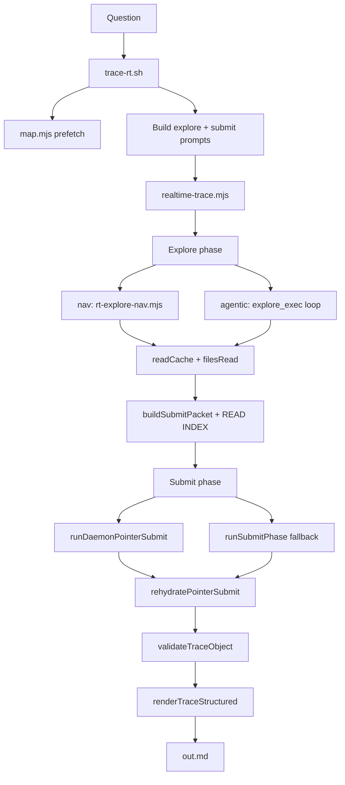

Tracing the `trace-rt` pipeline through the codebase, starting with entry points and how explore, rehydrate, and markdown rendering connect.
# How `trace-rt` turns a question into a rendered trace

The pipeline is a **two-phase Realtime trace**: host-side setup and repo prefetch, **explore** (read-only evidence gathering), then **submit** (structured synthesis + host pointer rehydration + markdown rendering). Default entry is `unitrace.sh` → `trace-rt.sh` → `realtime-trace.mjs`.



---

## 1. Shell wrapper: run layout and prefetch

`trace-rt.sh` accepts a quoted question, sets up an isolated run directory (`$RUNS_DIR/$RUN_ID/`), and prepares the explore/submit prompts.

**Repo map prefetch** (default mode `tandem` via `map.mjs`) orients explore before any model turn:

```343:373:skills/unitrace/scripts/trace-rt.sh
MAP_FILE="$WORK_DIR/map.txt"
MAP_BLOCK=""
if [ "${UNITRACE_MAP_MODE:-tandem}" != "none" ] && command -v node >/dev/null 2>&1; then
  MAP_OUT="$(mktemp "${TMPDIR:-/tmp}/explore-trace-map.XXXXXX")"
  if node "$SCRIPT_DIR/map.mjs" --root "$WORKSPACE" --mode "${UNITRACE_MAP_MODE:-tandem}" "$QUESTION" > "$MAP_OUT" 2>/dev/null && [ -s "$MAP_OUT" ]; then
    MAP_BLOCK="$(cat "$MAP_OUT")"
  fi
  rm -f "$MAP_OUT"
fi
// ...
UNITRACE_PROMPT="${UNITRACE_PROMPT}
QUESTION: ${QUESTION}"
```

It then invokes `realtime-trace.mjs` with prompt files, map, workspace, and output paths. On success, the temp output becomes `$RUN_DIR/out.md` and is printed to stdout.

**Important files:** `trace-rt.sh`, `map.mjs`, `explore-hydrate.sh` (wire-format post-processing only).

---

## 2. Orchestrator: `realtime-trace.mjs`

`main()` reads the explore prompt and delegates to `runStructuredTrace()` (default) or `runWireStructuredTrace()` when `UNITRACE_WIRE_FORMAT=1`.

The structured path has three major stages inside `runStructuredTrace()`:

```1010:1121:skills/unitrace/scripts/realtime-trace.mjs
const exploreStats = await dispatchExplore({ ... });

const { text: submitPacket, orderedPaths } = buildSubmitPacket({ ... });

// Default: daemon pointer submit, then session fallback
if (UNITRACE_RT_DAEMON && usePointerSubmit) {
  const daemonResult = await runDaemonPointerSubmit({ ... });
  if (daemonResult) {
    return { text: daemonResult.markdown, toolLog, structured: daemonResult.structured };
  }
}

structured = await runSubmitPhase(submitSession.connection, { ... });
const markdown = renderTraceStructured(workspace, structured);
return { text: markdown, toolLog, structured };
```

Shared state across phases:

| State | Purpose |
|---|---|
| `filesRead` | Set of repo-relative paths actually read |
| `readCache` | Map of path → numbered excerpt text (`N\|line`) |
| `toolLog` | Phase metrics and tool summaries |

The read tracker (`makeReadTracker`) keeps **pinned** excerpts (seed/definition windows) at the front and **recent** reads in a tail-bounded budget so later reads do not evict anchor evidence.

---

## 3. Explore phase

Explore mode is selected by `UNITRACE_RT_UNITRACE_MODE` (default **`nav`**). `dispatchExplore()` in `realtime-trace.mjs` routes accordingly:

```581:634:skills/unitrace/scripts/realtime-trace.mjs
async function dispatchExplore({ model, ensureSession, ...args }) {
  const mode = UNITRACE_RT_UNITRACE_MODE;
  if (mode !== "nav" && mode !== "hybrid") {
    // agentic: daemon explore_exec first, then live WebSocket session
    ...
  }

  const navStats = await runExploreNav({ ... });
  if (!navStats) {
    // fail-open to agentic explore_exec loop
    ...
  }
  ...
}
```

### 3a. Default: `nav` explore (`rt-explore-nav.mjs`)

Host-driven micro-agent loop — mini navigators propose reads; host executes them:

1. **Explicit seeds** via `seedExploreReads()` (`rt-map-seed.mjs`): question-named scripts, map line ranges, grep hits.
2. **Retriever seeds** via `hostSeed()` → `retrieveCandidates()` from `search-fast.mjs` (combined ripgrep + AST hydration).
3. **Usage follow-ups** and **import-follow** reads expand the call graph from anchors.
4. **Parallel navigators** (default 8× `gpt-realtime-mini` via `daemonAskBatch`) each get a different **facet** (entry point, callees, config, etc.) and return `{ grep_terms, read_paths, done }`.
5. Host **hydrates** proposals with `hydrateFromPaths()` / `hydrateFromTerms()` using `htools.mjs` (`toolReadRange`, `toolGrep`).

```617:672:skills/unitrace/scripts/lib/rt-explore-nav.mjs
for (let round = 0; round < rounds; round += 1) {
  const results = await daemonAskBatch(namespace, requests, { model: navModel });
  const { terms: dedupTerms, paths: dedupPaths, allDone, validCount } = dedupNavProposals(results);
  const fromPaths = hydrateFromPaths(workspace, dedupPaths, onRead, { ... });
  const fromTerms = await hydrateFromTerms(workspace, dedupTerms, onRead, { ... });
  ...
}
```

Returns `null` if the daemon is unavailable and nothing was seeded → **fail-open** to the agentic loop.

### 3b. Fallback: `agentic` explore (`runExplorePhaseSession` / `runExplorePhaseDaemon`)

Full-model `explore_exec` tool loop over a Realtime WebSocket (or `rtinferd` daemon). The model writes JS that calls `tools.grep`, `tools.read`, etc. in parallel via `dispatchToolBatch()` (`rt-tools.mjs`).

Both paths also run **map seed reads** before turn 1 when `UNITRACE_RT_MAP_SEED=1`:

```315:340:skills/unitrace/scripts/realtime-trace.mjs
if (UNITRACE_RT_MAP_SEED) {
  seedPaths = seedExploreReads({ workspace, question, mapBlock, filesRead, readCache, onRead });
  ...
}
```

Explore stops when `shouldStopExplore()` fires (enough reads, enough tool calls, or caps hit).

---

## 4. Submit packet and pointer index

After explore, the session is pruned (`session.pruneItems`) to drop explore conversation items before submit.

`buildSubmitPacket()` assembles the synthesis prompt. With defaults (`UNITRACE_RT_HOST_PASSAGES=1`, `UNITRACE_RT_SUBMIT_POINTER_INDEX=1`), it includes a **READ INDEX** instead of full excerpts:

```709:730:skills/unitrace/scripts/realtime-trace.mjs
if (usePointerIndex) {
  parts.push(buildReadIndex(orderedEntries, { maxFiles: SUBMIT_EXCERPT_FILES + 4, previewLines: READ_INDEX_PREVIEW_LINES }), "");
} else {
  parts.push("READ EXCERPTS:");
  ...
}
// ...
parts.push(
  `Call ${SUBMIT_POINTER_SCHEMA_NAME} once with prose fields and citation_spans (excerpt_index + line range).`,
  "Do NOT include code_passages or grounding_manifest — host rehydrates citations from READ INDEX.",
);
```

`buildReadIndex()` / `buildReadIndexEntries()` live in `rt-rehydrate-submit.mjs`. Each index entry is `[i] path (lines start-end)` plus a short preview. `orderReadCacheEntries()` ranks seed paths first so the most load-bearing files get lower indices.

The model is asked to call `submit_trace_pointer` with **prose only** plus `citation_spans` referencing `excerpt_index` and line ranges — not full code blocks.

---

## 5. Submit synthesis and pointer rehydrate

Default submit path: **`runDaemonPointerSubmit()`** over the warm daemon pool (`gpt-realtime-2`, reasoning `low`), with fail-open to **`runSubmitPhase()`** on the live Realtime session.

Both paths share the same post-processing:

```813:835:skills/unitrace/scripts/realtime-trace.mjs
if (usePointerIndex) {
  parsed = rehydratePointerSubmit({
    pointer: parsed,
    orderedPaths,
    workspace,
    filesRead,
    readCache,
    toolTurns,
    seedPaths,
    question,
  });
}
const err = validateTraceObject(parsed, { workspace, filesRead, toolTurns, question });
```

### `rehydratePointerSubmit()` (`rt-rehydrate-submit.mjs`)

Turns model pointers into grounded `code_passages`:

1. For each `citation_spans[]` entry, resolve `excerpt_index` → path from `orderedPaths`.
2. Bound/clamp line ranges against the excerpt segment and on-disk file (`clampSpan()` + `expandLineRange()` from `ast-context.mjs`).
3. Build up to 5 passages; if none valid, **fail-open** to `pickCodePassages()` (`rt-pick-passages.mjs`).
4. `ensureKeyFileCoverage()` adds spans for `key_files[]` the model named but did not cite.
5. `mergeProseWithPassages()` attaches `code_passages` and `grounding_manifest` (host-owned, not model-generated).

```240:325:skills/unitrace/scripts/lib/rt-rehydrate-submit.mjs
export function rehydratePointerSubmit({ pointer, orderedPaths, workspace, filesRead, readCache, ... }) {
  for (const cite of pointer.citation_spans || []) {
    const idx = cite.excerpt_index;
    const entry = orderedPaths[idx];
    ...
    passages.push({ file_path: rel, start_line: finalStart, end_line: finalEnd, rationale: ... });
  }
  ...
  return mergeProseWithPassages(out, ensureKeyFileCoverage({ passages, ... }), filesRead, toolTurns);
}
```

`validateTraceObject()` (`trace-schema.mjs`) enforces grounding: cited paths must be in `filesRead`, spans must exist on disk, comparison tables required for contrast questions, etc. One **reask** on validation failure (`UNITRACE_RT_SUBMIT_REASK=1`).

---

## 6. Markdown rendering

Final markdown is produced by **`renderTraceStructured()`** in `render-trace-structured.mjs`. It reads the validated structured object and emits:

| Section | Source field |
|---|---|
| Opening paragraph | `opening_summary` |
| Bulleted pipeline | `flow_steps` |
| File table | `key_files` |
| Comparison tables | `comparison_tables` |
| Per-module sections | `sections[]` |
| Code blocks | `code_passages[]` — **re-read from disk** at render time |

Code references use fence blocks with `start:end:path` info lines:

```23:40:skills/unitrace/scripts/lib/render-trace-structured.mjs
function hydratePassage(repo, passage, index) {
  const lines = readFileSync(join(repo, rel), "utf8").split("\n");
  ...
  return `\n${ref}${rationale}\n${fence}${s}:${e}:${rel}\n${code}\n${fence}`;
}
```

So rendering is a **second hydration**: submit rehydrates pointers into structured spans; render reads verbatim source lines for the final markdown.

---

## 7. Optional wire-format path

When `UNITRACE_WIRE_FORMAT=1`:

- Explore still runs, but submit uses `submit_wire_trace` with plaintext `<file:...>` tokens (`runWireSubmitPhase`).
- `trace-rt.sh` post-processes via `explore_hydrate_trace_output()` → `rehydrate-explore-wire.mjs`.

The default structured path (what your benchmark question describes) does **not** use this branch.

---

## 8. Output artifacts

Per run under `$RUNS_DIR/$RUN_ID/`:

| File | Contents |
|---|---|
| `out.md` | Final rendered markdown |
| `structured.json` | Validated structured trace (if submit succeeded) |
| `raw` | Same as out (structured path) |
| `err.log` | Tool/phase log (not necessarily an error) |
| `frames.ndjson` | Realtime WebSocket frame log |
| `done` | Completion marker |

---

## Key files summary

| Role | Path |
|---|---|
| CLI entry | `skills/unitrace/scripts/trace-rt.sh` |
| Two-phase orchestrator | `skills/unitrace/scripts/realtime-trace.mjs` |
| Nav explore (default) | `skills/unitrace/scripts/lib/rt-explore-nav.mjs` |
| Map/question seed reads | `skills/unitrace/scripts/lib/rt-map-seed.mjs` |
| Explore tools | `skills/unitrace/scripts/lib/rt-tools.mjs`, `htools.mjs` |
| Submit packet + READ INDEX | `buildSubmitPacket()` in `realtime-trace.mjs`; index in `rt-rehydrate-submit.mjs` |
| Pointer rehydrate | `skills/unitrace/scripts/lib/rt-rehydrate-submit.mjs` |
| Host passage fallback | `skills/unitrace/scripts/lib/rt-pick-passages.mjs` |
| Schema + validation | `skills/unitrace/scripts/lib/trace-schema.mjs` |
| Markdown render | `skills/unitrace/scripts/lib/render-trace-structured.mjs` |
| Daemon pool | `skills/unitrace/scripts/lib/daemon-client.mjs` |
| Realtime session | `skills/unitrace/scripts/lib/rt-agent-session.mjs` |

---

## End-to-end in one sentence

**`trace-rt.sh`** prefetches a repo map and builds prompts; **`realtime-trace.mjs`** explores via host-seeded reads plus parallel mini navigators (or an `explore_exec` fallback), packs evidence into a READ INDEX, asks **`gpt-realtime-2`** to return prose + pointer citations, **rehydrates** those pointers into grounded `code_passages` on the host, validates, and **`renderTraceStructured()`** turns the structured object into final **`out.md`** with live code fences.

Tracing the `trace-rt` pipeline through the codebase, starting with entry points and how explore, rehydrate, and markdown rendering connect.
# How `trace-rt` turns a question into a rendered trace

The pipeline is a **two-phase Realtime trace**: host-side setup and repo prefetch, **explore** (read-only evidence gathering), then **submit** (structured synthesis + host pointer rehydration + markdown rendering). Default entry is `unitrace.sh` → `trace-rt.sh` → `realtime-trace.mjs`.


---

## 1. Shell wrapper: run layout and prefetch

`trace-rt.sh` accepts a quoted question, sets up an isolated run directory (`$RUNS_DIR/$RUN_ID/`), and prepares the explore/submit prompts.

**Repo map prefetch** (default mode `tandem` via `map.mjs`) orients explore before any model turn:

```343:373:skills/unitrace/scripts/trace-rt.sh
MAP_FILE="$WORK_DIR/map.txt"
MAP_BLOCK=""
if [ "${UNITRACE_MAP_MODE:-tandem}" != "none" ] && command -v node >/dev/null 2>&1; then
  MAP_OUT="$(mktemp "${TMPDIR:-/tmp}/explore-trace-map.XXXXXX")"
  if node "$SCRIPT_DIR/map.mjs" --root "$WORKSPACE" --mode "${UNITRACE_MAP_MODE:-tandem}" "$QUESTION" > "$MAP_OUT" 2>/dev/null && [ -s "$MAP_OUT" ]; then
    MAP_BLOCK="$(cat "$MAP_OUT")"
  fi
  rm -f "$MAP_OUT"
fi
// ...
UNITRACE_PROMPT="${UNITRACE_PROMPT}
QUESTION: ${QUESTION}"
```

It then invokes `realtime-trace.mjs` with prompt files, map, workspace, and output paths. On success, the temp output becomes `$RUN_DIR/out.md` and is printed to stdout.

**Important files:** `trace-rt.sh`, `map.mjs`, `explore-hydrate.sh` (wire-format post-processing only).

---

## 2. Orchestrator: `realtime-trace.mjs`

`main()` reads the explore prompt and delegates to `runStructuredTrace()` (default) or `runWireStructuredTrace()` when `UNITRACE_WIRE_FORMAT=1`.

The structured path has three major stages inside `runStructuredTrace()`:

```1010:1121:skills/unitrace/scripts/realtime-trace.mjs
const exploreStats = await dispatchExplore({ ... });

const { text: submitPacket, orderedPaths } = buildSubmitPacket({ ... });

// Default: daemon pointer submit, then session fallback
if (UNITRACE_RT_DAEMON && usePointerSubmit) {
  const daemonResult = await runDaemonPointerSubmit({ ... });
  if (daemonResult) {
    return { text: daemonResult.markdown, toolLog, structured: daemonResult.structured };
  }
}

structured = await runSubmitPhase(submitSession.connection, { ... });
const markdown = renderTraceStructured(workspace, structured);
return { text: markdown, toolLog, structured };
```

Shared state across phases:

| State | Purpose |
|---|---|
| `filesRead` | Set of repo-relative paths actually read |
| `readCache` | Map of path → numbered excerpt text (`N\|line`) |
| `toolLog` | Phase metrics and tool summaries |

The read tracker (`makeReadTracker`) keeps **pinned** excerpts (seed/definition windows) at the front and **recent** reads in a tail-bounded budget so later reads do not evict anchor evidence.

---

## 3. Explore phase

Explore mode is selected by `UNITRACE_RT_UNITRACE_MODE` (default **`nav`**). `dispatchExplore()` in `realtime-trace.mjs` routes accordingly:

```581:634:skills/unitrace/scripts/realtime-trace.mjs
async function dispatchExplore({ model, ensureSession, ...args }) {
  const mode = UNITRACE_RT_UNITRACE_MODE;
  if (mode !== "nav" && mode !== "hybrid") {
    // agentic: daemon explore_exec first, then live WebSocket session
    ...
  }

  const navStats = await runExploreNav({ ... });
  if (!navStats) {
    // fail-open to agentic explore_exec loop
    ...
  }
  ...
}
```

### 3a. Default: `nav` explore (`rt-explore-nav.mjs`)

Host-driven micro-agent loop — mini navigators propose reads; host executes them:

1. **Explicit seeds** via `seedExploreReads()` (`rt-map-seed.mjs`): question-named scripts, map line ranges, grep hits.
2. **Retriever seeds** via `hostSeed()` → `retrieveCandidates()` from `search-fast.mjs` (combined ripgrep + AST hydration).
3. **Usage follow-ups** and **import-follow** reads expand the call graph from anchors.
4. **Parallel navigators** (default 8× `gpt-realtime-mini` via `daemonAskBatch`) each get a different **facet** (entry point, callees, config, etc.) and return `{ grep_terms, read_paths, done }`.
5. Host **hydrates** proposals with `hydrateFromPaths()` / `hydrateFromTerms()` using `htools.mjs` (`toolReadRange`, `toolGrep`).

```617:672:skills/unitrace/scripts/lib/rt-explore-nav.mjs
for (let round = 0; round < rounds; round += 1) {
  const results = await daemonAskBatch(namespace, requests, { model: navModel });
  const { terms: dedupTerms, paths: dedupPaths, allDone, validCount } = dedupNavProposals(results);
  const fromPaths = hydrateFromPaths(workspace, dedupPaths, onRead, { ... });
  const fromTerms = await hydrateFromTerms(workspace, dedupTerms, onRead, { ... });
  ...
}
```

Returns `null` if the daemon is unavailable and nothing was seeded → **fail-open** to the agentic loop.

### 3b. Fallback: `agentic` explore (`runExplorePhaseSession` / `runExplorePhaseDaemon`)

Full-model `explore_exec` tool loop over a Realtime WebSocket (or `rtinferd` daemon). The model writes JS that calls `tools.grep`, `tools.read`, etc. in parallel via `dispatchToolBatch()` (`rt-tools.mjs`).

Both paths also run **map seed reads** before turn 1 when `UNITRACE_RT_MAP_SEED=1`:

```315:340:skills/unitrace/scripts/realtime-trace.mjs
if (UNITRACE_RT_MAP_SEED) {
  seedPaths = seedExploreReads({ workspace, question, mapBlock, filesRead, readCache, onRead });
  ...
}
```

Explore stops when `shouldStopExplore()` fires (enough reads, enough tool calls, or caps hit).

---

## 4. Submit packet and pointer index

After explore, the session is pruned (`session.pruneItems`) to drop explore conversation items before submit.

`buildSubmitPacket()` assembles the synthesis prompt. With defaults (`UNITRACE_RT_HOST_PASSAGES=1`, `UNITRACE_RT_SUBMIT_POINTER_INDEX=1`), it includes a **READ INDEX** instead of full excerpts:

```709:730:skills/unitrace/scripts/realtime-trace.mjs
if (usePointerIndex) {
  parts.push(buildReadIndex(orderedEntries, { maxFiles: SUBMIT_EXCERPT_FILES + 4, previewLines: READ_INDEX_PREVIEW_LINES }), "");
} else {
  parts.push("READ EXCERPTS:");
  ...
}
// ...
parts.push(
  `Call ${SUBMIT_POINTER_SCHEMA_NAME} once with prose fields and citation_spans (excerpt_index + line range).`,
  "Do NOT include code_passages or grounding_manifest — host rehydrates citations from READ INDEX.",
);
```

`buildReadIndex()` / `buildReadIndexEntries()` live in `rt-rehydrate-submit.mjs`. Each index entry is `[i] path (lines start-end)` plus a short preview. `orderReadCacheEntries()` ranks seed paths first so the most load-bearing files get lower indices.

The model is asked to call `submit_trace_pointer` with **prose only** plus `citation_spans` referencing `excerpt_index` and line ranges — not full code blocks.

---

## 5. Submit synthesis and pointer rehydrate

Default submit path: **`runDaemonPointerSubmit()`** over the warm daemon pool (`gpt-realtime-2`, reasoning `low`), with fail-open to **`runSubmitPhase()`** on the live Realtime session.

Both paths share the same post-processing:

```813:835:skills/unitrace/scripts/realtime-trace.mjs
if (usePointerIndex) {
  parsed = rehydratePointerSubmit({
    pointer: parsed,
    orderedPaths,
    workspace,
    filesRead,
    readCache,
    toolTurns,
    seedPaths,
    question,
  });
}
const err = validateTraceObject(parsed, { workspace, filesRead, toolTurns, question });
```

### `rehydratePointerSubmit()` (`rt-rehydrate-submit.mjs`)

Turns model pointers into grounded `code_passages`:

1. For each `citation_spans[]` entry, resolve `excerpt_index` → path from `orderedPaths`.
2. Bound/clamp line ranges against the excerpt segment and on-disk file (`clampSpan()` + `expandLineRange()` from `ast-context.mjs`).
3. Build up to 5 passages; if none valid, **fail-open** to `pickCodePassages()` (`rt-pick-passages.mjs`).
4. `ensureKeyFileCoverage()` adds spans for `key_files[]` the model named but did not cite.
5. `mergeProseWithPassages()` attaches `code_passages` and `grounding_manifest` (host-owned, not model-generated).

```240:325:skills/unitrace/scripts/lib/rt-rehydrate-submit.mjs
export function rehydratePointerSubmit({ pointer, orderedPaths, workspace, filesRead, readCache, ... }) {
  for (const cite of pointer.citation_spans || []) {
    const idx = cite.excerpt_index;
    const entry = orderedPaths[idx];
    ...
    passages.push({ file_path: rel, start_line: finalStart, end_line: finalEnd, rationale: ... });
  }
  ...
  return mergeProseWithPassages(out, ensureKeyFileCoverage({ passages, ... }), filesRead, toolTurns);
}
```

`validateTraceObject()` (`trace-schema.mjs`) enforces grounding: cited paths must be in `filesRead`, spans must exist on disk, comparison tables required for contrast questions, etc. One **reask** on validation failure (`UNITRACE_RT_SUBMIT_REASK=1`).

---

## 6. Markdown rendering

Final markdown is produced by **`renderTraceStructured()`** in `render-trace-structured.mjs`. It reads the validated structured object and emits:

| Section | Source field |
|---|---|
| Opening paragraph | `opening_summary` |
| Bulleted pipeline | `flow_steps` |
| File table | `key_files` |
| Comparison tables | `comparison_tables` |
| Per-module sections | `sections[]` |
| Code blocks | `code_passages[]` — **re-read from disk** at render time |

Code references use fence blocks with `start:end:path` info lines:

```23:40:skills/unitrace/scripts/lib/render-trace-structured.mjs
function hydratePassage(repo, passage, index) {
  const lines = readFileSync(join(repo, rel), "utf8").split("\n");
  ...
  return `\n${ref}${rationale}\n${fence}${s}:${e}:${rel}\n${code}\n${fence}`;
}
```

So rendering is a **second hydration**: submit rehydrates pointers into structured spans; render reads verbatim source lines for the final markdown.

---

## 7. Optional wire-format path

When `UNITRACE_WIRE_FORMAT=1`:

- Explore still runs, but submit uses `submit_wire_trace` with plaintext `<file:...>` tokens (`runWireSubmitPhase`).
- `trace-rt.sh` post-processes via `explore_hydrate_trace_output()` → `rehydrate-explore-wire.mjs`.

The default structured path (what your benchmark question describes) does **not** use this branch.

---

## 8. Output artifacts

Per run under `$RUNS_DIR/$RUN_ID/`:

| File | Contents |
|---|---|
| `out.md` | Final rendered markdown |
| `structured.json` | Validated structured trace (if submit succeeded) |
| `raw` | Same as out (structured path) |
| `err.log` | Tool/phase log (not necessarily an error) |
| `frames.ndjson` | Realtime WebSocket frame log |
| `done` | Completion marker |

---

## Key files summary

| Role | Path |
|---|---|
| CLI entry | `skills/unitrace/scripts/trace-rt.sh` |
| Two-phase orchestrator | `skills/unitrace/scripts/realtime-trace.mjs` |
| Nav explore (default) | `skills/unitrace/scripts/lib/rt-explore-nav.mjs` |
| Map/question seed reads | `skills/unitrace/scripts/lib/rt-map-seed.mjs` |
| Explore tools | `skills/unitrace/scripts/lib/rt-tools.mjs`, `htools.mjs` |
| Submit packet + READ INDEX | `buildSubmitPacket()` in `realtime-trace.mjs`; index in `rt-rehydrate-submit.mjs` |
| Pointer rehydrate | `skills/unitrace/scripts/lib/rt-rehydrate-submit.mjs` |
| Host passage fallback | `skills/unitrace/scripts/lib/rt-pick-passages.mjs` |
| Schema + validation | `skills/unitrace/scripts/lib/trace-schema.mjs` |
| Markdown render | `skills/unitrace/scripts/lib/render-trace-structured.mjs` |
| Daemon pool | `skills/unitrace/scripts/lib/daemon-client.mjs` |
| Realtime session | `skills/unitrace/scripts/lib/rt-agent-session.mjs` |

---

## End-to-end in one sentence

**`trace-rt.sh`** prefetches a repo map and builds prompts; **`realtime-trace.mjs`** explores via host-seeded reads plus parallel mini navigators (or an `explore_exec` fallback), packs evidence into a READ INDEX, asks **`gpt-realtime-2`** to return prose + pointer citations, **rehydrates** those pointers into grounded `code_passages` on the host, validates, and **`renderTraceStructured()`** turns the structured object into final **`out.md`** with live code fences.
