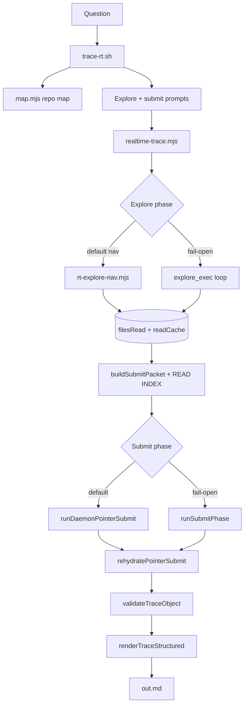

Tracing the `trace-rt` pipeline through the codebase: locating entry points and following explore, rehydrate, and render stages.
# How `trace-rt` turns a question into a rendered trace

`trace-rt` is a **two-phase pipeline**: host-side setup and repo prefetch, then **explore** (gather evidence) and **submit** (structured synthesis + host rehydration + markdown). The default path is **nav explore** + **daemon pointer submit** + **`renderTraceStructured`**.

## End-to-end flow



---

## 1. Shell entry: question, map, prompts

**Entry:** `unitrace.sh` delegates to `trace-rt.sh` with tuned reasoning defaults. `trace-rt.sh` is the orchestrator.

It:

1. Validates Codex OAuth (`~/.codex/auth.json`)
2. Creates an isolated run dir under `~/.cache/explore/runs/` (or `UNITRACE_RUNS_DIR`)
3. Prefetches a **repo map** via `map.mjs` (default mode `tandem`: pagerank + sigmap)
4. Builds an **explore prompt** (REPO MAP + QUESTION) and a **submit prompt**
5. Invokes `realtime-trace.mjs`

```301:397:skills/unitrace/scripts/trace-rt.sh
read -r -d '' UNITRACE_PROMPT <<EOF || true
Explore the codebase to gather ground truth for the question below. Do NOT write the final answer yet.
...
EOF
...
if node "$SCRIPT_DIR/map.mjs" --root "$WORKSPACE" --mode "${UNITRACE_MAP_MODE:-tandem}" "$QUESTION" > "$MAP_OUT" ...
...
node "$SCRIPT_DIR/realtime-trace.mjs" "${RT_ARGS[@]}" || trace_status=$?
```

On success, `out.md` is written and printed with run metadata.

---

## 2. Core orchestrator: `realtime-trace.mjs`

`realtime-trace.mjs` runs **`runStructuredTrace`** (default) or **`runWireStructuredTrace`** when `UNITRACE_WIRE_FORMAT=1`.

Shared state for both phases:

- `filesRead` — set of relative paths actually read
- `readCache` — numbered excerpts (`N|line`) per file, with pinned vs recent layers via `makeReadTracker`
- `toolLog` — phase metrics and tool summaries

```972:1121:skills/unitrace/scripts/realtime-trace.mjs
async function runStructuredTrace({ ... }) {
  const filesRead = new Set();
  const readCache = new Map();
  ...
  const exploreStats = await dispatchExplore({ ... });
  ...
  const { text: submitPacket, orderedPaths } = buildSubmitPacket({ ... });
  ...
  if (UNITRACE_RT_DAEMON && usePointerSubmit) {
    const daemonResult = await runDaemonPointerSubmit({ ... });
    if (daemonResult) return { text: daemonResult.markdown, ... };
  }
  structured = await runSubmitPhase(...);
  const markdown = renderTraceStructured(workspace, structured);
  return { text: markdown, ... };
}
```

Before explore, it **warms the daemon pool** (`warmDaemonPool`) so submit/nav do not pay connect cost on the critical path.

---

## 3. Explore phase (default: `nav`)

`dispatchExplore` routes by `UNITRACE_RT_UNITRACE_MODE` (default **`nav`**):

| Mode | Behavior |
|------|----------|
| **`nav`** (default) | Host-driven micro-agent in `rt-explore-nav.mjs` |
| **`agentic`** | Full-model `explore_exec` loop (daemon first, then live WS) |
| **`hybrid`** | Nav + one agentic top-up if coverage is thin |

### 3a. Map/question seed reads (`rt-map-seed.mjs`)

Before navigators run, the host seeds the read cache:

- **Named paths** from the question (e.g. `trace-rt.sh`, `realtime-trace.mjs`)
- **Map line ranges** from sigmap/pagerank output
- **Question-specific targets** (e.g. trace-rt questions get `trace-rt.sh` + `realtime-trace.mjs`)

```89:95:skills/unitrace/scripts/lib/rt-map-seed.mjs
function traceSeedTargets(question) {
  ...
  if (wantsTraceRt) return ["scripts/trace-rt.sh", "scripts/realtime-trace.mjs"];
  return [];
}
```

`seedExploreReads` uses `htools.mjs` (`toolReadRange`, `toolGrep`) to populate `readCache` via the `onRead` callback.

### 3b. Nav explore (`rt-explore-nav.mjs`)

Default fast path:

1. **Host seed** — `search-fast.mjs` `retrieveCandidates` (combined ripgrep + AST hydrate), plus usage/import follow-ups
2. **Parallel navigators** — 8× `gpt-realtime-mini` via `daemonAskBatch`, each with a different facet framing
3. **Host hydration** — navigators return `grep_terms` + `read_paths`; host runs combined rg + line-range reads (mini never reads files itself)
4. **Coalesce/dedup** — union into `readCache`, stop when satisfied or nothing new

```551:691:skills/unitrace/scripts/lib/rt-explore-nav.mjs
export async function runExploreNav({ ... }) {
  const explicitSeeds = seedExploreReads({ ... });
  const hostSeeds = await hostSeed(...);
  ...
  for (let round = 0; round < rounds; round += 1) {
    const results = await daemonAskBatch(namespace, requests, { model: navModel });
    ...
    hydrateFromPaths(...);
    await hydrateFromTerms(...);
  }
  return { toolTurnCount, exploreTurns, maxBatch, seedPaths, exploreItemIds };
}
```

**Fail-open:** if nav returns `null`, fallback to **`runExplorePhaseDaemon`** then **`runExplorePhaseSession`** — the legacy agentic loop where the model writes JS calling `tools.grep` / `tools.read` inside `explore_exec`.

Early-stop logic (`shouldStopExplore` in `rt-map-seed.mjs`) caps reads/tool calls once enough load-bearing files are covered.

---

## 4. Submit packet: pointer index instead of full excerpts

After explore, `buildSubmitPacket` assembles what the synth model sees. With defaults (`UNITRACE_RT_HOST_PASSAGES=1`, `UNITRACE_RT_SUBMIT_POINTER_INDEX=1`):

- Question, files read, seed priority, anchor symbols
- **READ INDEX** — numbered excerpt previews (`[0] path (lines X-Y)`) built by `buildReadIndex` / `buildReadIndexEntries` in `rt-rehydrate-submit.mjs`
- Instruction to call **`submit_trace_pointer`** with `citation_spans` (`excerpt_index` + line range), **not** full code

```637:744:skills/unitrace/scripts/realtime-trace.mjs
function buildSubmitPacket({ ..., pointerIndex = false }) {
  ...
  if (usePointerIndex) {
    parts.push(buildReadIndex(orderedEntries, { maxFiles: ..., previewLines: ... }), "");
    parts.push(
      `Call ${SUBMIT_POINTER_SCHEMA_NAME} once with prose fields and citation_spans ...`,
      "Do NOT include code_passages or grounding_manifest — host rehydrates citations from READ INDEX.",
    );
  }
  return { text: truncateText(parts.join("\n"), SUBMIT_PACKET_MAX), orderedPaths };
}
```

Explore conversation items are **pruned** from the Realtime session (`session.pruneItems`) before submit so synthesis runs on fresh context.

---

## 5. Submit phase: daemon pointer submit + rehydrate

Default submit path: **`runDaemonPointerSubmit`** — `gpt-realtime-2` over the warm `"trace"` daemon pool, schema `submit_trace_pointer` from `tracePointerSchema`.

Loop per attempt:

1. **`daemonAsk`** → pointer JSON (prose + `citation_spans`)
2. **`rehydratePointerSubmit`** → full structured trace with `code_passages`
3. **`validateTraceObject`** → grounding checks
4. On failure + `UNITRACE_RT_SUBMIT_REASK=1`: one reask; then fail-open to live session `runSubmitPhase`

```856:906:skills/unitrace/scripts/realtime-trace.mjs
async function runDaemonPointerSubmit({ ... }) {
  ...
  parsed = rehydratePointerSubmit({ pointer: parsed, orderedPaths, workspace, filesRead, readCache, ... });
  const err = validateTraceObject(parsed, { workspace, filesRead, toolTurns, question });
  ...
  return { markdown: renderTraceStructured(workspace, parsed), structured: parsed };
}
```

### Pointer rehydration (`rt-rehydrate-submit.mjs`)

`rehydratePointerSubmit` maps each `citation_span`:

- `excerpt_index` → path (+ optional line bounds) from `orderedPaths`
- Clamps/bounds lines with `clampSpan` (AST-aware via `expandLineRange`)
- Builds `code_passages[]`
- Ensures `key_files` coverage via `ensureKeyFileCoverage`
- Falls back to `pickCodePassages` if no valid citations
- Merges via `mergeProseWithPassages` (adds `grounding_manifest`)

```240:325:skills/unitrace/scripts/lib/rt-rehydrate-submit.mjs
export function rehydratePointerSubmit({ pointer, orderedPaths, workspace, filesRead, readCache, ... }) {
  for (const cite of pointer.citation_spans || []) {
    const entry = orderedPaths[idx];
    ...
    passages.push({ file_path: rel, start_line, end_line, rationale });
  }
  ...
  return mergeProseWithPassages(out, ensureKeyFileCoverage({ passages, ... }), filesRead, toolTurns);
}
```

Validation in `trace-schema.mjs` enforces non-empty flow, grounded file paths, span limits, comparison tables when the question contrasts things, etc.

---

## 6. Markdown rendering (`render-trace-structured.mjs`)

Final step: **`renderTraceStructured(workspace, structured)`** turns validated JSON into markdown:

1. **Opening summary** (plain prose)
2. **`## Flow`** — bullet pipeline steps
3. **`## Key files`** — table
4. **Comparison tables** (if any)
5. **`## {heading}`** sections
6. **`## Code references`** — reads **verbatim source** from disk for each `code_passage`, wrapped in fenced blocks with `start:end:path` info line

```43:91:skills/unitrace/scripts/lib/render-trace-structured.mjs
export function renderTraceStructured(repo, data) {
  ...
  for (let i = 0; i < passages.length; i++) {
    out.push(hydratePassage(repo, passages[i], i));
  }
  return out.join("\n").replace(/\n{3,}/g, "\n\n").trim() + "\n";
}
```

`hydratePassage` reads the file from the workspace and emits `<refN>` markers plus a code fence — this is **render-time** hydration from disk, separate from submit-time pointer rehydration (which picks line ranges from the read index).

Output lands in `$RUN_DIR/out.md`; `structured.json` is also written when `--structured-out` is passed.

---

## 7. Optional wire-format path

If `UNITRACE_WIRE_FORMAT=1`:

- Explore still runs (agentic session path in `runWireStructuredTrace`)
- Submit uses **`submit_wire_trace`** with plaintext wire + `<file:...>` tokens
- `trace-rt.sh` post-processes via `explore_hydrate_trace_output` → `rehydrate-explore-wire.mjs`

The default structured path (above) does not use this.

---

## Key files (for this question specifically)

| Role | File |
|------|------|
| Shell wrapper + map prefetch | `skills/unitrace/scripts/trace-rt.sh` |
| Two-phase orchestrator | `skills/unitrace/scripts/realtime-trace.mjs` |
| Default explore (nav) | `skills/unitrace/scripts/lib/rt-explore-nav.mjs` |
| Seed reads | `skills/unitrace/scripts/lib/rt-map-seed.mjs` |
| Submit packet + READ INDEX | `skills/unitrace/scripts/lib/rt-rehydrate-submit.mjs` (`buildReadIndex`, `rehydratePointerSubmit`) |
| Fallback passage picking | `skills/unitrace/scripts/lib/rt-pick-passages.mjs` |
| Schema + validation | `skills/unitrace/scripts/lib/trace-schema.mjs` |
| Markdown output | `skills/unitrace/scripts/lib/render-trace-structured.mjs` |
| Daemon pool | `skills/unitrace/scripts/lib/daemon-client.mjs` |

---

## Summary

**Question → trace** in one sentence: `trace-rt.sh` prefetches a repo map and builds prompts; `realtime-trace.mjs` **explores** by seeding reads and running parallel mini navigators (or falling back to agentic `explore_exec`), then **submits** prose + pointer citations over the daemon; the host **rehydrates** pointers into grounded `code_passages`, **validates**, and **renders** markdown with live file reads in code fences.

The design keeps **exploration cheap** (host tools + mini navigators) and **synthesis quality high** (full `gpt-realtime-2` + pointer submit), with **three-tier fail-open**: nav → agentic explore; daemon submit → live session submit; invalid citations → `pickCodePassages` fallback.

Tracing the `trace-rt` pipeline through the codebase: locating entry points and following explore, rehydrate, and render stages.
# How `trace-rt` turns a question into a rendered trace

`trace-rt` is a **two-phase pipeline**: host-side setup and repo prefetch, then **explore** (gather evidence) and **submit** (structured synthesis + host rehydration + markdown). The default path is **nav explore** + **daemon pointer submit** + **`renderTraceStructured`**.

## End-to-end flow


---

## 1. Shell entry: question, map, prompts

**Entry:** `unitrace.sh` delegates to `trace-rt.sh` with tuned reasoning defaults. `trace-rt.sh` is the orchestrator.

It:

1. Validates Codex OAuth (`~/.codex/auth.json`)
2. Creates an isolated run dir under `~/.cache/explore/runs/` (or `UNITRACE_RUNS_DIR`)
3. Prefetches a **repo map** via `map.mjs` (default mode `tandem`: pagerank + sigmap)
4. Builds an **explore prompt** (REPO MAP + QUESTION) and a **submit prompt**
5. Invokes `realtime-trace.mjs`

```301:397:skills/unitrace/scripts/trace-rt.sh
read -r -d '' UNITRACE_PROMPT <<EOF || true
Explore the codebase to gather ground truth for the question below. Do NOT write the final answer yet.
...
EOF
...
if node "$SCRIPT_DIR/map.mjs" --root "$WORKSPACE" --mode "${UNITRACE_MAP_MODE:-tandem}" "$QUESTION" > "$MAP_OUT" ...
...
node "$SCRIPT_DIR/realtime-trace.mjs" "${RT_ARGS[@]}" || trace_status=$?
```

On success, `out.md` is written and printed with run metadata.

---

## 2. Core orchestrator: `realtime-trace.mjs`

`realtime-trace.mjs` runs **`runStructuredTrace`** (default) or **`runWireStructuredTrace`** when `UNITRACE_WIRE_FORMAT=1`.

Shared state for both phases:

- `filesRead` — set of relative paths actually read
- `readCache` — numbered excerpts (`N|line`) per file, with pinned vs recent layers via `makeReadTracker`
- `toolLog` — phase metrics and tool summaries

```972:1121:skills/unitrace/scripts/realtime-trace.mjs
async function runStructuredTrace({ ... }) {
  const filesRead = new Set();
  const readCache = new Map();
  ...
  const exploreStats = await dispatchExplore({ ... });
  ...
  const { text: submitPacket, orderedPaths } = buildSubmitPacket({ ... });
  ...
  if (UNITRACE_RT_DAEMON && usePointerSubmit) {
    const daemonResult = await runDaemonPointerSubmit({ ... });
    if (daemonResult) return { text: daemonResult.markdown, ... };
  }
  structured = await runSubmitPhase(...);
  const markdown = renderTraceStructured(workspace, structured);
  return { text: markdown, ... };
}
```

Before explore, it **warms the daemon pool** (`warmDaemonPool`) so submit/nav do not pay connect cost on the critical path.

---

## 3. Explore phase (default: `nav`)

`dispatchExplore` routes by `UNITRACE_RT_UNITRACE_MODE` (default **`nav`**):

| Mode | Behavior |
|------|----------|
| **`nav`** (default) | Host-driven micro-agent in `rt-explore-nav.mjs` |
| **`agentic`** | Full-model `explore_exec` loop (daemon first, then live WS) |
| **`hybrid`** | Nav + one agentic top-up if coverage is thin |

### 3a. Map/question seed reads (`rt-map-seed.mjs`)

Before navigators run, the host seeds the read cache:

- **Named paths** from the question (e.g. `trace-rt.sh`, `realtime-trace.mjs`)
- **Map line ranges** from sigmap/pagerank output
- **Question-specific targets** (e.g. trace-rt questions get `trace-rt.sh` + `realtime-trace.mjs`)

```89:95:skills/unitrace/scripts/lib/rt-map-seed.mjs
function traceSeedTargets(question) {
  ...
  if (wantsTraceRt) return ["scripts/trace-rt.sh", "scripts/realtime-trace.mjs"];
  return [];
}
```

`seedExploreReads` uses `htools.mjs` (`toolReadRange`, `toolGrep`) to populate `readCache` via the `onRead` callback.

### 3b. Nav explore (`rt-explore-nav.mjs`)

Default fast path:

1. **Host seed** — `search-fast.mjs` `retrieveCandidates` (combined ripgrep + AST hydrate), plus usage/import follow-ups
2. **Parallel navigators** — 8× `gpt-realtime-mini` via `daemonAskBatch`, each with a different facet framing
3. **Host hydration** — navigators return `grep_terms` + `read_paths`; host runs combined rg + line-range reads (mini never reads files itself)
4. **Coalesce/dedup** — union into `readCache`, stop when satisfied or nothing new

```551:691:skills/unitrace/scripts/lib/rt-explore-nav.mjs
export async function runExploreNav({ ... }) {
  const explicitSeeds = seedExploreReads({ ... });
  const hostSeeds = await hostSeed(...);
  ...
  for (let round = 0; round < rounds; round += 1) {
    const results = await daemonAskBatch(namespace, requests, { model: navModel });
    ...
    hydrateFromPaths(...);
    await hydrateFromTerms(...);
  }
  return { toolTurnCount, exploreTurns, maxBatch, seedPaths, exploreItemIds };
}
```

**Fail-open:** if nav returns `null`, fallback to **`runExplorePhaseDaemon`** then **`runExplorePhaseSession`** — the legacy agentic loop where the model writes JS calling `tools.grep` / `tools.read` inside `explore_exec`.

Early-stop logic (`shouldStopExplore` in `rt-map-seed.mjs`) caps reads/tool calls once enough load-bearing files are covered.

---

## 4. Submit packet: pointer index instead of full excerpts

After explore, `buildSubmitPacket` assembles what the synth model sees. With defaults (`UNITRACE_RT_HOST_PASSAGES=1`, `UNITRACE_RT_SUBMIT_POINTER_INDEX=1`):

- Question, files read, seed priority, anchor symbols
- **READ INDEX** — numbered excerpt previews (`[0] path (lines X-Y)`) built by `buildReadIndex` / `buildReadIndexEntries` in `rt-rehydrate-submit.mjs`
- Instruction to call **`submit_trace_pointer`** with `citation_spans` (`excerpt_index` + line range), **not** full code

```637:744:skills/unitrace/scripts/realtime-trace.mjs
function buildSubmitPacket({ ..., pointerIndex = false }) {
  ...
  if (usePointerIndex) {
    parts.push(buildReadIndex(orderedEntries, { maxFiles: ..., previewLines: ... }), "");
    parts.push(
      `Call ${SUBMIT_POINTER_SCHEMA_NAME} once with prose fields and citation_spans ...`,
      "Do NOT include code_passages or grounding_manifest — host rehydrates citations from READ INDEX.",
    );
  }
  return { text: truncateText(parts.join("\n"), SUBMIT_PACKET_MAX), orderedPaths };
}
```

Explore conversation items are **pruned** from the Realtime session (`session.pruneItems`) before submit so synthesis runs on fresh context.

---

## 5. Submit phase: daemon pointer submit + rehydrate

Default submit path: **`runDaemonPointerSubmit`** — `gpt-realtime-2` over the warm `"trace"` daemon pool, schema `submit_trace_pointer` from `tracePointerSchema`.

Loop per attempt:

1. **`daemonAsk`** → pointer JSON (prose + `citation_spans`)
2. **`rehydratePointerSubmit`** → full structured trace with `code_passages`
3. **`validateTraceObject`** → grounding checks
4. On failure + `UNITRACE_RT_SUBMIT_REASK=1`: one reask; then fail-open to live session `runSubmitPhase`

```856:906:skills/unitrace/scripts/realtime-trace.mjs
async function runDaemonPointerSubmit({ ... }) {
  ...
  parsed = rehydratePointerSubmit({ pointer: parsed, orderedPaths, workspace, filesRead, readCache, ... });
  const err = validateTraceObject(parsed, { workspace, filesRead, toolTurns, question });
  ...
  return { markdown: renderTraceStructured(workspace, parsed), structured: parsed };
}
```

### Pointer rehydration (`rt-rehydrate-submit.mjs`)

`rehydratePointerSubmit` maps each `citation_span`:

- `excerpt_index` → path (+ optional line bounds) from `orderedPaths`
- Clamps/bounds lines with `clampSpan` (AST-aware via `expandLineRange`)
- Builds `code_passages[]`
- Ensures `key_files` coverage via `ensureKeyFileCoverage`
- Falls back to `pickCodePassages` if no valid citations
- Merges via `mergeProseWithPassages` (adds `grounding_manifest`)

```240:325:skills/unitrace/scripts/lib/rt-rehydrate-submit.mjs
export function rehydratePointerSubmit({ pointer, orderedPaths, workspace, filesRead, readCache, ... }) {
  for (const cite of pointer.citation_spans || []) {
    const entry = orderedPaths[idx];
    ...
    passages.push({ file_path: rel, start_line, end_line, rationale });
  }
  ...
  return mergeProseWithPassages(out, ensureKeyFileCoverage({ passages, ... }), filesRead, toolTurns);
}
```

Validation in `trace-schema.mjs` enforces non-empty flow, grounded file paths, span limits, comparison tables when the question contrasts things, etc.

---

## 6. Markdown rendering (`render-trace-structured.mjs`)

Final step: **`renderTraceStructured(workspace, structured)`** turns validated JSON into markdown:

1. **Opening summary** (plain prose)
2. **`## Flow`** — bullet pipeline steps
3. **`## Key files`** — table
4. **Comparison tables** (if any)
5. **`## {heading}`** sections
6. **`## Code references`** — reads **verbatim source** from disk for each `code_passage`, wrapped in fenced blocks with `start:end:path` info line

```43:91:skills/unitrace/scripts/lib/render-trace-structured.mjs
export function renderTraceStructured(repo, data) {
  ...
  for (let i = 0; i < passages.length; i++) {
    out.push(hydratePassage(repo, passages[i], i));
  }
  return out.join("\n").replace(/\n{3,}/g, "\n\n").trim() + "\n";
}
```

`hydratePassage` reads the file from the workspace and emits `<refN>` markers plus a code fence — this is **render-time** hydration from disk, separate from submit-time pointer rehydration (which picks line ranges from the read index).

Output lands in `$RUN_DIR/out.md`; `structured.json` is also written when `--structured-out` is passed.

---

## 7. Optional wire-format path

If `UNITRACE_WIRE_FORMAT=1`:

- Explore still runs (agentic session path in `runWireStructuredTrace`)
- Submit uses **`submit_wire_trace`** with plaintext wire + `<file:...>` tokens
- `trace-rt.sh` post-processes via `explore_hydrate_trace_output` → `rehydrate-explore-wire.mjs`

The default structured path (above) does not use this.

---

## Key files (for this question specifically)

| Role | File |
|------|------|
| Shell wrapper + map prefetch | `skills/unitrace/scripts/trace-rt.sh` |
| Two-phase orchestrator | `skills/unitrace/scripts/realtime-trace.mjs` |
| Default explore (nav) | `skills/unitrace/scripts/lib/rt-explore-nav.mjs` |
| Seed reads | `skills/unitrace/scripts/lib/rt-map-seed.mjs` |
| Submit packet + READ INDEX | `skills/unitrace/scripts/lib/rt-rehydrate-submit.mjs` (`buildReadIndex`, `rehydratePointerSubmit`) |
| Fallback passage picking | `skills/unitrace/scripts/lib/rt-pick-passages.mjs` |
| Schema + validation | `skills/unitrace/scripts/lib/trace-schema.mjs` |
| Markdown output | `skills/unitrace/scripts/lib/render-trace-structured.mjs` |
| Daemon pool | `skills/unitrace/scripts/lib/daemon-client.mjs` |

---

## Summary

**Question → trace** in one sentence: `trace-rt.sh` prefetches a repo map and builds prompts; `realtime-trace.mjs` **explores** by seeding reads and running parallel mini navigators (or falling back to agentic `explore_exec`), then **submits** prose + pointer citations over the daemon; the host **rehydrates** pointers into grounded `code_passages`, **validates**, and **renders** markdown with live file reads in code fences.

The design keeps **exploration cheap** (host tools + mini navigators) and **synthesis quality high** (full `gpt-realtime-2` + pointer submit), with **three-tier fail-open**: nav → agentic explore; daemon submit → live session submit; invalid citations → `pickCodePassages` fallback.
