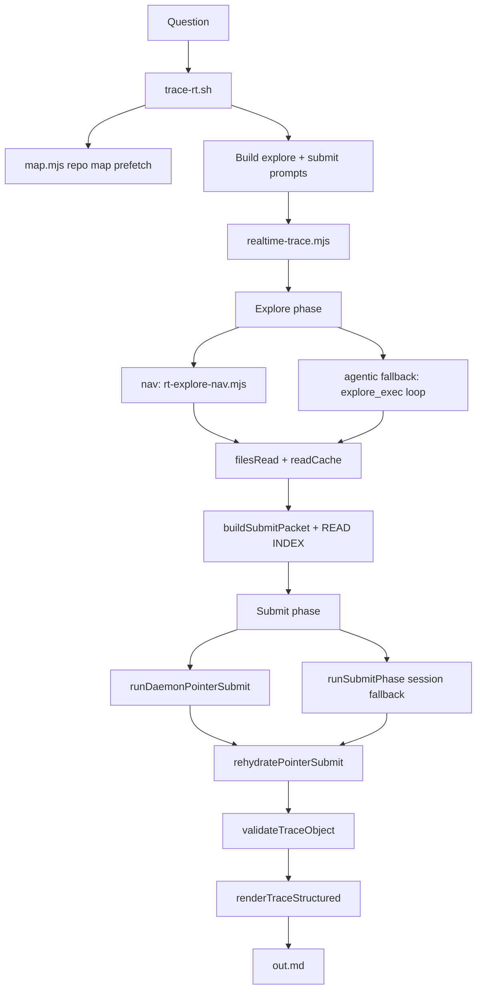

I'll trace the trace-rt pipeline from entry point through explore, rehydrate, and markdown rendering.
## Overview

`trace-rt` is a **two-phase pipeline**: host-driven **explore** (read-only codebase gathering) followed by **submit** (structured synthesis + host rehydration + markdown rendering). The shell wrapper orchestrates prep and I/O; `realtime-trace.mjs` runs the model phases.

Default entry: `unitrace.sh` → `trace-rt.sh` → `realtime-trace.mjs`.



---

## 1. Shell wrapper: question → run directory → Node driver

**Files:** `skills/unitrace/scripts/trace-rt.sh`, `skills/unitrace/scripts/unitrace.sh`

`trace-rt.sh` takes the question as arguments, sets up an isolated run under `~/.cache/explore/runs/<run-id>/`, and launches Node.

Key prep steps:

1. **Repo map prefetch** — `map.mjs` (default mode `tandem`: pagerank + sigmap) produces a `REPO MAP` block injected into the explore prompt. Optionally compacted via `compactMapBlock` (`rt-trace-utils.mjs`).

2. **Prompt assembly** — Two heredocs:
   - **Explore prompt**: instructs `explore_exec`-only reading (or nav mode handles this host-side), includes repo map + `QUESTION: …`
   - **Submit prompt**: schema rules for `submit_trace` / pointer submit

3. **Invoke** `realtime-trace.mjs` with `--prompt-file`, `--map-file`, `--question`, `--workspace`, `--out`, `--structured-out`, etc.

4. **Post-process** — On success, writes `out.md`, `structured.json`, `raw`, sets `done`. If `UNITRACE_WIRE_FORMAT=1`, runs `explore_hydrate_trace_output` (wire token expansion); the default structured path skips that.

```301:397:skills/unitrace/scripts/trace-rt.sh
read -r -d '' UNITRACE_PROMPT <<EOF || true
Explore the codebase to gather ground truth for the question below. Do NOT write the final answer yet.
...
QUESTION: ${QUESTION}
...
node "$SCRIPT_DIR/realtime-trace.mjs" "${RT_ARGS[@]}" || trace_status=$?
```

---

## 2. Explore phase: gather grounded evidence

**Files:** `skills/unitrace/scripts/realtime-trace.mjs`, `lib/rt-explore-nav.mjs`, `lib/rt-map-seed.mjs`, `lib/rt-tools.mjs`, `search-fast.mjs`

`runStructuredTrace()` in `realtime-trace.mjs` maintains:

- `filesRead` — set of relative paths actually read
- `readCache` — numbered excerpts (`123|line content`) per file, with pinned vs recent layers via `makeReadTracker()`

### Default mode: `nav` (host-driven micro-agent)

`dispatchExplore()` routes to `runExploreNav()` when `UNITRACE_RT_UNITRACE_MODE=nav` (default):

1. **Explicit seeds** — `seedExploreReads()` (`rt-map-seed.mjs`): question-named scripts, map line ranges, trace-specific targets (e.g. questions mentioning `trace-rt` auto-seed `trace-rt.sh` + `realtime-trace.mjs`).

2. **Host seed** — `search-fast.mjs` `retrieveCandidates()`: combined ripgrep → AST hydrate → pinned reads.

3. **Follow-ups** — Header reads, dependency tracing (imports/`source` lines), symbol usage greps.

4. **Navigator round(s)** — 8 parallel `gpt-realtime-mini` calls via `daemonAskBatch()` return `{ grep_terms, read_paths, done }`. Host executes greps + `toolReadRange()` — mini proposes, host reads.

5. **Fail-open** — Returns `null` if daemon unavailable and no seeds → falls back to **agentic** `explore_exec` loop on the live Realtime WebSocket.

```576:635:skills/unitrace/scripts/realtime-trace.mjs
async function dispatchExplore({ model, ensureSession, ...args }) {
  const mode = UNITRACE_RT_UNITRACE_MODE;
  if (mode !== "nav" && mode !== "hybrid") { ... agentic/daemon ... }
  const navStats = await runExploreNav({ workspace, question, mapBlock, filesRead, readCache, onRead, ... });
  if (!navStats) {
    toolLog.push("phase explore_mode=nav_failopen->agentic");
    return runExplorePhaseSession(await ensureSession(), args);
  }
  ...
}
```

### Agentic fallback

`runExplorePhaseSession()` opens a Realtime session, sends the explore prompt, and loops on `explore_exec` tool calls (`rt-tools.mjs` → `grep`, `read`, `batch_read`, etc.). Stops when `shouldStopExplore()` hits read/tool-call caps.

After explore, explore conversation items are **pruned** from the socket (`session.pruneItems`) so submit gets a fresh context.

---

## 3. Submit packet: evidence → model input

**File:** `realtime-trace.mjs` → `buildSubmitPacket()`

The submit packet includes:

- Original question, compact repo map (orientation only)
- `FILES READ DURING EXPLORE`
- Seed priority list, anchor symbols extracted from excerpts
- Tool log tail
- **READ INDEX** (default pointer path): numbered excerpt entries with line ranges and previews — model cites `excerpt_index` + line range, not full code

```637:745:skills/unitrace/scripts/realtime-trace.mjs
function buildSubmitPacket({ question, mapBlock, submitInstructions, filesRead, readCache, toolLog, seedPaths = [], ... }) {
  ...
  if (usePointerIndex) {
    parts.push(buildReadIndex(orderedEntries, { maxFiles: SUBMIT_EXCERPT_FILES + 4, previewLines: READ_INDEX_PREVIEW_LINES }), "");
  }
  ...
  parts.push(`Call ${SUBMIT_POINTER_SCHEMA_NAME} once with prose fields and citation_spans ...`);
}
```

`buildReadIndex()` / `buildReadIndexEntries()` live in `lib/rt-rehydrate-submit.mjs`.

---

## 4. Submit phase: structured JSON from model

**Files:** `realtime-trace.mjs`, `lib/realtime_client.mjs` (`askStructured`), `lib/daemon-client.mjs`, `lib/trace-schema.mjs`

Default path (`UNITRACE_RT_SUBMIT_POINTER_INDEX=1`, `UNITRACE_RT_HOST_PASSAGES=1`):

1. **Daemon submit first** — `runDaemonPointerSubmit()` sends the packet to the warm `gpt-realtime-2` daemon pool (`UNITRACE_RT_DAEMON=1`). Schema: `submit_trace_pointer` (`tracePointerSchema`) — prose fields + `citation_spans[]` with `{ excerpt_index, start_line, end_line, rationale }`. No `code_passages` from the model.

2. **Session fallback** — `runSubmitPhase()` on the live Realtime socket if daemon misses or validation fails after reask.

Both paths use reasoning effort `low` (override via env), one reask on validation failure (`UNITRACE_RT_SUBMIT_REASK=1`).

---

## 5. Pointer rehydrate: citations → `code_passages`

**File:** `skills/unitrace/scripts/lib/rt-rehydrate-submit.mjs`

`rehydratePointerSubmit()` is the core rehydration step:

1. For each `citation_spans` entry, look up `orderedPaths[excerpt_index]` (path + optional bounds).
2. Clamp cited lines to excerpt bounds; widen tiny citations to full excerpt window when appropriate.
3. `clampSpan()` snaps to enclosing AST nodes via `expandLineRange()` (`ast-context.mjs`), caps at 40 lines.
4. `ensureKeyFileCoverage()` adds passages for model-named `key_files` not yet cited.
5. **Fallback** — if no valid citations, `pickCodePassages()` (`rt-pick-passages.mjs`) host-picks spans from read cache.
6. `mergeProseWithPassages()` attaches `code_passages` + `grounding_manifest`.

```205:290:skills/unitrace/scripts/lib/rt-rehydrate-submit.mjs
export function rehydratePointerSubmit({ pointer, orderedPaths, workspace, filesRead, readCache, toolTurns, seedPaths, question }) {
  ...
  passages.push({ file_path: rel, start_line: finalStart, end_line: finalEnd, rationale: ... });
  ...
  return mergeProseWithPassages(out, ensureKeyFileCoverage({ passages, ... }), filesRead, toolTurns);
}
```

Then `validateTraceObject()` (`trace-schema.mjs`) enforces grounding: every `code_passages[].file_path` must appear in `filesRead`, spans ≤ 40 lines, comparison tables when question asks for contrast, etc.

---

## 6. Markdown rendering: structured JSON → final trace

**File:** `skills/unitrace/scripts/lib/render-trace-structured.mjs`

After validation, `renderTraceStructured(workspace, structured)` produces the final markdown:

| Section | Source field |
|---------|--------------|
| Opening paragraph | `opening_summary` |
| `## Flow` | `flow_steps[]` bullets |
| `## Key files` | table from `key_files[]` |
| Comparison tables | `comparison_tables[]` |
| `## <heading>` sections | `sections[]` |
| `## Code references` | **re-reads disk** for each `code_passages` span |

Code references are hydrated **again at render time** from the workspace (not from cached excerpts): reads file lines `start_line`–`end_line`, wraps in a fence with `` `start:end:path` `` info string and optional rationale.

```43:91:skills/unitrace/scripts/lib/render-trace-structured.mjs
export function renderTraceStructured(repo, data) {
  ...
  for (let i = 0; i < passages.length; i++) {
    out.push(hydratePassage(repo, passages[i], i));
  }
  return out.join("\n").replace(/\n{3,}/g, "\n\n").trim() + "\n";
}
```

`realtime-trace.mjs` writes this to `--out`; `trace-rt.sh` moves it to `$RUN_DIR/out.md` and prints it with run metadata footer.

```1094:1121:skills/unitrace/scripts/realtime-trace.mjs
if (daemonResult) {
  return { text: daemonResult.markdown, toolLog, structured: daemonResult.structured };
}
...
const markdown = renderTraceStructured(workspace, structured);
return { text: markdown, toolLog, structured };
```

---

## 7. Optional wire-format path

When `UNITRACE_WIRE_FORMAT=1`:

- Submit uses `submit_wire_trace` with a plaintext wire format (`runWireSubmitPhase`).
- `trace-rt.sh` post-hydrates via `explore_hydrate_trace_output` → `rehydrate-explore-wire.mjs` (expands `<file:…>` tokens to fenced code).
- Default structured path does **not** use this.

---

## Key files summary

| Role | Path |
|------|------|
| Shell entry + map prefetch + run state | `skills/unitrace/scripts/trace-rt.sh` |
| Two-phase orchestrator | `skills/unitrace/scripts/realtime-trace.mjs` |
| Default nav explore | `skills/unitrace/scripts/lib/rt-explore-nav.mjs` |
| Map/question seed reads | `skills/unitrace/scripts/lib/rt-map-seed.mjs` |
| READ INDEX + pointer rehydrate | `skills/unitrace/scripts/lib/rt-rehydrate-submit.mjs` |
| Host passage fallback | `skills/unitrace/scripts/lib/rt-pick-passages.mjs` |
| Schema + validation | `skills/unitrace/scripts/lib/trace-schema.mjs` |
| Markdown renderer | `skills/unitrace/scripts/lib/render-trace-structured.mjs` |
| Repo map | `skills/unitrace/scripts/map.mjs` |
| Explore tools (`explore_exec`) | `skills/unitrace/scripts/lib/rt-tools.mjs` |

---

## End-to-end in one sentence

**`trace-rt.sh` prefetches a repo map and builds prompts → `realtime-trace.mjs` explores via host nav (or agentic fallback), filling `readCache` → builds a READ INDEX submit packet → `gpt-realtime-2` returns pointer citations → host rehydrates them into grounded `code_passages` → `renderTraceStructured` reads those line ranges from disk and emits the final markdown trace.**

I'll trace the trace-rt pipeline from entry point through explore, rehydrate, and markdown rendering.
## Overview

`trace-rt` is a **two-phase pipeline**: host-driven **explore** (read-only codebase gathering) followed by **submit** (structured synthesis + host rehydration + markdown rendering). The shell wrapper orchestrates prep and I/O; `realtime-trace.mjs` runs the model phases.

Default entry: `unitrace.sh` → `trace-rt.sh` → `realtime-trace.mjs`.


---

## 1. Shell wrapper: question → run directory → Node driver

**Files:** `skills/unitrace/scripts/trace-rt.sh`, `skills/unitrace/scripts/unitrace.sh`

`trace-rt.sh` takes the question as arguments, sets up an isolated run under `~/.cache/explore/runs/<run-id>/`, and launches Node.

Key prep steps:

1. **Repo map prefetch** — `map.mjs` (default mode `tandem`: pagerank + sigmap) produces a `REPO MAP` block injected into the explore prompt. Optionally compacted via `compactMapBlock` (`rt-trace-utils.mjs`).

2. **Prompt assembly** — Two heredocs:
   - **Explore prompt**: instructs `explore_exec`-only reading (or nav mode handles this host-side), includes repo map + `QUESTION: …`
   - **Submit prompt**: schema rules for `submit_trace` / pointer submit

3. **Invoke** `realtime-trace.mjs` with `--prompt-file`, `--map-file`, `--question`, `--workspace`, `--out`, `--structured-out`, etc.

4. **Post-process** — On success, writes `out.md`, `structured.json`, `raw`, sets `done`. If `UNITRACE_WIRE_FORMAT=1`, runs `explore_hydrate_trace_output` (wire token expansion); the default structured path skips that.

```301:397:skills/unitrace/scripts/trace-rt.sh
read -r -d '' UNITRACE_PROMPT <<EOF || true
Explore the codebase to gather ground truth for the question below. Do NOT write the final answer yet.
...
QUESTION: ${QUESTION}
...
node "$SCRIPT_DIR/realtime-trace.mjs" "${RT_ARGS[@]}" || trace_status=$?
```

---

## 2. Explore phase: gather grounded evidence

**Files:** `skills/unitrace/scripts/realtime-trace.mjs`, `lib/rt-explore-nav.mjs`, `lib/rt-map-seed.mjs`, `lib/rt-tools.mjs`, `search-fast.mjs`

`runStructuredTrace()` in `realtime-trace.mjs` maintains:

- `filesRead` — set of relative paths actually read
- `readCache` — numbered excerpts (`123|line content`) per file, with pinned vs recent layers via `makeReadTracker()`

### Default mode: `nav` (host-driven micro-agent)

`dispatchExplore()` routes to `runExploreNav()` when `UNITRACE_RT_UNITRACE_MODE=nav` (default):

1. **Explicit seeds** — `seedExploreReads()` (`rt-map-seed.mjs`): question-named scripts, map line ranges, trace-specific targets (e.g. questions mentioning `trace-rt` auto-seed `trace-rt.sh` + `realtime-trace.mjs`).

2. **Host seed** — `search-fast.mjs` `retrieveCandidates()`: combined ripgrep → AST hydrate → pinned reads.

3. **Follow-ups** — Header reads, dependency tracing (imports/`source` lines), symbol usage greps.

4. **Navigator round(s)** — 8 parallel `gpt-realtime-mini` calls via `daemonAskBatch()` return `{ grep_terms, read_paths, done }`. Host executes greps + `toolReadRange()` — mini proposes, host reads.

5. **Fail-open** — Returns `null` if daemon unavailable and no seeds → falls back to **agentic** `explore_exec` loop on the live Realtime WebSocket.

```576:635:skills/unitrace/scripts/realtime-trace.mjs
async function dispatchExplore({ model, ensureSession, ...args }) {
  const mode = UNITRACE_RT_UNITRACE_MODE;
  if (mode !== "nav" && mode !== "hybrid") { ... agentic/daemon ... }
  const navStats = await runExploreNav({ workspace, question, mapBlock, filesRead, readCache, onRead, ... });
  if (!navStats) {
    toolLog.push("phase explore_mode=nav_failopen->agentic");
    return runExplorePhaseSession(await ensureSession(), args);
  }
  ...
}
```

### Agentic fallback

`runExplorePhaseSession()` opens a Realtime session, sends the explore prompt, and loops on `explore_exec` tool calls (`rt-tools.mjs` → `grep`, `read`, `batch_read`, etc.). Stops when `shouldStopExplore()` hits read/tool-call caps.

After explore, explore conversation items are **pruned** from the socket (`session.pruneItems`) so submit gets a fresh context.

---

## 3. Submit packet: evidence → model input

**File:** `realtime-trace.mjs` → `buildSubmitPacket()`

The submit packet includes:

- Original question, compact repo map (orientation only)
- `FILES READ DURING EXPLORE`
- Seed priority list, anchor symbols extracted from excerpts
- Tool log tail
- **READ INDEX** (default pointer path): numbered excerpt entries with line ranges and previews — model cites `excerpt_index` + line range, not full code

```637:745:skills/unitrace/scripts/realtime-trace.mjs
function buildSubmitPacket({ question, mapBlock, submitInstructions, filesRead, readCache, toolLog, seedPaths = [], ... }) {
  ...
  if (usePointerIndex) {
    parts.push(buildReadIndex(orderedEntries, { maxFiles: SUBMIT_EXCERPT_FILES + 4, previewLines: READ_INDEX_PREVIEW_LINES }), "");
  }
  ...
  parts.push(`Call ${SUBMIT_POINTER_SCHEMA_NAME} once with prose fields and citation_spans ...`);
}
```

`buildReadIndex()` / `buildReadIndexEntries()` live in `lib/rt-rehydrate-submit.mjs`.

---

## 4. Submit phase: structured JSON from model

**Files:** `realtime-trace.mjs`, `lib/realtime_client.mjs` (`askStructured`), `lib/daemon-client.mjs`, `lib/trace-schema.mjs`

Default path (`UNITRACE_RT_SUBMIT_POINTER_INDEX=1`, `UNITRACE_RT_HOST_PASSAGES=1`):

1. **Daemon submit first** — `runDaemonPointerSubmit()` sends the packet to the warm `gpt-realtime-2` daemon pool (`UNITRACE_RT_DAEMON=1`). Schema: `submit_trace_pointer` (`tracePointerSchema`) — prose fields + `citation_spans[]` with `{ excerpt_index, start_line, end_line, rationale }`. No `code_passages` from the model.

2. **Session fallback** — `runSubmitPhase()` on the live Realtime socket if daemon misses or validation fails after reask.

Both paths use reasoning effort `low` (override via env), one reask on validation failure (`UNITRACE_RT_SUBMIT_REASK=1`).

---

## 5. Pointer rehydrate: citations → `code_passages`

**File:** `skills/unitrace/scripts/lib/rt-rehydrate-submit.mjs`

`rehydratePointerSubmit()` is the core rehydration step:

1. For each `citation_spans` entry, look up `orderedPaths[excerpt_index]` (path + optional bounds).
2. Clamp cited lines to excerpt bounds; widen tiny citations to full excerpt window when appropriate.
3. `clampSpan()` snaps to enclosing AST nodes via `expandLineRange()` (`ast-context.mjs`), caps at 40 lines.
4. `ensureKeyFileCoverage()` adds passages for model-named `key_files` not yet cited.
5. **Fallback** — if no valid citations, `pickCodePassages()` (`rt-pick-passages.mjs`) host-picks spans from read cache.
6. `mergeProseWithPassages()` attaches `code_passages` + `grounding_manifest`.

```205:290:skills/unitrace/scripts/lib/rt-rehydrate-submit.mjs
export function rehydratePointerSubmit({ pointer, orderedPaths, workspace, filesRead, readCache, toolTurns, seedPaths, question }) {
  ...
  passages.push({ file_path: rel, start_line: finalStart, end_line: finalEnd, rationale: ... });
  ...
  return mergeProseWithPassages(out, ensureKeyFileCoverage({ passages, ... }), filesRead, toolTurns);
}
```

Then `validateTraceObject()` (`trace-schema.mjs`) enforces grounding: every `code_passages[].file_path` must appear in `filesRead`, spans ≤ 40 lines, comparison tables when question asks for contrast, etc.

---

## 6. Markdown rendering: structured JSON → final trace

**File:** `skills/unitrace/scripts/lib/render-trace-structured.mjs`

After validation, `renderTraceStructured(workspace, structured)` produces the final markdown:

| Section | Source field |
|---------|--------------|
| Opening paragraph | `opening_summary` |
| `## Flow` | `flow_steps[]` bullets |
| `## Key files` | table from `key_files[]` |
| Comparison tables | `comparison_tables[]` |
| `## <heading>` sections | `sections[]` |
| `## Code references` | **re-reads disk** for each `code_passages` span |

Code references are hydrated **again at render time** from the workspace (not from cached excerpts): reads file lines `start_line`–`end_line`, wraps in a fence with `` `start:end:path` `` info string and optional rationale.

```43:91:skills/unitrace/scripts/lib/render-trace-structured.mjs
export function renderTraceStructured(repo, data) {
  ...
  for (let i = 0; i < passages.length; i++) {
    out.push(hydratePassage(repo, passages[i], i));
  }
  return out.join("\n").replace(/\n{3,}/g, "\n\n").trim() + "\n";
}
```

`realtime-trace.mjs` writes this to `--out`; `trace-rt.sh` moves it to `$RUN_DIR/out.md` and prints it with run metadata footer.

```1094:1121:skills/unitrace/scripts/realtime-trace.mjs
if (daemonResult) {
  return { text: daemonResult.markdown, toolLog, structured: daemonResult.structured };
}
...
const markdown = renderTraceStructured(workspace, structured);
return { text: markdown, toolLog, structured };
```

---

## 7. Optional wire-format path

When `UNITRACE_WIRE_FORMAT=1`:

- Submit uses `submit_wire_trace` with a plaintext wire format (`runWireSubmitPhase`).
- `trace-rt.sh` post-hydrates via `explore_hydrate_trace_output` → `rehydrate-explore-wire.mjs` (expands `<file:…>` tokens to fenced code).
- Default structured path does **not** use this.

---

## Key files summary

| Role | Path |
|------|------|
| Shell entry + map prefetch + run state | `skills/unitrace/scripts/trace-rt.sh` |
| Two-phase orchestrator | `skills/unitrace/scripts/realtime-trace.mjs` |
| Default nav explore | `skills/unitrace/scripts/lib/rt-explore-nav.mjs` |
| Map/question seed reads | `skills/unitrace/scripts/lib/rt-map-seed.mjs` |
| READ INDEX + pointer rehydrate | `skills/unitrace/scripts/lib/rt-rehydrate-submit.mjs` |
| Host passage fallback | `skills/unitrace/scripts/lib/rt-pick-passages.mjs` |
| Schema + validation | `skills/unitrace/scripts/lib/trace-schema.mjs` |
| Markdown renderer | `skills/unitrace/scripts/lib/render-trace-structured.mjs` |
| Repo map | `skills/unitrace/scripts/map.mjs` |
| Explore tools (`explore_exec`) | `skills/unitrace/scripts/lib/rt-tools.mjs` |

---

## End-to-end in one sentence

**`trace-rt.sh` prefetches a repo map and builds prompts → `realtime-trace.mjs` explores via host nav (or agentic fallback), filling `readCache` → builds a READ INDEX submit packet → `gpt-realtime-2` returns pointer citations → host rehydrates them into grounded `code_passages` → `renderTraceStructured` reads those line ranges from disk and emits the final markdown trace.**
