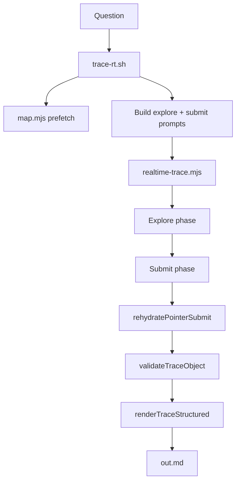

Tracing the `trace-rt` pipeline through the codebase, starting with entry points and how explore, rehydrate, and markdown rendering connect.
`trace-rt` is a two-phase pipeline: a shell wrapper prepares the question and repo context, `realtime-trace.mjs` runs **explore** then **submit**, and the host turns structured JSON into final markdown. The default path uses **nav explore** + **pointer submit** + **host rehydration** + **`renderTraceStructured`**.

## End-to-end flow



---

## 1. Entry: `trace-rt.sh`

The wrapper turns a quoted question into an isolated run under `~/.cache/explore/runs/<run-id>/` (or `UNITRACE_RUNS_DIR`).

Key steps:

1. **Auth + run layout** — requires Codex OAuth at `~/.codex/auth.json`, creates `out.md`, `raw`, `structured.json`, `frames.ndjson`, etc.
2. **Repo map prefetch** — unless `UNITRACE_MAP_MODE=none`, runs `map.mjs` in tandem mode and optionally compacts it via `compactMapBlock` (`rt-trace-utils.mjs`).
3. **Prompt assembly** — builds an explore prompt (REPO MAP + QUESTION) and a submit prompt (schema rules). Sets `UNITRACE_INSIDE_TRACE_DAEMON=1` so nested trace calls are blocked.
4. **Delegates to Node** — invokes `realtime-trace.mjs` with `--prompt-file`, `--map-file`, `--question`, `--workspace`, output paths, etc.
5. **Post-process (wire only)** — if `UNITRACE_WIRE_FORMAT=1`, runs `explore_hydrate_trace_output` from `explore-hydrate.sh` to expand wire `<file:...>` tokens via `rehydrate-explore-wire.mjs`. The default structured path does not need this.

```301:397:skills/unitrace/scripts/trace-rt.sh
read -r -d '' UNITRACE_PROMPT <<EOF || true
Explore the codebase to gather ground truth for the question below. Do NOT write the final answer yet.
...
QUESTION: ${QUESTION}
...
node "$SCRIPT_DIR/realtime-trace.mjs" "${RT_ARGS[@]}" || trace_status=$?
```

---

## 2. Orchestration: `realtime-trace.mjs`

`runStructuredTrace` is the main coordinator. It maintains shared state for both phases:

- `filesRead` — set of workspace-relative paths actually read
- `readCache` — map of path → numbered excerpt (`N|line text`)
- `toolLog` — phase metrics and tool summaries

It also warms the daemon pool (`warmDaemonPool`) for submit (and nav mini model) while explore runs.

```972:1121:skills/unitrace/scripts/realtime-trace.mjs
async function runStructuredTrace({ ... }) {
  const filesRead = new Set();
  const readCache = new Map();
  ...
  const exploreStats = await dispatchExplore({ ... });
  ...
  const { text: submitPacket, orderedPaths } = buildSubmitPacket({ ... });
  ...
  if (UNITRACE_RT_DAEMON && usePointerSubmit) {
    const daemonResult = await runDaemonPointerSubmit({ ... });
    if (daemonResult) return { text: daemonResult.markdown, ... };
  }
  structured = await runSubmitPhase(...);
  const markdown = renderTraceStructured(workspace, structured);
  return { text: markdown, toolLog, structured };
}
```

---

## 3. Explore phase (default: `nav` mode)

`dispatchExplore` routes by `UNITRACE_RT_UNITRACE_MODE` (default **`nav`**):

| Mode | Behavior |
|------|----------|
| `nav` | Host-driven micro-agent (`runExploreNav`) |
| `agentic` | Full-model `explore_exec` loop (daemon first, then live WebSocket) |
| `hybrid` | Nav + one agentic top-up if coverage is thin |

### 3a. Nav explore (`rt-explore-nav.mjs`)

This is the default fast path. The model does **not** read files directly; the host does:

1. **Seed reads** — `seedExploreReads` (`rt-map-seed.mjs`): question-named scripts, map line ranges, trace-specific targets.
2. **Host seed** — `retrieveCandidates` from `search-fast.mjs` (combined ripgrep → classify → AST hydrate).
3. **Usage + import follow-ups** — grep for symbols from seeds, follow import graph one hop.
4. **Parallel navigators** — 8× `gpt-realtime-mini` via `daemonAskBatch`, each with a different facet prompt. They return `grep_terms` + `read_paths`.
5. **Host hydration** — `hydrateFromPaths` / `hydrateFromTerms` call `toolReadRange` / `toolGrep` (`htools.mjs`), writing into `readCache` through `makeReadTracker`.

```568:709:skills/unitrace/scripts/lib/rt-explore-nav.mjs
export async function runExploreNav({ workspace, question, mapBlock, filesRead, readCache, onRead, ... }) {
  const explicitSeeds = seedExploreReads({ ... });
  const hostSeeds = await hostSeed(...);
  ...
  const results = await daemonAskBatch(namespace, requests, { model: navModel });
  ...
  const fromPaths = hydrateFromPaths(workspace, dedupPaths, onRead, ...);
  const fromTerms = await hydrateFromTerms(workspace, dedupTerms, onRead, ...);
  return { toolTurnCount, exploreTurns, maxBatch, seedPaths, exploreItemIds: new Set() };
}
```

`makeReadTracker` keeps **pinned** (grep-hit) excerpts at the front and **recent** reads in a tail-bounded cache so later reads do not evict the best evidence.

### 3b. Agentic fallback (`runExplorePhaseSession` / `runExplorePhaseDaemon`)

If nav fails (daemon unavailable, zero seeds), it falls back to a Realtime WebSocket loop where the model calls `explore_exec` with JS that batches `tools.grep`, `tools.read`, etc. via `dispatchToolBatch` (`rt-tools.mjs`).

Stop conditions: `shouldStopExplore` (`rt-map-seed.mjs`) on read count, tool-call count, and question-aware heuristics.

---

## 4. Submit packet: `buildSubmitPacket`

After explore, the host assembles evidence for synthesis:

- Original question, files read, seed priorities, anchor symbols
- **READ INDEX** (default pointer path): numbered excerpts with line ranges — model cites `excerpt_index` + line range, not full code
- Tool log tail

```637:744:skills/unitrace/scripts/realtime-trace.mjs
function buildSubmitPacket({ question, mapBlock, filesRead, readCache, toolLog, seedPaths, pointerIndex, ... }) {
  const orderedEntries = orderReadCacheEntries(readCache, seedPaths);
  const readIndexEntries = buildReadIndexEntries(orderedEntries, ...);
  ...
  if (usePointerIndex) {
    parts.push(buildReadIndex(orderedEntries, ...), "");
    parts.push(`Call ${SUBMIT_POINTER_SCHEMA_NAME} once with prose fields and citation_spans ...`);
  }
  return { text: truncateText(parts.join("\n"), SUBMIT_PACKET_MAX), orderedPaths: readIndexEntries };
}
```

`buildReadIndex` / `buildReadIndexEntries` live in `rt-rehydrate-submit.mjs`.

---

## 5. Submit phase + pointer rehydrate

Default submit path (`UNITRACE_RT_SUBMIT_POINTER_INDEX=1`, `UNITRACE_RT_HOST_PASSAGES=1`):

1. **Synthesis** — `runDaemonPointerSubmit` (preferred, warm `gpt-realtime-2` pool) or `runSubmitPhase` (live WebSocket fallback). Model returns `submit_trace_pointer`: prose fields + `citation_spans` (no `code_passages`).
2. **Rehydrate** — `rehydratePointerSubmit` maps each `citation_span.excerpt_index` → file path + line range from the READ INDEX, clamps via AST-aware `expandLineRange`, ensures `key_files` coverage.
3. **Fallback** — if citations are invalid, `pickCodePassages` (`rt-pick-passages.mjs`) picks host-assembled spans from `readCache`.
4. **Merge** — `mergeProseWithPassages` attaches `code_passages` + `grounding_manifest`.
5. **Validate** — `validateTraceObject` (`trace-schema.mjs`) checks grounding (paths must be in `filesRead`, spans ≤ 40 lines, etc.). One reask on failure (`UNITRACE_RT_SUBMIT_REASK=1`).

```240:325:skills/unitrace/scripts/lib/rt-rehydrate-submit.mjs
export function rehydratePointerSubmit({ pointer, orderedPaths, workspace, filesRead, readCache, ... }) {
  for (const cite of pointer.citation_spans || []) {
    const entry = orderedPaths[cite.excerpt_index];
    ...
    passages.push({ file_path: rel, start_line: finalStart, end_line: finalEnd, rationale: ... });
  }
  if (!passages.length) {
    const fallback = pickCodePassages({ workspace, filesRead, readCache, seedPaths, question });
    return mergeProseWithPassages(pointer, ensureKeyFileCoverage({ passages: fallback, ... }), ...);
  }
  return mergeProseWithPassages(out, ensureKeyFileCoverage({ passages, ... }), filesRead, toolTurns);
}
```

---

## 6. Markdown rendering: `renderTraceStructured`

Once structured JSON is validated, `renderTraceStructured` (`render-trace-structured.mjs`) reads **actual file bytes from disk** (not cached excerpts) and emits markdown:

- Opening summary
- `## Flow` bullet list
- `## Key files` table
- Comparison tables
- Per-module `##` sections
- `## Code references` — fenced blocks with `start:end:path` header and `<refN>` anchors

```43:91:skills/unitrace/scripts/lib/render-trace-structured.mjs
export function renderTraceStructured(repo, data) {
  ...
  if (passages.length) {
    out.push("## Code references");
    for (let i = 0; i < passages.length; i++) {
      out.push(hydratePassage(repo, passages[i], i));
    }
  }
  return out.join("\n").replace(/\n{3,}/g, "\n\n").trim() + "\n";
}
```

This is the final rendered trace written to `out.md`. `trace-rt.sh` prints it and appends run metadata:

```169:176:skills/unitrace/scripts/trace-rt.sh
print_done() {
  cat "$out_file"
  printf '\n---\n[explore: full trace saved to %s]\n[explore: run id %s]\nUNITRACE_RUN_ID=%s\n' ...
}
```

---

## Important files (quick reference)

| Role | File / function |
|------|-----------------|
| Shell entry + run state | `trace-rt.sh` |
| Two-phase orchestrator | `realtime-trace.mjs` → `runStructuredTrace`, `dispatchExplore`, `buildSubmitPacket`, `runDaemonPointerSubmit`, `runSubmitPhase` |
| Default explore | `lib/rt-explore-nav.mjs` → `runExploreNav` |
| Map/question seed reads | `lib/rt-map-seed.mjs` → `seedExploreReads` |
| Read cache + READ INDEX | `realtime-trace.mjs` → `makeReadTracker`; `lib/rt-rehydrate-submit.mjs` → `buildReadIndex`, `orderReadCacheEntries` |
| Pointer → passages | `lib/rt-rehydrate-submit.mjs` → `rehydratePointerSubmit` |
| Host passage fallback | `lib/rt-pick-passages.mjs` → `pickCodePassages`, `mergeProseWithPassages` |
| Schema + validation | `lib/trace-schema.mjs` → `tracePointerSchema`, `validateTraceObject` |
| Markdown output | `lib/render-trace-structured.mjs` → `renderTraceStructured` |
| Daemon pool | `lib/daemon-client.mjs` → `warmDaemonPool`, `daemonAsk`, `daemonAskBatch` |

---

## Fail-open tiers (summary)

The pipeline never depends solely on the daemon:

- **Explore:** nav → agentic daemon → agentic live session
- **Submit:** daemon pointer submit → live session pointer submit → (legacy) full-model `submit_trace` with model-supplied passages

For your question specifically, nav explore would seed `trace-rt.sh` and `realtime-trace.mjs`, follow imports to `rt-rehydrate-submit.mjs` and `render-trace-structured.mjs`, then submit would cite those via READ INDEX pointers that rehydrate into the final markdown code blocks.

Tracing the `trace-rt` pipeline through the codebase, starting with entry points and how explore, rehydrate, and markdown rendering connect.
`trace-rt` is a two-phase pipeline: a shell wrapper prepares the question and repo context, `realtime-trace.mjs` runs **explore** then **submit**, and the host turns structured JSON into final markdown. The default path uses **nav explore** + **pointer submit** + **host rehydration** + **`renderTraceStructured`**.

## End-to-end flow


---

## 1. Entry: `trace-rt.sh`

The wrapper turns a quoted question into an isolated run under `~/.cache/explore/runs/<run-id>/` (or `UNITRACE_RUNS_DIR`).

Key steps:

1. **Auth + run layout** — requires Codex OAuth at `~/.codex/auth.json`, creates `out.md`, `raw`, `structured.json`, `frames.ndjson`, etc.
2. **Repo map prefetch** — unless `UNITRACE_MAP_MODE=none`, runs `map.mjs` in tandem mode and optionally compacts it via `compactMapBlock` (`rt-trace-utils.mjs`).
3. **Prompt assembly** — builds an explore prompt (REPO MAP + QUESTION) and a submit prompt (schema rules). Sets `UNITRACE_INSIDE_TRACE_DAEMON=1` so nested trace calls are blocked.
4. **Delegates to Node** — invokes `realtime-trace.mjs` with `--prompt-file`, `--map-file`, `--question`, `--workspace`, output paths, etc.
5. **Post-process (wire only)** — if `UNITRACE_WIRE_FORMAT=1`, runs `explore_hydrate_trace_output` from `explore-hydrate.sh` to expand wire `<file:...>` tokens via `rehydrate-explore-wire.mjs`. The default structured path does not need this.

```301:397:skills/unitrace/scripts/trace-rt.sh
read -r -d '' UNITRACE_PROMPT <<EOF || true
Explore the codebase to gather ground truth for the question below. Do NOT write the final answer yet.
...
QUESTION: ${QUESTION}
...
node "$SCRIPT_DIR/realtime-trace.mjs" "${RT_ARGS[@]}" || trace_status=$?
```

---

## 2. Orchestration: `realtime-trace.mjs`

`runStructuredTrace` is the main coordinator. It maintains shared state for both phases:

- `filesRead` — set of workspace-relative paths actually read
- `readCache` — map of path → numbered excerpt (`N|line text`)
- `toolLog` — phase metrics and tool summaries

It also warms the daemon pool (`warmDaemonPool`) for submit (and nav mini model) while explore runs.

```972:1121:skills/unitrace/scripts/realtime-trace.mjs
async function runStructuredTrace({ ... }) {
  const filesRead = new Set();
  const readCache = new Map();
  ...
  const exploreStats = await dispatchExplore({ ... });
  ...
  const { text: submitPacket, orderedPaths } = buildSubmitPacket({ ... });
  ...
  if (UNITRACE_RT_DAEMON && usePointerSubmit) {
    const daemonResult = await runDaemonPointerSubmit({ ... });
    if (daemonResult) return { text: daemonResult.markdown, ... };
  }
  structured = await runSubmitPhase(...);
  const markdown = renderTraceStructured(workspace, structured);
  return { text: markdown, toolLog, structured };
}
```

---

## 3. Explore phase (default: `nav` mode)

`dispatchExplore` routes by `UNITRACE_RT_UNITRACE_MODE` (default **`nav`**):

| Mode | Behavior |
|------|----------|
| `nav` | Host-driven micro-agent (`runExploreNav`) |
| `agentic` | Full-model `explore_exec` loop (daemon first, then live WebSocket) |
| `hybrid` | Nav + one agentic top-up if coverage is thin |

### 3a. Nav explore (`rt-explore-nav.mjs`)

This is the default fast path. The model does **not** read files directly; the host does:

1. **Seed reads** — `seedExploreReads` (`rt-map-seed.mjs`): question-named scripts, map line ranges, trace-specific targets.
2. **Host seed** — `retrieveCandidates` from `search-fast.mjs` (combined ripgrep → classify → AST hydrate).
3. **Usage + import follow-ups** — grep for symbols from seeds, follow import graph one hop.
4. **Parallel navigators** — 8× `gpt-realtime-mini` via `daemonAskBatch`, each with a different facet prompt. They return `grep_terms` + `read_paths`.
5. **Host hydration** — `hydrateFromPaths` / `hydrateFromTerms` call `toolReadRange` / `toolGrep` (`htools.mjs`), writing into `readCache` through `makeReadTracker`.

```568:709:skills/unitrace/scripts/lib/rt-explore-nav.mjs
export async function runExploreNav({ workspace, question, mapBlock, filesRead, readCache, onRead, ... }) {
  const explicitSeeds = seedExploreReads({ ... });
  const hostSeeds = await hostSeed(...);
  ...
  const results = await daemonAskBatch(namespace, requests, { model: navModel });
  ...
  const fromPaths = hydrateFromPaths(workspace, dedupPaths, onRead, ...);
  const fromTerms = await hydrateFromTerms(workspace, dedupTerms, onRead, ...);
  return { toolTurnCount, exploreTurns, maxBatch, seedPaths, exploreItemIds: new Set() };
}
```

`makeReadTracker` keeps **pinned** (grep-hit) excerpts at the front and **recent** reads in a tail-bounded cache so later reads do not evict the best evidence.

### 3b. Agentic fallback (`runExplorePhaseSession` / `runExplorePhaseDaemon`)

If nav fails (daemon unavailable, zero seeds), it falls back to a Realtime WebSocket loop where the model calls `explore_exec` with JS that batches `tools.grep`, `tools.read`, etc. via `dispatchToolBatch` (`rt-tools.mjs`).

Stop conditions: `shouldStopExplore` (`rt-map-seed.mjs`) on read count, tool-call count, and question-aware heuristics.

---

## 4. Submit packet: `buildSubmitPacket`

After explore, the host assembles evidence for synthesis:

- Original question, files read, seed priorities, anchor symbols
- **READ INDEX** (default pointer path): numbered excerpts with line ranges — model cites `excerpt_index` + line range, not full code
- Tool log tail

```637:744:skills/unitrace/scripts/realtime-trace.mjs
function buildSubmitPacket({ question, mapBlock, filesRead, readCache, toolLog, seedPaths, pointerIndex, ... }) {
  const orderedEntries = orderReadCacheEntries(readCache, seedPaths);
  const readIndexEntries = buildReadIndexEntries(orderedEntries, ...);
  ...
  if (usePointerIndex) {
    parts.push(buildReadIndex(orderedEntries, ...), "");
    parts.push(`Call ${SUBMIT_POINTER_SCHEMA_NAME} once with prose fields and citation_spans ...`);
  }
  return { text: truncateText(parts.join("\n"), SUBMIT_PACKET_MAX), orderedPaths: readIndexEntries };
}
```

`buildReadIndex` / `buildReadIndexEntries` live in `rt-rehydrate-submit.mjs`.

---

## 5. Submit phase + pointer rehydrate

Default submit path (`UNITRACE_RT_SUBMIT_POINTER_INDEX=1`, `UNITRACE_RT_HOST_PASSAGES=1`):

1. **Synthesis** — `runDaemonPointerSubmit` (preferred, warm `gpt-realtime-2` pool) or `runSubmitPhase` (live WebSocket fallback). Model returns `submit_trace_pointer`: prose fields + `citation_spans` (no `code_passages`).
2. **Rehydrate** — `rehydratePointerSubmit` maps each `citation_span.excerpt_index` → file path + line range from the READ INDEX, clamps via AST-aware `expandLineRange`, ensures `key_files` coverage.
3. **Fallback** — if citations are invalid, `pickCodePassages` (`rt-pick-passages.mjs`) picks host-assembled spans from `readCache`.
4. **Merge** — `mergeProseWithPassages` attaches `code_passages` + `grounding_manifest`.
5. **Validate** — `validateTraceObject` (`trace-schema.mjs`) checks grounding (paths must be in `filesRead`, spans ≤ 40 lines, etc.). One reask on failure (`UNITRACE_RT_SUBMIT_REASK=1`).

```240:325:skills/unitrace/scripts/lib/rt-rehydrate-submit.mjs
export function rehydratePointerSubmit({ pointer, orderedPaths, workspace, filesRead, readCache, ... }) {
  for (const cite of pointer.citation_spans || []) {
    const entry = orderedPaths[cite.excerpt_index];
    ...
    passages.push({ file_path: rel, start_line: finalStart, end_line: finalEnd, rationale: ... });
  }
  if (!passages.length) {
    const fallback = pickCodePassages({ workspace, filesRead, readCache, seedPaths, question });
    return mergeProseWithPassages(pointer, ensureKeyFileCoverage({ passages: fallback, ... }), ...);
  }
  return mergeProseWithPassages(out, ensureKeyFileCoverage({ passages, ... }), filesRead, toolTurns);
}
```

---

## 6. Markdown rendering: `renderTraceStructured`

Once structured JSON is validated, `renderTraceStructured` (`render-trace-structured.mjs`) reads **actual file bytes from disk** (not cached excerpts) and emits markdown:

- Opening summary
- `## Flow` bullet list
- `## Key files` table
- Comparison tables
- Per-module `##` sections
- `## Code references` — fenced blocks with `start:end:path` header and `<refN>` anchors

```43:91:skills/unitrace/scripts/lib/render-trace-structured.mjs
export function renderTraceStructured(repo, data) {
  ...
  if (passages.length) {
    out.push("## Code references");
    for (let i = 0; i < passages.length; i++) {
      out.push(hydratePassage(repo, passages[i], i));
    }
  }
  return out.join("\n").replace(/\n{3,}/g, "\n\n").trim() + "\n";
}
```

This is the final rendered trace written to `out.md`. `trace-rt.sh` prints it and appends run metadata:

```169:176:skills/unitrace/scripts/trace-rt.sh
print_done() {
  cat "$out_file"
  printf '\n---\n[explore: full trace saved to %s]\n[explore: run id %s]\nUNITRACE_RUN_ID=%s\n' ...
}
```

---

## Important files (quick reference)

| Role | File / function |
|------|-----------------|
| Shell entry + run state | `trace-rt.sh` |
| Two-phase orchestrator | `realtime-trace.mjs` → `runStructuredTrace`, `dispatchExplore`, `buildSubmitPacket`, `runDaemonPointerSubmit`, `runSubmitPhase` |
| Default explore | `lib/rt-explore-nav.mjs` → `runExploreNav` |
| Map/question seed reads | `lib/rt-map-seed.mjs` → `seedExploreReads` |
| Read cache + READ INDEX | `realtime-trace.mjs` → `makeReadTracker`; `lib/rt-rehydrate-submit.mjs` → `buildReadIndex`, `orderReadCacheEntries` |
| Pointer → passages | `lib/rt-rehydrate-submit.mjs` → `rehydratePointerSubmit` |
| Host passage fallback | `lib/rt-pick-passages.mjs` → `pickCodePassages`, `mergeProseWithPassages` |
| Schema + validation | `lib/trace-schema.mjs` → `tracePointerSchema`, `validateTraceObject` |
| Markdown output | `lib/render-trace-structured.mjs` → `renderTraceStructured` |
| Daemon pool | `lib/daemon-client.mjs` → `warmDaemonPool`, `daemonAsk`, `daemonAskBatch` |

---

## Fail-open tiers (summary)

The pipeline never depends solely on the daemon:

- **Explore:** nav → agentic daemon → agentic live session
- **Submit:** daemon pointer submit → live session pointer submit → (legacy) full-model `submit_trace` with model-supplied passages

For your question specifically, nav explore would seed `trace-rt.sh` and `realtime-trace.mjs`, follow imports to `rt-rehydrate-submit.mjs` and `render-trace-structured.mjs`, then submit would cite those via READ INDEX pointers that rehydrate into the final markdown code blocks.
