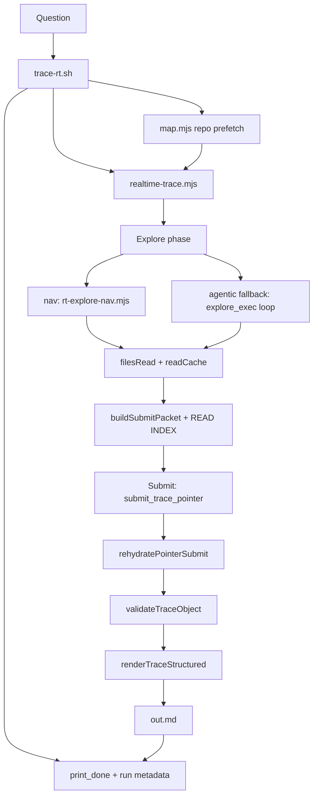

Tracing the trace-rt pipeline through the codebase, starting with entry points and the main flow.
# How `trace-rt` turns a question into a rendered trace

The default path is a **shell wrapper → two-phase Realtime pipeline → host pointer rehydrate → markdown renderer**. Entry is usually `unitrace.sh`, which only sets reasoning defaults and execs `trace-rt.sh`.



---

## 1. Shell wrapper: run layout, map prefetch, prompts

`trace-rt.sh` owns orchestration outside the model loop:

- Validates Codex OAuth, allocates an isolated run dir (`$RUNS_DIR/$RUN_ID/`), sets `UNITRACE_INSIDE_TRACE_DAEMON=1` so nested trace calls are blocked.
- Prefetches a **repo map** with `map.mjs` (default mode `tandem`), optionally compacts it for the explore prompt via `compactMapBlock` in `rt-trace-utils.mjs`.
- Builds two prompt files:
  - **Explore prompt** — instructs `explore_exec`-style reading (or nav equivalent), embeds REPO MAP + QUESTION.
  - **Submit prompt** — rules for structured synthesis (`opening_summary`, `flow_steps`, sections, etc.).
- Invokes `realtime-trace.mjs` with workspace, auth, frames log, and optional `structured.json` output path.
- On success, moves temp output to `out.md`, marks `done`, and prints the trace plus run-id footer via `print_done`.

```301:397:skills/unitrace/scripts/trace-rt.sh
read -r -d '' UNITRACE_PROMPT <<EOF || true
Explore the codebase to gather ground truth for the question below. Do NOT write the final answer yet.
...
EOF
...
node "$SCRIPT_DIR/realtime-trace.mjs" "${RT_ARGS[@]}" || trace_status=$?
```

Default reasoning: explore **omit + steer** (`unitrace.sh` sets `UNITRACE_RT_UNITRACE_REASONING_EFFORT=none`), submit **`low`**.

---

## 2. Explore phase: gather grounded reads

`realtime-trace.mjs` runs `runStructuredTrace`, which always ends with a **submit packet** built from a shared `filesRead` set and `readCache` map (line-numbered excerpts).

### Mode dispatch (default: `nav`)

`dispatchExplore` chooses the explore strategy (`UNITRACE_RT_UNITRACE_MODE`, default `nav`):

| Mode | Behavior |
|------|----------|
| **nav** (default) | Host-driven micro-agent in `rt-explore-nav.mjs` |
| **agentic** | Full-model `explore_exec` loop (daemon first, then live WebSocket session) |
| **hybrid** | nav, then one agentic top-up if coverage is thin |

All paths populate the same `readCache` via `makeReadTracker`, which keeps **pinned** seed windows and **recent** exploration excerpts within a per-file char budget.

### Nav explore (fast path)

`runExploreNav` does host-side work the model never reads files directly:

1. **Explicit seeds** — `seedExploreReads` (`rt-map-seed.mjs`): question-named scripts (e.g. a question mentioning `trace-rt.sh` seeds `scripts/trace-rt.sh` + `scripts/realtime-trace.mjs`), map line ranges, grep for symbols.
2. **Retriever seed** — `retrieveCandidates` from `search-fast.mjs` (combined ripgrep → AST hydrate), pinned so later reads cannot truncate definition windows.
3. **Parallel navigators** — 8× `gpt-realtime-mini` calls via `daemonAskBatch`; each returns `grep_terms` + `read_paths` for a different “facet” of the question.
4. **Host hydration** — combined rg + `toolReadRange` (`htools.mjs`), deduped, written into `readCache`.

If the daemon path fails and nothing was seeded, it **fail-opens** to the agentic `explore_exec` loop.

```445:571:skills/unitrace/scripts/lib/rt-explore-nav.mjs
export async function runExploreNav({ ... }) {
  const explicitSeeds = seedExploreReads({ ... });
  const hostSeeds = await hostSeed(workspace, question, onRead, { ... });
  ...
  const results = await daemonAskBatch(namespace, requests, { model: navModel });
  ...
  const fromPaths = hydrateFromPaths(...);
  const fromTerms = await hydrateFromTerms(...);
  ...
}
```

### Agentic fallback

`runExplorePhaseSession` / `runExplorePhaseDaemon` drive a Realtime session with `explore_exec` tool calls. The host executes JS that calls `tools.grep`, `tools.read`, etc. via `dispatchToolBatch` (`rt-tools.mjs`). Early stopping uses `shouldStopExplore` once enough load-bearing files are read.

---

## 3. Submit phase: pointer synthesis (not full code in the model)

After explore, explore conversation items are pruned (`session.pruneItems`) to free context. `buildSubmitPacket` assembles evidence for submit:

- Original question, files read, seed priority list, anchor symbols extracted from excerpts
- **READ INDEX** (default pointer path): numbered excerpts with preview lines — the model cites `excerpt_index` + line ranges, not raw code blocks
- Truncated tool log

Default submit path (`UNITRACE_RT_HOST_PASSAGES=1`, `UNITRACE_RT_SUBMIT_POINTER_INDEX=1`):

1. **`runDaemonPointerSubmit`** — synthesis over the warm daemon pool (`gpt-realtime-2`, reasoning `low`), fail-open to live session.
2. Model calls **`submit_trace_pointer`** with prose fields + `citation_spans`.
3. **`rehydratePointerSubmit`** resolves each span:
   - Maps `excerpt_index` → file path from ordered read index
   - Clamps line ranges (AST expand via `expandLineRange`, max 40 lines)
   - Builds `code_passages`; if none valid, falls back to host `pickCodePassages`
4. **`mergeProseWithPassages`** attaches `code_passages` + `grounding_manifest`
5. **`validateTraceObject`** (`trace-schema.mjs`) — grounding checks (paths must be in `filesRead`, span limits, comparison tables when question contrasts things). One reask on failure.

```709:905:skills/unitrace/scripts/realtime-trace.mjs
  if (usePointerIndex) {
    parts.push(buildReadIndex(orderedEntries, ...), "");
  ...
async function runDaemonPointerSubmit({ ... }) {
  ...
  parsed = rehydratePointerSubmit({ pointer: parsed, orderedPaths, workspace, filesRead, readCache, ... });
  const err = validateTraceObject(parsed, { workspace, filesRead, toolTurns, question });
  ...
  return { markdown: renderTraceStructured(workspace, parsed), structured: parsed };
}
```

Pointer rehydration core:

```112:181:skills/unitrace/scripts/lib/rt-rehydrate-submit.mjs
export function rehydratePointerSubmit({ pointer, orderedPaths, workspace, filesRead, readCache, ... }) {
  for (const cite of pointer.citation_spans || []) {
    const idx = cite.excerpt_index;
    ...
    passages.push({ file_path: rel, start_line: finalStart, end_line: finalEnd, rationale: ... });
  }
  ...
  return mergeProseWithPassages(out, passages, filesRead, toolTurns);
}
```

---

## 4. Markdown rendering: structured JSON → `out.md`

`renderTraceStructured` is the final renderer. It does **not** trust model-supplied code text for citations — it re-reads the workspace from disk for each `code_passage`:

- Opening summary (plain prose)
- `## Flow` bullet list from `flow_steps`
- `## Key files` table
- Comparison tables
- Per-module `##` sections
- `## Code references` — each passage becomes a fenced block with `start:end:path` header and `<refN>` marker

```43:91:skills/unitrace/scripts/lib/render-trace-structured.mjs
export function renderTraceStructured(repo, data) {
  ...
  for (let i = 0; i < passages.length; i++) {
    out.push(hydratePassage(repo, passages[i], i));
  }
  return out.join("\n").replace(/\n{3,}/g, "\n\n").trim() + "\n";
}
```

`realtime-trace.mjs` writes this markdown to `--out`; `trace-rt.sh` moves it to `$RUN_DIR/out.md` and prints it with a saved-path footer.

Structured JSON is also written to `$RUN_DIR/structured.json` when submit succeeds.

---

## 5. Optional wire-format branch

If `UNITRACE_WIRE_FORMAT=1`, the pipeline uses wire plaintext submit instead of structured JSON, and `trace-rt.sh` post-processes through `explore_hydrate_trace_output` → `rehydrate-explore-wire.mjs`. That path is **not** the default; the question you asked about maps to the structured + pointer + `renderTraceStructured` path above.

---

## Key files (quick reference)

| Stage | File | Role |
|-------|------|------|
| Entry | `unitrace.sh`, `trace-rt.sh` | Wrapper, map prefetch, run state, final print |
| Orchestration | `realtime-trace.mjs` | Two-phase pipeline, submit dispatch, output write |
| Explore (default) | `lib/rt-explore-nav.mjs` | Nav micro-agent + host reads |
| Explore seeds | `lib/rt-map-seed.mjs` | Question/map-driven prefetch reads |
| Explore (fallback) | `lib/rt-tools.mjs`, `lib/rt-agent-session.mjs` | `explore_exec` tool loop |
| Submit packet | `buildSubmitPacket` in `realtime-trace.mjs` | READ INDEX + evidence bundle |
| Pointer rehydrate | `lib/rt-rehydrate-submit.mjs`, `lib/rt-pick-passages.mjs` | Spans → `code_passages` |
| Validation | `lib/trace-schema.mjs` | Schema + grounding gate |
| Markdown | `lib/render-trace-structured.mjs` | Final `out.md` layout + disk hydration |
| Daemon pool | `lib/daemon-client.mjs` | Warm parallel nav + submit (fail-open) |

---

## End-to-end summary

A question becomes a trace by: **(1)** prefetching a repo map and seed reads, **(2)** exploring via host-driven nav (or agentic `explore_exec`) into a shared read cache, **(3)** asking the synth model for prose + pointer citations against a READ INDEX, **(4)** host-rehydrating those pointers into grounded `code_passages`, validating, and **(5)** rendering markdown that pulls actual source lines from disk for every citation. The shell wrapper adds run isolation, optional structured JSON artifact, and the printed footer with run id and output path.
