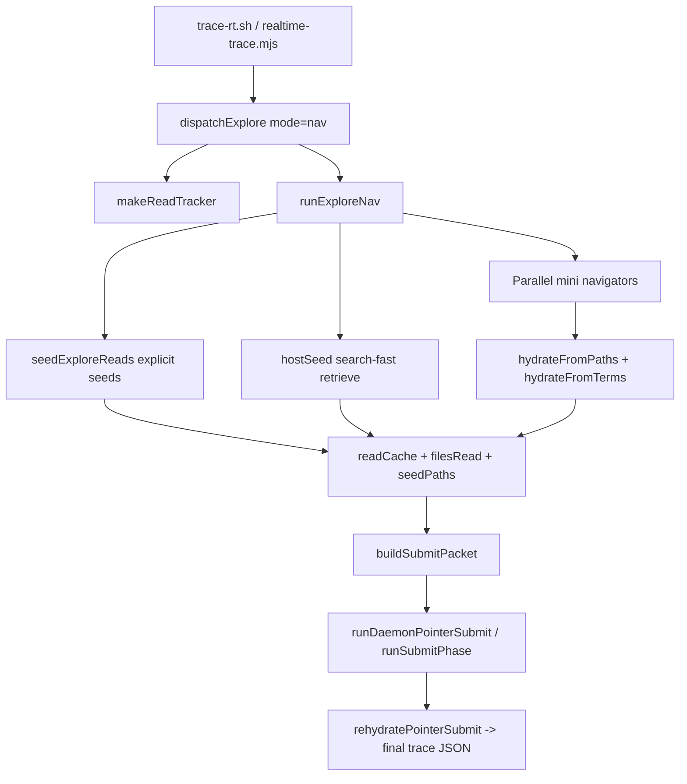

Tracing the nav explore path: searching for seed-file logic and submit-packet assembly for the final trace.
The nav explore path is a two-phase pipeline in `realtime-trace.mjs`: **explore** fills a shared read cache, then **submit** serializes that cache into a text packet for the synth model. Seeding and navigation both write into the same `filesRead` / `readCache` / `seedPaths` state that `buildSubmitPacket` reads.

## End-to-end flow



Entry: `unitrace.sh` → `trace-rt.sh` → `realtime-trace.mjs`. With default `UNITRACE_RT_UNITRACE_MODE=nav`, explore goes through `dispatchExplore` → `runExploreNav`, not the full-model `explore_exec` loop.

---

## 1. Shared read state (`makeReadTracker`)

Before seeding, the host creates one callback that all seed/nav reads share:

```261:284:skills/unitrace/scripts/realtime-trace.mjs
function makeReadTracker(workspace, filesRead, readCache) {
  const pinned = new Map();
  const recent = new Map();
  return (rel, excerpt, opts = {}) => {
    const normalized = normalizeReadPath(workspace, rel);
    if (!normalized) return;
    filesRead.add(normalized);

    if (opts.pin) {
      pinned.set(normalized, clampExcerptHead(mergeExcerpt(pinned.get(normalized), excerpt), READ_EXCERPT_MAX));
    } else {
      recent.set(normalized, clampExcerptTail(mergeExcerpt(recent.get(normalized), excerpt), READ_EXCERPT_MAX));
    }
    // ... merges pinned + recent into readCache ...
    readCache.set(normalized, combined);
  };
}
```

- **`filesRead`**: set of repo-relative paths touched during explore (becomes the `code_passages` enum).
- **`readCache`**: map of path → numbered line excerpts (what submit cites).
- **`pin: true`**: seed reads stay at the front and are not truncated by later reads.

`dispatchExplore` wires this up for nav mode:

```597:609:skills/unitrace/scripts/realtime-trace.mjs
  const { workspace, question, mapBlock, filesRead, readCache, toolLog, framesPath } = args;
  const onRead = makeReadTracker(workspace, filesRead, readCache);
  const navStats = await runExploreNav({
    workspace,
    question,
    mapBlock,
    filesRead,
    readCache,
    onRead,
    // ...
  });
```

---

## 2. Seeding files (`seedExploreReads` + `hostSeed`)

`runExploreNav` seeds in two layers, then merges path lists:

```361:379:skills/unitrace/scripts/lib/rt-explore-nav.mjs
  const explicitSeeds = seedExploreReads({
    workspace,
    question,
    mapBlock,
    filesRead,
    readCache,
    onRead,
  });
  const focusRoots = focusRootsFor(question, explicitSeeds);
  const hostSeeds = await hostSeed(workspace, question, onRead, {
    maxSpans: seedSpans,
    preferSourceOnly,
    focusRoots,
    // ...
  });
  const seedPaths = [...new Set([...explicitSeeds, ...hostSeeds])];
```

### 2a. Explicit seeds — `seedExploreReads` (`rt-map-seed.mjs`)

Priority order inside `seedExploreReads`:

1. **`grepHitSeeds`** — grep for code symbols in the question, find definition hits, read a window around each definition (pinned). Own budget; does not consume the map budget.

2. **`curatedTraceSeeds`** — question-pattern shortcuts. For nav/seed/submit questions, it pins specific line ranges in `rt-map-seed.mjs`, `rt-explore-nav.mjs`, and `realtime-trace.mjs` (`buildSubmitPacket`):

```138:150:skills/unitrace/scripts/lib/rt-map-seed.mjs
  const wantsNavSeedSubmit = /\b(nav|seed|submit packet|submit-packet|build submit packet)\b/.test(q);
  if (/\btrace-rt(?:\.sh)?\b|\brealtime-trace(?:\.mjs)?\b|\btrace rt\b/.test(q) || wantsNavSeedSubmit) {
    // ...
    if (wantsNavSeedSubmit) {
      specs.push({ path: "scripts/lib/rt-map-seed.mjs", start_line: 300, end_line: 390 });
      specs.push({ path: "scripts/lib/rt-explore-nav.mjs", start_line: 294, end_line: 380 });
      specs.push({ path: "scripts/realtime-trace.mjs", start_line: 632, end_line: 715 });
    }
  }
```

3. **Repo map line ranges** — `parseMapLineRanges(mapBlock)` scored by `scoreMapRange`, read with padding, pinned.

4. **`deriveSeedPaths`** — paths from named files in the question + map paths matching focus terms.

5. **`pipelineSeedReads`** — pipeline-specific extras.

Each read goes through `readSeedSpec` → `toolReadRange` → `onRead(rel, content, { pin: true })`.

### 2b. Host retriever seed — `hostSeed`

After explicit seeds, `hostSeed` runs **`retrieveCandidates`** from `search-fast.mjs` (combined ripgrep → classify/score → AST hydrate) on the full question text. Matches are filtered by focus roots, archive/wire/test suppressions, and `suppressDownstream` (for seed+submit questions, downstream transport files like `rt-rehydrate-submit.mjs` are excluded unless the question asks about pointers/rehydrate/wire).

```314:333:skills/unitrace/scripts/lib/rt-explore-nav.mjs
async function hostSeed(workspace, question, onRead, { maxSpans, ... }) {
  result = await retrieveCandidates(workspace, question, { maxSpans, ... });
  for (const c of focusCandidates(...)) {
    onRead(rel, readCandidateWindow(workspace, c), { pin: true });
    if (!seeded.includes(rel)) seeded.push(rel);
  }
  return seeded;
}
```

Default span budget: `UNITRACE_RT_NAV_SEED_SPANS=12`.

---

## 3. Navigation round(s) (optional extra reads)

After seeding, navigators see a **READ INDEX** built from the same cache (`buildNavIndex` → `orderReadCacheEntries` + `buildReadIndex` from `rt-rehydrate-submit.mjs`).

Each round:

1. **`daemonAskBatch`** — 8 parallel `gpt-realtime-mini` navigators (`FACETS`), each returning `{ grep_terms, read_paths, done }` per `NAV_SCHEMA`.
2. **`dedupNavProposals`** — union/dedup across navigators.
3. **`hydrateFromPaths`** — direct `toolReadRange` for explicit path requests.
4. **`hydrateFromTerms`** — another `retrieveCandidates` pass for grep terms.

New reads go through the same `onRead` (unpinned unless seeded). `runExploreNav` returns `{ seedPaths, toolTurnCount, exploreTurns, ... }`; `seedPaths` is logged and passed to submit.

Fail-open: if the daemon is unavailable and nothing was seeded, nav returns `null` and `dispatchExplore` falls back to the agentic `explore_exec` loop.

---

## 4. Building the submit packet (`buildSubmitPacket`)

After explore, `runTrace` calls `buildSubmitPacket` with explore outputs:

```1044:1054:skills/unitrace/scripts/realtime-trace.mjs
    const { text: submitPacket, orderedPaths } = buildSubmitPacket({
      question: q,
      mapBlock,
      submitInstructions,
      filesRead,
      readCache,
      toolLog,
      seedPaths: exploreStats.seedPaths || [],
      hostPassages: UNITRACE_RT_HOST_PASSAGES,
      pointerIndex: UNITRACE_RT_SUBMIT_POINTER_INDEX,
    });
```

`buildSubmitPacket` assembles a single text blob:

| Section | Source |
|--------|--------|
| Original question | `question` |
| Repo map (optional, compact) | `mapBlock` |
| Files read list | `filesRead` |
| High-priority seeded files | `seedPaths` (ranking hint) |
| Anchor symbols | extracted from ordered excerpts |
| Question-specific guidance | `questionGuidance(question)` |
| Tool log (last 8 non-phase lines) | `toolLog` |
| Evidence body | full excerpts **or** pointer READ INDEX |

Key ordering logic — seeds rank first in excerpts/index:

```39:51:skills/unitrace/scripts/lib/rt-rehydrate-submit.mjs
export function orderReadCacheEntries(readCache, seedPaths = []) {
  const rank = new Map();
  seedPaths.forEach((p, i) => { if (!rank.has(p)) rank.set(p, i); });
  // ... sort readCache entries by seed rank, then alphabetically ...
}
```

Default submit path (pointer index on): instead of full excerpts, the packet includes a **READ INDEX** with `[excerpt_index] path (lines)` previews; the model returns `citation_spans` referencing indices. Packet is truncated to `UNITRACE_RT_SUBMIT_PACKET_MAX` (default 45000).

```643:750:skills/unitrace/scripts/realtime-trace.mjs
function buildSubmitPacket({ question, mapBlock, ..., seedPaths = [], ... }) {
  const orderedEntries = orderReadCacheEntries(readCache, seedPaths);
  const readIndexEntries = buildReadIndexEntries(orderedEntries, ...);
  // ... assembles ORIGINAL QUESTION, FILES READ, HIGH PRIORITY FILES, TOOL LOG,
  //     READ INDEX or READ EXCERPTS, and submit tool instructions ...
  return { text: truncateText(parts.join("\n"), SUBMIT_PACKET_MAX), orderedPaths };
}
```

---

## 5. Consuming the packet (final trace)

The submit packet is **not** the final trace — it is input to synthesis:

- **Default**: `runDaemonPointerSubmit` sends the packet to the warm daemon (`gpt-realtime-2`, reasoning `low`), model returns pointer JSON with `citation_spans`.
- **Rehydration**: `rehydratePointerSubmit` in `rt-rehydrate-submit.mjs` turns `excerpt_index` + line ranges into `code_passages`, using `seedPaths` for fallback passage picking via `pickCodePassages`.
- **Fallback**: daemon miss → live-session `runSubmitPhase` → same validation/reask path.

---

## Important files / functions

| Role | File | Functions |
|------|------|-----------|
| Orchestration | `skills/unitrace/scripts/realtime-trace.mjs` | `dispatchExplore`, `makeReadTracker`, `buildSubmitPacket`, `runDaemonPointerSubmit`, `runTrace` |
| Nav explore | `skills/unitrace/scripts/lib/rt-explore-nav.mjs` | `runExploreNav`, `hostSeed`, `buildNavIndex`, `hydrateFromPaths`, `hydrateFromTerms`, `dedupNavProposals` |
| Map/symbol seeding | `skills/unitrace/scripts/lib/rt-map-seed.mjs` | `seedExploreReads`, `grepHitSeeds`, `curatedTraceSeeds`, `deriveSeedPaths` |
| Fast retrieval | `skills/unitrace/scripts/search-fast.mjs` | `retrieveCandidates` |
| Submit ordering/rehydrate | `skills/unitrace/scripts/lib/rt-rehydrate-submit.mjs` | `orderReadCacheEntries`, `buildReadIndex`, `buildReadIndexEntries`, `rehydratePointerSubmit` |
| File reads | `skills/unitrace/scripts/lib/htools.mjs` | `toolReadRange`, `confine` |

---

## Short summary

**Seeding**: `runExploreNav` calls `seedExploreReads` (grep definitions, curated ranges, map paths, derive paths) and `hostSeed` (`search-fast` retrieval), both writing pinned excerpts into `readCache` via `onRead`. **`seedPaths`** records which files were seeded for priority ordering.

**Submit packet**: After nav (and optional hybrid top-up), `buildSubmitPacket` sorts `readCache` by `seedPaths`, adds question/map/files/tool-log context, and emits either full excerpts or a pointer READ INDEX. That text goes to the synth model; the host rehydrates citations into the final structured trace.

For this exact question, `curatedTraceSeeds` and `suppressDownstream` are tuned so the explore phase prioritizes `rt-map-seed.mjs`, `rt-explore-nav.mjs`, and the `buildSubmitPacket` block in `realtime-trace.mjs` over downstream rehydrate/render plumbing.
