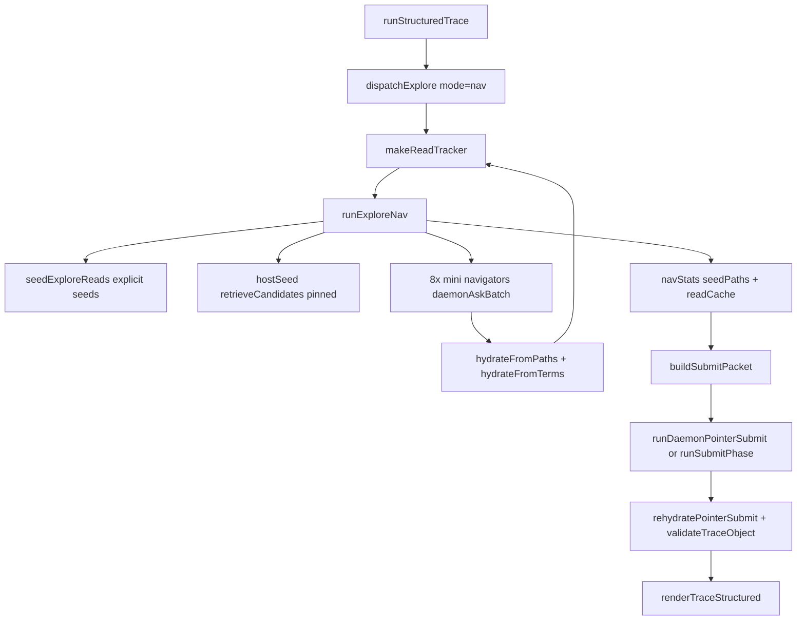

Tracing the nav explore path from seeding through submit-packet construction. Searching and reading the relevant unitrace modules.
The **nav explore path** is the default trace explore mode (`UNITRACE_RT_UNITRACE_MODE=nav`). It has two distinct phases: host-side seeding + navigator hydration during explore, then `buildSubmitPacket` assembling evidence for the submit model. Both phases share the same `readCache` / `filesRead` state via `makeReadTracker`.

## End-to-end flow



Orchestration lives in `realtime-trace.mjs`: `dispatchExplore` routes to `runExploreNav` when mode is `nav`, then `buildSubmitPacket` runs immediately after explore completes.

```587:609:skills/unitrace/scripts/realtime-trace.mjs
async function dispatchExplore({ model, ensureSession, ...args }) {
  const mode = UNITRACE_RT_UNITRACE_MODE;
  if (mode !== "nav" && mode !== "hybrid") {
    // ... agentic path ...
  }

  const { workspace, question, mapBlock, filesRead, readCache, toolLog, framesPath } = args;
  const onRead = makeReadTracker(workspace, filesRead, readCache);
  const navStats = await runExploreNav({
    workspace,
    question,
    mapBlock,
    filesRead,
    readCache,
    onRead,
    namespace: UNITRACE_RT_NAMESPACE,
    navModel: UNITRACE_RT_NAV_MODEL,
    debug: Boolean(framesPath),
  });
```

---

## Phase 1: Seeding files (nav path)

Seeding happens inside `runExploreNav` in two layers, both writing into the shared read tracker.

### Layer A — `seedExploreReads` (question + repo map)

Called first from `runExploreNav`:

```364:382:skills/unitrace/scripts/lib/rt-explore-nav.mjs
  const explicitSeeds = seedExploreReads({
    workspace,
    question,
    mapBlock,
    filesRead,
    readCache,
    onRead,
  });
  const focusRoots = focusRootsFor(question, explicitSeeds);
  const hostSeeds = await hostSeed(workspace, question, onRead, {
    maxSpans: seedSpans,
    preferSourceOnly,
    focusRoots,
    archiveOk,
    wireOk,
    testsOk,
    readCache,
  });
  const seedPaths = [...new Set([...explicitSeeds, ...hostSeeds])];
```

`seedExploreReads` (`rt-map-seed.mjs`) runs several strategies in priority order:

1. **`grepHitSeeds`** — Grep code symbols from the question (snake_case, camelCase, SCREAMING_CASE), pick the best definition hit per symbol, read a window around it, and **pin** it so later reads cannot truncate it.
2. **`curatedTraceSeeds`** — Hard-coded line ranges for known question shapes (e.g. questions mentioning nav/seed/submit packet get `rt-map-seed.mjs`, `rt-explore-nav.mjs`, and `buildSubmitPacket` ranges in `realtime-trace.mjs`).
3. **Repo map ranges** — `parseMapLineRanges(mapBlock)` scored by `scoreMapRange`; best range per file, pinned reads.
4. **`deriveSeedPaths`** — Named scripts from the question, map paths matching focus terms, fallback `scripts/` paths.
5. **`pipelineSeedReads`** — Deterministic pipeline reads from `rt-pipeline-seed.mjs` for trace/submit/render questions.

Each read goes through `readSeedSpec` → `toolReadRange` (workspace-confined, optional preamble strip) → `onRead(rel, content, { pin: true })`.

### Layer B — `hostSeed` (search-fast retriever)

After explicit seeds, `hostSeed` calls `retrieveCandidates` from `search-fast.mjs` with the full question:

```317:336:skills/unitrace/scripts/lib/rt-explore-nav.mjs
async function hostSeed(workspace, question, onRead, { maxSpans, preferSourceOnly = false, focusRoots = [], ... }) {
  const seeded = [];
  let result;
  try {
    result = await retrieveCandidates(workspace, question, {
      maxSpans,
      ...(preferSourceOnly ? { maxDocFiles: 0 } : {}),
    });
  } catch {
    return seeded;
  }
  for (const c of focusCandidates(result.candidates || [], focusRoots, archiveOk, wireOk, testsOk, question)) {
    const rel = normalizeReadPath(workspace, c.path);
    if (!rel) continue;
    if (excerptCovers(readCache, rel, c.startLine || 1, c.endLine || c.startLine || 1)) continue;
    onRead(rel, readCandidateWindow(workspace, c), { pin: true });
    if (!seeded.includes(rel)) seeded.push(rel);
  }
  return seeded;
}
```

`retrieveCandidates` does one combined ripgrep, classifies/scores hits, AST-hydrates spans, and returns ranked candidates. Nav filters them through `focusCandidates` (respects archive/wire/test exclusions and `suppressDownstream` for seed/submit questions).

### Read tracker: pinned vs recent

`makeReadTracker` in `realtime-trace.mjs` maintains two layers per file: **pinned** excerpts (seeds, answer locations) always at the front; **recent** nav reads fill the tail. Combined excerpt is capped at `READ_EXCERPT_MAX` (default 6000 chars).

```261:284:skills/unitrace/scripts/realtime-trace.mjs
function makeReadTracker(workspace, filesRead, readCache) {
  const pinned = new Map();
  const recent = new Map();
  return (rel, excerpt, opts = {}) => {
    const normalized = normalizeReadPath(workspace, rel);
    if (!normalized) return;
    filesRead.add(normalized);

    if (opts.pin) {
      pinned.set(normalized, clampExcerptHead(mergeExcerpt(pinned.get(normalized), excerpt), READ_EXCERPT_MAX));
    } else {
      recent.set(normalized, clampExcerptTail(mergeExcerpt(recent.get(normalized), excerpt), READ_EXCERPT_MAX));
    }
    // ... merge pin + recent into readCache ...
  };
}
```

### Navigator rounds (post-seed)

After seeding, nav runs `UNITRACE_RT_NAV_ROUNDS` (default 1) × `UNITRACE_RT_NAV_COUNT` (default 8) parallel `gpt-realtime-mini` calls via `daemonAskBatch`. Each navigator gets a **READ INDEX** built from current cache (`buildNavIndex` → `orderReadCacheEntries` + `buildReadIndex`) and a distinct **facet** (entry point, callees, config, etc.).

Navigators return `{ grep_terms, read_paths, done }`. The host hydrates proposals:

- **`hydrateFromPaths`** — Direct `toolReadRange` on explicit paths/ranges.
- **`hydrateFromTerms`** — Another `retrieveCandidates` pass on unioned grep terms.

These writes use unpinned `onRead` (recent layer). `runExploreNav` returns `{ seedPaths, toolTurnCount, exploreTurns, ... }` for submit.

---

## Phase 2: Building the submit packet

After explore, `runStructuredTrace` calls `buildSubmitPacket`:

```1044:1054:skills/unitrace/scripts/realtime-trace.mjs
    const { text: submitPacket, orderedPaths } = buildSubmitPacket({
      question: q,
      mapBlock,
      submitInstructions,
      filesRead,
      readCache,
      toolLog,
      seedPaths: exploreStats.seedPaths || [],
      hostPassages: UNITRACE_RT_HOST_PASSAGES,
      pointerIndex: UNITRACE_RT_SUBMIT_POINTER_INDEX,
    });
```

### `buildSubmitPacket` assembly (`realtime-trace.mjs:643–751`)

Key steps:

1. **`orderReadCacheEntries(readCache, seedPaths)`** — Sort files by seed priority (grep/curated seeds first, not alphabetically). Implemented in `rt-rehydrate-submit.mjs`.
2. **`buildReadIndexEntries`** — Split multi-segment excerpts (`---` separators) into indexed entries with line spans.
3. **`extractAnchorSymbols`** — Pull likely function/class names from numbered excerpts for submit guidance.
4. **Question-specific guidance** — For seed+submit-packet questions, injects rules pointing at `seedExploreReads`, `runExploreNav`/`hostSeed`, and `buildSubmitPacket`.
5. **Assemble text sections** (truncated to `SUBMIT_PACKET_MAX`, default 45k):
   - ORIGINAL QUESTION
   - REPO MAP (omitted when pointer index mode is on)
   - FILES READ DURING EXPLORE
   - HIGH PRIORITY FILES (seed paths)
   - LIKELY ANCHOR SYMBOLS
   - QUESTION-SPECIFIC GUIDANCE
   - TOOL LOG (last 8 non-phase lines)
   - **Either** full READ EXCERPTS (legacy) **or** READ INDEX (default pointer mode via `buildReadIndex`)
   - Instruction to call `submit_pointer_trace` / `submit_trace_prose` / etc.

Default path uses **pointer index mode** when `UNITRACE_RT_HOST_PASSAGES=1` and `UNITRACE_RT_SUBMIT_POINTER_INDEX=1`:

```715:736:skills/unitrace/scripts/realtime-trace.mjs
  if (usePointerIndex) {
    parts.push(buildReadIndex(orderedEntries, { maxFiles: SUBMIT_EXCERPT_FILES + 4, previewLines: READ_INDEX_PREVIEW_LINES }), "");
  } else {
    parts.push("READ EXCERPTS:");
    // ... full excerpts for first N files ...
  }
  // ...
  } else if (usePointerIndex) {
    parts.push(
      `Call ${SUBMIT_POINTER_SCHEMA_NAME} once with prose fields and citation_spans (excerpt_index + line range).`,
      "Do NOT include code_passages or grounding_manifest — host rehydrates citations from READ INDEX.",
    );
```

Returns `{ text, orderedPaths }` where `orderedPaths` is the structured index the submit model cites by `excerpt_index`.

### Submit phase consumption

Default submit tries **`runDaemonPointerSubmit`** first (warm `gpt-realtime-2` pool), then falls back to **`runSubmitPhase`** (live Realtime session):

1. Model receives the submit packet and returns pointer JSON (`citation_spans` with `excerpt_index` + line ranges).
2. **`rehydratePointerSubmit`** (`rt-rehydrate-submit.mjs`) maps indices back to real `code_passages` from disk (AST-clamped via `expandLineRange`), with fallbacks via `pickCodePassages`.
3. **`validateTraceObject`** checks grounding against `filesRead`.
4. **`renderTraceStructured`** produces final markdown.

For seed/submit questions specifically, `rehydratePointerSubmit` includes `repairQuestionSpecificTrace` / `ensureQuestionCoverage` logic (lines 197+) that can inject passages for `rt-map-seed.mjs`, `rt-explore-nav.mjs`, and `buildSubmitPacket` if the model missed them.

---

## Important files and functions

| Role | File | Key symbols |
|------|------|-------------|
| Orchestrator | `realtime-trace.mjs` | `dispatchExplore`, `makeReadTracker`, `buildSubmitPacket`, `runStructuredTrace`, `runDaemonPointerSubmit` |
| Nav explore | `rt-explore-nav.mjs` | `runExploreNav`, `hostSeed`, `hydrateFromTerms`, `hydrateFromPaths`, `buildNavIndex`, `dedupNavProposals` |
| Map/question seeds | `rt-map-seed.mjs` | `seedExploreReads`, `grepHitSeeds`, `curatedTraceSeeds`, `deriveSeedPaths` |
| Pipeline seeds | `rt-pipeline-seed.mjs` | `pipelineSeedReads` |
| Fast retrieval | `search-fast.mjs` | `retrieveCandidates` |
| Read index + rehydrate | `rt-rehydrate-submit.mjs` | `orderReadCacheEntries`, `buildReadIndex`, `buildReadIndexEntries`, `rehydratePointerSubmit` |
| Host reads | `htools.mjs` | `toolReadRange`, `toolGrep`, `confine` |
| Design docs | `skills/unitrace/AGENTS.md` | Nav explore + daemon submit defaults |

---

## Summary

**Seeding:** Nav does not wait for a model to discover files. `seedExploreReads` deterministically reads question/map/pipeline targets (pinned), then `hostSeed` adds search-fast AST-hydrated spans (also pinned). Both feed the same `readCache` the submit phase uses.

**Submit packet:** `buildSubmitPacket` turns that cache into a bounded prompt: ordered file list, seed priority, anchor symbols, tool log, and a **READ INDEX** (numbered excerpts with line ranges). The submit model returns pointer citations; the host rehydrates them into grounded `code_passages` and renders the final trace.

**Fail-open:** If nav daemon calls fail with zero seeds, `dispatchExplore` falls back to the legacy agentic `explore_exec` loop; if daemon submit fails, it falls back to live-session submit. Neither path is required for correctness.
